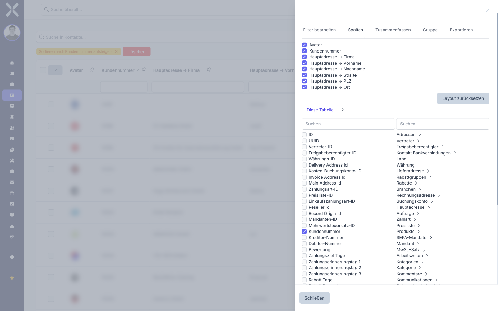
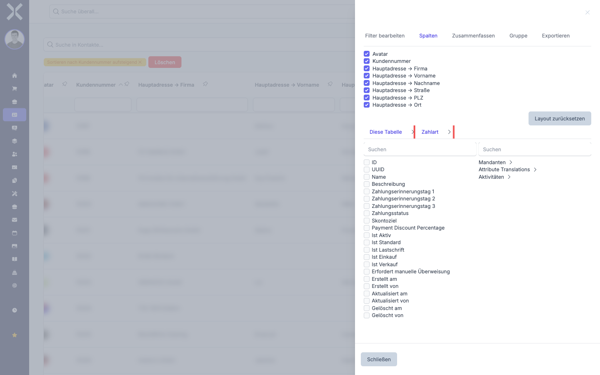

# Spalten anpassen

Sie können die sichtbaren Spalten einer Tabelle frei konfigurieren. Blenden Sie Spalten ein oder aus, die für Ihre Arbeit relevant sind. Zusätzlich können Sie Spalten aus verknüpften Datensätzen (Relationen) hinzufügen, um weitere Informationen direkt in der Tabelle zu sehen.

## Spalten ein- und ausblenden

1. Klicken Sie auf das Symbol am rechten Rand der Tabelle, um die Seitenleiste zu öffnen.

2. Wählen Sie den Tab **Spalten**.

   

3. Sie sehen eine Liste aller verfügbaren Spalten mit einem Kontrollkästchen neben jedem Eintrag.

4. **Spalte einblenden:** Aktivieren Sie das Kontrollkästchen neben der gewünschten Spalte.

5. **Spalte ausblenden:** Deaktivieren Sie das Kontrollkästchen neben der Spalte.

6. Die Tabelle aktualisiert sich sofort. Die ausgewählten Spalten werden angezeigt, die abgewählten werden ausgeblendet.

> **Hinweis:** Ausgeblendete Spalten werden von der Suchleiste nicht durchsucht. Wenn Sie nach Inhalten einer bestimmten Spalte suchen möchten, stellen Sie sicher, dass diese Spalte eingeblendet ist.

## Relationsspalten hinzufügen

Neben den Standardspalten eines Datensatzes können Sie auch Spalten aus verknüpften Datensätzen (Relationen) in die Tabelle aufnehmen. Damit sehen Sie z. B. in der Auftragsliste direkt den Namen des zugehörigen Kontakts, ohne den Auftrag öffnen zu müssen.

1. Öffnen Sie die Seitenleiste und wählen Sie den Tab **Spalten**.

2. Scrollen Sie in der Spaltenliste nach unten. Unterhalb der direkten Spalten finden Sie Abschnitte für die verfügbaren Relationen (z. B. **Kontakt**, **Adresse**, **Preisliste**).

3. Klappen Sie die gewünschte Relation auf, um deren Felder zu sehen.

   

4. Aktivieren Sie das Kontrollkästchen neben dem Feld, das Sie als Spalte hinzufügen möchten.

5. Die neue Spalte erscheint in der Tabelle. Sie können sie wie jede andere Spalte sortieren und filtern.

> **Hinweis:** Relationsspalten können die Ladezeit der Tabelle leicht erhöhen, da zusätzliche Daten abgerufen werden müssen. Fügen Sie nur die Spalten hinzu, die Sie tatsächlich benötigen.

### Beispiel: Kommentare als Spalte einblenden

Ein häufiger Anwendungsfall ist das Einblenden von Kommentardaten, um z. B. zu sehen, wann der letzte Kommentar zu einem Datensatz verfasst wurde:

1. Öffnen Sie die Seitenleiste über das **Zahnrad-Symbol** und wechseln Sie zum Tab **Spalten**.

2. In der rechten Spaltenliste finden Sie den Abschnitt **Kommentare**. Klicken Sie darauf, um ihn aufzuklappen.

3. Aktivieren Sie das Kontrollkästchen neben **Erstellt am**.

4. Die neue Spalte **Kommentare → Erstellt am** erscheint ganz rechts in der Tabelle.

Sie können diese Spalte nun wie gewohnt filtern, z. B. mit `>=15.01.2026`, um alle Datensätze mit Kommentaren ab einem bestimmten Datum zu finden. Weitere Informationen zu Filteroperatoren finden Sie unter [Filtern](2-filtern.md).

## Spaltenanordnung

Die Reihenfolge der Spalten in der Tabelle entspricht der Reihenfolge in der Spaltenliste der Seitenleiste. Die ersten aktivierten Spalten erscheinen links, die später aktivierten rechts.

## Weiterführende Themen

- [Suchen und Sortieren](1-suchen-und-sortieren.md) - Nur eingeblendete Spalten werden bei der Suche berücksichtigt
- [Filtern](2-filtern.md) - Für eingeblendete Spalten stehen Spaltenfilter zur Verfügung
- [Exportieren](6-exportieren.md) - Beim Export können Sie ebenfalls Spalten auswählen
