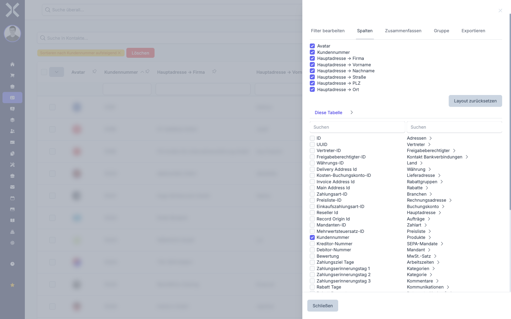
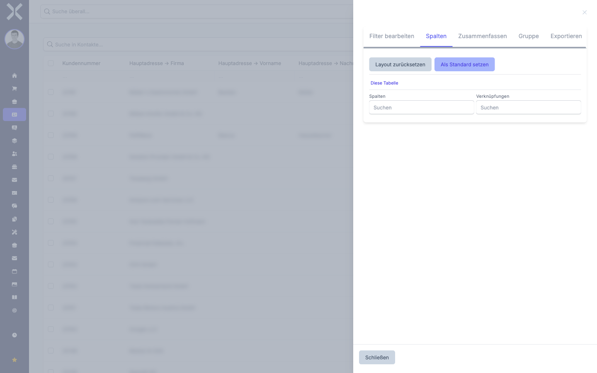
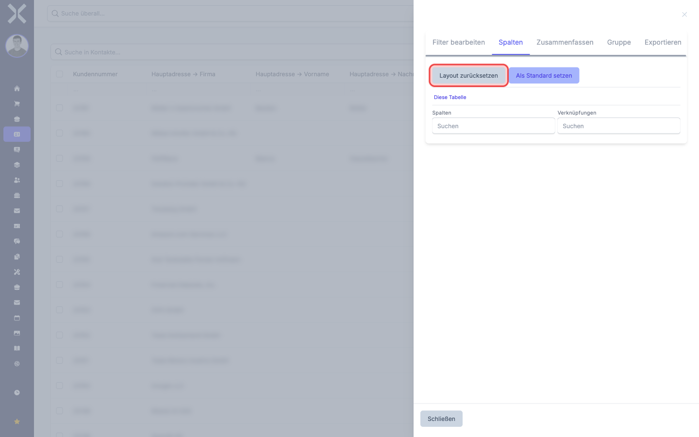
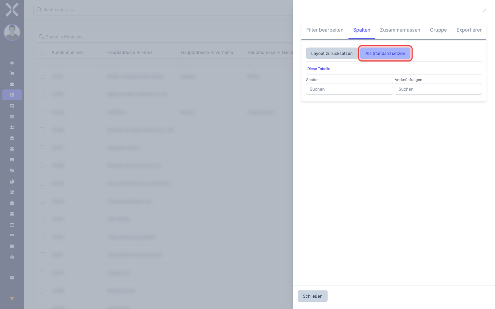

# Spalten anpassen

Sie können die sichtbaren Spalten einer Tabelle frei konfigurieren. Blenden Sie Spalten ein oder aus, die für Ihre Arbeit relevant sind. Zusätzlich können Sie Spalten aus verknüpften Datensätzen (Relationen) hinzufügen, um weitere Informationen direkt in der Tabelle zu sehen.

## Spalten ein- und ausblenden

1. Klicken Sie auf das Symbol am rechten Rand der Tabelle, um die Seitenleiste zu öffnen.

2. Wählen Sie den Tab **Spalten**.

   

3. Sie sehen eine Liste aller verfügbaren Spalten mit einem Kontrollkästchen neben jedem Eintrag.

4. **Spalte einblenden:** Aktivieren Sie das Kontrollkästchen neben der gewünschten Spalte.

5. **Spalte ausblenden:** Deaktivieren Sie das Kontrollkästchen neben der Spalte.

6. Die Tabelle aktualisiert sich sofort. Die ausgewählten Spalten werden angezeigt, die abgewählten werden ausgeblendet.

> **Hinweis:** Ausgeblendete Spalten werden von der Suchleiste nicht durchsucht. Wenn Sie nach Inhalten einer bestimmten Spalte suchen möchten, stellen Sie sicher, dass diese Spalte eingeblendet ist.

## Relationsspalten hinzufügen

Neben den Standardspalten eines Datensatzes können Sie auch Spalten aus verknüpften Datensätzen (Relationen) in die Tabelle aufnehmen. Damit sehen Sie z. B. in der Auftragsliste direkt den Namen des zugehörigen Kontakts, ohne den Auftrag öffnen zu müssen.

1. Öffnen Sie die Seitenleiste und wählen Sie den Tab **Spalten**.

2. Scrollen Sie in der Spaltenliste nach unten. Unterhalb der direkten Spalten finden Sie Abschnitte für die verfügbaren Relationen (z. B. **Kontakt**, **Adresse**, **Preisliste**).

3. Klappen Sie die gewünschte Relation auf, um deren Felder zu sehen.

   

4. Aktivieren Sie das Kontrollkästchen neben dem Feld, das Sie als Spalte hinzufügen möchten.

5. Die neue Spalte erscheint in der Tabelle. Sie können sie wie jede andere Spalte sortieren und filtern.

> **Hinweis:** Relationsspalten können die Ladezeit der Tabelle leicht erhöhen, da zusätzliche Daten abgerufen werden müssen. Fügen Sie nur die Spalten hinzu, die Sie tatsächlich benötigen.

### Beispiel: Kommentare als Spalte einblenden

Ein häufiger Anwendungsfall ist das Einblenden von Kommentardaten, um z. B. zu sehen, wann der letzte Kommentar zu einem Datensatz verfasst wurde:

1. Öffnen Sie die Seitenleiste über das **Zahnrad-Symbol** und wechseln Sie zum Tab **Spalten**.

2. In der rechten Spaltenliste finden Sie den Abschnitt **Kommentare**. Klicken Sie darauf, um ihn aufzuklappen.

3. Aktivieren Sie das Kontrollkästchen neben **Erstellt am**.

4. Die neue Spalte **Kommentare → Erstellt am** erscheint ganz rechts in der Tabelle.

Sie können diese Spalte nun wie gewohnt filtern, z. B. mit `>=15.01.2026`, um alle Datensätze mit Kommentaren ab einem bestimmten Datum zu finden. Weitere Informationen zu Filteroperatoren finden Sie unter [Filtern](2-filtern.md).

## Spaltenanordnung

Die Reihenfolge der Spalten in der Tabelle entspricht der Reihenfolge in der Spaltenliste der Seitenleiste. Die ersten aktivierten Spalten erscheinen links, die später aktivierten rechts.

## Layout speichern, teilen und zurücksetzen

Ihre Spalten-Anpassungen werden **automatisch** für Ihren persönlichen Account gespeichert. Sie müssen nichts manuell sichern -- wenn Sie eine Spalte ein- oder ausblenden, behält Nuxbe das beim nächsten Aufruf der Tabelle so. Diese persönliche Ansicht hat Vorrang vor dem Mandanten-Standard.

Im oberen Bereich des Tabs **Spalten** finden Sie zwei Schaltflächen, mit denen Sie Ihre Ansicht gezielt steuern.

### Layout zurücksetzen -- zurück zum Mandanten-Standard

1. Öffnen Sie die Seitenleiste und wählen Sie den Tab **Spalten**.
2. Klicken Sie oben links auf **Layout zurücksetzen**.

   

3. Ihre persönliche Anpassung wird verworfen. Die Tabelle springt zurück auf den **Mandanten-Standard**, also die Ansicht, die Ihr Administrator als Default für alle Anwender festgelegt hat (siehe nächster Abschnitt). Sind keine Mandanten-Defaults gesetzt, sehen Sie die werkseitige Standard-Ansicht.

> **Hinweis:** Diese Schaltfläche wirkt nur auf **Sie**, nicht auf andere Anwender. Sie ist außerdem das Mittel der Wahl, wenn jemand sagt: *"Bei mir sieht die Tabelle ganz anders aus als bei der Kollegin"* -- in dem Fall hat eine der beiden Personen eine eigene persönliche Ansicht gespeichert, und ein Klick auf **Layout zurücksetzen** bringt die Standard-Ansicht zurück.

### Als Standard setzen -- für alle Anwender im Mandanten

Diese Schaltfläche ist Administratoren vorbehalten und wirkt sich auf **alle Anwender** Ihres Mandanten aus, die noch keine eigene persönliche Ansicht gespeichert haben.

1. Konfigurieren Sie zunächst Ihre Spalten-Ansicht so, wie sie für alle gelten soll: blenden Sie die gewünschten Spalten ein, blenden Sie nicht benötigte aus, ergänzen Sie passende Relationsspalten.

2. Klicken Sie oben rechts auf **Als Standard setzen**.

   

3. Ihre aktuelle Spalten-Konfiguration wird als Mandanten-Standard hinterlegt.

**Was das für andere Anwender bedeutet:**

- Anwender **ohne** eigene persönliche Ansicht sehen die neue Ansicht beim nächsten Tabellen-Aufruf automatisch.
- Anwender **mit** eigener persönlicher Ansicht (also alle, die je eine Spalte ein-/ausgeblendet haben) bemerken keinen Unterschied. Erst wenn sie auf **Layout zurücksetzen** klicken, kommen sie auf den neu gesetzten Mandanten-Standard.

> **Hinweis:** Es gibt aktuell **kein** Werkzeug, mit dem Sie als Administrator die persönlichen Layouts aller Anwender erzwingen oder zurücksetzen können. Wenn Sie also einen neuen Standard setzen und alle sollen ihn auch sofort sehen, müssen die einzelnen Anwender selbst auf **Layout zurücksetzen** klicken. Kommunizieren Sie das deshalb mit dem Team, wenn Sie eine Tabelle umstellen.

> **Tipp:** Diese beiden Schaltflächen wirken jeweils nur auf die Tabelle, in der Sie sich gerade befinden. Eine in der Auftragsliste gesetzte Standard-Ansicht hat keinen Einfluss auf die Kontaktliste oder Rechnungsliste -- jede Tabelle hat ihren eigenen Standard.

## Weiterführende Themen

- [Suchen und Sortieren](1-suchen-und-sortieren.md) - Nur eingeblendete Spalten werden bei der Suche berücksichtigt
- [Filtern](2-filtern.md) - Für eingeblendete Spalten stehen Spaltenfilter zur Verfügung
- [Exportieren](6-exportieren.md) - Beim Export können Sie ebenfalls Spalten auswählen
