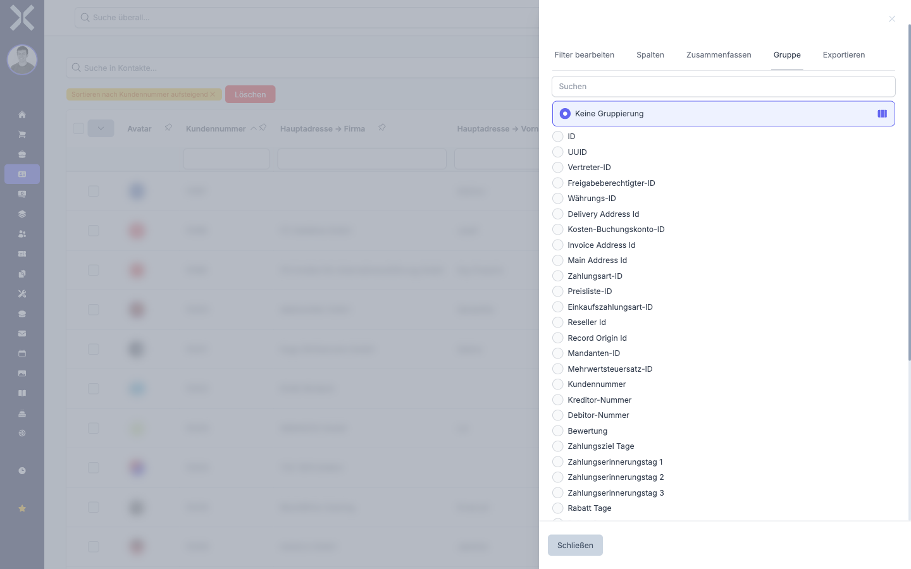

# Gruppieren

Die Gruppierungsfunktion fasst Tabelleneinträge nach einem gemeinsamen Merkmal zusammen. So erkennen Sie auf einen Blick, wie viele Einträge zu einer bestimmten Kategorie gehören.

## Daten gruppieren

1. Klicken Sie auf das Symbol am rechten Rand der Tabelle, um die Seitenleiste zu öffnen.

2. Wählen Sie den Tab **Gruppe**.

   

3. Sie sehen eine Liste der verfügbaren Spalten, nach denen gruppiert werden kann. Jede Spalte hat einen Auswahlknopf (Radio-Button).

4. Klicken Sie auf den Auswahlknopf neben der Spalte, nach der Sie gruppieren möchten (z. B. **Zahlungsart**, **Land** oder **Branche**).

5. Die Tabelle wird sofort umstrukturiert. Einträge mit dem gleichen Wert in der gewählten Spalte werden zu einer Gruppe zusammengefasst. Jede Gruppe zeigt eine Überschriftszeile mit dem Gruppenwert und der Anzahl der enthaltenen Einträge.

6. Klicken Sie auf eine Gruppenüberschrift, um die zugehörigen Einträge ein- oder auszuklappen.

## Gruppierung entfernen

1. Öffnen Sie die Seitenleiste und wählen Sie den Tab **Gruppe**.

2. Deaktivieren Sie den aktuell ausgewählten Auswahlknopf oder wählen Sie die Option **Keine Gruppierung** (sofern vorhanden).

3. Die Tabelle kehrt zur normalen, ungruppierten Ansicht zurück.

## Gruppierung mit anderen Funktionen kombinieren

Die Gruppierung lässt sich mit allen anderen Tabellenfunktionen kombinieren:

- **Suche:** Die Gruppierung wird auf die Suchergebnisse angewendet. Nur passende Einträge erscheinen in den Gruppen.
- **Filter:** Spaltenfilter und Seitenleisten-Filter schränken die Daten ein, bevor die Gruppierung greift.
- **Sortierung:** Innerhalb jeder Gruppe können die Einträge sortiert werden.
- **Zusammenfassung:** In Kombination mit der Zusammenfassung werden Summen, Durchschnitte und andere Berechnungen pro Gruppe angezeigt.

## Weiterführende Themen

- [Zusammenfassen](4-zusammenfassen.md) - Auswertungen pro Gruppe berechnen
- [Filtern](2-filtern.md) - Daten vor der Gruppierung filtern
- [Exportieren](6-exportieren.md) - Gruppierte Daten exportieren
