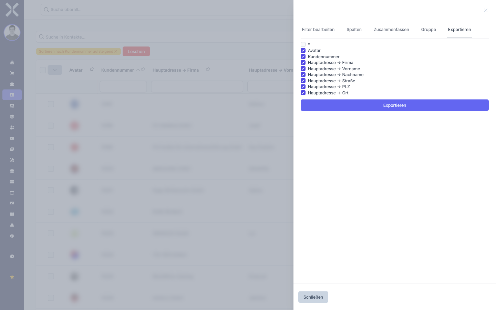

# Exportieren

Sie können die Inhalte jeder Datentabelle als Datei exportieren. Der Export berücksichtigt die aktuell aktiven Filter, die Suchbegriffe und die sichtbaren Spalten. So exportieren Sie genau die Daten, die Sie in der Tabelle sehen.

## Export starten

1. Klicken Sie auf das Symbol am rechten Rand der Tabelle, um die Seitenleiste zu öffnen.

2. Wählen Sie den Tab **Exportieren**.

   

3. Sie sehen eine Liste aller verfügbaren Spalten mit Kontrollkästchen. Standardmäßig sind die aktuell sichtbaren Spalten vorausgewählt.

4. **Spalten anpassen:** Aktivieren oder deaktivieren Sie die Kontrollkästchen, um festzulegen, welche Spalten im Export enthalten sein sollen. Sie können für den Export auch Spalten einschließen, die in der Tabellenansicht ausgeblendet sind.

5. Klicken Sie auf die Schaltfläche **Exportieren**, um den Download zu starten.

6. Die Datei wird automatisch heruntergeladen und in Ihrem Standard-Download-Ordner gespeichert.

## Was wird exportiert?

Der Export enthält genau die Daten, die aktuell in der Tabelle angezeigt werden:

- **Aktive Filter** werden berücksichtigt. Nur gefilterte Einträge werden exportiert.
- **Suchbegriffe** schränken den Export ein. Nur Suchergebnisse werden exportiert.
- **Sortierung** wird übernommen. Die Reihenfolge im Export entspricht der Sortierung in der Tabelle.
- **Alle Seiten** werden exportiert, nicht nur die aktuell sichtbare Seite. Der Export umfasst alle Einträge, die den Filtern und der Suche entsprechen.

> **Hinweis:** Wenn Sie alle Daten ohne Einschränkung exportieren möchten, entfernen Sie vor dem Export alle Filter und Suchbegriffe.

## Weiterführende Themen

- [Filtern](2-filtern.md) - Filter bestimmen, welche Daten exportiert werden
- [Spalten anpassen](3-spalten-anpassen.md) - Spaltenauswahl in der Tabelle und im Export
