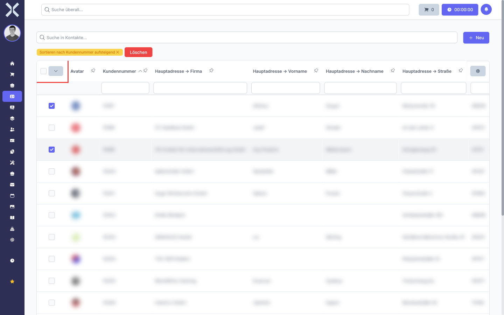

# Zeilen auswählen

In vielen Tabellen können Sie einzelne oder mehrere Zeilen auswählen, um Aktionen auf die ausgewählten Einträge anzuwenden. Ausgewählte Zeilen werden visuell hervorgehoben.

## Einzelne Zeile auswählen

1. Klicken Sie auf das Kontrollkästchen am linken Rand der gewünschten Zeile.

2. Die Zeile wird farblich hervorgehoben, um die Auswahl zu kennzeichnen.

3. Klicken Sie erneut auf das Kontrollkästchen, um die Auswahl aufzuheben.

## Mehrere Zeilen auswählen

1. Klicken Sie nacheinander auf die Kontrollkästchen der gewünschten Zeilen. Jede angeklickte Zeile wird der Auswahl hinzugefügt.

   

2. Die Anzahl der ausgewählten Zeilen wird oberhalb der Tabelle angezeigt.

3. Um eine einzelne Zeile aus der Auswahl zu entfernen, klicken Sie erneut auf deren Kontrollkästchen.

## Alle Zeilen auswählen

1. Klicken Sie auf das Kontrollkästchen in der Spaltenüberschrift ganz links.

2. Alle Zeilen der aktuellen Seite werden ausgewählt.

3. Klicken Sie erneut auf das Kontrollkästchen in der Spaltenüberschrift, um die gesamte Auswahl aufzuheben.

> **Hinweis:** Die Auswahl über die Spaltenüberschrift bezieht sich auf die aktuell angezeigte Seite. Einträge auf anderen Seiten werden nicht automatisch ausgewählt.

## Aktionen auf ausgewählte Zeilen anwenden

Wenn Zeilen ausgewählt sind, erscheinen je nach Kontext Schaltflächen für verfügbare Aktionen oberhalb der Tabelle. Die verfügbaren Aktionen hängen vom Modul ab, in dem Sie sich befinden. Typische Aktionen sind:

- **Löschen** - Ausgewählte Einträge löschen
- **Exportieren** - Nur die ausgewählten Einträge exportieren
- **Status ändern** - Den Status der ausgewählten Einträge ändern

## Weiterführende Themen

- [Exportieren](6-exportieren.md) - Ausgewählte Zeilen gezielt exportieren
- [Suchen und Sortieren](1-suchen-und-sortieren.md) - Ergebnisse eingrenzen, bevor Sie Zeilen auswählen
