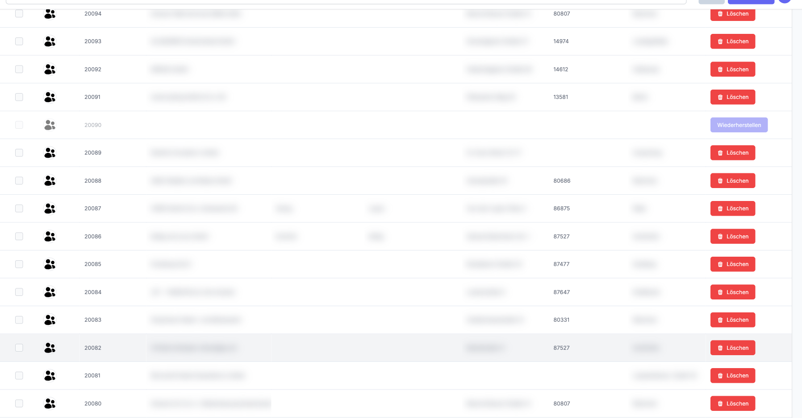

# Gelöschte Datensätze

In Nuxbe werden Datensätze in vielen Bereichen nicht endgültig gelöscht, sondern zunächst als gelöscht markiert. Diese sogenannten „weich gelöschten" Einträge sind standardmäßig ausgeblendet, können aber bei Bedarf angezeigt und wiederhergestellt werden.

## Gelöschte Datensätze anzeigen

Ob eine Tabelle gelöschte Datensätze unterstützt, hängt vom jeweiligen Bereich ab. Wenn gelöschte Datensätze vorhanden sind, finden Sie die entsprechende Option in der Seitenleiste.

1. Klicken Sie auf das Zahnrad-Symbol am rechten Rand der Tabelle, um die Seitenleiste zu öffnen.

2. Im Tab **Filter bearbeiten** finden Sie am unteren Rand die Checkbox **Inklusive gelöschter**.

   

3. Aktivieren Sie die Checkbox. Die Tabelle aktualisiert sich sofort und zeigt zusätzlich die gelöschten Datensätze an.

Gelöschte Datensätze werden mit reduzierter Deckkraft dargestellt, sodass sie sich von aktiven Einträgen unterscheiden lassen.

> **Hinweis:** Gelöschte Datensätze lassen sich nicht anklicken und können nicht bearbeitet werden. Auch die regulären Zeilenaktionen sind bei gelöschten Einträgen ausgeblendet.

## Datensätze wiederherstellen

Wenn gelöschte Datensätze in der Tabelle angezeigt werden, erscheint bei jedem gelöschten Eintrag eine Schaltfläche **Wiederherstellen**.

1. Stellen Sie sicher, dass die Checkbox **Inklusive gelöschter** aktiviert ist (siehe oben).

2. Suchen Sie den gelöschten Datensatz in der Tabelle. Er ist an der reduzierten Deckkraft erkennbar.

3. Klicken Sie auf die Schaltfläche **Wiederherstellen** in der Aktionsspalte des gelöschten Eintrags.

   

4. Der Datensatz wird sofort wiederhergestellt und erscheint wieder in voller Deckkraft als aktiver Eintrag.

> **Hinweis:** Die Schaltfläche **Wiederherstellen** ist nur bei Tabellen verfügbar, die diese Funktion unterstützen. Nicht in jedem Bereich ist eine Wiederherstellung möglich.

## Weiterführende Themen

- [Filtern](2-filtern.md) - Weitere Filteroptionen in der Seitenleiste
- [Zeilen auswählen](7-zeilen-auswaehlen.md) - Mehrere Zeilen für Aktionen markieren
