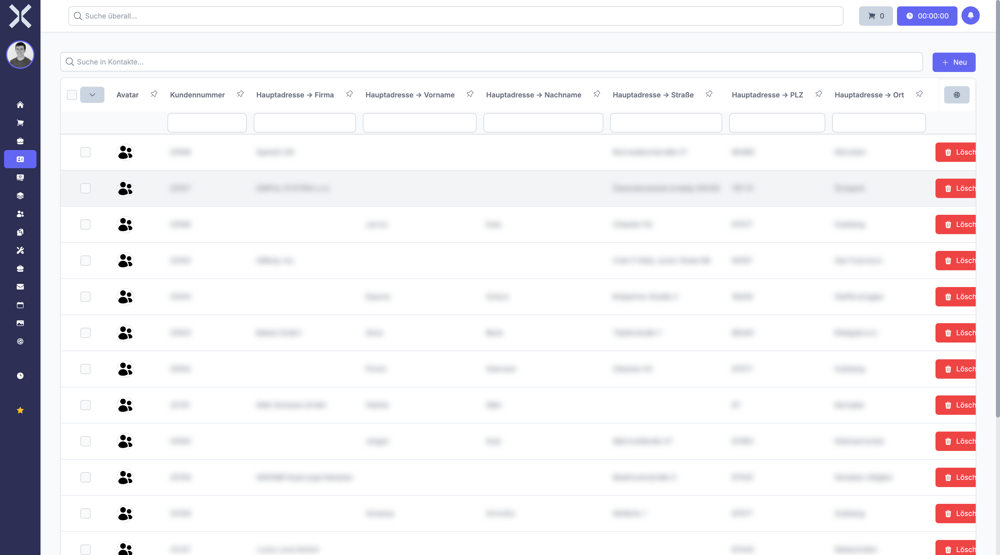
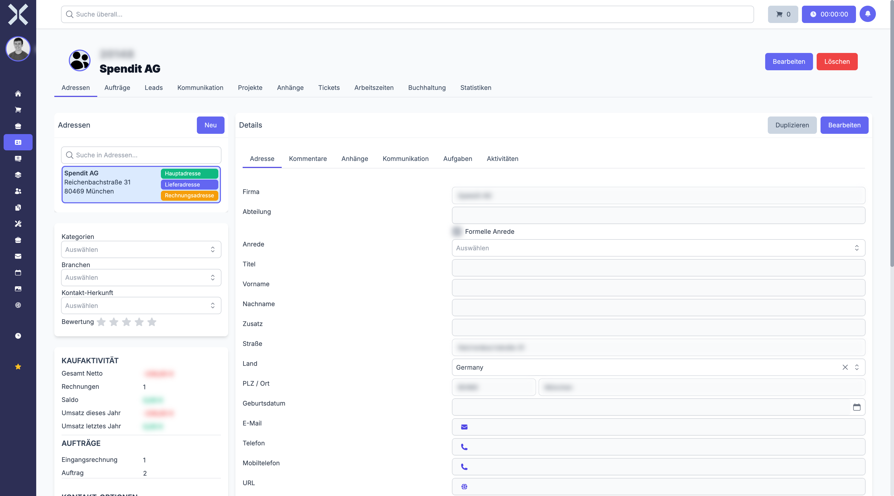

# Kontakte

Im Modul **Kontakte** verwalten Sie Ihre Kunden, Lieferanten und deren zugehörige Daten zentral an einem Ort. Jeder Kontakt bündelt Adressen, Kommunikationsdaten, Aufträge, Bankverbindungen und weitere Informationen in einer übersichtlichen Struktur.

## Übersicht

Navigieren Sie über die Sidebar zu **Kontakte**. Sie sehen eine tabellarische Übersicht aller Kontakte mit Spalten wie Kundennummer, Name, Debitorennummer, Kreditorennummer, Zahlungsart, Zahlungsziel und weiteren Informationen.

Die Kontaktliste basiert auf einer DataTable. Sie können Spalten sortieren, filtern und die Anzeige an Ihre Bedürfnisse anpassen.

## Kontakttypen

Nuxbe unterscheidet grundsätzlich zwei Kontakttypen:

- **Kunden** - Kontakte, an die Sie Waren oder Dienstleistungen verkaufen. Kunden erhalten eine Kundennummer und eine Debitorennummer für die Buchhaltung.
- **Lieferanten** - Kontakte, von denen Sie Waren oder Dienstleistungen beziehen. Lieferanten erhalten eine Kreditorennummer.

Ein Kontakt kann gleichzeitig Kunde und Lieferant sein.

## Stammdaten eines Kontakts

Jeder Kontakt verfügt über die folgenden Stammdaten:

- **Kundennummer** - Eindeutige Identifikationsnummer des Kontakts
- **Debitorennummer** - Nummer für die Zuordnung in der Debitorenbuchhaltung
- **Kreditorennummer** - Nummer für die Zuordnung in der Kreditorenbuchhaltung
- **Zahlungsart** - Standard-Zahlungsart für neue Aufträge (z. B. Überweisung, Lastschrift, Kreditkarte)
- **Zahlungsziel** - Vereinbartes Zahlungsziel in Tagen
- **Preisliste** - Zugewiesene Preisliste für kundenspezifische Preise
- **Rabattgruppe** - Zugehörige Rabattgruppe für automatische Rabattberechnung

## Zuordnungen und Klassifizierung

Kontakte lassen sich über verschiedene Merkmale strukturieren und klassifizieren:

- **Mandant** - Zuordnung zu einem Mandanten, falls Sie mehrere Unternehmen in Nuxbe verwalten
- **Kontaktherkunft** - Herkunft des Kontakts (z. B. Webseite, Messe, Empfehlung)
- **Branche** - Branchenzugehörigkeit des Kontakts
- **Kategorien** - Flexible Kategorisierung über Mehrfachauswahl
- **Tags** - Freie Schlagwörter zur weiteren Gruppierung

## Detailansicht mit Tabs

Klicken Sie auf einen Kontakt in der Liste, um die Detailansicht zu öffnen.

Die Detailansicht gliedert sich in mehrere Tabs:

| Tab | Inhalt |
|---|---|
| **Allgemein** | Stammdaten, Mandant, Zahlungseinstellungen, Klassifizierung |
| **Adressen** | Alle hinterlegten Adressen mit Adresstyp |
| **Aufträge** | Verknüpfte Aufträge und Rechnungen |
| **Leads** | Verknüpfte Verkaufschancen |
| **Kommunikation** | E-Mail-Adressen, Telefonnummern, Webseiten |
| **Projekte** | Zugeordnete Projekte |
| **Anhänge** | Hochgeladene Dateien und Dokumente |
| **Tickets** | Support-Tickets dieses Kontakts |
| **Arbeitszeiten** | Erfasste Arbeitszeiten für diesen Kontakt |
| **Buchhaltung** | Bankverbindungen, Kreditlimit, Skontoeinstellungen |
| **Statistiken** | Umsatzdiagramme und Auftragsstatistiken |

## Seiten in diesem Kapitel

- [Kontakte verwalten](1-kontakte-verwalten.md) - Kontaktliste, Suche und Filter
- [Kontaktdetails](2-kontakt-detail.md) - Detailansicht eines Kontakts mit allen Tabs
- [Adressen](3-adressen.md) - Adressen eines Kontakts verwalten
- [Kommunikation](4-kommunikation.md) - Kontaktmöglichkeiten verwalten

## Weiterführende Themen

- [Aufträge](../4-auftraege/0-index.md) - Aufträge und Rechnungen für Kontakte erstellen
- [Buchhaltung](../5-buchhaltung/0-index.md) - Transaktionen und Zahlungen verwalten
- [Einstellungen > Zahlungsarten](../14-einstellungen/12-zahlungsarten.md) - Zahlungsarten konfigurieren
- [Einstellungen > Rabattgruppen](../14-einstellungen/13-rabattgruppen.md) - Rabattgruppen verwalten
- [Einstellungen > Preislisten](../14-einstellungen/15-preislisten.md) - Preislisten einrichten
- [Einstellungen > Branchen](../14-einstellungen/9-branchen.md) - Branchen pflegen
- [Einstellungen > Adresstypen](../14-einstellungen/28-adresstypen.md) - Adresstypen konfigurieren
