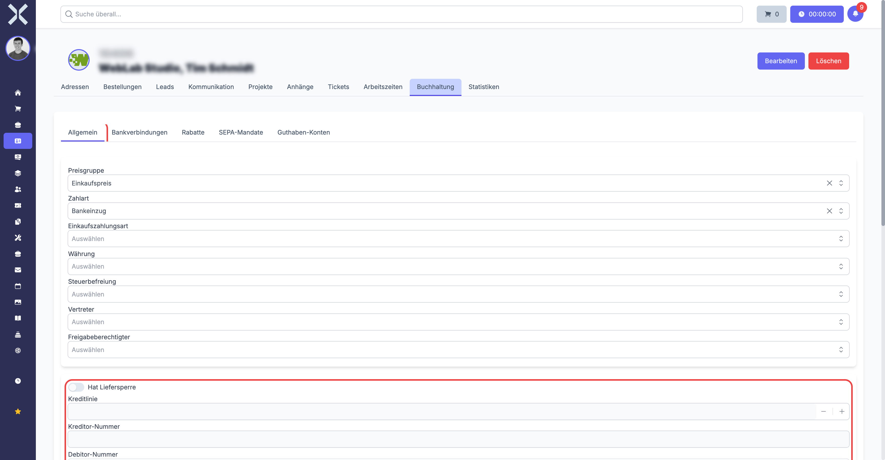
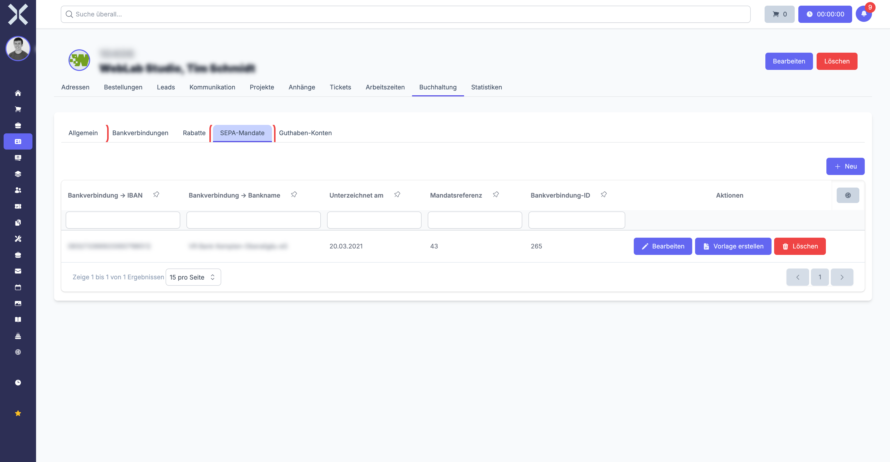

# Kontaktdetails

In der Detailansicht sehen und bearbeiten Sie alle Informationen zu einem einzelnen Kontakt. Die Ansicht ist in einen Kopfbereich und mehrere Tabs unterteilt.

## Detailansicht öffnen

1. Navigieren Sie zur [Kontaktliste](1-kontakte-verwalten.md).
2. Klicken Sie auf den gewünschten Kontakt in der Tabelle.

   

## Kopfbereich

Am oberen Rand der Detailansicht finden Sie die wichtigsten Informationen auf einen Blick:

- **Avatar** - Profilbild des Kontakts. Klicken Sie darauf, um ein Bild hochzuladen oder zu ändern.
- **Name** - Firmenname oder Personenname, prominent dargestellt
- **Kundennummer** - Eindeutige Identifikationsnummer
- **Debitorennummer** - Nummer für die Debitorenbuchhaltung
- **Kreditorennummer** - Nummer für die Kreditorenbuchhaltung (bei Lieferanten)

Im Kopfbereich befinden sich auch die Aktionsschaltflächen:

- **Speichern** - Übernimmt alle vorgenommenen Änderungen
- **Löschen** - Entfernt den Kontakt nach Bestätigung

## Tab: Allgemein

Der Tab **Allgemein** enthält die Stammdaten und Einstellungen des Kontakts.

### Mandant und Zuordnung

- **Mandant** - Wählen Sie den Mandanten aus, dem dieser Kontakt zugeordnet ist. Dies ist relevant, wenn Sie mehrere Unternehmen in Nuxbe verwalten.

### Zahlungseinstellungen

- **Zahlungsart** - Standard-Zahlungsart für neue Aufträge dieses Kontakts (z. B. Überweisung, Lastschrift, Kreditkarte). Die Auswahl erfolgt über ein Dropdown-Menü. Die verfügbaren Zahlungsarten werden in den [Einstellungen > Zahlungsarten](../14-einstellungen/12-zahlungsarten.md) konfiguriert.
- **Zahlungsziel** - Standard-Zahlungsziel in Tagen für neue Aufträge. Geben Sie die Anzahl der Tage ein, die dem Kontakt für die Bezahlung gewährt werden.

#### Besonderheit bei Zahlungsart „Lastschrift" (SEPA-Lastschrift)

Wenn Sie die Zahlungsart auf **Lastschrift** setzen, müssen mehrere Voraussetzungen erfüllt sein, damit der Einzug funktioniert:

1. **Bankverbindung hinterlegen:** Der Kontakt muss eine gültige Bankverbindung mit **IBAN** und **BIC** haben. Diese wird im Tab [Buchhaltung](#tab-buchhaltung) eingetragen.
2. **SEPA-Mandat einrichten:** Es muss ein aktives SEPA-Lastschriftmandat für diesen Kontakt vorliegen. Ohne gültiges Mandat dürfen Sie rechtlich keine Lastschrift einziehen. Das Mandat wird ebenfalls im Tab [Buchhaltung](#tab-buchhaltung) bzw. im Bereich [SEPA-Mandate](#sepa-mandate) verwaltet.
3. **Mandatsreferenz:** Jedes SEPA-Mandat benötigt eine eindeutige Mandatsreferenznummer und ein Unterschriftsdatum.

> **Wichtig:** Stellen Sie sicher, dass sowohl die Bankverbindung als auch das SEPA-Mandat **vor** dem ersten Lastschrifteinzug vollständig eingerichtet sind. Ohne diese Daten schlägt der Lastschrifteinzug fehl. Weitere Details zu Bankverbindungen und SEPA-Mandaten finden Sie im Abschnitt [Tab: Buchhaltung](#tab-buchhaltung).

### Preise und Rabatte

- **Preisliste** - Weisen Sie dem Kontakt eine Preisliste zu. Beim Erstellen neuer Aufträge werden automatisch die Preise aus dieser Liste verwendet. Die Preislisten verwalten Sie unter [Einstellungen > Preislisten](../14-einstellungen/15-preislisten.md).
- **Rabattgruppe** - Ordnen Sie den Kontakt einer Rabattgruppe zu. Die Rabattgruppe bestimmt, welche automatischen Rabatte bei der Auftragsanlage greifen. Die Rabattgruppen konfigurieren Sie unter [Einstellungen > Rabattgruppen](../14-einstellungen/13-rabattgruppen.md).

### Klassifizierung

- **Kontaktherkunft** - Erfassen Sie, woher der Kontakt stammt (z. B. Webseite, Messe, Empfehlung, Kaltakquise). Die verfügbaren Herkünfte werden in den Einstellungen gepflegt.
- **Branche** - Ordnen Sie den Kontakt einer Branche zu. Die Branchen verwalten Sie unter [Einstellungen > Branchen](../14-einstellungen/9-branchen.md).
- **Kategorien** - Weisen Sie dem Kontakt eine oder mehrere Kategorien zu. Die Auswahl erfolgt als Mehrfachauswahl. Kategorien dienen der flexiblen Gruppierung und können in den [Einstellungen > Kategorien](../14-einstellungen/1-kategorien.md) angelegt werden.
- **Tags** - Vergeben Sie freie Schlagwörter, um den Kontakt zusätzlich zu kennzeichnen. Tags ermöglichen eine schnelle Filterung in der Kontaktliste. Die Tags verwalten Sie unter [Einstellungen > Tags](../14-einstellungen/6-tags.md).

## Tab: Adressen

Der Tab **Adressen** zeigt eine Tabelle aller hinterlegten Adressen des Kontakts.

Jede Adresse enthält die folgenden Informationen:

- Adresstyp (z. B. Hauptadresse, Lieferadresse, Rechnungsadresse)
- Firma
- Straße und Hausnummer
- PLZ und Ort
- Land

Sie können Adressen hinzufügen, bearbeiten und löschen. Eine ausführliche Beschreibung finden Sie unter [Adressen verwalten](3-adressen.md).

## Tab: Aufträge

Der Tab **Aufträge** listet alle Aufträge auf, die mit diesem Kontakt verknüpft sind. Die Tabelle zeigt:

- **Auftragsnummer** - Eindeutige Nummer des Auftrags
- **Auftragsart** - Typ des Auftrags (z. B. Angebot, Auftrag, Rechnung, Gutschrift)
- **Beträge** - Netto- und Bruttobeträge
- **Datum** - Erstellungs- und Fälligkeitsdatum
- **Status** - Aktueller Bearbeitungsstatus

Klicken Sie auf einen Auftrag, um dessen [Detailansicht](../4-auftraege/2-auftrag-detail.md) zu öffnen.

## Tab: Leads

Der Tab **Leads** zeigt alle Verkaufschancen, die mit diesem Kontakt verknüpft sind. Leads geben Ihnen einen Überblick über laufende Verkaufsprozesse.

Klicken Sie auf einen Lead, um dessen [Detailansicht](../3-verkauf/2-lead-detail.md) zu öffnen. Neue Leads können über das Modul [Verkauf > Leads](../3-verkauf/0-index.md) angelegt und diesem Kontakt zugeordnet werden.

## Tab: Kommunikation

Der Tab **Kommunikation** verwaltet alle Kontaktmöglichkeiten wie E-Mail-Adressen, Telefonnummern, Mobilnummern, Faxnummern und Webseiten.

Eine ausführliche Beschreibung finden Sie unter [Kommunikation verwalten](4-kommunikation.md).

## Tab: Projekte

Der Tab **Projekte** zeigt alle Projekte, die diesem Kontakt zugeordnet sind. Die Tabelle listet Projektname, Status und weitere Details auf.

Klicken Sie auf ein Projekt, um dessen [Detailansicht](../10-projekte/2-projekt-detail.md) zu öffnen.

## Tab: Anhänge

Im Tab **Anhänge** verwalten Sie Dateien, die diesem Kontakt zugeordnet sind, z. B. Verträge, Korrespondenz oder sonstige Dokumente.

### Datei hochladen

1. Klicken Sie auf **Hochladen** im Anhänge-Tab.
2. Wählen Sie eine oder mehrere Dateien aus.
3. Die Dateien werden hochgeladen und in der Liste angezeigt.

### Datei herunterladen

Klicken Sie auf den Dateinamen, um die Datei herunterzuladen.

### Datei löschen

Klicken Sie auf **Löschen** neben der gewünschten Datei und bestätigen Sie den Vorgang.

## Tab: Tickets

Der Tab **Tickets** zeigt alle Support-Tickets, die diesem Kontakt zugeordnet sind. Die Tabelle listet Ticketnummer, Betreff, Status und Erstellungsdatum auf.

Klicken Sie auf ein Ticket, um dessen [Detailansicht](../9-tickets/2-ticket-detail.md) zu öffnen.

## Tab: Arbeitszeiten

Der Tab **Arbeitszeiten** zeigt alle erfassten Arbeitszeiten, die für diesen Kontakt gebucht wurden. Dies ist hilfreich, um den Zeitaufwand pro Kontakt nachzuvollziehen.

Die Tabelle listet Datum, Mitarbeiter, Dauer und Beschreibung der jeweiligen Arbeitszeiteinträge auf.

## Tab: Buchhaltung

Der Tab **Buchhaltung** enthält alle finanzrelevanten Daten des Kontakts. Hier verwalten Sie Bankverbindungen, Kreditlimits, Skontoeinstellungen, Debitor-/Kreditornummern und SEPA-Mandate. Dieser Tab ist besonders wichtig für die korrekte Abwicklung von Zahlungen und das Mahnwesen.

### Debitorennummer und Kreditorennummer

Im Kopfbereich der Kontaktdetails und im Tab Buchhaltung sehen Sie die **Debitorennummer** und die **Kreditorennummer** des Kontakts.

- **Debitorennummer:** Wird automatisch vergeben, wenn der Kontakt als **Kunde** (Debitor) angelegt wird. Diese Nummer identifiziert den Kunden in der Debitorenbuchhaltung und wird bei Buchhaltungsexporten (z. B. DATEV) verwendet.
- **Kreditorennummer:** Wird automatisch vergeben, wenn der Kontakt als **Lieferant** (Kreditor) geführt wird. Diese Nummer identifiziert den Lieferanten in der Kreditorenbuchhaltung.

Die Nummern werden in der Regel automatisch vom System vergeben und müssen nicht manuell eingetragen werden. Sie **können** die Nummern manuell ändern, wenn es dafür einen Grund gibt (z. B. Übernahme aus einem Altsystem).

> **Wichtig:** Ändern Sie die Debitorennummer oder Kreditorennummer nur, wenn Sie genau wissen, was Sie tun. Diese Nummern werden in Buchhaltungsexporten (z. B. DATEV-Export) verwendet. Wenn Sie eine Nummer nachträglich ändern, stimmt die Zuordnung in Ihrem externen Buchhaltungssystem möglicherweise nicht mehr mit der Zuordnung in Nuxbe überein. Sprechen Sie im Zweifel vorher mit Ihrer Buchhaltung oder Ihrem Steuerberater.

> **Hinweis:** Ob ein Kontakt eine Debitorennummer, eine Kreditorennummer oder beides hat, hängt davon ab, ob der Kontakt als Kunde, als Lieferant oder beides geführt wird. Bei einem reinen Kunden wird nur eine Debitorennummer vergeben. Bei einem reinen Lieferanten nur eine Kreditorennummer. Wenn ein Kontakt sowohl Kunde als auch Lieferant ist, erhält er beide Nummern.

### Bankverbindungen

In diesem Bereich hinterlegen Sie die Bankdaten des Kontakts:

- **IBAN** - Internationale Bankkontonummer
- **BIC** - Bank Identifier Code (SWIFT-Code)
- **Bankname** - Name der Bank
- **Kontoinhaber** - Name des Kontoinhabers

Sie können mehrere Bankverbindungen hinterlegen. Klicken Sie auf **Neu**, um eine neue Bankverbindung hinzuzufügen.

#### Warum mehrere Bankverbindungen?

In der Praxis gibt es verschiedene Gründe, warum ein Kontakt mehr als eine Bankverbindung haben kann:

- **Verschiedene Währungen:** Ein internationaler Kunde hat möglicherweise ein Euro-Konto und ein Dollar-Konto. Je nach Auftragswährung wird die passende Bankverbindung verwendet.
- **Verschiedene Gesellschaften/Standorte:** Bei Konzernen kann jede Tochtergesellschaft ein eigenes Bankkonto haben.
- **Altes und neues Konto:** Während eines Bankwechsels können vorübergehend beide Konten aktiv sein.

> **Tipp:** Markieren Sie die bevorzugte Bankverbindung als Standard, damit diese bei neuen Aufträgen automatisch vorgeschlagen wird.

### Kreditlimit

Legen Sie ein Kreditlimit fest, um den maximalen offenen Rechnungsbetrag für diesen Kontakt zu begrenzen.

**Was passiert, wenn das Kreditlimit erreicht ist?**

- Bei der Anlage eines neuen Auftrags wird eine **Warnung** angezeigt, dass das Kreditlimit überschritten wird.
- Der Auftrag wird **nicht blockiert** — Sie können den Auftrag trotzdem anlegen, wenn Sie die Warnung bestätigen.
- Das Kreditlimit dient als Hinweis und Sicherheitsnetz, nicht als harte Sperre.

> **Hinweis:** Das Kreditlimit bezieht sich auf den **gesamten offenen Saldo** des Kontakts, also die Summe aller unbezahlten Rechnungen. Wenn ein Kontakt ein Kreditlimit von 10.000 EUR hat und bereits offene Rechnungen über 8.000 EUR bestehen, werden Sie bei einem neuen Auftrag über 3.000 EUR gewarnt, weil damit das Limit überschritten würde.

> **Tipp:** Wenn Sie das Kreditlimit auf **0** lassen oder das Feld leer lassen, gibt es kein Kreditlimit — der Kontakt kann beliebig hohe offene Beträge haben, ohne dass eine Warnung erscheint.

### Skontoeinstellungen

Hinterlegen Sie Skontokonditionen für diesen Kontakt:

- **Skontofrist** - Anzahl der Tage, innerhalb derer Skonto gewährt wird. Der Zeitraum beginnt ab dem Rechnungsdatum.
- **Skontoprozent** - Prozentsatz des gewährten Skontos (z. B. 2 % bei Zahlung innerhalb von 10 Tagen).

Die hier eingestellten Skontokonditionen werden automatisch auf neue Aufträge für diesen Kontakt übernommen. Im Auftrag selbst können Sie die Konditionen bei Bedarf noch anpassen.

> **Beispiel:** Wenn Sie eine Skontofrist von 10 Tagen und 2 % Skonto hinterlegen, wird bei jeder neuen Rechnung für diesen Kontakt automatisch der Hinweis „2 % Skonto bei Zahlung innerhalb von 10 Tagen" aufgeführt. Zahlt der Kunde innerhalb dieser Frist, darf er 2 % vom Rechnungsbetrag abziehen.

### SEPA-Mandate

SEPA-Mandate (Lastschriftmandate) werden benötigt, wenn Sie die Zahlungsart **Lastschrift** verwenden und Beträge direkt vom Bankkonto des Kontakts einziehen möchten. Ohne ein gültiges SEPA-Mandat ist ein Lastschrifteinzug **rechtlich nicht zulässig**.

#### Was ist ein SEPA-Mandat?

Ein SEPA-Mandat ist die **schriftliche Einwilligung** des Kontakts (Zahlungspflichtigen), dass Sie berechtigt sind, Beträge von seinem Bankkonto einzuziehen. Das Mandat enthält folgende Informationen:

| Feld | Beschreibung |
|---|---|
| **Mandatsreferenz** | Eine eindeutige Nummer, die dieses Mandat identifiziert. Wird in der Regel automatisch vergeben, kann aber auch manuell eingetragen werden. |
| **Unterschriftsdatum** | Das Datum, an dem der Kontakt das Mandat unterschrieben hat. Dieses Datum muss vor dem ersten Lastschrifteinzug liegen. |
| **Status** | Ob das Mandat aktiv oder inaktiv ist. Nur aktive Mandate können für Lastschrifteinzüge verwendet werden. |

#### SEPA-Mandat anlegen

1. Wechseln Sie zum Tab **Buchhaltung** des Kontakts.
2. Scrollen Sie zum Bereich **SEPA-Mandate**.
3. Klicken Sie auf **Neu**.
4. Geben Sie die **Mandatsreferenz** ein (oder lassen Sie sie automatisch vergeben).
5. Tragen Sie das **Unterschriftsdatum** ein.
6. Stellen Sie sicher, dass der Status auf **Aktiv** steht.
7. Klicken Sie auf **Speichern**.

> **Wichtig:** Stellen Sie sicher, dass Sie das SEPA-Mandat auch in **Papierform** oder **elektronisch** vom Kontakt vorliegen haben. Das Mandat in Nuxbe dient der Verwaltung — die rechtliche Grundlage ist das vom Kontakt unterschriebene Originaldokument. Bewahren Sie dieses sorgfältig auf.

#### Voraussetzungen für den SEPA-Lastschrifteinzug

Damit ein SEPA-Lastschrifteinzug funktioniert, müssen **alle** folgenden Bedingungen erfüllt sein:

1. Die **Zahlungsart** des Kontakts ist auf „Lastschrift" gesetzt (Tab Allgemein → [Zahlungseinstellungen](#zahlungseinstellungen)).
2. Eine gültige **Bankverbindung** mit IBAN und BIC ist hinterlegt (Tab Buchhaltung → [Bankverbindungen](#bankverbindungen)).
3. Ein **aktives SEPA-Mandat** mit Mandatsreferenz und Unterschriftsdatum existiert (Tab Buchhaltung → [SEPA-Mandate](#sepa-mandate)).

Fehlt einer dieser Punkte, kann der Lastschrifteinzug nicht durchgeführt werden.

> **Tipp:** Wenn Sie bei einem Kontakt die Zahlungsart auf „Lastschrift" umstellen, vergessen Sie nicht, auch die Bankverbindung und das SEPA-Mandat einzurichten. Es empfiehlt sich, alle drei Schritte direkt nacheinander zu erledigen, damit nichts vergessen wird.

## Tab: Statistiken

Der Tab **Statistiken** bietet eine grafische Auswertung der Geschäftsbeziehung mit diesem Kontakt.

### Umsatzdiagramme

Diagramme zeigen den Umsatzverlauf über verschiedene Zeiträume. So erkennen Sie Trends und saisonale Schwankungen auf einen Blick.

### Auftragsstatistiken

Kennzahlen zu Aufträgen geben Auskunft über:

- Anzahl der Aufträge nach Auftragsart
- Gesamtumsatz
- Durchschnittlicher Auftragswert

## Kontakt bearbeiten

1. Ändern Sie die gewünschten Felder direkt in der Detailansicht.
2. Wechseln Sie bei Bedarf zwischen den Tabs, um verschiedene Bereiche zu bearbeiten.
3. Klicken Sie auf **Speichern**, um alle Änderungen zu übernehmen.

## Weiterführende Themen

- [Kontakte verwalten](1-kontakte-verwalten.md) - Zurück zur Kontaktliste
- [Adressen](3-adressen.md) - Adressen dieses Kontakts verwalten
- [Kommunikation](4-kommunikation.md) - Kontaktmöglichkeiten verwalten
- [Aufträge](../4-auftraege/0-index.md) - Aufträge für diesen Kontakt erstellen
- [Buchhaltung](../5-buchhaltung/0-index.md) - Transaktionen und Zahlungen verwalten
