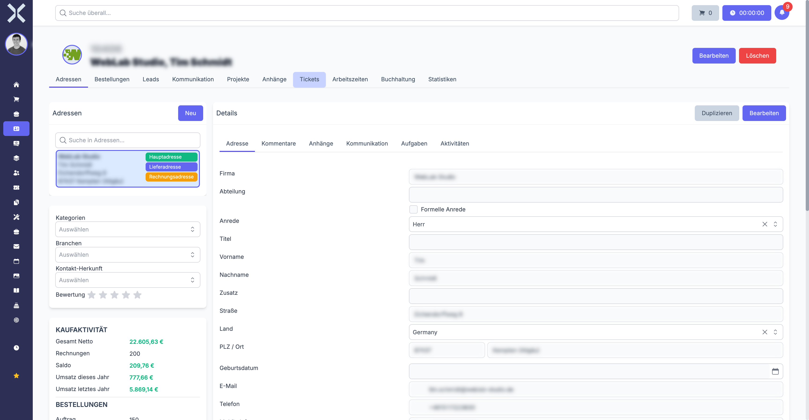

# Adressen

Jedem Kontakt können mehrere Adressen zugeordnet werden. Adressen dienen als Grundlage für Rechnungsstellung, Lieferung und Korrespondenz. Jede Adresse kann eigene Kontaktoptionen (E-Mail, Telefon) besitzen.

## Kontakte vs. Adressen — Das Konzept verstehen

Bevor Sie mit Adressen arbeiten, ist es wichtig, den Unterschied zwischen einem **Kontakt** und einer **Adresse** in Nuxbe zu verstehen. Viele Anwender verwechseln diese beiden Begriffe, was zu Problemen bei der Auftragsanlage und beim Dokumentenversand führen kann.

### Was ist ein Kontakt?

Ein **Kontakt** ist eine Geschäftseinheit — also ein Unternehmen, eine Organisation oder eine Einzelperson. Der Kontakt enthält übergreifende Informationen wie die Kundennummer, Zahlungseinstellungen, Preislisten und Rabattgruppen. Ein Kontakt ist sozusagen die „Klammer" um alle zugehörigen Daten.

Stellen Sie sich einen Kontakt als die **Firma selbst** vor.

### Was ist eine Adresse?

Eine **Adresse** ist ein **physischer Standort** dieses Kontakts. Jede Adresse hat eine eigene Anschrift (Straße, PLZ, Ort, Land) und kann eine eigene Kontaktperson mit eigenem Vor- und Nachnamen, eigener E-Mail-Adresse und eigener Telefonnummer haben.

Stellen Sie sich eine Adresse als ein **Büro, eine Filiale oder ein Lager** dieser Firma vor.

### Ein Kontakt — viele Adressen

Ein einzelner Kontakt kann **beliebig viele Adressen** haben. Das ist in der Praxis sehr häufig der Fall:

| Kontakt | Adresse | Adresstyp | Kontaktperson | E-Mail |
|---|---|---|---|---|
| Muster GmbH | Musterstraße 1, 80331 München | Hauptadresse | Thomas Müller | t.mueller@muster.de |
| Muster GmbH | Berliner Allee 25, 10115 Berlin | Niederlassung | Sabine Weber | s.weber@muster.de |
| Muster GmbH | Hafenweg 8, 20457 Hamburg | Lieferadresse (Lager) | Lars Hansen | lager@muster.de |

In diesem Beispiel gibt es **einen** Kontakt (Muster GmbH), aber **drei** Adressen. Jede Adresse hat eine eigene Kontaktperson mit eigener E-Mail-Adresse. Wenn Sie einen Auftrag für die Muster GmbH anlegen, können Sie auswählen, an welche Adresse die Rechnung geschickt werden soll und an welche Adresse die Ware geliefert werden soll.

> **Tipp:** Denken Sie immer so: **Kontakt = Wer ist der Kunde?** und **Adresse = Wohin sollen die Dokumente oder Waren?** Wenn ein Kunde mehrere Standorte hat, legen Sie nicht mehrere Kontakte an, sondern fügen dem bestehenden Kontakt weitere Adressen hinzu. So behalten Sie den Überblick über alle Aufträge und den gesamten Umsatz dieses Kunden an einer Stelle.

> **Wichtig:** Legen Sie für denselben Kunden **nicht** mehrere Kontakte an, nur weil er mehrere Standorte hat. Stattdessen verwenden Sie **einen** Kontakt mit **mehreren Adressen**. Mehrere Kontakte für denselben Kunden führen dazu, dass Umsätze, Aufträge und die Kommunikationshistorie auf verschiedene Einträge verteilt werden und Sie den Überblick verlieren. Falls Sie versehentlich doppelte Kontakte angelegt haben, können Sie diese über die Funktion [Kontakte zusammenführen](5-kontakte-zusammenfuehren.md) bereinigen.

## Adressen eines Kontakts anzeigen

1. Öffnen Sie die [Detailansicht](2-kontakt-detail.md) eines Kontakts.
2. Wechseln Sie zum Tab **Adressen**.

   

3. Sie sehen eine Tabelle aller hinterlegten Adressen mit folgenden Spalten:
   - **Adresstyp** - Art der Adresse (z. B. Hauptadresse, Lieferadresse, Rechnungsadresse)
   - **Firma** - Firmenname an dieser Adresse
   - **Straße** - Straße und Hausnummer
   - **PLZ** - Postleitzahl
   - **Ort** - Stadt
   - **Land** - Land der Adresse

## Adresstypen

Adresstypen legen fest, wofür eine Adresse verwendet wird. Die verfügbaren Typen werden in den [Einstellungen > Adresstypen](../14-einstellungen/28-adresstypen.md) konfiguriert. Typische Adresstypen sind:

- **Hauptadresse** - Primäre Geschäftsadresse des Kontakts
- **Lieferadresse** - Adresse für den Warenversand
- **Rechnungsadresse** - Adresse für die Rechnungsstellung
- **Standort** - Weiterer Unternehmensstandort

Sie können in den Einstellungen beliebige weitere Adresstypen anlegen.

### Verschiedene Rechnungsadressen pro Auftrag

Ein Kontakt kann mehrere Adressen besitzen. Bei der Auftragsanlage wählen Sie aus, welche Adresse als Rechnungsadresse für diesen Auftrag verwendet werden soll. So können verschiedene Rechnungen desselben Kunden an unterschiedliche Abteilungen oder Standorte adressiert werden.

> **Beispiel:** Die Firma „Muster GmbH" hat ihren Hauptsitz in München und eine Niederlassung in Berlin. Legen Sie beide Adressen unter dem Kontakt „Muster GmbH" an und weisen Sie bei der Auftragsanlage jeweils die passende Rechnungsadresse zu.

## Hauptadresse

Die erste angelegte Adresse eines Kontakts gilt als Hauptadresse. Sie wird standardmäßig für neue Aufträge als Rechnungs- und Lieferadresse übernommen. In der Kontaktliste werden die Daten der Hauptadresse angezeigt.

Um eine andere Adresse als Standard für Rechnungsstellung oder Lieferung festzulegen, weisen Sie der entsprechenden Adresse den passenden Adresstyp zu.

## Adressfelder

Jede Adresse verfügt über die folgenden Felder:

| Feld | Beschreibung |
|---|---|
| **Firma** | Firmenname an dieser Adresse. Kann vom Kontaktnamen abweichen, z. B. bei Niederlassungen. |
| **Anrede** | Anrede der Kontaktperson an dieser Adresse (z. B. Herr, Frau) |
| **Titel** | Akademischer Titel (z. B. Dr., Prof.) |
| **Vorname** | Vorname der Kontaktperson |
| **Nachname** | Nachname der Kontaktperson |
| **Zusatz** | Adresszusatz (z. B. Abteilung, Gebäude, Stockwerk) |
| **Straße** | Straße und Hausnummer |
| **PLZ** | Postleitzahl |
| **Ort** | Stadt |
| **Land** | Land der Adresse. Auswahl aus der Länderliste. |
| **Adresstyp** | Art der Adresse (siehe oben) |

## Sprache auf Adressebene

Jede Adresse kann eine eigene **Sprache** zugewiesen bekommen. Diese Einstellung hat einen direkten Einfluss darauf, in welcher Sprache Dokumente (z. B. Rechnungen, Angebote, Auftragsbestätigungen, Lieferscheine) erstellt werden, wenn sie an diese Adresse adressiert sind.

### Wo finde ich die Spracheinstellung?

Die Sprache wird direkt im Adressformular eingestellt. Öffnen Sie die Adresse zur Bearbeitung — dort finden Sie ein Dropdown-Feld **Sprache**. Wählen Sie die gewünschte Sprache aus der Liste aus.

### Wie wirkt sich die Sprache aus?

Wenn Sie einen Auftrag anlegen und eine Rechnungsadresse auswählen, wird die Sprache dieser Adresse für die Dokumentenerstellung verwendet. Das bedeutet:

- Alle Texte auf der Rechnung (Überschriften, Fußzeilen, Zahlungsbedingungen usw.) erscheinen in der Sprache der Rechnungsadresse.
- Alle automatisch generierten Textbausteine werden in der Sprache der Adresse ausgegeben.
- Die E-Mail-Vorlagen für den Versand dieser Dokumente verwenden ebenfalls die Sprache der Adresse.

### Praktisches Beispiel

Die **Muster GmbH** hat ihren Hauptsitz in Deutschland und eine Tochtergesellschaft in Frankreich:

| Adresse | Land | Sprache | Auswirkung |
|---|---|---|---|
| Musterstraße 1, 80331 München | Deutschland | Deutsch | Rechnungen werden auf Deutsch erstellt |
| 15 Rue de la Paix, 75002 Paris | Frankreich | Französisch | Rechnungen werden auf Französisch erstellt |

Wenn Sie nun einen Auftrag anlegen und die Pariser Adresse als Rechnungsadresse auswählen, wird die Rechnung automatisch auf Französisch erstellt — ohne dass Sie irgendetwas manuell umstellen müssen.

### Was passiert, wenn keine Sprache gesetzt ist?

Wenn bei einer Adresse keine Sprache eingestellt ist, verwendet das System die **Standardsprache des Mandanten**. Die Standardsprache des Mandanten wird in den [Einstellungen](../14-einstellungen/0-index.md) konfiguriert.

> **Tipp:** Wenn Sie regelmäßig mit internationalen Kunden arbeiten, prüfen Sie bei jeder ausländischen Adresse, ob die richtige Sprache hinterlegt ist. So stellen Sie sicher, dass Ihre Kunden Dokumente immer in der korrekten Sprache erhalten.

> **Hinweis:** Die Spracheinstellung betrifft nur die Dokumentenausgabe (PDFs, E-Mail-Vorlagen). Die Benutzeroberfläche von Nuxbe selbst ändert sich dadurch nicht.

## Standardlieferadresse vs. auftragsbezogene Lieferadresse

In der Praxis kommt es häufig vor, dass Rechnungen an eine andere Adresse geschickt werden sollen als die Ware. Nuxbe unterstützt diesen Fall über das Zusammenspiel von Adresstypen und der Adressauswahl bei der Auftragsanlage.

### Standardverhalten bei der Auftragsanlage

Wenn Sie einen neuen Auftrag anlegen, setzt Nuxbe automatisch die **erste Adresse** (Hauptadresse) des Kontakts sowohl als **Rechnungsadresse** als auch als **Lieferadresse** ein. Solange Sie nichts ändern, gehen Rechnung und Lieferung an dieselbe Adresse.

### Lieferadresse im Auftrag ändern

Bei der Auftragsanlage (und auch nachträglich bei der Bearbeitung) können Sie die Lieferadresse des Auftrags jederzeit ändern:

1. Öffnen Sie den Auftrag.
2. Klicken Sie auf das Feld **Lieferadresse**.
3. Wählen Sie aus den hinterlegten Adressen des Kontakts die gewünschte Lieferadresse aus.
4. Speichern Sie den Auftrag.

Der Lieferschein wird dann an die neu gewählte Adresse adressiert, während die Rechnung weiterhin an die Rechnungsadresse geht.

### Feste Lieferadresse für einen Kontakt einrichten

Wenn ein Kontakt seine Waren **immer** an eine bestimmte Adresse geliefert bekommen möchte (z. B. an ein Zentrallager), können Sie dies so einrichten:

1. Legen Sie die Lieferadresse als eigene Adresse unter dem Kontakt an (falls noch nicht vorhanden).
2. Weisen Sie dieser Adresse den Adresstyp **Lieferadresse** zu.
3. Bei der Auftragsanlage wird Nuxbe diese Adresse automatisch als Lieferadresse vorschlagen.

> **Beispiel:** Die Muster GmbH möchte, dass alle Rechnungen an den Hauptsitz in München gehen, die Ware aber immer an das Lager in Hamburg geliefert wird. Legen Sie die Hamburger Adresse mit dem Adresstyp „Lieferadresse" an. Bei jeder neuen Auftragsanlage für die Muster GmbH wird automatisch München als Rechnungsadresse und Hamburg als Lieferadresse vorgeschlagen.

### Zusammenfassung

| Situation | Was tun? |
|---|---|
| Rechnung und Lieferung gehen immer an dieselbe Adresse | Keine besondere Einrichtung nötig — Hauptadresse wird für beides verwendet |
| Lieferung geht bei diesem einen Auftrag ausnahmsweise woanders hin | Lieferadresse direkt im Auftrag ändern |
| Lieferung geht **immer** an eine andere Adresse als die Rechnung | Eigene Adresse mit Adresstyp „Lieferadresse" anlegen |
| Verschiedene Aufträge gehen an verschiedene Lieferadressen | Mehrere Adressen anlegen und bei jedem Auftrag die passende auswählen |

> **Wichtig:** Die Lieferadresse im Auftrag wirkt sich nur auf den Lieferschein und die Versandabwicklung aus. Die Rechnung wird immer an die **Rechnungsadresse** des Auftrags geschickt — nicht an die Lieferadresse.

## Neue Adresse hinzufügen

1. Klicken Sie auf **Neu** im Adress-Tab.
2. Füllen Sie die Adressfelder aus. Pflichtfelder sind mit einem Stern gekennzeichnet.
3. Wählen Sie den passenden **Adresstyp** aus dem Dropdown.
4. Klicken Sie auf **Speichern**.

Die neue Adresse erscheint anschließend in der Adressliste des Kontakts.

## Adresse bearbeiten

1. Klicken Sie auf die gewünschte Adresse in der Tabelle.
2. Ändern Sie die entsprechenden Felder.
3. Klicken Sie auf **Speichern**.

## Adresse löschen

1. Klicken Sie auf **Löschen** neben der gewünschten Adresse.
2. Bestätigen Sie den Löschvorgang im angezeigten Dialog.

Beachten Sie, dass Adressen, die bereits in Aufträgen verwendet werden, nicht gelöscht werden können.

## Kontaktoptionen auf Adressebene

Jede Adresse kann eigene Kontaktoptionen besitzen. So können Sie z. B. für eine Lieferadresse eine abweichende Telefonnummer oder E-Mail-Adresse hinterlegen.

Die Kontaktoptionen auf Adressebene funktionieren analog zu den Kontaktoptionen auf Kontaktebene. Weitere Informationen finden Sie unter [Kommunikation](4-kommunikation.md).

Bei der Auftragsanlage werden die Kontaktoptionen der jeweils ausgewählten Adresse herangezogen. So wird sichergestellt, dass die richtige E-Mail-Adresse für den Rechnungsversand verwendet wird.

> **Wichtig:** Für den automatischen E-Mail-Versand von Mahnungen wird bevorzugt die E-Mail-Adresse der **Rechnungsadresse des Auftrags** verwendet. Ist dort keine E-Mail hinterlegt, fällt das System auf die Rechnungsadresse des Kontakts und dann auf die Hauptadresse zurück. Stellen Sie sicher, dass an der jeweiligen Rechnungsadresse eine gültige E-Mail-Adresse hinterlegt ist. Weitere Details finden Sie unter [Mahnungen](../5-buchhaltung/2-mahnungen.md).

## E-Mail-Adresse auf Adressebene für den Rechnungsversand

Dies ist die **häufigste Frage** im Support: _„Warum bekommt mein Kunde keine Rechnungs-E-Mail?"_ In fast allen Fällen liegt die Ursache daran, dass an der falschen Stelle eine E-Mail-Adresse fehlt oder an der falschen Adresse hinterlegt ist. Lesen Sie diesen Abschnitt sorgfältig durch, um dieses Problem zu vermeiden.

### Die wichtigste Regel

Die E-Mail-Adresse, die auf der **Rechnungsadresse des Auftrags** hinterlegt ist, bestimmt, wohin Rechnungen, Mahnungen und andere Belege per E-Mail versendet werden.

Das bedeutet konkret: Es reicht **nicht** aus, einfach irgendwo beim Kontakt eine E-Mail-Adresse einzutragen. Die E-Mail muss an der **richtigen Adresse** hinterlegt sein — und zwar an genau der Adresse, die im Auftrag als Rechnungsadresse ausgewählt wurde.

### Die Fallback-Kette: Woher nimmt Nuxbe die E-Mail-Adresse?

Wenn Nuxbe eine Rechnung, Mahnung oder ein anderes Dokument per E-Mail versenden soll, sucht das System die E-Mail-Adresse in dieser Reihenfolge:

| Priorität | Wo wird gesucht? | Erklärung |
|---|---|---|
| 1 (höchste) | **Rechnungsadresse des Auftrags** | Die E-Mail-Adresse, die direkt auf der Adresse hinterlegt ist, die im Auftrag als Rechnungsadresse ausgewählt wurde. |
| 2 | **Rechnungsadresse des Kontakts** | Falls der Auftrag keine eigene E-Mail auf der Rechnungsadresse hat, wird die Adresse des Kontakts geprüft, die den Adresstyp „Rechnungsadresse" hat. |
| 3 (niedrigste) | **Hauptadresse des Kontakts** | Falls auch dort keine E-Mail vorhanden ist, wird die Hauptadresse (erste Adresse) des Kontakts herangezogen. |

Wird an **keiner** dieser drei Stellen eine E-Mail-Adresse gefunden, kann das Dokument **nicht** per E-Mail versendet werden. Das System zeigt in diesem Fall eine Fehlermeldung an.

> **Wichtig:** Die häufigste Ursache für das Problem „Kunde bekommt keine Rechnung per E-Mail" ist, dass die E-Mail-Adresse nur auf der **Kontaktebene** (Tab Kommunikation) hinterlegt ist, aber **nicht** auf der **Adressebene**. Die Kontaktebene wird bei der Fallback-Kette **nicht** berücksichtigt — es werden nur die E-Mails auf den Adressen geprüft.

### So hinterlegen Sie die E-Mail-Adresse richtig — Schritt für Schritt

Wenn Sie sicherstellen möchten, dass ein Kunde Rechnungen per E-Mail erhält, gehen Sie wie folgt vor:

1. Öffnen Sie den Kontakt in der [Kontaktdetailansicht](2-kontakt-detail.md).
2. Wechseln Sie zum Tab **Adressen**.
3. Klicken Sie auf die Adresse, die als Rechnungsadresse verwendet wird (in der Regel die Hauptadresse oder eine Adresse mit dem Typ „Rechnungsadresse").
4. Prüfen Sie, ob bei dieser Adresse eine **E-Mail-Adresse** hinterlegt ist.
5. Falls nicht, fügen Sie eine E-Mail-Adresse hinzu:
   - Klicken Sie im Bereich **Kontaktoptionen** der Adresse auf **Neu**.
   - Wählen Sie als Typ **E-Mail**.
   - Geben Sie die E-Mail-Adresse ein (z. B. `buchhaltung@musterfirma.de`).
   - Klicken Sie auf **Speichern**.
6. Speichern Sie die Adresse.

> **Tipp:** Wenn ein Kontakt mehrere Adressen hat und Sie möchten, dass Rechnungen immer an eine bestimmte E-Mail-Adresse gehen, hinterlegen Sie die E-Mail-Adresse an **jeder** Adresse, die als Rechnungsadresse in Aufträgen verwendet wird. So vermeiden Sie Überraschungen.

### Praxisbeispiel: Warum bekommt der Kunde keine E-Mail?

**Situation:** Sie haben für die Muster GmbH eine Rechnung erstellt und versuchen, diese per E-Mail zu versenden. Es kommt aber eine Fehlermeldung, dass keine E-Mail-Adresse vorhanden ist.

**Checkliste zur Fehlersuche:**

1. Öffnen Sie den **Auftrag** und prüfen Sie, welche Adresse als **Rechnungsadresse** eingetragen ist.
2. Öffnen Sie diese **Adresse** und prüfen Sie, ob dort eine **E-Mail-Adresse** hinterlegt ist.
3. Falls dort keine E-Mail ist: Prüfen Sie, ob der Kontakt eine Adresse mit dem Typ **Rechnungsadresse** hat und ob dort eine E-Mail hinterlegt ist.
4. Falls auch dort keine E-Mail ist: Prüfen Sie die **Hauptadresse** des Kontakts.
5. Falls an keiner dieser drei Stellen eine E-Mail vorhanden ist: **Tragen Sie die E-Mail-Adresse an der Rechnungsadresse des Auftrags ein** (siehe Schritt-für-Schritt-Anleitung oben).

> **Hinweis:** E-Mail-Adressen, die nur im Tab **Kommunikation** auf Kontaktebene hinterlegt sind (also nicht an einer bestimmten Adresse), werden für den automatischen Belegversand **nicht** herangezogen. Sie müssen die E-Mail-Adresse immer **auf der Adresse selbst** hinterlegen.

## Weiterführende Themen

- [Kontaktdetails](2-kontakt-detail.md) - Zurück zur Kontaktdetailansicht
- [Kommunikation](4-kommunikation.md) - Kontaktmöglichkeiten verwalten
- [Einstellungen > Adresstypen](../14-einstellungen/28-adresstypen.md) - Adresstypen konfigurieren
- [Einstellungen > Länder](../14-einstellungen/2-laender.md) - Länderliste verwalten
- [Mahnungen](../5-buchhaltung/2-mahnungen.md) - Mahnwesen und Zahlungserinnerungen
