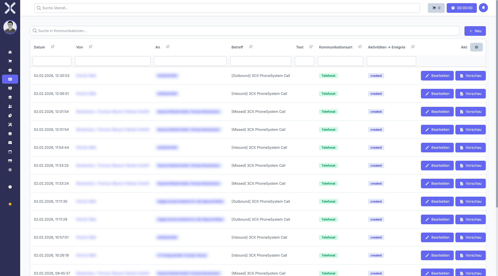

# Kommunikation

Im Tab **Kommunikation** verwalten Sie alle Kontaktmöglichkeiten eines Kontakts. Dazu gehören E-Mail-Adressen, Telefonnummern, Mobilnummern, Faxnummern und Webseiten. Die hier hinterlegten Daten werden bei der Auftragsanlage, beim E-Mail-Versand und in anderen Bereichen von Nuxbe automatisch herangezogen.

## Kommunikation anzeigen

1. Öffnen Sie die [Detailansicht](2-kontakt-detail.md) eines Kontakts.
2. Wechseln Sie zum Tab **Kommunikation**.

   

3. Sie sehen eine Tabelle aller hinterlegten Kontaktmöglichkeiten mit folgenden Spalten:
   - **Typ** - Art der Kontaktmöglichkeit
   - **Wert** - Die eigentliche Kontaktinformation (z. B. die E-Mail-Adresse oder Telefonnummer)

## Verfügbare Typen

Folgende Typen stehen für Kontaktmöglichkeiten zur Verfügung:

| Typ | Beschreibung | Beispiel |
|---|---|---|
| **E-Mail** | E-Mail-Adresse | info@musterfirma.de |
| **Telefon** | Festnetznummer | +49 89 123456 |
| **Mobil** | Mobilfunknummer | +49 170 1234567 |
| **Fax** | Faxnummer | +49 89 123457 |
| **Website** | Internetadresse | www.musterfirma.de |
| **Sonstige** | Weitere Kontaktdaten | z. B. Social-Media-Profile |

## Primäre Kontaktmöglichkeit

Für jeden Typ kann eine Kontaktmöglichkeit als primär markiert werden. Die primäre E-Mail-Adresse wird z. B. beim Versand von Rechnungen oder Angeboten als Standard-Empfänger verwendet. Die primäre Telefonnummer erscheint als erste Nummer in der Übersicht.

## Kontaktoptionen auf Kontakt- und Adressebene

Kontaktmöglichkeiten können auf zwei Ebenen gepflegt werden:

- **Kontaktebene** - Allgemeine Kontaktdaten, die für den gesamten Kontakt gelten (z. B. die zentrale Firmennummer)
- **Adressebene** - Kontaktdaten, die einer bestimmten Adresse zugeordnet sind (z. B. die Durchwahl einer Niederlassung)

Die Kontaktoptionen auf Adressebene verwalten Sie direkt in der jeweiligen Adresse. Weitere Informationen finden Sie unter [Adressen](3-adressen.md).

### Welche Ebene wird verwendet?

Bei der Auftragsanlage werden die Kontaktoptionen der ausgewählten Rechnungsadresse herangezogen. Gibt es dort keine passende Kontaktoption, wird auf die Kontaktoptionen der Kontaktebene zurückgegriffen.

Beim E-Mail-Versand wird die primäre E-Mail-Adresse der jeweiligen Ebene vorgeschlagen. Sie können die Empfängeradresse vor dem Versand manuell anpassen.

## Neue Kontaktmöglichkeit hinzufügen

1. Klicken Sie auf **Neu** im Kommunikations-Tab.
2. Wählen Sie den **Typ** aus dem Dropdown (z. B. E-Mail, Telefon, Mobil, Fax, Website).
3. Geben Sie den **Wert** ein (z. B. die E-Mail-Adresse oder Telefonnummer).
4. Klicken Sie auf **Speichern**.

Der neue Eintrag erscheint anschließend in der Kommunikationsliste.

## Kontaktmöglichkeit bearbeiten

1. Klicken Sie auf den gewünschten Eintrag in der Tabelle.
2. Ändern Sie den Typ oder den Wert.
3. Klicken Sie auf **Speichern**.

## Kontaktmöglichkeit löschen

1. Klicken Sie auf **Löschen** neben dem gewünschten Eintrag.
2. Bestätigen Sie den Löschvorgang im angezeigten Dialog.

## Automatische Verwendung

Die hier hinterlegten Kontaktmöglichkeiten werden in folgenden Bereichen automatisch verwendet:

- **Auftragsanlage** - Die E-Mail-Adresse der Rechnungsadresse wird als Empfänger für den Belegversand vorgeschlagen.
- **E-Mail-Versand** - Beim Erstellen einer E-Mail aus Nuxbe wird die primäre E-Mail-Adresse des Kontakts vorausgefüllt.
- **Kontaktliste** - Die primären Kontaktdaten werden in der Übersicht angezeigt.
- **Mahnwesen** - Mahnungen werden bevorzugt an die E-Mail-Adresse der **Rechnungsadresse des Auftrags** versendet. Fallback: Rechnungsadresse des Kontakts, dann Hauptadresse des Kontakts.

### Voraussetzung für den E-Mail-Versand von Mahnungen

Der automatische Mahnversand verwendet bevorzugt die E-Mail-Adresse der **Rechnungsadresse des Auftrags**. Ist dort keine E-Mail hinterlegt, wird die **Rechnungsadresse des Kontakts** (`Kontakt > Rechnungsadresse`) geprüft. Ist auch dort keine E-Mail vorhanden, wird die **Hauptadresse** des Kontakts verwendet. Fehlt an allen drei Adressen eine E-Mail-Adresse, kann keine Mahnung per E-Mail versendet werden.

> **Wichtig:** Stellen Sie sicher, dass an der Rechnungsadresse des Auftrags oder zumindest an der Hauptadresse des Kontakts eine gültige E-Mail-Adresse hinterlegt ist. Weitere Informationen finden Sie unter [Adressen](3-adressen.md) und [Mahnungen](../5-buchhaltung/2-mahnungen.md).

Weitere Informationen zum Mahnwesen finden Sie unter [Mahnungen](../5-buchhaltung/2-mahnungen.md).

## Weiterführende Themen

- [Kontaktdetails](2-kontakt-detail.md) - Zurück zur Kontaktdetailansicht
- [Adressen](3-adressen.md) - Adressen und deren Kontaktoptionen verwalten
- [E-Mail](../11-e-mail/0-index.md) - E-Mails direkt aus Nuxbe versenden
- [Mahnungen](../5-buchhaltung/2-mahnungen.md) - Mahnwesen und Zahlungserinnerungen
