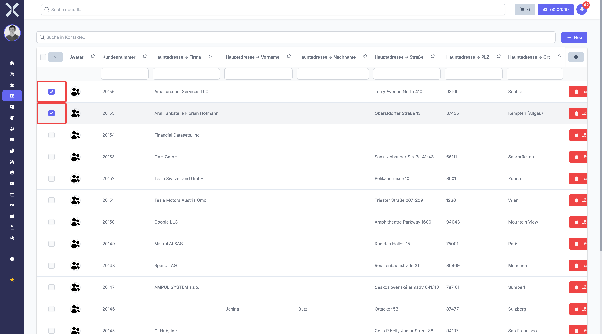
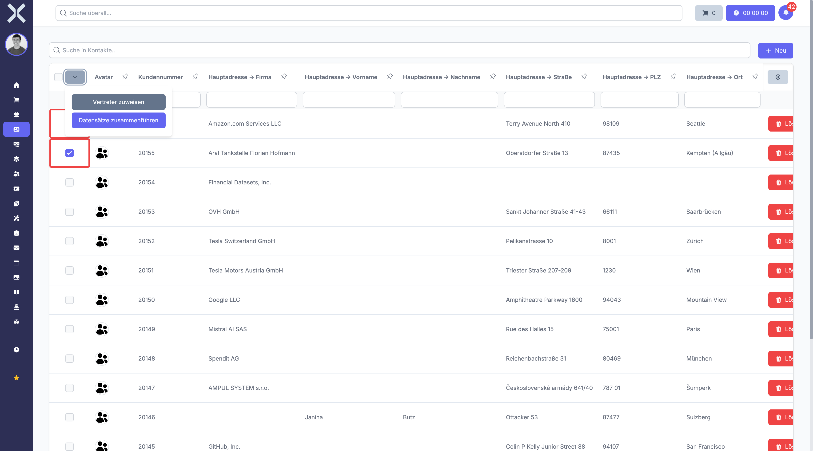
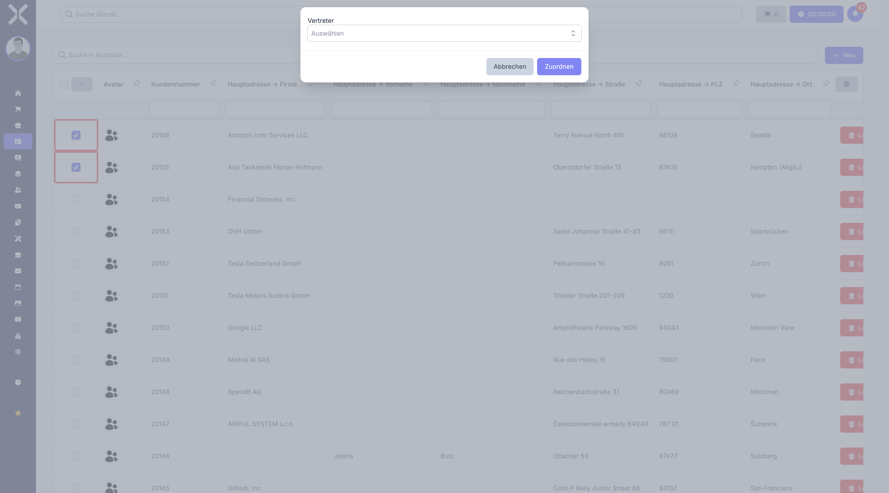
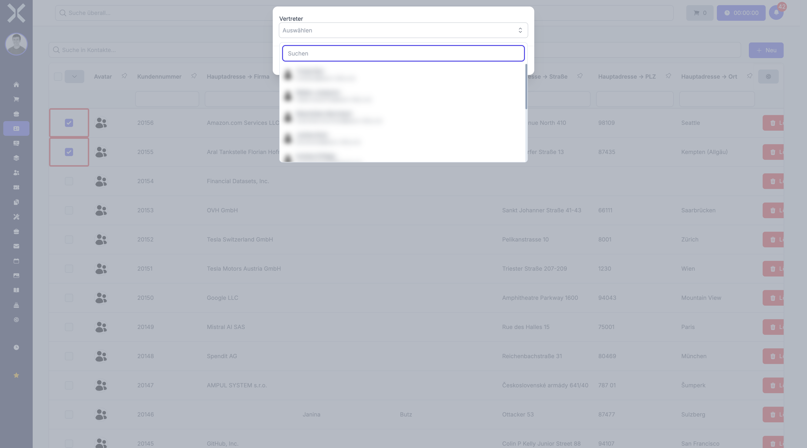

# Vertreter zuweisen

Mit der Funktion **Vertreter zuweisen** können Sie mehreren Kontakten gleichzeitig einen neuen Vertreter zuordnen. Das ist besonders nützlich, wenn ein Mitarbeiter das Unternehmen verlässt und seine Kunden einem anderen Vertreter übergeben werden sollen.

## Voraussetzungen

- Sie benötigen die Berechtigung zum Bearbeiten von Kontakten.
- Der gewünschte Vertreter muss als aktiver Benutzer im System angelegt sein.

## Vertreter für mehrere Kontakte ändern

1. Navigieren Sie zu **Kontakte**.

2. Wählen Sie die Kontakte aus, denen Sie einen neuen Vertreter zuweisen möchten. Klicken Sie dazu auf die Kontrollkästchen am linken Rand der jeweiligen Zeilen.

   

3. Klicken Sie auf den Dropdown-Pfeil neben dem Kontrollkästchen in der Spaltenüberschrift. Unterhalb der Kopfzeile erscheint die Schaltfläche **Vertreter zuweisen**.

   

4. Klicken Sie auf **Vertreter zuweisen**. Es öffnet sich ein Dialog.

   

5. Klicken Sie auf das Auswahlfeld **Auswählen** und wählen Sie den gewünschten Vertreter aus der Liste. Sie können den Namen im Suchfeld eingeben, um die Liste zu filtern.

   

6. Klicken Sie auf **Zuordnen**. Bestätigen Sie die Änderung im angezeigten Bestätigungsdialog.

Alle ausgewählten Kontakte werden dem neuen Vertreter zugeordnet.

## Tipps

- Nutzen Sie die Filter und die Suche in der Kontaktliste, um gezielt die Kontakte eines bestimmten Vertreters zu finden, bevor Sie die Auswahl treffen.
- Über das Kontrollkästchen in der Spaltenüberschrift können Sie alle Kontakte der aktuellen Seite auf einmal auswählen.

## Weiterführende Themen

- [Kontakte verwalten](1-kontakte-verwalten.md) - Kontaktliste, Suche und Filter
- [Kontaktdetails](2-kontakt-detail.md) - Einzelnen Kontakt im Detail ansehen und bearbeiten
- [Zeilen auswählen](../15-tabellen/7-zeilen-auswaehlen.md) - Mehrere Zeilen für Aktionen markieren
