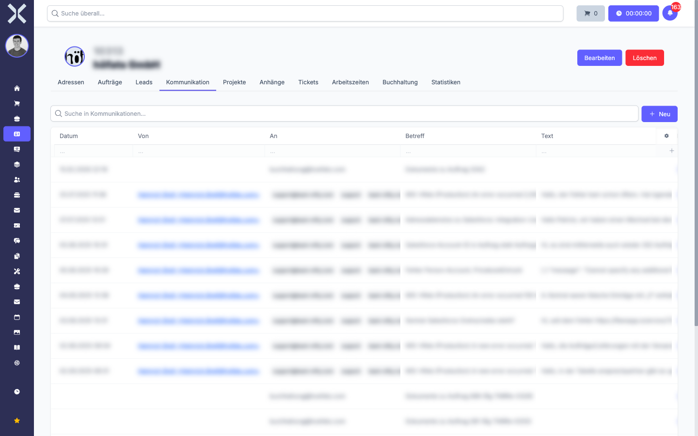
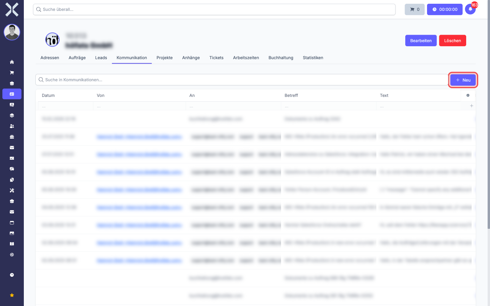
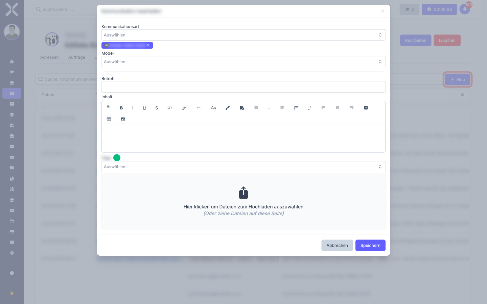
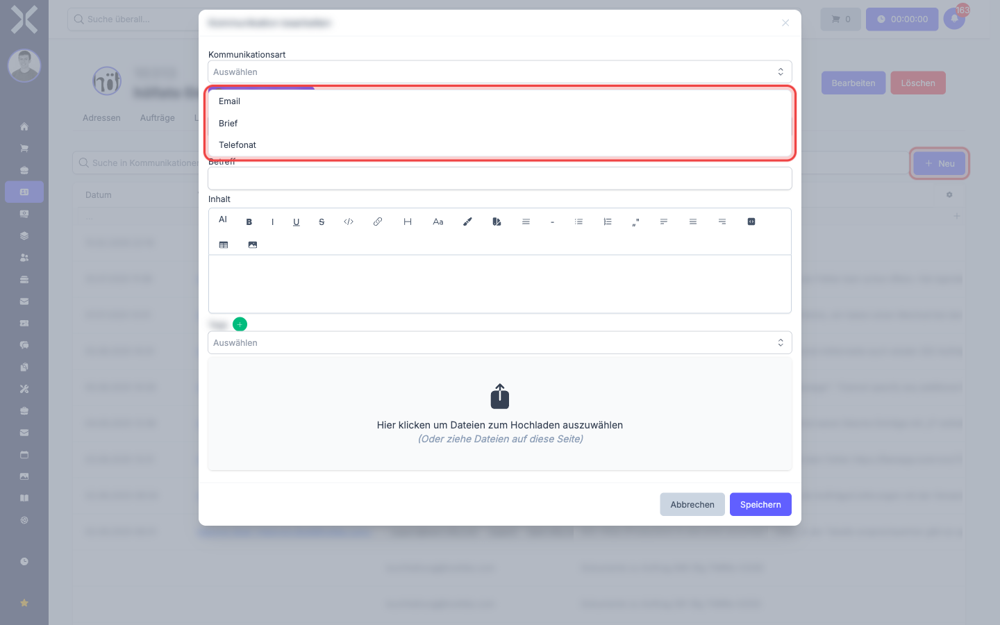

# Kommunikation protokollieren

Im Tab **Kommunikation** auf einem Kontakt -- oder direkt auf einer Adresse, einem Auftrag, einem Ticket oder einer Eingangsrechnung -- protokollieren Sie manuell, welche E-Mails, Briefe oder Telefonate stattgefunden haben. Diese Einträge sind eine reine Dokumentation: Sie versenden damit nichts, sondern halten fest, was bereits passiert ist.

> **Hinweis:** Verwechseln Sie diesen Tab nicht mit dem ähnlich klingenden Tab **Kommunikation** auf der Adress-Detailseite, in dem Sie [Kontaktmöglichkeiten](4-kommunikation.md) (E-Mail, Telefon, Mobil) als feste Eigenschaften pflegen. Hier geht es um **einzelne Vorgänge**, dort um **Daueradressdaten**.

## Wann nutzt man das?

- Sie haben mit einem Kunden telefoniert und möchten festhalten, was vereinbart wurde.
- Sie haben einen Brief verschickt und wollen das nachvollziehbar dokumentieren -- inklusive einer hochgeladenen PDF-Kopie.
- Sie haben eine E-Mail außerhalb von Nuxbe verschickt (z. B. aus Outlook) und wollen den Vorgang trotzdem im Kunden-Verlauf haben.
- Eingehende E-Mails, die über die [E-Mail-Konten-Anbindung](../14-einstellungen/26-mail-konten.md) automatisch in Nuxbe synchronisiert werden, landen ebenfalls in dieser Liste.

## Den Tab öffnen

1. Öffnen Sie die [Detailansicht](2-kontakt-detail.md) eines Kontakts.
2. Klicken Sie auf den Reiter **Kommunikation**.

   

Die Tabelle zeigt alle protokollierten Vorgänge mit folgenden Spalten:

- **Datum** -- wann der Vorgang stattgefunden hat
- **Von** -- Absender (bei E-Mails: Mail-Adresse, bei Briefen/Telefonaten: leer oder manuell gepflegt)
- **An** -- Empfänger
- **Betreff** -- kurze Zeile, was der Vorgang behandelt hat
- **Text** -- Vorschau des Inhalts

Über das **Suchfeld** oben können Sie nach Stichworten in Betreff oder Inhalt filtern.

## Neuen Eintrag anlegen

1. Klicken Sie oben rechts auf **+ Neu**.

   

2. Es öffnet sich ein Formular mit den folgenden Feldern.

   

3. **Kommunikationsart** -- wählen Sie aus, was protokolliert wird:

   

   - **Email** -- für ausgehende oder dokumentierte eingehende Mails
   - **Brief** -- für Postversand
   - **Telefonat** -- für Anrufe (eingehend oder ausgehend)

4. **Modell** und **Datensatz** -- mit diesen beiden Feldern verknüpfen Sie den Eintrag mit weiteren Records. Standardmäßig ist der Datensatz, von dem aus Sie das Formular geöffnet haben (z. B. der Kontakt), bereits zugewiesen. Sie können zusätzlich verknüpfen, etwa: *dieses Telefonat gehört auch zum Auftrag X und zum Ticket Y*.

   1. Wählen Sie unter **Modell** den Datensatztyp (Auftrag, Adresse, Auftrag, Ticket, Eingangsrechnung, Lead, SEPA-Mandat).
   2. Wählen Sie unter **Datensatz** den konkreten Eintrag des gewählten Typs.
   3. Über das grüne **+** rechts neben den Feldern können Sie weitere Verknüpfungen hinzufügen, sodass eine Kommunikation auf mehrere Records verlinkt wird.

   > **Hinweis:** Mehrfachverknüpfungen sind eine der wichtigsten Stärken dieses Tabs. Ein einziges Telefonat, in dem zwei Aufträge besprochen wurden, taucht so im Kommunikations-Verlauf **beider** Aufträge **und** beim Kontakt auf -- mit nur einem Eintrag.

5. **Betreff** -- kurze, sprechende Zeile. Bei E-Mails klassisch der Mail-Betreff, bei Telefonaten ein Stichwort wie *"Reklamation Liefertermin"*.

6. **Inhalt** -- der eigentliche Text. Der Editor unterstützt Formatierung, Aufzählungen, Verlinkungen und Bilder. Bei Telefonaten ein freies Gesprächsprotokoll, bei Briefen oft ein Verweis auf die hochgeladene PDF.

7. **Tags** -- optional. Wenn Sie [Tags](../14-einstellungen/6-tags.md) eingerichtet haben, können Sie hier z. B. *Beschwerde*, *Akquise* oder eine Projekt-Markierung hinterlegen, um später besser zu suchen.

8. **Dateien** -- ziehen Sie unten Dateien per Drag & Drop in das Feld oder klicken Sie auf die Upload-Fläche. Anhänge werden direkt am Eintrag gespeichert.

9. Klicken Sie auf **Speichern**. Der Eintrag erscheint sofort in der Liste -- und gleichzeitig im Kommunikations-Tab aller Records, die Sie als Modell verknüpft haben.

## Wichtig: Es gibt **keine** Vorlagen

Im Gegensatz zum E-Mail-Versand aus einem Auftrag oder einer Rechnung verwendet dieser Tab **keine** [E-Mail-Vorlagen](../14-einstellungen/25-email-vorlagen.md). Es ist eine reine Doku-Funktion. Wenn Sie einen Brief immer wieder ähnlich formulieren, müssen Sie den Text manuell einfügen oder aus einer externen Quelle hineinkopieren.

> **Tipp:** Wenn Sie standardisierten Schriftverkehr automatisch versenden möchten, nutzen Sie die Mail-Versand-Funktion direkt im jeweiligen Datensatz (Auftrag, Rechnung) -- dort sind Vorlagen verfügbar. Der versendete Inhalt wird **automatisch** im Kommunikations-Tab protokolliert.

## Eintrag bearbeiten oder löschen

Klicken Sie in der Liste auf eine Zeile, um den Eintrag zu öffnen. Sie können Inhalt, Anhänge und Verknüpfungen anpassen oder den Eintrag löschen. **Achtung:** Beim Löschen verschwindet der Eintrag aus den Kommunikations-Tabs aller verknüpften Records -- nicht nur aus dem aktuellen.

## Wo erscheinen meine Einträge sonst?

Eine Kommunikation lebt nicht nur am Kontakt. Wenn Sie in Schritt 4 weitere Modelle verknüpft haben, sehen Sie denselben Eintrag auch:

- Im Tab **Kommunikation** des verknüpften Auftrags
- Im Tab **Kommunikation** des verknüpften Tickets
- Im Tab **Kommunikation** der verknüpften Eingangsrechnung
- In der globalen [Kommunikations-Übersicht](../1-erste-schritte/2-navigation.md) unter **Kontakte > Kommunikationen**, wenn Sie diese in Ihrem Mandanten freigeschaltet haben

So bleibt der Verlauf immer am richtigen Ort sichtbar -- egal, ob Sie ihn aus der Kunden-, Auftrags- oder Ticket-Sicht aufrufen.
