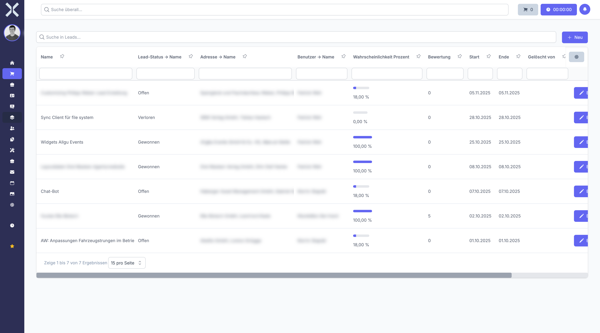

# Leads verwalten

In der Leadliste sehen Sie alle Vertriebskontakte und deren aktuellen Status in der Vertriebspipeline. Von hier aus können Sie neue Leads anlegen, bestehende filtern und direkt in die Detailansicht eines Leads wechseln.

## Leadliste öffnen

1. Klicken Sie in der Sidebar auf **Verkauf** und dann auf **Leads**.

   

2. Die Tabelle zeigt alle Leads mit folgenden Spalten:

   | Spalte | Beschreibung |
   |---|---|
   | **Name** | Bezeichnung des Leads (z. B. Projektname oder Kundenanfrage) |
   | **Status** | Aktueller Stand in der Vertriebspipeline (z. B. Neu, Qualifiziert, Angebot) |
   | **Kontakt** | Verknüpfter Kontakt aus der Kontaktverwaltung |
   | **Adresse** | Adresse des verknüpften Kontakts |
   | **Verantwortlicher** | Zugewiesener Vertriebsmitarbeiter |
   | **Erwarteter Umsatz** | Geschätzter Auftragswert des Leads |
   | **Erwartetes Abschlussdatum** | Geplantes Datum für den Abschluss |
   | **Erstellt am** | Datum, an dem der Lead angelegt wurde |

## Leads suchen

Nutzen Sie das Suchfeld oberhalb der Tabelle, um Leads schnell nach Name, Kontakt oder anderen Kriterien zu finden. Die Ergebnisse werden in Echtzeit aktualisiert.

## Filter verwenden

### Spaltenfilter

Verwenden Sie die Filterzeile unterhalb der Spaltenüberschriften, um gezielt nach Werten in einzelnen Spalten zu filtern. So können Sie beispielsweise nur Leads eines bestimmten Verantwortlichen oder mit einem bestimmten Status anzeigen lassen.

### Gespeicherte Filter

1. Klicken Sie auf **Gespeicherte Filter**, um häufig verwendete Filtereinstellungen aufzurufen.
2. Wählen Sie einen vordefinierten Filter aus oder erstellen Sie einen neuen, indem Sie die gewünschten Filterbedingungen einstellen und speichern.

### Nach Status filtern

Um nur Leads in einem bestimmten Pipelinestatus anzuzeigen, filtern Sie die Spalte **Status** nach dem gewünschten Wert (z. B. nur offene Leads mit Status **Neu** oder **Qualifiziert**).

## Neuen Lead anlegen

1. Klicken Sie auf die Schaltfläche **Neu** oben rechts.
2. Füllen Sie die folgenden Felder aus:
   - **Name** - Aussagekräftige Bezeichnung für den Lead (Pflichtfeld)
   - **Kontakt** - Wählen Sie einen bestehenden Kontakt aus der Kontaktverwaltung
   - **Status** - Wählen Sie den Einstiegsstatus (Standard: Neu)
   - **Verantwortlicher** - Weisen Sie einen Vertriebsmitarbeiter zu
   - **Erwarteter Umsatz** - Tragen Sie den geschätzten Auftragswert ein
   - **Erwartetes Abschlussdatum** - Wählen Sie das geplante Abschlussdatum
3. Klicken Sie auf **Speichern**, um den Lead anzulegen.

> **Tipp:** Wenn Sie den Kontakt auswählen, werden die zugehörige Adresse und weitere Stammdaten automatisch übernommen.

## Weiterführende Themen

- [Lead-Details](2-lead-detail.md) - Einzelnen Lead im Detail ansehen und bearbeiten
- [Kontakte](../2-kontakte/0-index.md) - Kontakte für Leads verwalten
- [Einstellungen > Lead-Status](../14-einstellungen/44-lead-status.md) - Verfügbare Status konfigurieren
