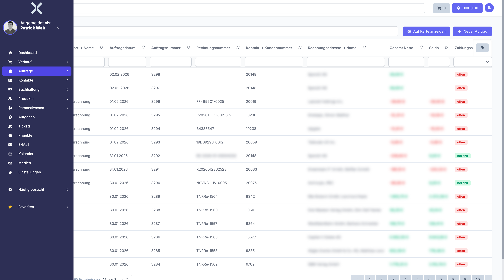
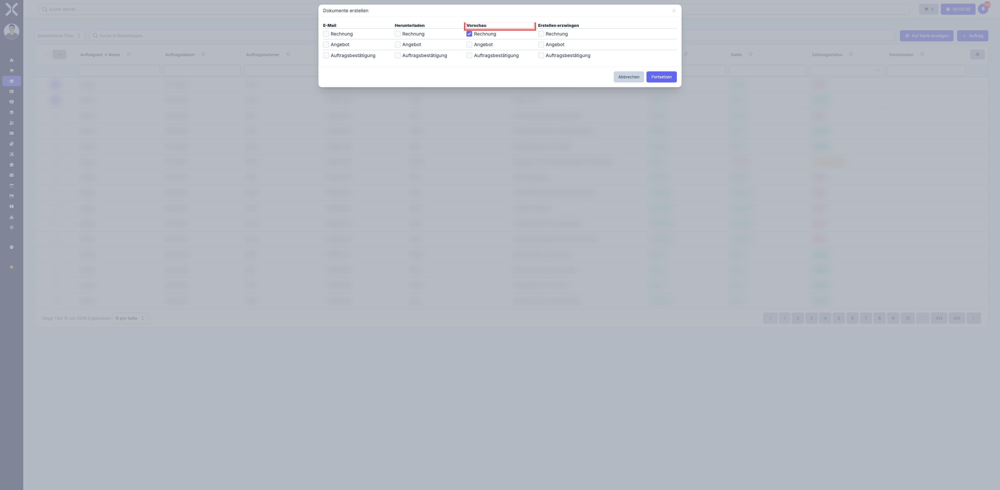

# Aufträge verwalten

In der Auftragsliste sehen Sie alle Aufträge, Rechnungen, Angebote und weitere Auftragsarten auf einen Blick. Von hier aus können Sie neue Aufträge anlegen, bestehende filtern und direkt in die Detailansicht wechseln.

## Auftragsliste öffnen

1. Klicken Sie in der Sidebar auf **Aufträge**.

   

2. Die Tabelle zeigt alle Aufträge mit folgenden Spalten:

   | Spalte | Beschreibung |
   |---|---|
   | **Auftragsnummer** | Eindeutige, automatisch vergebene Nummer des Auftrags |
   | **Auftragsart** | Typ des Auftrags (z. B. Angebot, Auftrag, Rechnung, Gutschrift) |
   | **Kontakt** | Zugehöriger Kunde oder Lieferant |
   | **Rechnungsnummer** | Rechnungsnummer (nur bei Rechnungen und Gutschriften) |
   | **Nettosumme** | Gesamtbetrag ohne Mehrwertsteuer |
   | **Bruttosumme** | Gesamtbetrag inklusive Mehrwertsteuer |
   | **Saldo** | Offener Restbetrag des Auftrags (relevant bei Rechnungen) |
   | **Lieferdatum** | Geplantes oder tatsächliches Lieferdatum |
   | **Erstellt am** | Datum, an dem der Auftrag angelegt wurde |

## Nach Auftragsart filtern

Oberhalb der Tabelle befinden sich **Reiter**, mit denen Sie die Anzeige auf eine bestimmte Auftragsart einschränken können:

- **Alle** - Zeigt sämtliche Aufträge unabhängig vom Typ
- **Angebote** - Nur Angebote
- **Aufträge** - Nur bestätigte Aufträge
- **Rechnungen** - Nur Rechnungen
- **Gutschriften** - Nur Gutschriften
- **Abonnements** - Nur wiederkehrende Aufträge
- **Retouren** - Nur Retouren
- **Einkauf** - Nur Einkaufsaufträge

Klicken Sie auf den gewünschten Reiter, um die Liste entsprechend zu filtern.

## Aufträge suchen

Nutzen Sie das Suchfeld oberhalb der Tabelle, um Aufträge nach Auftragsnummer, Rechnungsnummer, Kontaktname oder anderen Kriterien zu finden. Die Ergebnisse werden in Echtzeit aktualisiert.

## Filter verwenden

### Spaltenfilter

Verwenden Sie die Filterzeile unterhalb der Spaltenüberschriften, um gezielt nach Werten in einzelnen Spalten zu filtern. So können Sie beispielsweise nur Aufträge eines bestimmten Kontakts oder mit einem bestimmten Saldo anzeigen lassen.

### Gespeicherte Filter

1. Klicken Sie auf **Gespeicherte Filter**, um häufig verwendete Filtereinstellungen aufzurufen.
2. Wählen Sie einen vordefinierten Filter aus oder erstellen Sie einen neuen, indem Sie die gewünschten Filterbedingungen einstellen und speichern.

Gespeicherte Filter eignen sich besonders für wiederkehrende Abfragen wie z. B. "Offene Rechnungen der letzten 30 Tage" oder "Alle Angebote in Verhandlung".

## Neuen Auftrag erstellen

1. Klicken Sie auf die Schaltfläche **Neu** oben rechts.
2. Wählen Sie die **Auftragsart** (Angebot, Auftrag, Rechnung etc.).
3. Wählen Sie den **Kontakt** -- die Rechnungs- und Lieferadresse werden automatisch aus den hinterlegten Adressen des Kontakts übernommen.
4. Füllen Sie die weiteren Kopfdaten aus (Zahlungsart, Zahlungsziel, Lieferdatum etc.).
5. Klicken Sie auf **Speichern**, um den Auftrag anzulegen.

> **Tipp:** Nachdem der Auftrag gespeichert wurde, können Sie in der [Detailansicht](2-auftrag-detail.md) Positionen hinzufügen und den Auftrag weiter bearbeiten.

## Mehrere Aufträge gleichzeitig bearbeiten (Sammelaktionen)

In der Auftragsliste können Sie mehrere Aufträge gleichzeitig auswählen und Sammelaktionen ausführen.

### Aufträge auswählen

1. Aktivieren Sie die Kontrollkästchen in der ersten Spalte der Tabelle, um einzelne Aufträge zu markieren.
2. Optional: Verwenden Sie das Kontrollkästchen in der Kopfzeile, um alle sichtbaren Aufträge auf einmal auszuwählen.

### Sammelversand per E-Mail

1. Wählen Sie die gewünschten Aufträge aus.
2. Klicken Sie auf die Schaltfläche **E-Mail senden** in der Aktionsleiste oberhalb der Tabelle.
3. Es öffnet sich das **E-Mail-Fenster**. Hier sehen Sie folgende Felder:
   - **Absender** - Das konfigurierte E-Mail-Konto, von dem gesendet wird.
   - **Empfänger** - Beim Sammelversand ist dieses Feld ausgegraut und nicht bearbeitbar. Der Empfänger wird für jeden Auftrag **individuell** aus der hinterlegten Rechnungsadresse des jeweiligen Auftrags ermittelt. So wird sichergestellt, dass jeder Kunde seine eigene E-Mail erhält.
   - **Betreff** - Wird automatisch aus der **E-Mail Vorlage** der jeweiligen **Auftragsart** befüllt.
   - **E-Mail Vorlage** - Die Vorlage, die für den Inhalt und Betreff der E-Mail verwendet wird. Wird automatisch vorausgewählt, wenn an der Auftragsart eine **E-Mail Vorlage** hinterlegt ist (siehe [Auftragsarten-Einstellungen](../14-einstellungen/11-auftragsarten.md)).
   - **Nachrichtentext** - Der E-Mail-Inhalt, der aus der Vorlage generiert wird. Platzhalter (z. B. Rechnungsnummer, Kundenname) werden beim Versand für jeden Auftrag einzeln ersetzt.
4. Prüfen Sie die Angaben und klicken Sie auf **Senden**.
5. Für jeden ausgewählten Auftrag wird ein PDF mit dem jeweiligen Drucklayout erstellt und zusammen mit der personalisierten E-Mail an den hinterlegten Kontakt versendet.
6. Der Versand wird für jeden Auftrag einzeln im Tab **Kommunikation** der jeweiligen [Detailansicht](2-auftrag-detail.md) protokolliert.

> **Wichtig:** Damit die Felder im E-Mail-Fenster automatisch befüllt werden, muss an der jeweiligen **Auftragsart** eine **E-Mail Vorlage** hinterlegt sein. Ist keine Vorlage konfiguriert, bleiben Betreff und Nachrichtentext leer. Die Konfiguration erfolgt unter [Einstellungen > Aufträge > Auftragsarten](../14-einstellungen/11-auftragsarten.md).

> **Tipp:** Sammelversand eignet sich besonders für monatliche Rechnungsläufe, bei denen viele Rechnungen gleichzeitig versendet werden sollen.

### Sammeldruck

1. Wählen Sie die gewünschten Aufträge aus.
2. Klicken Sie auf **Drucken** in der Aktionsleiste.
3. Wählen Sie das gewünschte Drucklayout.
4. Die PDFs werden für alle ausgewählten Aufträge erzeugt.

### Vorschau erstellen

Mit der **Vorschau** können Sie PDFs erzeugen, ohne dabei eine echte Rechnung oder ein anderes Dokument zu erstellen. Die Vorschau-PDFs enthalten **keine echte Rechnungsnummer und kein Rechnungsdatum** -- sie dienen ausschließlich zur Kontrolle, wie das fertige Dokument aussehen wird.

1. Wählen Sie die gewünschten Aufträge aus.
2. Klicken Sie auf **Dokumente erstellen** in der Aktionsleiste unterhalb der Tabelle.
3. Im Dialog **Dokumente erstellen** sehen Sie für jedes verfügbare Drucklayout eine Zeile mit den Spalten **E-Mail**, **Herunterladen**, **Vorschau** und **Erstellen erzwingen**.
4. Aktivieren Sie das Kontrollkästchen in der Spalte **Vorschau** für das gewünschte Layout (z. B. **Rechnung**).

   

5. Klicken Sie auf **Fortsetzen**.
6. Die Vorschau-PDFs werden erzeugt und Ihnen als Download bereitgestellt.

> **Hinweis:** Wenn Sie **nur** die Spalte **Vorschau** aktivieren, wird kein echtes Dokument erstellt und keine Rechnungsnummer vergeben. So können Sie vorab prüfen, ob alle Daten und Positionen korrekt sind, bevor Sie die endgültige Rechnung erzeugen.

> **Tipp:** Sie können die **Vorschau** auch mit anderen Optionen kombinieren. Aktivieren Sie z. B. zusätzlich **E-Mail** oder **Herunterladen**, um neben der Vorschau gleichzeitig das endgültige Dokument zu erstellen und zu versenden.

## Auftrag duplizieren

Um einen bestehenden Auftrag als Vorlage zu nutzen:

1. Öffnen Sie den gewünschten Auftrag in der [Detailansicht](2-auftrag-detail.md).
2. Klicken Sie auf **Duplizieren**.
3. Es öffnet sich ein Dialog, in dem Sie die **Auftragsart** für den neuen Auftrag auswählen können. Standardmäßig ist die Auftragsart des Originals vorausgewählt.
4. Wählen Sie die gewünschte Auftragsart und bestätigen Sie.
5. Ein neuer Auftrag wird mit denselben Kopfdaten und Positionen erstellt.
6. Passen Sie die Daten nach Bedarf an und klicken Sie auf **Speichern**.

> **Wichtig:** Beim Duplizieren können Sie nur Auftragsarten auswählen, die **demselben Mandanten** zugeordnet sind wie der ursprüngliche Auftrag. Auftragsarten anderer Mandanten werden nicht angeboten. Wenn Sie einen Auftrag für einen anderen Mandanten benötigen, erstellen Sie stattdessen einen neuen Auftrag über die Schaltfläche **Neu** und wählen dort den gewünschten Mandanten und die Auftragsart.

## Weiterführende Themen

- [Auftragsdetails](2-auftrag-detail.md) - Einzelnen Auftrag im Detail ansehen und bearbeiten
- [Auftragspositionen](3-auftragspositionen.md) - Positionen innerhalb eines Auftrags verwalten
- [Auftragspositionen-Liste](4-auftragspositionen-liste.md) - Positionen auftragsübergreifend durchsuchen
- [Einstellungen > Auftragsarten](../14-einstellungen/11-auftragsarten.md) - Auftragsarten konfigurieren
