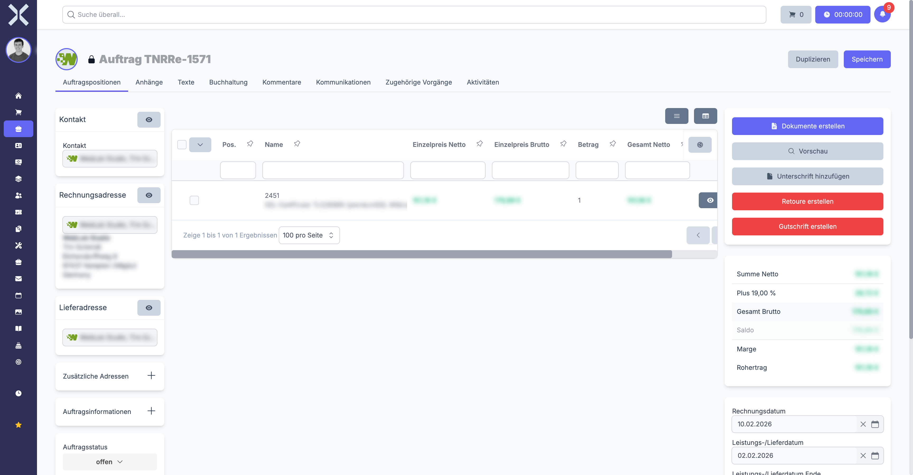
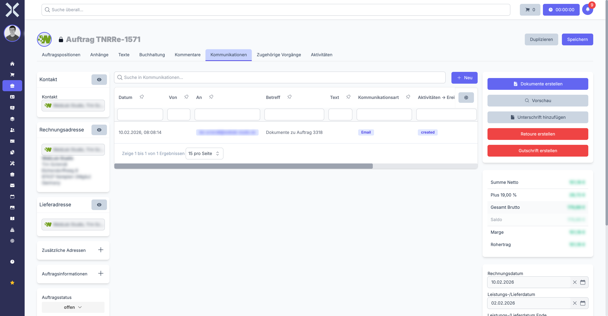

# Auftragsdetails

In der Detailansicht sehen Sie alle Informationen zu einem einzelnen Auftrag und können diesen vollständig bearbeiten. Die Ansicht ist in ein Drei-Spalten-Layout gegliedert, das Ihnen einen schnellen Überblick über alle relevanten Daten gibt.

## Detailansicht öffnen

1. Navigieren Sie zur [Auftragsliste](1-auftraege-verwalten.md).
2. Klicken Sie auf den gewünschten Auftrag.

   

## Linke Spalte (Sidebar)

Die linke Spalte zeigt übergeordnete Informationen und Aktionen zum Auftrag:

- **Auftragsart** - Anzeige der Auftragsart als Badge (z. B. Angebot, Rechnung, Auftrag)
- **Status** - Aktueller Bearbeitungsstatus des Auftrags
- **Aktionsschaltflächen** - Speichern, Löschen, Drucken und weitere Aktionen (siehe Abschnitt [Aktionen](#aktionen))
- **Metadaten** - Zusätzliche Informationen wie Erstelldatum und letztes Änderungsdatum

## Mittlerer Bereich (Hauptinhalt)

Der mittlere Bereich enthält die Kerndaten des Auftrags, aufgeteilt in die Abschnitte Kopfdaten, Positionen und Texte.

### Kopfdaten

Die Kopfdaten umfassen alle übergeordneten Informationen zum Auftrag:

| Feld | Beschreibung |
|---|---|
| **Auftragsnummer** | Automatisch vergebene, eindeutige Nummer des Auftrags |
| **Kommission** | Freies Textfeld für eine interne Referenz oder Kommissionsnummer |
| **Rechnungsnummer** | Rechnungsnummer (wird bei Rechnungen und Gutschriften automatisch vergeben) |
| **Kontakt** | Verknüpfter Kunde oder Lieferant; per Klick gelangen Sie direkt zum Kontakt |
| **Rechnungsadresse** | Adresse für die Rechnungsstellung; aus den hinterlegten Adressen des Kontakts wählbar |
| **Lieferadresse** | Adresse für die Lieferung; kann von der Rechnungsadresse abweichen |
| **Zahlungsart** | Vereinbarte Zahlungsart (z. B. Überweisung, Lastschrift, Kreditkarte) |
| **Zahlungsziel** | Zahlungsfrist in Tagen |
| **Bestelldatum** | Datum der Bestellung |
| **Lieferdatum** | Geplantes oder tatsächliches Lieferdatum |
| **Kopfrabatt** | Prozentualer Rabatt, der auf alle Positionen des Auftrags angewendet wird |

### Rechnungsadresse auswählen

Beim Anlegen oder Bearbeiten eines Auftrags können Sie die Rechnungsadresse aus allen Adressen auswählen, die beim verknüpften Kontakt hinterlegt sind. Klicken Sie dazu auf das Dropdown-Feld **Rechnungsadresse**, um alle verfügbaren Adressen des Kontakts einzusehen. Standardmäßig wird die Hauptadresse des Kontakts vorgeschlagen -- Sie können jedoch jederzeit eine andere Adresse auswählen.

Dies ist besonders wichtig, wenn ein Kontakt mehrere Standorte oder Abteilungen hat, die Rechnungen separat erhalten sollen. Jeder Auftrag kann eine eigene Rechnungsadresse haben. Die Rechnungsadresse bestimmt, welche Anschrift auf dem Beleg (PDF, Druck) erscheint.

Das Ändern der Rechnungsadresse an einem Auftrag hat keinen Einfluss auf die Standardadresse des Kontakts. Die Anpassung wirkt sich ausschließlich auf den jeweiligen Auftrag aus.

> **Beispiel:** Ihr Kunde „Muster GmbH" hat eine Zentrale in München und eine Niederlassung in Berlin. Wählen Sie bei der Auftragsanlage einfach die jeweils passende Adresse im Feld **Rechnungsadresse** aus.

> **Hinweis:** Der automatische E-Mail-Versand von Mahnungen verwendet bevorzugt die E-Mail-Adresse der hier ausgewählten **Rechnungsadresse des Auftrags**. Ist dort keine E-Mail hinterlegt, fällt das System auf die Rechnungsadresse des Kontakts und dann auf die Hauptadresse zurück. Stellen Sie sicher, dass an der Rechnungsadresse eine gültige E-Mail-Adresse hinterlegt ist. Weitere Details finden Sie unter [Mahnungen](../5-buchhaltung/2-mahnungen.md).

### Adresse auf dem Auftrag aktualisieren

Beim Anlegen eines Auftrags wird die Adresse als **Momentaufnahme** im Auftrag gespeichert. Wenn die Adresse eines Kontakts nachträglich in der Adressverwaltung geändert wird (z. B. Umzug, neuer Firmenname), werden bestehende Aufträge **nicht automatisch** aktualisiert. Dadurch bleibt die Adresse auf bereits erstellten Rechnungen korrekt und nachvollziehbar -- auch Jahre nach der Erstellung.

Wenn Sie die Adresse auf einem bestehenden Auftrag manuell aktualisieren möchten:

1. Öffnen Sie den Auftrag in der Detailansicht.
2. Neben dem Dropdown-Feld **Rechnungsadresse** befindet sich ein **Aktualisieren-Symbol** (Pfeil).
3. Klicken Sie auf das Aktualisieren-Symbol. Die Adressdaten werden aus der aktuell in der Adressverwaltung hinterlegten Adresse neu geladen.
4. Klicken Sie auf **Speichern**, um die Änderung zu übernehmen.

> **Hinweis:** Das Aktualisieren-Symbol ist nur bei Aufträgen sichtbar, die noch nicht gesperrt sind. Bei bereits abgeschlossenen oder gesperrten Aufträgen kann die Adresse nicht mehr geändert werden.

> **Wichtig:** Aktualisieren Sie die Adresse bewusst und gezielt. Bei bereits versendeten Rechnungen sollte die ursprüngliche Adresse beibehalten werden, da das Dokument mit dieser Adresse rechtsgültig erstellt wurde.

### Zahlungserinnerung

Das Feld **Zahlungserinnerung Nächstes Datum** steuert, wann die nächste Zahlungserinnerung für diesen Auftrag fällig wird. Das System prüft dieses Datum beim automatischen Mahnlauf. Ist das Datum erreicht und die Rechnung noch nicht bezahlt, wird automatisch eine Mahnung erzeugt.

#### Wo finde ich das Feld?

Das Feld **Zahlungserinnerung Nächstes Datum** befindet sich in der **linken Spalte (Sidebar)** der Auftragsdetailansicht, unterhalb der Zahlungsinformationen. Es ist nur bei Auftragsarten sichtbar, die eine Rechnungsnummer haben (z. B. Rechnungen, Gutschriften) -- bei Angeboten oder Auftragsbestätigungen wird dieses Feld nicht angezeigt.

#### Was passiert, wenn das Datum erreicht ist?

Wenn das Datum im Feld **Zahlungserinnerung Nächstes Datum** erreicht ist **und** die Rechnung noch einen offenen Saldo hat (also nicht vollständig bezahlt ist), geschieht Folgendes beim automatischen Mahnlauf:

1. Das System prüft alle Rechnungen mit einem erreichten oder überschrittenen Zahlungserinnerungsdatum.
2. Für jede überfällige Rechnung wird automatisch eine **Mahnung** erzeugt.
3. Die Mahnung wird gemäß den konfigurierten Mahnstufen erstellt (1. Mahnung, 2. Mahnung, 3. Mahnung usw.).
4. Je nach Konfiguration wird die Mahnung automatisch per E-Mail an den Kunden versendet.
5. Nach dem Erzeugen der Mahnung wird das Feld **Zahlungserinnerung Nächstes Datum** automatisch auf das nächste Mahndatum aktualisiert (basierend auf dem konfigurierten Mahnintervall).

#### Mahnung verzögern (auf einen späteren Zeitpunkt verschieben)

Wenn ein Kunde Sie kontaktiert und um Aufschub bittet (z. B. „Ich kann erst nächsten Monat bezahlen"), können Sie das Mahndatum manuell in die Zukunft verschieben:

1. Öffnen Sie die Rechnung in der Detailansicht.
2. Setzen Sie das Feld **Zahlungserinnerung Nächstes Datum** auf ein Datum in der Zukunft (z. B. 4 Wochen später).
3. Klicken Sie auf **Speichern**.

Bis zum neuen Datum wird für diese Rechnung **keine automatische Mahnung** erzeugt. Nach Erreichen des neuen Datums läuft der Mahnprozess normal weiter.

> **Tipp:** Notieren Sie den Grund für die Verschiebung im Auftrag oder in einem Kommentar am Kontakt, damit Kollegen nachvollziehen können, warum die Mahnung verzögert wurde.

#### Mahnungen für einen Auftrag dauerhaft verhindern

Wenn Sie für einen bestimmten Auftrag **dauerhaft keine Mahnungen** erzeugen möchten, gibt es zwei Möglichkeiten:

1. **Auf Auftragsebene:** Lassen Sie das Feld **Zahlungserinnerung Nächstes Datum** leer und stellen Sie sicher, dass es auch nach dem Speichern leer bleibt. Ohne ein gesetztes Datum wird der Auftrag beim Mahnlauf nicht berücksichtigt.

2. **Auf Kontaktebene:** Wenn ein Kontakt generell nicht gemahnt werden soll (z. B. bei bestimmten Geschäftspartnern oder internen Verrechnungen), können Sie dies direkt am Kontakt konfigurieren. Öffnen Sie dazu den Kontakt und prüfen Sie die Mahneinstellungen in den Stammdaten.

> **Hinweis:** Die Einstellung auf Kontaktebene hat Vorrang. Wenn beim Kontakt Mahnungen deaktiviert sind, werden **alle** Rechnungen dieses Kontakts vom Mahnlauf ausgeschlossen -- unabhängig vom Datum auf dem einzelnen Auftrag.

Weitere Informationen zum Mahnwesen finden Sie unter [Mahnungen](../5-buchhaltung/2-mahnungen.md).

> **Hinweis:** Wenn Sie den Kontakt auswählen oder ändern, werden die Rechnungs- und Lieferadresse sowie die Zahlungseinstellungen automatisch aus den Stammdaten des Kontakts übernommen. Sie können diese Werte anschließend manuell anpassen.

### Positionen

Unterhalb der Kopfdaten finden Sie die **Positionen** des Auftrags -- die einzelnen Zeilen mit Produkten, Dienstleistungen oder freien Texten. Eine ausführliche Beschreibung der Positionsverwaltung finden Sie unter [Auftragspositionen](3-auftragspositionen.md).

### Texte

Im Bereich **Texte** können Sie Kopf- und Fußtexte hinterlegen, die auf den generierten Belegen (z. B. Angebots-PDF, Rechnung) erscheinen:

- **Kopftext** - Wird oberhalb der Positionstabelle auf dem Beleg dargestellt (z. B. Einleitungstext, Bezugnahme auf ein Gespräch)
- **Fußtext** - Wird unterhalb der Positionstabelle auf dem Beleg dargestellt (z. B. Lieferbedingungen, Hinweise)

## Rechte Spalte

Die rechte Spalte zeigt eine Zusammenfassung der Beträge sowie verknüpfte Dokumente:

### Betragsübersicht

| Feld | Beschreibung |
|---|---|
| **Netto** | Gesamtbetrag aller Positionen ohne Mehrwertsteuer |
| **MwSt** | Summe der Mehrwertsteuerbeträge |
| **Brutto** | Gesamtbetrag inklusive Mehrwertsteuer |
| **Saldo** | Offener Restbetrag (Brutto abzüglich bereits geleisteter Zahlungen) |

### Verknüpfte Dokumente

Hier sehen Sie alle Aufträge, die mit dem aktuellen Auftrag in einer Belegkette verknüpft sind. Beispiele:

- Das **Angebot**, aus dem der Auftrag erstellt wurde
- Die **Rechnung**, die aus dem Auftrag generiert wurde
- Eine **Gutschrift**, die zu einer Rechnung erstellt wurde

Klicken Sie auf ein verknüpftes Dokument, um direkt zu dessen Detailansicht zu navigieren.

## Aktionen

Je nach Auftragsart und Status stehen verschiedene Aktionen zur Verfügung:

| Aktion | Beschreibung |
|---|---|
| **Speichern** | Übernimmt alle Änderungen am Auftrag |
| **Löschen** | Löscht den Auftrag (nur möglich, wenn keine Folgebelege existieren) |
| **Drucken / PDF** | Erstellt ein PDF-Dokument des Auftrags (Angebot, Rechnung, Lieferschein etc.) |
| **Duplizieren** | Erstellt eine Kopie des Auftrags mit allen Kopfdaten und Positionen |
| **Auftrag erstellen** | Erzeugt aus einem Angebot einen bestätigten Auftrag |
| **Rechnung erstellen** | Generiert aus einem Auftrag eine Rechnung |
| **Lieferschein** | Erstellt einen Lieferschein auf Basis der Auftragspositionen |
| **Zeitplan** | Nur bei Abonnements: Öffnet die Zeitplan-Konfiguration für wiederkehrende Belege |
| **Kündigung** | Nur bei Abonnements: Startet den Kündigungsprozess |

> **Hinweis:** Nicht alle Aktionen sind zu jeder Zeit verfügbar. Die Anzeige passt sich dem aktuellen Status und der Auftragsart an. Die einzelnen Auftragsarten und ihre spezifischen Funktionen sind unter [Auftragsarten](5-auftragsarten/0-index.md) dokumentiert.

## Dokumente erstellen (Drucken / PDF)

Über die Schaltfläche **Dokumente erstellen** in der rechten Spalte erzeugen Sie PDF-Dokumente für den Auftrag.

### PDF erstellen

1. Öffnen Sie den Auftrag in der Detailansicht.
2. Klicken Sie in der rechten Spalte auf **Dokumente erstellen**.
3. Wählen Sie das gewünschte **Drucklayout** aus (z. B. Rechnung, Angebot, Auftragsbestätigung, Lieferschein). Welche Layouts verfügbar sind, hängt von der Auftragsart ab.
4. Klicken Sie auf **Erstellen**.
5. Das PDF wird generiert. Sie können es anschließend herunterladen oder direkt per E-Mail an den Kunden versenden.

> **Hinweis:** Die Kopfzeile, Fußzeile und das Layout des PDFs werden durch die Auftragsart bestimmt. Wenn Sie das Erscheinungsbild anpassen möchten, ändern Sie die Einstellungen unter [Einstellungen > Auftragsarten](../14-einstellungen/11-auftragsarten.md).

### PDF per E-Mail versenden

Beim Erstellen eines PDFs können Sie dieses direkt per E-Mail versenden:

1. Erstellen Sie das PDF wie oben beschrieben.
2. Wählen Sie die Option zum E-Mail-Versand. Es öffnet sich das **E-Mail-Fenster** mit folgenden Feldern:
   - **Absender** - Das konfigurierte E-Mail-Konto, von dem gesendet wird.
   - **Empfänger** - Wird automatisch aus der Rechnungsadresse des Auftrags übernommen und kann angepasst werden.
   - **Betreff** und **Nachrichtentext** - Werden automatisch aus der **E-Mail Vorlage** befüllt, die an der **Auftragsart** hinterlegt ist.
   - **Anhänge** - Das erstellte PDF wird automatisch als Anhang hinzugefügt.
3. Prüfen Sie die Angaben, passen Sie bei Bedarf Empfänger oder Text an und klicken Sie auf **Senden**.
4. Der Versand wird im Tab **Kommunikation** protokolliert.

> **Wichtig:** Damit Betreff und Nachrichtentext automatisch befüllt werden, muss an der **Auftragsart** eine **E-Mail Vorlage** hinterlegt sein. Die Konfiguration erfolgt unter [Einstellungen > Aufträge > Auftragsarten](../14-einstellungen/11-auftragsarten.md).

### PDF nach Änderungen neu erstellen

Wenn Sie ein PDF bereits erstellt haben und anschließend Änderungen am Auftrag vornehmen (z. B. Adresse, Positionen, Texte), müssen Sie das PDF neu generieren. Aktivieren Sie dazu beim erneuten Erstellen die Option **Erstellen erzwingen**. Ohne diese Option wird das zuvor erstellte PDF ausgeliefert und Ihre Änderungen erscheinen nicht auf dem Beleg.

> **Tipp:** Prüfen Sie das generierte PDF immer, indem Sie es herunterladen. Die HTML-Vorschau im Browser kann von der tatsächlichen PDF-Darstellung abweichen, insbesondere bei Seitenumbrüchen.

### Texte auf dem Beleg

Die Texte, die auf dem PDF erscheinen, pflegen Sie im Bereich **Texte** der Detailansicht. Der **Kopftext** erscheint oberhalb der Positionstabelle, der **Fußtext** darunter. Zusätzlich können in den Auftragsarten-Einstellungen eine Standard-Kopfzeile und -Fußzeile definiert werden.

## Kommunikation

Im Tab **Kommunikation** finden Sie eine vollständige Übersicht aller E-Mails, die zu diesem Auftrag versendet wurden. Dieser Tab ist Ihre zentrale Anlaufstelle, um den gesamten E-Mail-Verkehr rund um einen Auftrag nachzuvollziehen.

### Was wird im Kommunikation-Tab protokolliert?

Jeder E-Mail-Versand, der über Nuxbe für diesen Auftrag ausgelöst wird, erscheint als eigener Eintrag mit folgenden Informationen:

| Feld | Beschreibung |
|---|---|
| **Betreff** | Der Betreff der versendeten E-Mail (z. B. „Ihre Rechnung Nr. RE-2025-0042") |
| **Empfänger** | Die E-Mail-Adresse, an die gesendet wurde |
| **Datum und Uhrzeit** | Der exakte Zeitpunkt des Versands |
| **Status** | Der Zustellstatus der E-Mail (versendet, fehlgeschlagen usw.) |

### Welche E-Mails werden protokolliert?

Folgende Versandarten werden automatisch im Kommunikation-Tab aufgezeichnet:

- **PDF-Versand:** Wenn Sie ein Dokument (Rechnung, Angebot, Gutschrift usw.) per E-Mail an den Kunden senden.
- **Mahnungen:** Wenn eine automatische oder manuelle Mahnung per E-Mail versendet wird.
- **Sammelversand:** Wenn Sie in der Auftragsliste mehrere Aufträge markieren und diese per Sammelversand gleichzeitig verschicken, erscheint für **jeden einzelnen Auftrag** ein separater Eintrag im jeweiligen Kommunikation-Tab. So können Sie auch bei Sammelaktionen nachvollziehen, welcher Auftrag wann an welchen Empfänger gesendet wurde.

### Fehlgeschlagene E-Mails erkennen und erneut senden

Wenn eine E-Mail nicht zugestellt werden konnte (z. B. weil die E-Mail-Adresse ungültig war oder der Mailserver nicht erreichbar war), wird dies im Kommunikation-Tab als **fehlgeschlagen** markiert.

So gehen Sie mit fehlgeschlagenen E-Mails um:

1. Öffnen Sie den Tab **Kommunikation** des betreffenden Auftrags.
2. Prüfen Sie den Eintrag mit dem Status „fehlgeschlagen" und die angezeigte Empfänger-Adresse.
3. Korrigieren Sie ggf. die E-Mail-Adresse beim Kontakt oder auf der Rechnungsadresse (siehe [Adressen](../2-kontakte/3-adressen.md)).
4. Erstellen Sie das Dokument (PDF) erneut über **Dokumente erstellen** und versenden Sie es per E-Mail.

> **Hinweis:** Fehlgeschlagene E-Mails werden **nicht automatisch** erneut versendet. Sie müssen den Versand manuell wiederholen.

### Zusammenhang mit der Kontakt-Kommunikation

Die Kommunikationshistorie ist auch auf **Kontaktebene** verfügbar. Der Unterschied:

- **Auftrags-Kommunikation** (dieser Tab): Zeigt nur E-Mails, die zu **diesem einen Auftrag** gehören.
- **Kontakt-Kommunikation**: Zeigt **alle** E-Mails über **alle Aufträge** dieses Kontakts hinweg.

Öffnen Sie den verknüpften Kontakt und wechseln Sie dort zum Tab **Kommunikation**, um eine Gesamtübersicht über die gesamte E-Mail-Korrespondenz mit diesem Kunden zu erhalten. Weitere Informationen finden Sie unter [Kommunikation](../2-kontakte/4-kommunikation.md).

> **Tipp:** Wenn Sie unsicher sind, ob eine E-Mail beim Kunden angekommen ist, prüfen Sie zuerst den Kommunikation-Tab des Auftrags. Hier sehen Sie den Versandstatus. Bei wiederholten Zustellproblemen kann es hilfreich sein, die E-Mail-Adresse direkt beim Kunden zu verifizieren.

## Welche Adresse erscheint auf welchem Beleg?

Eine der häufigsten Fragen lautet: „Welche Adresse wird auf meinem Dokument gedruckt?" Die Antwort hängt von der Art des Belegs ab. Nuxbe unterscheidet zwischen **Rechnungsadresse** und **Lieferadresse**, und je nach Dokumenttyp wird die eine oder die andere verwendet.

### Übersicht: Adresse nach Belegart

| Belegart | Verwendete Adresse | Erklärung |
|---|---|---|
| **Rechnung** | Rechnungsadresse | Die Rechnung wird an die Rechnungsadresse des Auftrags adressiert. |
| **Gutschrift** | Rechnungsadresse des Originalauftrags | Die Gutschrift verwendet die Rechnungsadresse, die im verknüpften Originalauftrag hinterlegt ist. |
| **Angebot** | Rechnungsadresse | Das Angebot wird an die Rechnungsadresse adressiert. |
| **Auftragsbestätigung** | Rechnungsadresse | Die Auftragsbestätigung wird an die Rechnungsadresse adressiert. |
| **Lieferschein** | Lieferadresse | Der Lieferschein wird an die Lieferadresse adressiert, da er die Ware begleitet. |

### Unterschiedliche Adressen pro Auftrag

Jeder Auftrag kann eine **eigene Rechnungsadresse** und eine **eigene Lieferadresse** haben. Diese werden beim Anlegen des Auftrags aus den hinterlegten Adressen des Kontakts ausgewählt und als Momentaufnahme im Auftrag gespeichert (siehe Abschnitt [Adresse auf dem Auftrag aktualisieren](#adresse-auf-dem-auftrag-aktualisieren)).

Das bedeutet:

- **Auftrag A** kann an die Zentrale in München adressiert sein.
- **Auftrag B** (gleicher Kunde) kann an die Niederlassung in Berlin adressiert sein.
- Beide Aufträge verwenden ihre jeweils eigene Adresse auf den Belegen.

> **Tipp:** Prüfen Sie vor dem Versenden eines Belegs immer, ob die korrekte Adresse ausgewählt ist. Sie können die Rechnungsadresse und die Lieferadresse in den Kopfdaten des Auftrags jederzeit ändern (solange der Auftrag nicht gesperrt ist).

### Was tun, wenn die falsche Adresse auf dem Beleg erscheint?

1. Öffnen Sie den Auftrag in der Detailansicht.
2. Prüfen Sie die Felder **Rechnungsadresse** und **Lieferadresse** in den Kopfdaten.
3. Wählen Sie die korrekte Adresse aus der Dropdown-Liste aus.
4. Klicken Sie auf **Speichern**.
5. **Wichtig:** Wenn Sie bereits ein PDF erstellt haben, müssen Sie das PDF **neu generieren**. Verwenden Sie dazu beim erneuten Erstellen die Option **Erstellen erzwingen** (siehe Abschnitt [PDF nach Änderungen neu erstellen](#pdf-nach-änderungen-neu-erstellen)). Andernfalls wird das alte PDF mit der falschen Adresse ausgeliefert.

> **Wichtig:** Bei bereits versendeten und gesperrten Rechnungen kann die Adresse nicht mehr geändert werden. In diesem Fall müssen Sie den Storno-Workflow verwenden: Gutschrift erstellen und eine neue Rechnung mit der korrekten Adresse anlegen (siehe [Gutschriften > Rechnung korrigieren](5-auftragsarten/3-gutschriften.md#rechnung-korrigieren-storno-workflow)).

### Adresse aktualisieren (Refresh)

Wenn sich die Adresse eines Kontakts geändert hat (z. B. Umzug, neuer Firmenname), wird die Adresse auf bestehenden Aufträgen **nicht automatisch** aktualisiert. Das ist gewollt, damit historische Belege korrekt bleiben. Wenn Sie die Adresse auf einem noch nicht gesperrten Auftrag aktualisieren möchten, verwenden Sie das **Aktualisieren-Symbol** neben dem Adressfeld (siehe Abschnitt [Adresse auf dem Auftrag aktualisieren](#adresse-auf-dem-auftrag-aktualisieren)).

---

## Auftrag bearbeiten

1. Ändern Sie die gewünschten Felder in der Detailansicht.
2. Klicken Sie auf **Speichern**, um die Änderungen zu übernehmen.

## Folgebeleg erstellen

Um aus einem bestehenden Auftrag einen Folgebeleg zu erstellen:

1. Öffnen Sie den Auftrag in der Detailansicht.
2. Klicken Sie auf die gewünschte Aktion (z. B. **Rechnung erstellen**).
3. Der neue Beleg wird mit den Daten des bestehenden Auftrags erstellt und in der Belegkette verknüpft.
4. Sie werden zur Detailansicht des neuen Belegs weitergeleitet.

## Weiterführende Themen

- [Aufträge verwalten](1-auftraege-verwalten.md) - Zurück zur Auftragsliste
- [Auftragspositionen](3-auftragspositionen.md) - Positionen bearbeiten und hinzufügen
- [Kontakte](../2-kontakte/0-index.md) - Verknüpften Kontakt bearbeiten
- [Buchhaltung](../5-buchhaltung/0-index.md) - Zahlungen und Transaktionen verwalten
- [Mahnungen](../5-buchhaltung/2-mahnungen.md) - Mahnwesen und Zahlungserinnerungen
- [Adressen](../2-kontakte/3-adressen.md) - Rechnungsadressen verwalten
- [Kommunikation](../2-kontakte/4-kommunikation.md) - E-Mail-Adressen auf Kontakt- und Adressebene
- [Einstellungen > Auftragsarten](../14-einstellungen/11-auftragsarten.md) - Auftragsarten und Nummernkreise konfigurieren
- [Einstellungen > Zahlungsarten](../14-einstellungen/12-zahlungsarten.md) - Zahlungsarten einrichten
