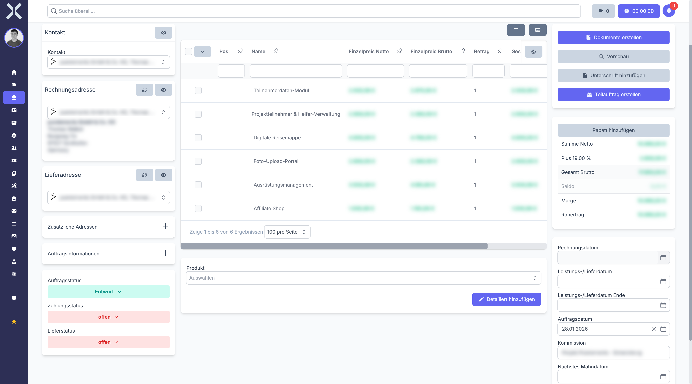

# Auftragspositionen

Auftragspositionen sind die einzelnen Zeilen innerhalb eines Auftrags. Jede Position beschreibt ein Produkt, eine Dienstleistung oder einen freien Text mit den zugehörigen Mengen- und Preisangaben. In diesem Abschnitt erfahren Sie, wie Sie Positionen hinzufügen, bearbeiten, sortieren und löschen.

## Positionen anzeigen

1. Öffnen Sie die [Detailansicht](2-auftrag-detail.md) eines Auftrags.
2. Die Positionen werden im Bereich **Positionen** unterhalb der Kopfdaten angezeigt.

   

## Positionsfelder

Jede Position verfügt über die folgenden Felder:

| Feld | Beschreibung |
|---|---|
| **Produktnummer** | Artikelnummer aus dem Produktkatalog (leer bei Freitextpositionen) |
| **Name** | Bezeichnung der Position |
| **Beschreibung** | Ausführlicher Beschreibungstext, der auf dem Beleg erscheint |
| **Menge** | Stückzahl oder Menge der Position |
| **Einzelpreis** | Preis pro Einheit (netto) |
| **Rabatt** | Positionsbezogener Rabatt in Prozent |
| **MwSt-Satz** | Geltender Mehrwertsteuersatz für diese Position |
| **Gesamtpreis** | Berechneter Gesamtbetrag der Position (Menge x Einzelpreis abzüglich Rabatt) |

## Positionsarten

Nuxbe unterstützt verschiedene Arten von Positionen:

### Produktposition

Eine Standardposition, die auf einem Produkt aus dem Katalog basiert. Beim Hinzufügen eines Produkts werden Name, Beschreibung, Einzelpreis und MwSt-Satz automatisch aus dem Produktkatalog übernommen.

### Freitextposition

Eine Position ohne Verknüpfung zu einem Produkt. Sie geben Name, Beschreibung, Menge und Preis manuell ein. Freitextpositionen eignen sich für individuelle Dienstleistungen oder einmalige Posten, die nicht im Katalog geführt werden.

### Textposition

Eine reine Textzeile ohne Preis- oder Mengenangaben. Textpositionen dienen als Zwischenüberschriften, Trennzeilen oder ergänzende Hinweise innerhalb der Positionsliste. Sie erscheinen auf dem Beleg, werden aber nicht in die Betragsberechnung einbezogen.

### Rabattpositon

Eine Position, die einen Rabatt oder Abzug auf den Gesamtauftrag oder eine Gruppe von Positionen abbildet.

## Neue Position hinzufügen

### Aus dem Produktkatalog

1. Klicken Sie auf **Position hinzufügen** im Positionsbereich.
2. Wählen Sie ein **Produkt** über das Suchfeld aus. Beim Tippen werden passende Produkte aus dem Katalog vorgeschlagen.
3. Name, Beschreibung, Einzelpreis und MwSt-Satz werden automatisch übernommen.
4. Passen Sie bei Bedarf die **Menge** an.
5. Klicken Sie auf **Speichern**.

> **Tipp:** Der Einzelpreis wird automatisch anhand der dem Kontakt zugewiesenen [Preisliste](../14-einstellungen/15-preislisten.md) ermittelt. Sie können den Preis manuell überschreiben.

### Als Freitextposition

1. Klicken Sie auf **Position hinzufügen**.
2. Lassen Sie das Produktfeld leer und geben Sie stattdessen **Name**, **Beschreibung**, **Menge**, **Einzelpreis** und **MwSt-Satz** manuell ein.
3. Klicken Sie auf **Speichern**.

## Hierarchische Positionen

Positionen können hierarchisch strukturiert werden, indem Unterpositionen einer übergeordneten Position zugeordnet werden. Dies eignet sich zum Beispiel für:

- **Baugruppen** - Eine übergeordnete Position (z. B. "Serverinstallation") mit mehreren Unterpositionen (Hardware, Software, Arbeitszeit)
- **Paketangebote** - Ein Gesamtpaket mit einzelnen Bestandteilen
- **Gruppierte Darstellung** - Logische Gruppierung auf dem Beleg für bessere Übersichtlichkeit

Die übergeordnete Position dient dabei als Klammer und kann einen eigenen Preis haben oder lediglich die Summe der Unterpositionen darstellen.

## Positionen sortieren

Die Reihenfolge der Positionen kann per **Drag & Drop** angepasst werden. Ziehen Sie eine Position an die gewünschte Stelle in der Liste. Die neue Reihenfolge wird auf dem generierten Beleg (PDF) übernommen.

## Position bearbeiten

1. Klicken Sie auf die gewünschte Position in der Tabelle.
2. Ändern Sie die gewünschten Felder (Menge, Preis, Beschreibung etc.).
3. Klicken Sie auf **Speichern**.

Der Gesamtpreis und die Auftragssumme werden automatisch neu berechnet.

## Position löschen

1. Klicken Sie auf das **Löschen**-Symbol neben der Position.
2. Bestätigen Sie die Löschung im Bestätigungsdialog.

Die Auftragssumme wird nach dem Löschen automatisch aktualisiert.

## Automatische Preisberechnung

Die Preisermittlung für Produktpositionen erfolgt automatisch anhand folgender Kriterien:

- **Preisliste** - Die dem Kontakt zugewiesene Preisliste bestimmt den Grundpreis
- **Rabattgruppe** - Falls dem Kontakt eine Rabattgruppe zugeordnet ist, wird der Rabatt automatisch angewendet
- **Kopfrabatt** - Der in den Kopfdaten hinterlegte prozentuale Rabatt wird zusätzlich berücksichtigt

Sie können automatisch ermittelte Preise und Rabatte jederzeit manuell überschreiben.

## Weiterführende Themen

- [Auftragsdetails](2-auftrag-detail.md) - Zurück zur Auftragsdetailansicht
- [Auftragspositionen-Liste](4-auftragspositionen-liste.md) - Alle Positionen auftragsübergreifend durchsuchen
- [Produkte](../6-produkte/0-index.md) - Produktkatalog verwalten
- [Einstellungen > Preislisten](../14-einstellungen/15-preislisten.md) - Preislisten einrichten
- [Einstellungen > Rabattgruppen](../14-einstellungen/13-rabattgruppen.md) - Rabattgruppen verwalten
- [Einstellungen > MwSt-Sätze](../14-einstellungen/20-mwst-saetze.md) - Mehrwertsteuersätze konfigurieren
