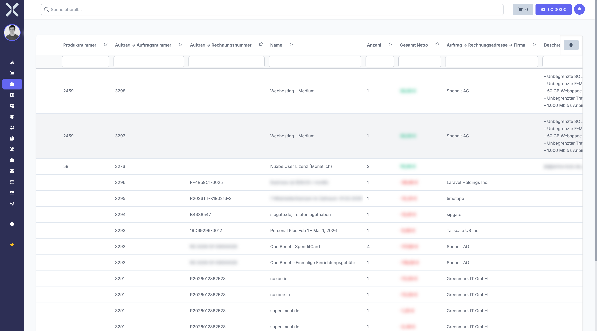

# Auftragspositionen-Liste

Die Auftragspositionen-Liste zeigt alle Positionen über sämtliche Aufträge hinweg in einer gemeinsamen Übersicht. Im Gegensatz zur Positionsansicht innerhalb eines einzelnen Auftrags können Sie hier auftragsübergreifend nach bestimmten Produkten, Kunden oder Zeiträumen suchen und auswerten.

## Liste öffnen

1. Navigieren Sie zu **Aufträge > Auftragspositionen**.

   

2. Die Tabelle zeigt alle Positionen mit folgenden Spalten:

   | Spalte | Beschreibung |
   |---|---|
   | **Produktnummer** | Artikelnummer des Produkts aus dem Katalog |
   | **Auftrag -> Auftragsnummer** | Nummer des zugehörigen Auftrags |
   | **Auftrag -> Rechnungsnummer** | Rechnungsnummer des zugehörigen Auftrags (falls vorhanden) |
   | **Name** | Bezeichnung der Position |
   | **Anzahl** | Menge der Position |
   | **Gesamt Netto** | Nettobetrag der Position |
   | **Auftrag -> Rechnungsadresse -> Firma** | Firmenname des Kunden aus der Rechnungsadresse |
   | **Beschreibung** | Beschreibungstext der Position |

## Positionen suchen und filtern

### Spaltenfilter

Nutzen Sie die Filterzeilen unterhalb der Spaltenüberschriften, um gezielt nach bestimmten Werten zu filtern. Typische Anwendungsfälle:

- **Nach Produktnummer filtern** - Finden Sie alle Aufträge, in denen ein bestimmtes Produkt verkauft wurde
- **Nach Kunde filtern** - Zeigen Sie alle Positionen eines bestimmten Kunden an
- **Nach Auftragsnummer filtern** - Suchen Sie Positionen eines bestimmten Auftrags

### Sortierung

Klicken Sie auf eine Spaltenüberschrift, um die Liste nach dieser Spalte aufsteigend oder absteigend zu sortieren. Ein erneuter Klick kehrt die Sortierreihenfolge um.

### Gespeicherte Filter

Klicken Sie auf **Gespeicherte Filter**, um häufig verwendete Filtereinstellungen aufzurufen oder eigene Filtersets zu erstellen und zu speichern.

## Einsatzbereiche

Die auftragsübergreifende Positionsliste eignet sich besonders für folgende Auswertungen:

- **Produktanalyse** - Welche Produkte wurden in einem bestimmten Zeitraum wie oft verkauft?
- **Kundenanalyse** - Welche Produkte hat ein bestimmter Kunde bestellt?
- **Preisprüfung** - Zu welchen Preisen wurde ein Produkt an verschiedene Kunden verkauft?
- **Umsatzübersicht** - Wie verteilen sich die Umsätze auf einzelne Produkte oder Produktgruppen?

## Position öffnen

Klicken Sie auf eine Position, um zum zugehörigen Auftrag in der [Detailansicht](2-auftrag-detail.md) zu navigieren.

## Weiterführende Themen

- [Auftragspositionen](3-auftragspositionen.md) - Positionen innerhalb eines Auftrags verwalten
- [Aufträge verwalten](1-auftraege-verwalten.md) - Zurück zur Auftragsliste
- [Produkte](../6-produkte/0-index.md) - Produktkatalog verwalten
