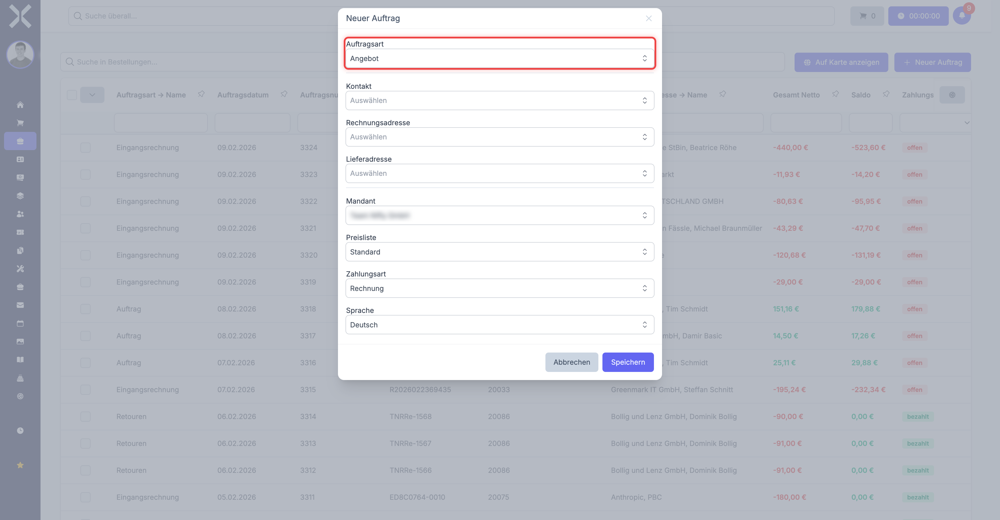
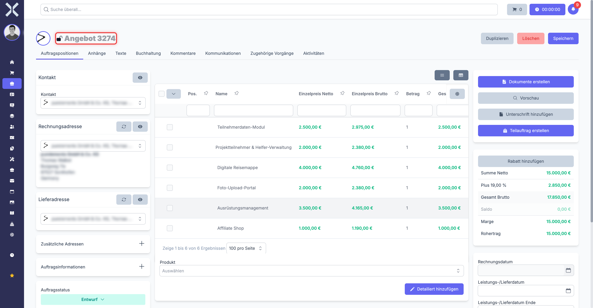

# Angebote

Ein Angebot ist ein unverbindlicher Kostenvoranschlag, den Sie einem Kunden unterbreiten. Es ist die typische Vorstufe zum Auftrag. Sobald der Kunde das Angebot annimmt, wandeln Sie es mit wenigen Klicks in einen verbindlichen Auftrag um. Alle Daten -- Positionen, Preise, Kontaktdaten -- werden dabei automatisch übernommen.

## Wann verwende ich ein Angebot?

- Sie möchten einem Kunden einen Preis für Produkte oder Dienstleistungen nennen, bevor eine Bestellung verbindlich wird.
- Sie benötigen eine schriftliche Grundlage für Preisverhandlungen.
- Sie möchten den Auftragsprozess mit einer dokumentierten Angebotsphase beginnen.

## Angebot erstellen

### Schritt 1: Neuen Auftrag anlegen

1. Navigieren Sie zu **Aufträge**.
2. Klicken Sie auf **Neu**.
3. Wählen Sie als **Auftragsart** den Typ **Angebot**.

   

4. Wählen Sie den **Kontakt** (Kunde).
5. Füllen Sie die Kopfdaten aus (Zahlungsart, Zahlungsziel, Preisliste usw.).
6. Klicken Sie auf **Speichern**.

### Schritt 2: Positionen hinzufügen

1. Klicken Sie auf **Position hinzufügen**.
2. Wählen Sie ein Produkt aus oder geben Sie einen freien Text ein.
3. Legen Sie Menge und Preis fest.
4. Wiederholen Sie dies für alle gewünschten Positionen.
5. Klicken Sie auf **Speichern**.

> **Hinweis:** Die Positionen im Angebot werden bei einer Umwandlung in einen Auftrag vollständig übernommen. Achten Sie darauf, dass alle Preise und Mengen korrekt sind, bevor Sie das Angebot versenden.

### Schritt 3: Texte pflegen (optional)

Im Reiter **Texte** können Sie einen Kopftext (z. B. "Vielen Dank für Ihre Anfrage") und einen Fußtext (z. B. "Dieses Angebot ist 30 Tage gültig") hinterlegen. Diese Texte erscheinen auf dem PDF-Beleg.

## Detailansicht eines Angebots

Die Detailansicht eines Angebots entspricht der allgemeinen [Auftragsdetailansicht](../2-auftrag-detail.md). Sie finden dort:

- **Linke Spalte** -- Kontakt, Rechnungsadresse, Lieferadresse, Auftragsinformationen und Zustände
- **Mittlerer Bereich** -- Kopfdaten, Positionen und Texte als Reiter
- **Rechte Spalte** -- Aktionsschaltflächen, Betragsübersicht (Netto, MwSt, Brutto, Saldo) und Datumsfelder

Das Angebot bietet dieselben Reiter wie alle anderen Auftragsarten: Positionen, Anhänge, Texte, Buchhaltung, Kommentare, Kommunikation, Verknüpfte Dokumente und Aktivitäten.

## Angebot versenden

1. Öffnen Sie das Angebot in der Detailansicht.
2. Klicken Sie in der rechten Spalte auf **Dokumente erstellen**.
3. Wählen Sie das Drucklayout **Angebot** aus.
4. Nuxbe erstellt ein PDF, das Sie herunterladen oder direkt per E-Mail an den Kunden senden können.

## Angebot in Auftrag umwandeln

Wenn der Kunde das Angebot annimmt, erstellen Sie daraus einen verbindlichen Auftrag:

1. Öffnen Sie das Angebot in der Detailansicht.
2. Klicken Sie auf **Duplizieren**.
3. Wählen Sie als neue Auftragsart **Auftrag** (oder eine andere gewünschte Auftragsart).
4. Prüfen Sie die übernommenen Daten und passen Sie diese bei Bedarf an.
5. Klicken Sie auf **Speichern**.

Der neue Auftrag wird automatisch in der Belegkette mit dem ursprünglichen Angebot verknüpft. Sie können diese Verknüpfung in der rechten Spalte unter **Verknüpfte Dokumente** einsehen.

> **Hinweis:** Das ursprüngliche Angebot bleibt erhalten und wird nicht gelöscht. So haben Sie jederzeit eine lückenlose Dokumentation des gesamten Vorgangs.

## Angebot duplizieren

Sie können ein bestehendes Angebot als Vorlage nutzen:

1. Öffnen Sie das gewünschte Angebot.
2. Klicken Sie auf **Duplizieren**.
3. Wählen Sie als Auftragsart wieder **Angebot**.
4. Passen Sie Kontakt, Positionen und Preise nach Bedarf an.
5. Speichern Sie das neue Angebot.

Das ist besonders nützlich, wenn Sie ähnliche Angebote regelmäßig erstellen.

## Verfügbare Drucklayouts

Für Angebote stehen folgende Drucklayouts zur Verfügung:

- **Angebot** -- Das Standard-Layout für den Angebotsbeleg
- **Auftragsbestätigung** -- Falls Sie das Angebot als Auftragsbestätigung versenden möchten
- **Rechnung** -- In der Regel nicht für Angebote verwendet, aber technisch verfügbar
- **Lieferschein** -- In der Regel nicht für Angebote verwendet, aber technisch verfügbar

## Typischer Workflow

Ein typischer Angebotsworkflow sieht wie folgt aus:

1. **Angebot erstellen** -- Positionen und Preise erfassen.
2. **PDF erstellen und versenden** -- Angebots-PDF an den Kunden senden.
3. **Rückmeldung abwarten** -- Der Kunde prüft das Angebot.
4. **Angebot in Auftrag umwandeln** -- Nach Annahme durch den Kunden.
5. **Rechnung erstellen** -- Aus dem Auftrag wird eine Rechnung generiert.

## Weiterführende Themen

- [Aufträge](2-auftraege.md) -- Der nächste Schritt nach dem Angebot
- [Auftragsdetails](../2-auftrag-detail.md) -- Allgemeine Detailansicht
- [Auftragspositionen](../3-auftragspositionen.md) -- Positionen bearbeiten
- [Aufträge verwalten](../1-auftraege-verwalten.md) -- Auftragsliste und Filter
- [Auftragsarten konfigurieren](../../14-einstellungen/11-auftragsarten.md) -- Nummernkreise und Einstellungen
