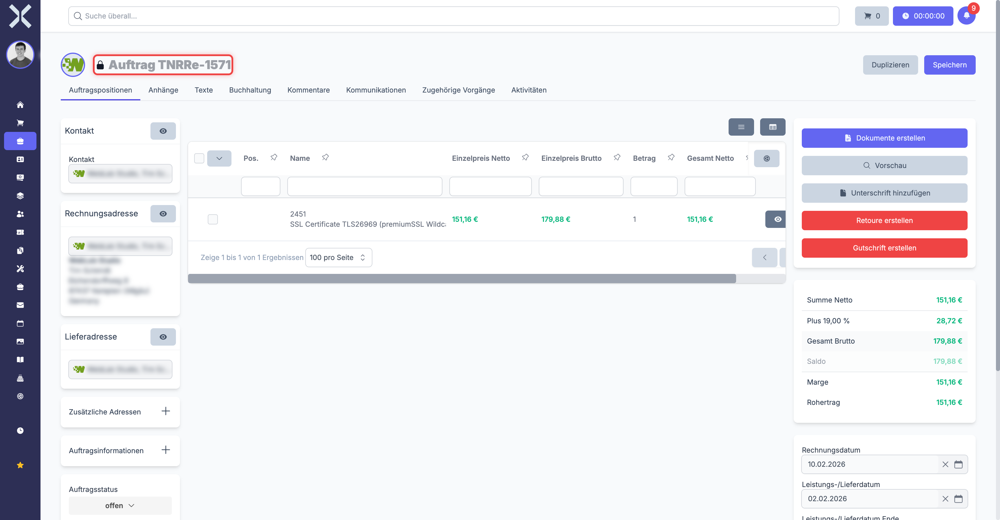
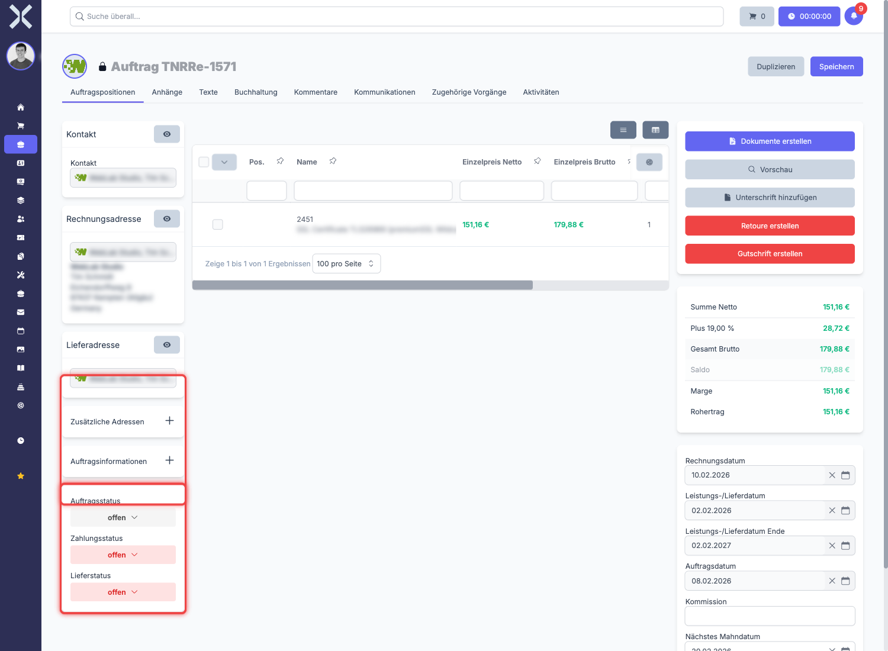
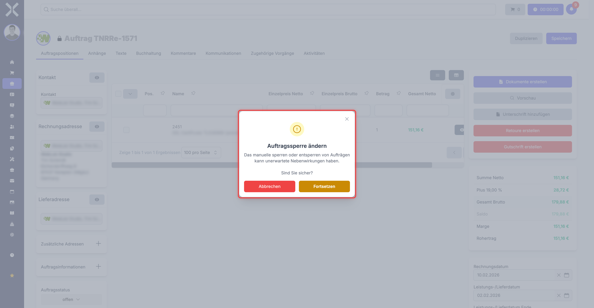
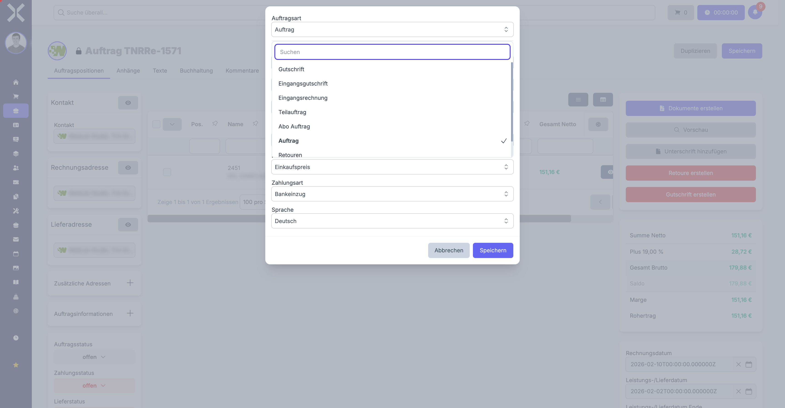

# Aufträge

Der Auftrag ist das zentrale Element der Auftragsverwaltung in Nuxbe. Er stellt einen bestätigten Kundenauftrag dar und bildet die Grundlage für Lieferung, Rechnungsstellung und alle weiteren Folgebelege. Aus einem Auftrag heraus können Sie Rechnungen, Gutschriften, Retouren und Split-Aufträge erstellen.

## Wann verwende ich einen Auftrag?

- Ein Kunde hat ein Angebot angenommen und Sie möchten die Bestellung verbindlich erfassen.
- Sie möchten direkt einen Auftrag anlegen, ohne zuvor ein Angebot zu erstellen.
- Sie benötigen einen Beleg als Grundlage für Rechnungsstellung und Lieferung.

## Auftrag erstellen

### Aus einem Angebot heraus

Wenn bereits ein Angebot vorhanden ist, wandeln Sie dieses in einen Auftrag um:

1. Öffnen Sie das Angebot in der Detailansicht.
2. Klicken Sie auf **Duplizieren**.
3. Wählen Sie als neue Auftragsart **Auftrag**.
4. Prüfen Sie die übernommenen Daten.
5. Klicken Sie auf **Speichern**.

Alle Positionen, Preise und Kontaktdaten werden automatisch übernommen. Der neue Auftrag wird in der Belegkette mit dem Angebot verknüpft.

### Direkt anlegen

1. Navigieren Sie zu **Aufträge**.
2. Klicken Sie auf **Neu**.
3. Wählen Sie als **Auftragsart** den Typ **Auftrag**.
4. Wählen Sie den **Kontakt** (Kunde).
5. Füllen Sie die Kopfdaten aus.
6. Klicken Sie auf **Speichern**.
7. Fügen Sie Positionen hinzu und speichern Sie erneut.

## Detailansicht

Die Detailansicht eines Auftrags ist die umfangreichste aller Auftragsarten. Sie bietet Zugriff auf alle Funktionen, die Nuxbe für die Auftragsverwaltung bereitstellt.

### Linke Spalte (Sidebar)

Die linke Spalte enthält:

- **Kontakt** -- Der verknüpfte Kunde mit Direktlink zum Kontakt
- **Rechnungsadresse** -- Adresse für die Rechnungsstellung
- **Lieferadresse** -- Adresse für die Lieferung (kann abweichen)
- **Zusätzliche Adressen** -- Weitere Adressen (einklappbar)
- **Auftragsinformationen** -- Erweiterte Felder (einklappbar):
  - Mandant
  - Provisionsvermittler
  - Verantwortlicher Benutzer
  - Zugewiesene Benutzer
  - Preisliste
  - Steuerbefreiung
  - Zahlungsart
  - Bankverbindung (falls hinterlegt)
  - Lead
  - Sprache
- **Zustände** -- Drei separate Status-Dropdowns (siehe Abschnitt [Zustandsverwaltung](#zustandsverwaltung))

### Mittlerer Bereich

Der mittlere Bereich enthält die Hauptinhalte als Reiter:

- **Positionen** -- Produkte und Dienstleistungen
- **Anhänge** -- Hochgeladene Dateien
- **Texte** -- Kopf- und Fußtexte für Belege
- **Buchhaltung** -- Buchungsrelevante Informationen
- **Kommentare** -- Interne Notizen
- **Kommunikation** -- E-Mail-Verkehr zum Auftrag
- **Verknüpfte Dokumente** -- Belegkette (Angebote, Rechnungen, Gutschriften usw.)
- **Aktivitäten** -- Änderungsprotokoll

### Rechte Spalte

Die rechte Spalte zeigt:

- **Aktionsschaltflächen** -- Dokumente erstellen, Vorschau, Signatur-Link
- **Betragsübersicht** -- Detaillierte Aufstellung aller Beträge (siehe Abschnitt [Betragsübersicht](#betragsübersicht))
- **Datumsfelder** -- Rechnungsdatum, Leistungszeitraum, Bestelldatum usw. (siehe Abschnitt [Datumsfelder](#datumsfelder))
- **Metadaten** -- Erstellt am/von, Geändert am/von

## Zustandsverwaltung

Ein Auftrag besitzt drei voneinander unabhängige Zustände. Diese werden in der linken Spalte als Dropdown-Felder angezeigt.

### Auftragsstatus

Der Auftragsstatus bildet den allgemeinen Bearbeitungsstand ab. Typische Werte sind z. B. "Offen", "In Bearbeitung" oder "Abgeschlossen".

### Zahlungsstatus

Der Zahlungsstatus zeigt den Stand der Bezahlung an. Typische Werte sind z. B. "Offen", "Teilweise bezahlt" oder "Bezahlt".

### Lieferstatus

Der Lieferstatus zeigt den Stand der Warenlieferung an. Typische Werte sind z. B. "Offen", "Teilweise geliefert" oder "Geliefert".

> **Hinweis:** Die verfügbaren Zustandswerte und Übergänge können in den Einstellungen konfiguriert werden. Nicht alle Übergänge sind jederzeit möglich -- Nuxbe zeigt nur die jeweils gültigen Folgezustände an.

## Auftrag sperren

Ein Auftrag kann gesperrt werden, um versehentliche Änderungen zu verhindern. Das Sperren wird typischerweise automatisch durch das System durchgeführt, z. B. wenn eine Rechnung erzeugt wurde. Sie können den Sperrstatus aber auch manuell umschalten.

### So sperren oder entsperren Sie einen Auftrag

1. Klicken Sie auf das **Schloss-Symbol** neben der Auftragsnummer.
2. Nuxbe zeigt eine Warnmeldung an: "Das manuelle Sperren oder Entsperren von Aufträgen kann unerwartete Nebenwirkungen haben."
3. Bestätigen Sie mit **Weiter**.

### Was passiert, wenn ein Auftrag gesperrt ist?

- Die meisten Felder in der Detailansicht werden deaktiviert und sind nicht mehr bearbeitbar.
- Kontakt, Adressen, Preisliste und Steuerbefreiung können nicht mehr geändert werden.
- Positionen können nicht mehr hinzugefügt, geändert oder entfernt werden.
- Eingeschränkte Änderungen sind weiterhin möglich (z. B. Zustände, Kommentare, bestimmte Datumsfelder).
- Der **Löschen**-Button wird ausgeblendet.

> **Hinweis:** Das manuelle Entsperren eines gesperrten Auftrags kann Inkonsistenzen verursachen, z. B. wenn bereits Rechnungen erstellt wurden. Nutzen Sie diese Funktion nur, wenn Sie sich sicher sind.

## Folgebelege erstellen

Aus einem Auftrag heraus können Sie verschiedene Folgebelege erstellen. Die Optionen finden Sie über die Schaltfläche **Duplizieren** in der oberen Leiste.

### Rechnung erstellen

1. Klicken Sie auf **Duplizieren**.
2. Wählen Sie als Auftragsart **Rechnung** (oder die entsprechende Rechnungs-Auftragsart).
3. Prüfen und speichern Sie den neuen Beleg.

Die Rechnung übernimmt alle Positionen und Kopfdaten aus dem Auftrag. Der Auftrag wird dabei in der Regel automatisch gesperrt.

### Gutschrift erstellen

1. Klicken Sie auf **Duplizieren**.
2. Wählen Sie als Auftragsart **Gutschrift**.
3. Passen Sie die Positionen an (z. B. nur die reklamierten Artikel).
4. Speichern Sie die Gutschrift.

Weitere Details finden Sie unter [Gutschriften](3-gutschriften.md).

### Retoure erstellen

1. Klicken Sie auf **Duplizieren**.
2. Wählen Sie als Auftragsart **Retoure**.
3. Passen Sie die Positionen an (z. B. nur die zurückgesendeten Artikel).
4. Speichern Sie die Retoure.

Weitere Details finden Sie unter [Retouren](5-retouren.md).

### Split-Auftrag erstellen

Split-Aufträge sind Teilaufträge, die als untergeordnete Aufträge dem Hauptauftrag zugeordnet werden. Sie eignen sich z. B. für Teillieferungen.

1. Klicken Sie auf **Duplizieren**.
2. Wählen Sie als Auftragsart **Split-Auftrag**.
3. Passen Sie die Positionen an.
4. Speichern Sie den Split-Auftrag.

Weitere Details finden Sie unter [Split-Aufträge](8-split-auftraege.md).

### Endrechnung erstellen

Eine Endrechnung ist ein spezieller Beleg, der alle bereits erstellten Teil- oder Split-Rechnungen zusammenfasst. Diese Option ist nur verfügbar, wenn mindestens ein Split-Auftrag mit eigener Rechnungsnummer existiert.

1. Öffnen Sie den übergeordneten Auftrag.
2. Die Option **Endrechnung** erscheint, wenn Split-Aufträge mit Rechnungsnummer vorhanden sind.
3. Die Endrechnung berücksichtigt alle bereits abgerechneten Teilbeträge.

## Rabattverwaltung

Aufträge unterstützen Rabatte auf Auftragsebene, die auf den Gesamtbetrag angewendet werden.

### Rabatt hinzufügen

1. Klicken Sie in der rechten Spalte (Betragsübersicht) auf **Rabatt hinzufügen**.
2. Geben Sie einen **Namen** für den Rabatt ein (z. B. "Treuerabatt").
3. Geben Sie den **Rabattwert** ein.
4. Wählen Sie über den Schalter **Ist Prozentual**, ob der Rabatt als Prozentsatz oder als fester Betrag gelten soll.
5. Klicken Sie auf **Speichern**.

### Rabatte sortieren

Wenn mehrere Rabatte vorhanden sind, können Sie deren Reihenfolge per Drag-and-Drop ändern. Die Reihenfolge beeinflusst die Berechnung: Rabatte werden nacheinander angewendet.

### Rabatt entfernen

Klicken Sie auf das rote **X** neben dem jeweiligen Rabatt, um diesen zu löschen.

> **Hinweis:** Rabatte auf Auftragsebene sind unabhängig von Positionsrabatten. Positionsrabatte werden pro Zeile angewendet, Auftragsrabatte auf die Gesamtsumme.

## Betragsübersicht

Die rechte Spalte zeigt eine detaillierte Aufstellung aller Beträge:

| Feld | Beschreibung |
|---|---|
| **Summe netto ohne Rabatt** | Gesamtbetrag aller Positionen vor allen Rabatten |
| **Positionsrabatte** | Summe aller Rabatte auf Positionsebene (Prozent und Betrag) |
| **Summe netto rabattiert** | Nettobetrag nach Abzug der Positionsrabatte |
| **Auftragsrabatte** | Einzeln aufgelistete Rabatte auf Auftragsebene |
| **Gesamtrabatt** | Summe aller Rabatte (Position + Auftrag) |
| **Zwischensumme netto** | Nettobetrag des Hauptauftrags (ohne Split-Aufträge) |
| **Split-Aufträge netto** | Nettobetrag der untergeordneten Split-Aufträge |
| **Summe netto** | Gesamter Nettobetrag (Hauptauftrag + Split-Aufträge) |
| **MwSt** | Auflistung der Mehrwertsteuerbeträge nach Steuersatz |
| **Brutto** | Gesamtbetrag inklusive Mehrwertsteuer |
| **Saldo** | Offener Restbetrag (Brutto abzüglich Zahlungen) |
| **Saldo bei Skonto** | Offener Betrag bei Zahlung innerhalb der Skontofrist |
| **Marge** | Differenz zwischen Verkaufspreis und Einkaufspreis |
| **Rohertrag** | Ertrag nach Abzug der direkten Kosten |

> **Hinweis:** Die Felder "Marge" und "Rohertrag" sind nur sichtbar, wenn Sie die entsprechenden Berechtigungen besitzen.

## Datumsfelder

In der rechten Spalte finden Sie folgende Datumsfelder:

| Feld | Beschreibung |
|---|---|
| **Rechnungsdatum** | Wird automatisch gesetzt, wenn eine Rechnungsnummer vergeben wird. Nicht manuell änderbar. |
| **Leistungsdatum** | Beginn des Leistungszeitraums |
| **Leistungsdatum Ende** | Ende des Leistungszeitraums |
| **Bestelldatum** | Datum der Kundenbestellung |
| **Kommission** | Freitextfeld für eine interne Referenz |
| **Nächstes Mahnungsdatum** | Datum für die nächste Zahlungserinnerung |

## Verfügbare Drucklayouts

Für Aufträge stehen folgende Drucklayouts zur Verfügung:

- **Rechnung** -- Standard-Rechnungsbeleg
- **Endrechnung** -- Zusammenfassende Rechnung über alle Split-Aufträge
- **Angebot** -- Angebotsbeleg
- **Auftragsbestätigung** -- Bestätigung des Auftrags
- **Lieferschein** -- Lieferschein für den Versand

## Typischer Workflow

### Standardworkflow

1. **Auftrag erstellen** -- Direkt oder aus einem Angebot.
2. **Positionen pflegen** -- Produkte und Dienstleistungen hinzufügen.
3. **Auftragsstatus setzen** -- Z. B. auf "In Bearbeitung".
4. **Lieferung vorbereiten** -- Lieferschein erstellen und Lieferstatus aktualisieren.
5. **Rechnung erstellen** -- Rechnungs-PDF erzeugen und versenden.
6. **Zahlung erfassen** -- Zahlungsstatus aktualisieren, wenn die Zahlung eingeht.

### Workflow mit Teillieferungen

1. **Auftrag erstellen**.
2. **Split-Auftrag für erste Teillieferung** erstellen.
3. **Rechnung für den Split-Auftrag** erstellen.
4. Weitere Split-Aufträge für weitere Teillieferungen erstellen.
5. **Endrechnung** erstellen, wenn alle Lieferungen abgeschlossen sind.

## Weiterführende Themen

- [Angebote](1-angebote.md) -- Vorstufe zum Auftrag
- [Gutschriften](3-gutschriften.md) -- Korrekturbelege
- [Retouren](5-retouren.md) -- Rücksendungen
- [Split-Aufträge](8-split-auftraege.md) -- Teilaufträge
- [Auftragsdetails](../2-auftrag-detail.md) -- Allgemeine Detailansicht
- [Auftragspositionen](../3-auftragspositionen.md) -- Positionen bearbeiten
- [Aufträge verwalten](../1-auftraege-verwalten.md) -- Auftragsliste und Filter
- [Auftragsarten konfigurieren](../../14-einstellungen/11-auftragsarten.md) -- Nummernkreise und Einstellungen
