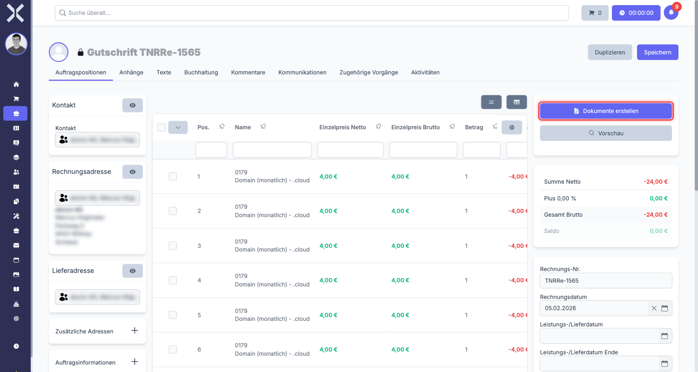

# Gutschriften

Eine Gutschrift ist ein Korrekturbeleg, der den offenen Betrag eines Kunden reduziert. Sie wird immer in Bezug auf einen bestehenden Auftrag oder eine Rechnung erstellt und enthält negative Beträge. Gutschriften können nicht eigenständig angelegt werden -- sie sind immer mit einem Originalbeleg verknüpft.

## Wann wird eine Gutschrift benötigt?

Typische Anwendungsfälle für Gutschriften:

- **Fehlerhafte Rechnung** - Eine Rechnung wurde mit falschem Betrag oder falschen Positionen erstellt.
- **Reklamation** - Der Kunde reklamiert eine Leistung oder ein Produkt und erhält eine teilweise oder vollständige Rückerstattung.
- **Preisnachlass** - Dem Kunden wird nachträglich ein Rabatt gewährt.
- **Teilstorno** - Nur ein Teil der ursprünglichen Rechnung soll storniert werden.

> **Hinweis:** Eine Gutschrift ist eine rein finanzielle Korrektur. Wenn der Kunde Ware zurücksendet, verwenden Sie stattdessen eine [Retoure](5-retouren.md).

## Gutschrift erstellen

Eine Gutschrift wird immer aus einem bestehenden Auftrag heraus erstellt, der bereits eine Rechnungsnummer hat.

### Schritt 1: Originalbeleg öffnen

1. Navigieren Sie zu **Aufträge** und öffnen Sie den Auftrag, für den die Gutschrift erstellt werden soll.
2. Der Auftrag muss bereits eine Rechnungsnummer haben.

### Schritt 2: Gutschrift anlegen

1. Klicken Sie in der Sidebar auf **Gutschrift erstellen**.

   

2. Nuxbe erstellt automatisch einen neuen Beleg vom Typ **Gutschrift**.
3. Die Daten aus dem Originalbeleg werden übernommen:
   - Kontakt und Adresse
   - Positionen und Preise
   - Zahlungsbedingungen

> **Hinweis:** Die Verknüpfung zum Originalbeleg wird automatisch hergestellt. Sie müssen diese nicht manuell setzen.

### Schritt 3: Positionen anpassen

Nach dem Erstellen können Sie die Positionen der Gutschrift anpassen. Das ist besonders wichtig bei einer Teilgutschrift.

- **Vollständige Gutschrift** - Alle Positionen und Mengen bleiben wie im Originalbeleg.
- **Teilgutschrift** - Entfernen Sie Positionen, die nicht gutgeschrieben werden sollen, oder reduzieren Sie die Mengen.

Die Beträge in einer Gutschrift sind immer **negativ** (mit Minuszeichen). Das bedeutet: Der Betrag wird dem Kunden gutgeschrieben und reduziert seinen offenen Saldo.

### Schritt 4: Speichern

Klicken Sie auf **Speichern**, um die Gutschrift zu sichern.

## Freigabe-Workflow

Gutschriften durchlaufen einen Freigabe-Workflow, bevor sie gültig werden.

1. **Genehmiger zuweisen** - Wählen Sie im Feld **Genehmiger** die Person aus, die die Gutschrift freigeben soll.
2. **Prüfung** - Der Genehmiger prüft die Gutschrift auf Richtigkeit.
3. **Bestätigung** - Der Genehmiger setzt das Bestätigungshäkchen, um die Gutschrift freizugeben.

> **Hinweis:** Ohne Freigabe durch den Genehmiger kann die Gutschrift nicht abgeschlossen werden. Das schützt vor versehentlichen oder unberechtigten Korrekturen.

## Verknüpfung zum Originalbeleg

Jede Gutschrift ist automatisch mit dem Originalauftrag verknüpft. Sie finden diese Verknüpfung an zwei Stellen:

- **In der Gutschrift** - In der rechten Spalte unter **Verknüpfte Dokumente** sehen Sie den Originalauftrag.
- **Im Originalauftrag** - Unter **Verknüpfte Dokumente** erscheint die Gutschrift.

So können Sie jederzeit zwischen den beiden Belegen hin- und herspringen.

## Auswirkung auf den Saldo

Wenn eine Gutschrift erstellt und freigegeben wird, hat das folgende Auswirkungen:

- Der **offene Betrag** des Originalauftrags wird um den Gutschriftsbetrag reduziert.
- Im Saldo des Kunden wird die Gutschrift als negativer Betrag geführt.
- Die Gutschrift erscheint in der Belegkette des Originalauftrags.

> **Hinweis:** Die Gutschrift ändert den Originalbeleg nicht. Stattdessen wird ein separater Korrekturbeleg erstellt, der den offenen Betrag rechnerisch reduziert.

## Rechnung korrigieren (Storno-Workflow)

Einer der häufigsten Anwendungsfälle für Gutschriften ist die Korrektur einer fehlerhaften Rechnung. Viele Anwender fragen sich: „Ich habe einen Fehler auf der Rechnung gemacht -- wie korrigiere ich das?" Die Antwort: **Sie können eine bereits versendete oder gesperrte Rechnung nicht direkt bearbeiten.** Stattdessen müssen Sie den sogenannten Storno-Workflow verwenden.

> **Wichtig:** Löschen Sie niemals eine bereits versendete Rechnung. In der DACH-Region (Deutschland, Österreich, Schweiz) ist es gesetzlich vorgeschrieben, dass jede erstellte Rechnung mit einer Rechnungsnummer lückenlos nachvollziehbar sein muss. Statt eine fehlerhafte Rechnung zu löschen, erstellen Sie eine Gutschrift und anschließend eine neue, korrigierte Rechnung.

### Warum kann ich die Rechnung nicht einfach bearbeiten?

Sobald eine Rechnung eine Rechnungsnummer erhalten hat und/oder versendet wurde, wird sie in Nuxbe gesperrt. Das hat rechtliche Gründe:

- **Lückenlose Belegkette:** Jede Rechnungsnummer muss nachvollziehbar bleiben. Wenn Sie eine Rechnung einfach ändern oder löschen würden, entstünde eine Lücke in der Nummerierung, die bei einer Steuerprüfung Probleme verursachen kann.
- **Dokumentationspflicht:** Jedes versendete Dokument muss in seiner ursprünglichen Form archiviert bleiben.
- **Nachvollziehbarkeit:** Sowohl der Rechnungsempfänger als auch das Finanzamt müssen jederzeit nachvollziehen können, was wann geändert wurde.

Die korrekte Vorgehensweise ist daher immer: **Gutschrift erstellen** (um die fehlerhafte Rechnung zu stornieren) und dann **eine neue, korrigierte Rechnung erstellen**.

### Schritt-für-Schritt: Fehlerhafte Rechnung korrigieren

Nachfolgend finden Sie die vollständige Anleitung, wie Sie eine fehlerhafte Rechnung korrekt stornieren und eine neue erstellen.

#### Schritt 1: Fehlerhafte Rechnung öffnen

1. Navigieren Sie zu **Aufträge** und suchen Sie die fehlerhafte Rechnung.
2. Öffnen Sie die Rechnung, indem Sie darauf klicken.
3. Prüfen Sie, ob die Rechnung tatsächlich eine Rechnungsnummer hat. Nur Belege mit Rechnungsnummer können storniert werden.

#### Schritt 2: Gutschrift für den vollen Betrag erstellen

1. Klicken Sie in der Sidebar auf **Gutschrift erstellen**.
2. Nuxbe erstellt automatisch einen neuen Beleg vom Typ **Gutschrift**.
3. Alle Positionen aus der fehlerhaften Rechnung werden mit **negativen Beträgen** übernommen. Das bedeutet: Die gesamte Rechnungssumme wird storniert.
4. **Lassen Sie bei einer Vollstornierung alle Positionen unverändert.** Entfernen oder reduzieren Sie keine Positionen -- die Gutschrift soll den vollen Betrag der fehlerhaften Rechnung abdecken.
5. Klicken Sie auf **Speichern**.

> **Hinweis:** Die Gutschrift wird automatisch mit der fehlerhaften Rechnung verknüpft. Sie können die Verknüpfung jederzeit in der rechten Spalte unter **Verknüpfte Dokumente** einsehen.

#### Schritt 3: Gutschrift freigeben und versenden

1. Weisen Sie im Feld **Genehmiger** die zuständige Person zu (falls noch nicht geschehen).
2. Der Genehmiger setzt das **Bestätigungshäkchen**, um die Gutschrift freizugeben.
3. Erstellen Sie ein PDF der Gutschrift über **Dokumente erstellen** (siehe Abschnitt [Gutschrift PDF erstellen und versenden](#gutschrift-pdf-erstellen-und-versenden) weiter unten).
4. Versenden Sie das PDF per E-Mail an den Kunden. So ist der Kunde informiert, dass die fehlerhafte Rechnung storniert wurde.

#### Schritt 4: Fehlerhafte Rechnung duplizieren

1. Gehen Sie zurück zur **fehlerhaften Rechnung** (über den Link in den Verknüpften Dokumenten der Gutschrift oder über die Auftragsliste).
2. Klicken Sie auf **Duplizieren** in der Sidebar.
3. Nuxbe erstellt eine **Kopie** der Rechnung mit allen Kopfdaten und Positionen, jedoch **ohne** Rechnungsnummer (diese wird erst beim Finalisieren vergeben).

#### Schritt 5: Fehler auf der neuen Kopie korrigieren

1. Bearbeiten Sie die duplizierte Rechnung und korrigieren Sie die Fehler:
   - **Falsche Adresse?** Wählen Sie die korrekte Rechnungsadresse aus.
   - **Falsche Positionen?** Entfernen, ändern oder ergänzen Sie die betreffenden Positionen.
   - **Falscher Preis?** Passen Sie den Einzelpreis oder die Menge an.
   - **Falscher MwSt-Satz?** Ändern Sie den Steuersatz auf der Position.
   - **Falsches Datum?** Korrigieren Sie das Bestelldatum oder Lieferdatum.
2. Klicken Sie auf **Speichern**.
3. Erstellen Sie ein PDF und versenden Sie die korrigierte Rechnung an den Kunden.

> **Tipp:** Verweisen Sie im Kopftext oder Fußtext der neuen Rechnung auf die stornierte Rechnung, z. B.: „Diese Rechnung ersetzt die stornierte Rechnung Nr. RE-2025-0042." Das erleichtert dem Kunden und der Buchhaltung die Zuordnung.

### Zusammenfassung des Korrektur-Workflows

| Schritt | Aktion | Ergebnis |
|---|---|---|
| 1 | Fehlerhafte Rechnung öffnen | Sie sehen die zu korrigierende Rechnung |
| 2 | Gutschrift erstellen (voller Betrag) | Die fehlerhafte Rechnung wird storniert |
| 3 | Gutschrift freigeben und versenden | Der Kunde wird über die Stornierung informiert |
| 4 | Fehlerhafte Rechnung duplizieren | Eine bearbeitbare Kopie wird erstellt |
| 5 | Fehler korrigieren und neue Rechnung versenden | Die korrekte Rechnung ist beim Kunden |

> **Wichtig:** Dieser Workflow gilt für alle Arten von Fehlern auf Rechnungen -- egal ob ein Tippfehler im Namen, eine falsche Menge, ein falscher Preis oder eine falsche Adresse vorliegt. Es gibt keinen kürzeren Weg. Die Gutschrift ist immer notwendig, um die gesetzlichen Anforderungen zu erfüllen.

---

## Teilgutschrift -- ausführliches Beispiel

Eine Teilgutschrift wird erstellt, wenn nur ein Teil des Rechnungsbetrags korrigiert werden soll. Im Gegensatz zur Vollgutschrift (die den gesamten Rechnungsbetrag storniert) werden bei einer Teilgutschrift nur die betroffenen Positionen oder Mengen gutgeschrieben.

### Wann ist eine Teilgutschrift sinnvoll?

- **Teilreklamation:** Nur ein Teil der gelieferten Ware ist defekt.
- **Mengenabweichung:** Es wurden weniger Artikel geliefert als in Rechnung gestellt.
- **Nachträglicher Preisnachlass:** Der Kunde erhält einen nachträglichen Rabatt auf einzelne Positionen.
- **Teilstorno:** Nur bestimmte Positionen einer Rechnung sollen storniert werden.

### Konkretes Beispiel: Defekte Ware

Stellen Sie sich folgende Situation vor:

**Ausgangslage:** Sie haben eine Rechnung an Ihren Kunden „Beispiel GmbH" erstellt:

| Position | Produkt | Menge | Einzelpreis (netto) | Gesamtpreis (netto) |
|---|---|---|---|---|
| 1 | Laptop-Ständer Modell X | 10 Stück | 50,00 EUR | 500,00 EUR |

**Rechnungssumme netto:** 500,00 EUR

**Problem:** Der Kunde meldet, dass 3 der 10 Laptop-Ständer bei der Lieferung beschädigt angekommen sind. Sie einigen sich darauf, für die 3 defekten Artikel eine Gutschrift zu erstellen.

### Schritt-für-Schritt: Teilgutschrift erstellen

#### Schritt 1: Originalrechnung öffnen

1. Navigieren Sie zu **Aufträge** und öffnen Sie die Rechnung der „Beispiel GmbH".

#### Schritt 2: Gutschrift erstellen

1. Klicken Sie in der Sidebar auf **Gutschrift erstellen**.
2. Nuxbe erstellt eine Gutschrift mit allen Positionen der Originalrechnung. Die Gutschrift enthält nun:

| Position | Produkt | Menge | Einzelpreis (netto) | Gesamtpreis (netto) |
|---|---|---|---|---|
| 1 | Laptop-Ständer Modell X | -10 Stück | 50,00 EUR | -500,00 EUR |

#### Schritt 3: Menge auf die defekten Artikel reduzieren

Jetzt müssen Sie die Gutschrift anpassen, damit nur die 3 defekten Artikel gutgeschrieben werden:

1. Klicken Sie auf die Position **Laptop-Ständer Modell X**.
2. Ändern Sie die **Menge** von **-10** auf **-3**.
3. Klicken Sie auf **Speichern**.

Die Gutschrift sieht nun so aus:

| Position | Produkt | Menge | Einzelpreis (netto) | Gesamtpreis (netto) |
|---|---|---|---|---|
| 1 | Laptop-Ständer Modell X | -3 Stück | 50,00 EUR | -150,00 EUR |

**Gutschriftsbetrag netto:** -150,00 EUR

#### Schritt 4: Ergebnis prüfen

Die Berechnung im Überblick:

| | Betrag (netto) |
|---|---|
| Ursprüngliche Rechnung | 500,00 EUR |
| Gutschrift (3 defekte Artikel) | -150,00 EUR |
| **Verbleibender offener Betrag** | **350,00 EUR** |

Der Kunde muss also nur noch 350,00 EUR bezahlen (für die 7 einwandfreien Laptop-Ständer).

#### Schritt 5: Gutschrift freigeben und versenden

1. Weisen Sie einen Genehmiger zu.
2. Nach der Freigabe: Erstellen Sie das Gutschrift-PDF und versenden Sie es an den Kunden.

> **Tipp:** Bei Gutschriften mit mehreren Positionen auf der Originalrechnung können Sie auch ganze Positionen entfernen, wenn diese nicht betroffen sind. Beispiel: Wenn die Rechnung 5 verschiedene Produkte enthält und nur ein Produkt defekt ist, löschen Sie die 4 anderen Positionen aus der Gutschrift und behalten nur die betroffene Position.

> **Hinweis:** Bei einer Teilgutschrift müssen Sie **keine neue Rechnung erstellen**. Die Originalrechnung bleibt bestehen und der offene Saldo wird automatisch um den Gutschriftsbetrag reduziert.

### Alternative Vorgehensweise: Positionen entfernen statt Menge ändern

Wenn die Originalrechnung mehrere unterschiedliche Positionen enthält und Sie nur eine oder wenige Positionen gutschreiben möchten, können Sie auch so vorgehen:

1. Erstellen Sie die Gutschrift wie oben beschrieben.
2. Statt die Mengen zu ändern, **löschen Sie alle Positionen, die nicht gutgeschrieben werden sollen**.
3. Behalten Sie nur die Positionen bei, die der Kunde tatsächlich gutgeschrieben bekommen soll.

Beide Vorgehensweisen (Menge reduzieren oder Positionen löschen) führen zum gleichen Ergebnis.

---

## Gutschrift PDF erstellen und versenden

Nachdem Sie eine Gutschrift erstellt und geprüft haben, müssen Sie ein PDF-Dokument generieren und dieses an den Kunden senden. Die Gutschrift wird erst dann „offiziell", wenn das PDF erstellt und versendet wurde.

### PDF erstellen

1. Öffnen Sie die Gutschrift in der Detailansicht.
2. Klicken Sie in der rechten Spalte auf **Dokumente erstellen**.
3. Wählen Sie als **Drucklayout** das Layout für Gutschriften aus. Welches Layout verfügbar ist, hängt von der Konfiguration Ihrer Auftragsarten ab (siehe [Einstellungen > Auftragsarten](../../14-einstellungen/11-auftragsarten.md)).
4. Klicken Sie auf **Erstellen**.
5. Das PDF wird generiert. Sie können es über die Schaltfläche **Herunterladen** auf Ihren Rechner speichern.

> **Tipp:** Laden Sie das PDF immer herunter und prüfen Sie es, bevor Sie es an den Kunden versenden. Die HTML-Vorschau im Browser kann von der tatsächlichen PDF-Darstellung abweichen, insbesondere bei Seitenumbrüchen und Formatierungen.

### PDF per E-Mail versenden

Sie können das Gutschrift-PDF direkt aus Nuxbe per E-Mail an den Kunden versenden:

1. Erstellen Sie das PDF wie oben beschrieben.
2. Wählen Sie die Option zum **E-Mail-Versand**.
3. Die für die Auftragsart „Gutschrift" hinterlegte **E-Mail-Vorlage** wird automatisch verwendet (Betreff, Text usw.).
4. Die **Empfänger-Adresse** wird automatisch aus der Rechnungsadresse des Auftrags übernommen.
5. Prüfen Sie die vorausgefüllten Daten und klicken Sie auf **Senden**.

> **Hinweis:** Ist an der Rechnungsadresse keine E-Mail-Adresse hinterlegt, wird die E-Mail-Adresse der Hauptadresse des Kontakts verwendet. Stellen Sie sicher, dass an mindestens einer Adresse eine gültige E-Mail hinterlegt ist.

### Versandprotokoll

Der E-Mail-Versand wird automatisch im Tab **Kommunikation** des Auftrags protokolliert. Dort können Sie nachvollziehen:

- **Wann** die Gutschrift-E-Mail versendet wurde
- **An wen** sie gesendet wurde
- **Welcher Betreff** verwendet wurde

Weitere Informationen zur Kommunikationshistorie finden Sie unter [Auftragsdetails > Kommunikation](../2-auftrag-detail.md#kommunikation).

> **Wichtig:** Versenden Sie die Gutschrift immer an den Kunden. Der Kunde benötigt die Gutschrift für seine eigene Buchhaltung und als Nachweis für die Korrektur.

---

## Häufige Fragen

### Kann ich eine Gutschrift ohne Originalbeleg erstellen?

Nein. Eine Gutschrift kann nur aus einem bestehenden Auftrag heraus erstellt werden, der bereits eine Rechnungsnummer hat.

### Kann ich den Betrag einer Gutschrift nachträglich ändern?

Ja, solange die Gutschrift noch nicht freigegeben wurde. Nach der Freigabe sind Änderungen nicht mehr möglich.

### Was ist der Unterschied zwischen einer Gutschrift und einer Retoure?

Eine Gutschrift ist eine rein finanzielle Korrektur. Eine [Retoure](5-retouren.md) bildet zusätzlich die physische Rücksendung von Waren ab. In der Praxis wird häufig zuerst eine Retoure erstellt und danach eine Gutschrift.

## Weiterführende Themen

- [Retouren](5-retouren.md) - Rücksendungen von Waren
- [Aufträge verwalten](../1-auftraege-verwalten.md) - Auftragsliste und Filter
- [Auftragsdetails](../2-auftrag-detail.md) - Allgemeine Auftragsdetails
- [Auftragspositionen](../3-auftragspositionen.md) - Positionen bearbeiten
- [Auftragsarten](../../14-einstellungen/11-auftragsarten.md) - Auftragsarten konfigurieren
