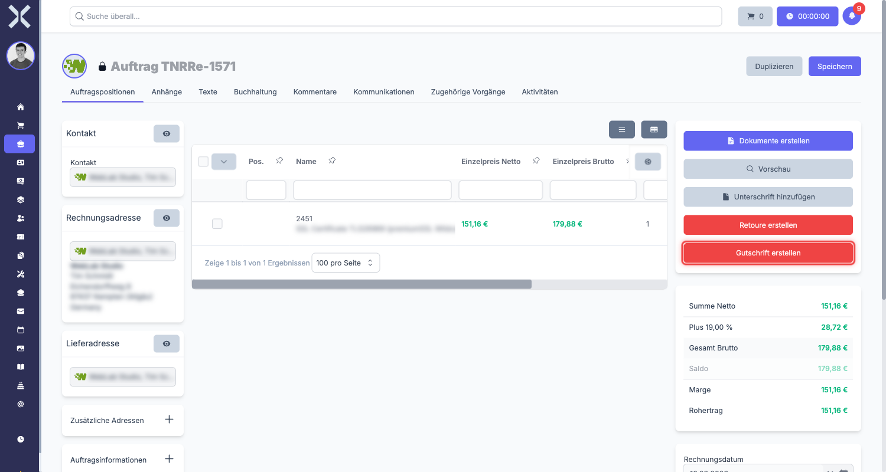
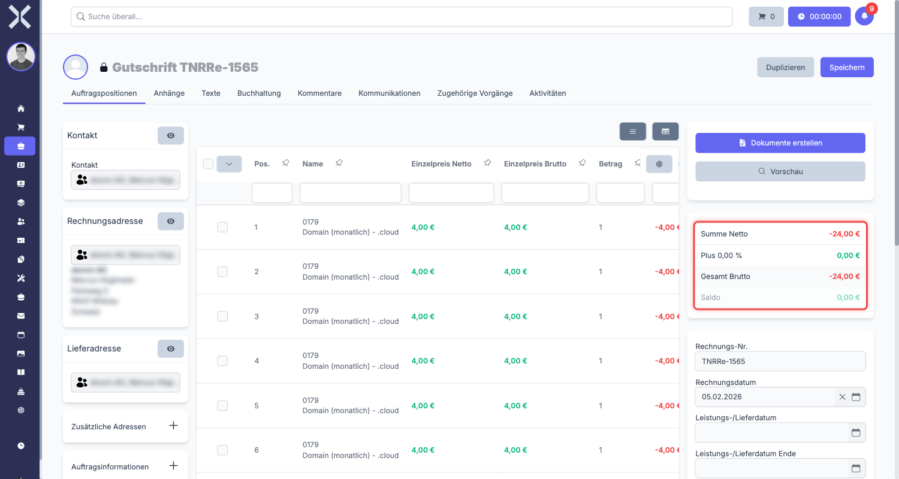

# Gutschriften

Eine Gutschrift ist ein Korrekturbeleg, der den offenen Betrag eines Kunden reduziert. Sie wird immer in Bezug auf einen bestehenden Auftrag oder eine Rechnung erstellt und enthält negative Beträge. Gutschriften können nicht eigenständig angelegt werden -- sie sind immer mit einem Originalbeleg verknüpft.

## Wann wird eine Gutschrift benötigt?

Typische Anwendungsfälle für Gutschriften:

- **Fehlerhafte Rechnung** - Eine Rechnung wurde mit falschem Betrag oder falschen Positionen erstellt.
- **Reklamation** - Der Kunde reklamiert eine Leistung oder ein Produkt und erhält eine teilweise oder vollständige Rückerstattung.
- **Preisnachlass** - Dem Kunden wird nachträglich ein Rabatt gewährt.
- **Teilstorno** - Nur ein Teil der ursprünglichen Rechnung soll storniert werden.

> **Hinweis:** Eine Gutschrift ist eine rein finanzielle Korrektur. Wenn der Kunde Ware zurücksendet, verwenden Sie stattdessen eine [Retoure](5-retouren.md).

## Gutschrift erstellen

Eine Gutschrift wird immer aus einem bestehenden Auftrag heraus erstellt, der bereits eine Rechnungsnummer hat.

### Schritt 1: Originalbeleg öffnen

1. Navigieren Sie zu **Aufträge** und öffnen Sie den Auftrag, für den die Gutschrift erstellt werden soll.
2. Der Auftrag muss bereits eine Rechnungsnummer haben.

### Schritt 2: Gutschrift anlegen

1. Klicken Sie in der Sidebar auf **Gutschrift erstellen**.

   

2. Nuxbe erstellt automatisch einen neuen Beleg vom Typ **Gutschrift**.
3. Die Daten aus dem Originalbeleg werden übernommen:
   - Kontakt und Adresse
   - Positionen und Preise
   - Zahlungsbedingungen

> **Hinweis:** Die Verknüpfung zum Originalbeleg wird automatisch hergestellt. Sie müssen diese nicht manuell setzen.

### Schritt 3: Positionen anpassen

Nach dem Erstellen können Sie die Positionen der Gutschrift anpassen. Das ist besonders wichtig bei einer Teilgutschrift.

- **Vollständige Gutschrift** - Alle Positionen und Mengen bleiben wie im Originalbeleg.
- **Teilgutschrift** - Entfernen Sie Positionen, die nicht gutgeschrieben werden sollen, oder reduzieren Sie die Mengen.

Die Beträge in einer Gutschrift sind immer **negativ** (mit Minuszeichen). Das bedeutet: Der Betrag wird dem Kunden gutgeschrieben und reduziert seinen offenen Saldo.

### Schritt 4: Speichern

Klicken Sie auf **Speichern**, um die Gutschrift zu sichern.

## Freigabe-Workflow

Gutschriften durchlaufen einen Freigabe-Workflow, bevor sie gültig werden.

1. **Genehmiger zuweisen** - Wählen Sie im Feld **Genehmiger** die Person aus, die die Gutschrift freigeben soll.
2. **Prüfung** - Der Genehmiger prüft die Gutschrift auf Richtigkeit.
3. **Bestätigung** - Der Genehmiger setzt das Bestätigungshäkchen, um die Gutschrift freizugeben.

> **Hinweis:** Ohne Freigabe durch den Genehmiger kann die Gutschrift nicht abgeschlossen werden. Das schützt vor versehentlichen oder unberechtigten Korrekturen.

## Verknüpfung zum Originalbeleg

Jede Gutschrift ist automatisch mit dem Originalauftrag verknüpft. Sie finden diese Verknüpfung an zwei Stellen:

- **In der Gutschrift** - In der rechten Spalte unter **Verknüpfte Dokumente** sehen Sie den Originalauftrag.
- **Im Originalauftrag** - Unter **Verknüpfte Dokumente** erscheint die Gutschrift.

So können Sie jederzeit zwischen den beiden Belegen hin- und herspringen.

## Auswirkung auf den Saldo

Wenn eine Gutschrift erstellt und freigegeben wird, hat das folgende Auswirkungen:

- Der **offene Betrag** des Originalauftrags wird um den Gutschriftsbetrag reduziert.
- Im Saldo des Kunden wird die Gutschrift als negativer Betrag geführt.
- Die Gutschrift erscheint in der Belegkette des Originalauftrags.

> **Hinweis:** Die Gutschrift ändert den Originalbeleg nicht. Stattdessen wird ein separater Korrekturbeleg erstellt, der den offenen Betrag rechnerisch reduziert.

## Häufige Fragen

### Kann ich eine Gutschrift ohne Originalbeleg erstellen?

Nein. Eine Gutschrift kann nur aus einem bestehenden Auftrag heraus erstellt werden, der bereits eine Rechnungsnummer hat.

### Kann ich den Betrag einer Gutschrift nachträglich ändern?

Ja, solange die Gutschrift noch nicht freigegeben wurde. Nach der Freigabe sind Änderungen nicht mehr möglich.

### Was ist der Unterschied zwischen einer Gutschrift und einer Retoure?

Eine Gutschrift ist eine rein finanzielle Korrektur. Eine [Retoure](5-retouren.md) bildet zusätzlich die physische Rücksendung von Waren ab. In der Praxis wird häufig zuerst eine Retoure erstellt und danach eine Gutschrift.

## Weiterführende Themen

- [Retouren](5-retouren.md) - Rücksendungen von Waren
- [Aufträge verwalten](../1-auftraege-verwalten.md) - Auftragsliste und Filter
- [Auftragsdetails](../2-auftrag-detail.md) - Allgemeine Auftragsdetails
- [Auftragspositionen](../3-auftragspositionen.md) - Positionen bearbeiten
- [Auftragsarten](../../14-einstellungen/11-auftragsarten.md) - Auftragsarten konfigurieren
