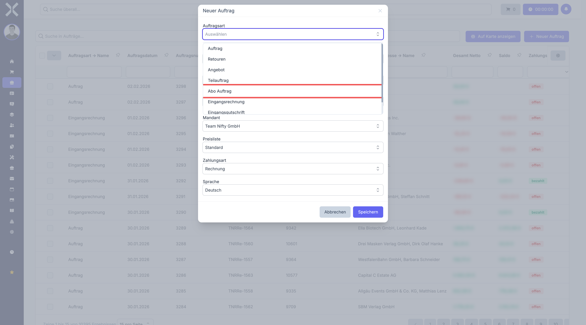
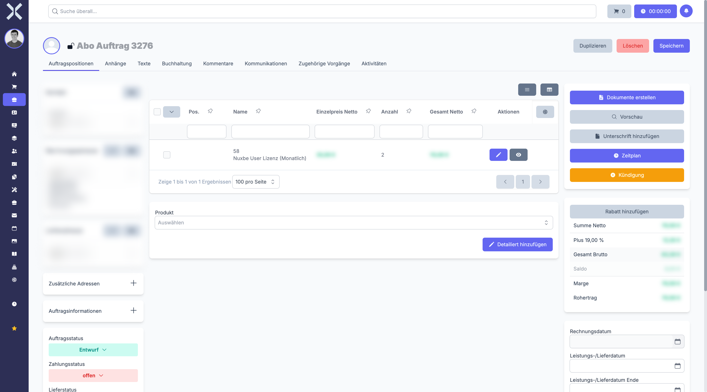
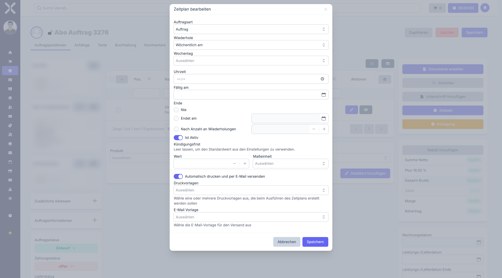
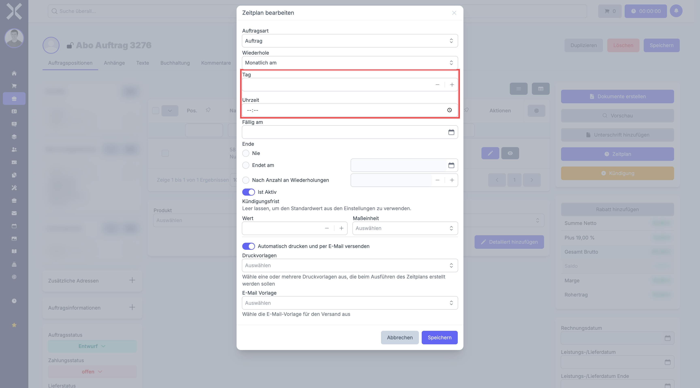
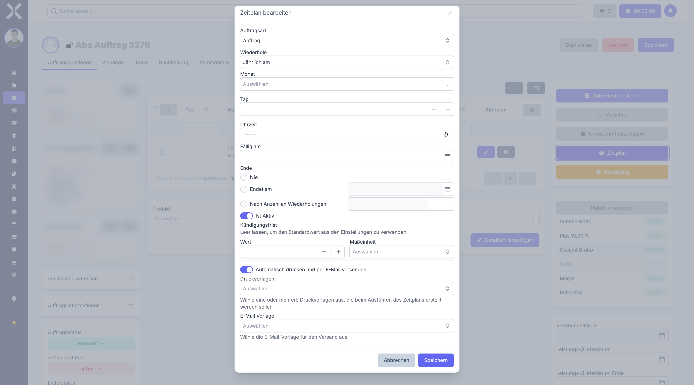
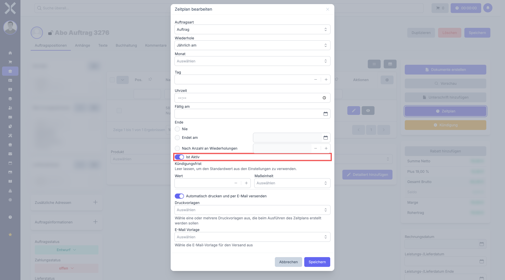
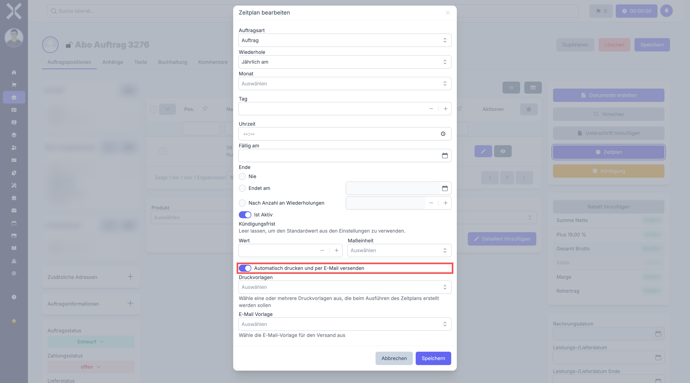
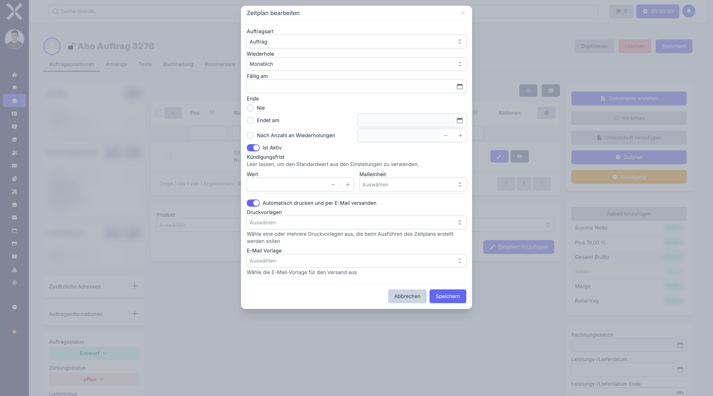
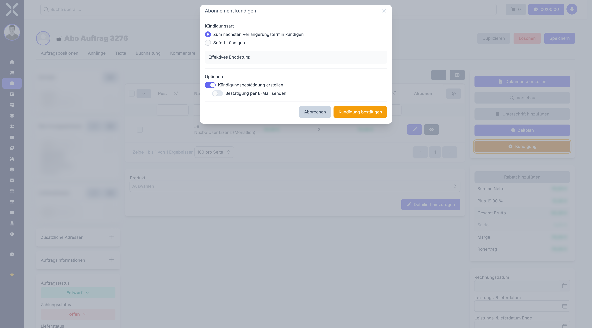
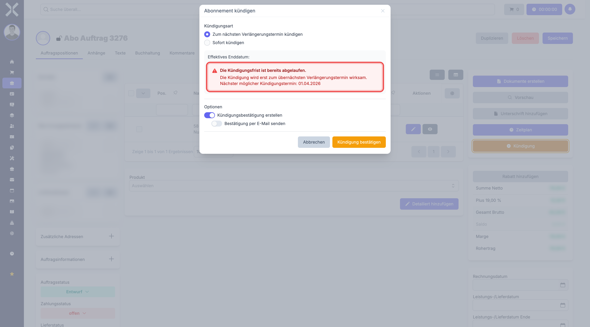

# Abonnements (wiederkehrende Aufträge)

Abonnements sind Aufträge, die in regelmäßigen Abständen automatisch neue Folgebelege erzeugen. Typische Anwendungsfälle sind monatliche Hosting-Gebühren, quartalsweise Wartungsverträge oder jährliche Lizenzabrechnungen. Nuxbe erstellt dabei vollautomatisch Rechnungen, kann diese als PDF erzeugen und per E-Mail an den Kunden versenden.

## So funktioniert ein Abonnement

Ein Abonnement besteht aus zwei Teilen:

1. **Der Auftrag** - Ein ganz normaler Auftrag mit Positionen, Kontakt, Preisen usw. Der einzige Unterschied: Die Auftragsart ist **Abonnement** statt z. B. "Rechnung" oder "Auftrag".
2. **Der Zeitplan** - Eine Konfiguration, die festlegt: *Wann* soll der nächste Beleg erstellt werden? *Wie oft*? *Bis wann*?

Wenn der Zeitplan fällig wird, erstellt Nuxbe automatisch eine Kopie des Abonnement-Auftrags als neuen Beleg (z. B. eine Rechnung). Die Positionen, Preise und Kontaktdaten werden dabei aus dem Abonnement übernommen.

## Abonnement erstellen

### Schritt 1: Neuen Auftrag anlegen

1. Navigieren Sie zu **Aufträge**.
2. Klicken Sie auf **Neu**.
3. Wählen Sie als **Auftragsart** den Typ **Abonnement**.

   

4. Wählen Sie den **Kontakt** (Kunde).
5. Füllen Sie die Kopfdaten aus (Zahlungsart, Zahlungsziel usw.) -- genau wie bei einem normalen Auftrag.
6. Klicken Sie auf **Speichern**.

### Schritt 2: Positionen hinzufügen

Fügen Sie die Produkte oder Dienstleistungen hinzu, die bei jeder Verlängerung abgerechnet werden sollen. Diese Positionen werden bei jeder automatischen Erstellung in den neuen Beleg übernommen.

1. Klicken Sie auf **Position hinzufügen**.
2. Wählen Sie das Produkt aus oder geben Sie einen freien Text ein.
3. Legen Sie Menge und Preis fest.
4. Wiederholen Sie dies für alle Positionen.
5. Klicken Sie auf **Speichern**.

> **Wichtig:** Die Positionen im Abonnement sind die Vorlage für alle automatisch erstellten Folgebelege. Wenn Sie hier z. B. "Webhosting - 1 Monat" mit 29,90 EUR eintragen, wird bei jeder Verlängerung ein neuer Beleg mit genau dieser Position und diesem Preis erzeugt.

### Schritt 3: Zeitplan einrichten

Nachdem der Abonnement-Auftrag gespeichert wurde, sehen Sie in der linken Spalte (Sidebar) zwei zusätzliche Schaltflächen, die nur bei Abonnements erscheinen:

- **Zeitplan** (blaues Uhr-Symbol) - Hier konfigurieren Sie den Wiederholungsrhythmus
- **Kündigung** (gelbes X-Symbol) - Hier können Sie das Abonnement kündigen

Klicken Sie auf **Zeitplan**, um das Zeitplan-Fenster zu öffnen.

## Der Zeitplan im Detail

Das Zeitplan-Fenster ist das Herzstück der Abonnement-Verwaltung. Hier legen Sie fest, wann und wie oft automatisch neue Belege erstellt werden. Im Folgenden wird **jedes einzelne Feld** des Zeitplan-Fensters ausführlich erklärt.

### Feld: Auftragsart

Mit dem Feld **Auftragsart** legen Sie fest, welche Art von Beleg Nuxbe bei jeder automatischen Ausführung erstellen soll. Klicken Sie auf das Dropdown-Feld und wählen Sie die gewünschte Auftragsart aus.

**Was bedeutet das?** Ihr Abonnement ist sozusagen die "Vorlage". Jedes Mal, wenn der Zeitplan fällig wird, erstellt Nuxbe daraus einen neuen Beleg. Die Auftragsart legt fest, was für ein Beleg das ist:

- **Rechnung** -- Nuxbe erstellt direkt eine Rechnung. Das ist die häufigste Wahl, wenn Sie den Kunden automatisch abrechnen möchten.
- **Auftrag** -- Nuxbe erstellt einen Auftrag. Daraus müssen Sie dann manuell eine Rechnung erzeugen. Das ist sinnvoll, wenn Sie den Beleg vor der Rechnungsstellung noch prüfen oder anpassen möchten.

> **Wichtig:** Das ist **nicht** die Auftragsart des Abonnements selbst (die ist immer "Abonnement"). Es ist die Auftragsart des neuen Belegs, der automatisch daraus erstellt wird. Stellen Sie sich das Abonnement als Schablone vor und die Auftragsart als "Was soll aus dieser Schablone werden?".

### Feld: Wiederholung

Das Feld **Wiederhole** bestimmt, in welchem Rhythmus neue Belege erstellt werden. Klicken Sie auf das Dropdown-Feld, um die verfügbaren Optionen zu sehen.

Es gibt 12 verschiedene Optionen. Diese lassen sich in zwei Gruppen einteilen:

#### Einfache Wiederholungen (ohne "am")

Bei den einfachen Wiederholungen (z. B. **Monatlich**, **Wöchentlich**, **Jährlich**) entscheidet Nuxbe selbst, wann genau der Beleg erstellt wird. Es werden **keine zusätzlichen Felder** angezeigt -- Sie legen lediglich das Intervall fest.

Das System orientiert sich am Datum im Feld **Fällig am**: Wenn dort z. B. der 15. Februar steht und Sie "Monatlich" wählen, wird der nächste Beleg am 15. März erstellt, dann am 15. April und so weiter.

| Wiederholung | Bedeutung |
|---|---|
| **Täglich** | Jeden Tag |
| **Wöchentlich** | Einmal pro Woche |
| **Monatlich** | Einmal pro Monat |
| **Quartalsweise** | Alle drei Monate |
| **Jährlich** | Einmal pro Jahr |

#### Wiederholungen mit "am" -- Sie bestimmen den genauen Zeitpunkt

Bei den Varianten mit **"am"** (z. B. **Monatlich am**, **Wöchentlich am**, **Jährlich am**) können Sie **exakt festlegen**, an welchem Tag und zu welcher Uhrzeit der Beleg erstellt werden soll. Sobald Sie eine "am"-Variante wählen, erscheinen zusätzliche Eingabefelder.

**Wöchentlich am** -- Hier erscheinen die Felder **Wochentag** und **Uhrzeit**:

- **Wochentag** -- Wählen Sie den gewünschten Wochentag aus der Liste (Montag, Dienstag, Mittwoch, Donnerstag, Freitag, Samstag oder Sonntag).
- **Uhrzeit** -- Geben Sie die gewünschte Uhrzeit ein (z. B. 06:00).

> **Beispiel:** Sie wählen "Wöchentlich am", Wochentag "Montag" und Uhrzeit "09:00". Dann wird jeden Montag um 09:00 Uhr ein neuer Beleg erstellt.

**Monatlich am** und **Quartalsweise am** -- Hier erscheinen die Felder **Tag** und **Uhrzeit**:

- **Tag** -- An welchem Tag im Monat soll der Beleg erstellt werden? Geben Sie eine Zahl von 1 bis 31 ein. Wenn Sie z. B. 1 eingeben, wird der Beleg immer am Ersten des Monats erstellt.
- **Uhrzeit** -- Zu welcher Uhrzeit soll der Beleg erstellt werden?

> **Beispiel:** Sie wählen "Monatlich am", Tag "1" und Uhrzeit "06:00". Dann wird am 1. jedes Monats um 06:00 Uhr eine Rechnung erstellt.

**Jährlich am** -- Hier erscheinen die Felder **Monat**, **Tag** und **Uhrzeit**:

- **Monat** -- In welchem Monat soll der Beleg erstellt werden? Wählen Sie aus der Liste (Januar bis Dezember).
- **Tag** -- An welchem Tag in diesem Monat?
- **Uhrzeit** -- Zu welcher Uhrzeit?

> **Beispiel:** Sie wählen "Jährlich am", Monat "Januar", Tag "1" und Uhrzeit "06:00". Dann wird jedes Jahr am 1. Januar um 06:00 Uhr eine Rechnung erstellt.

#### Sonderfall: Weitere Optionen

| Wiederholung | Bedeutung | Zusätzliche Felder |
|---|---|---|
| **Täglich um** | Jeden Tag zu einer festen Uhrzeit | Uhrzeit |
| **Zweimal monatlich** | Zwei Mal pro Monat | Erster Tag, Zweiter Tag, Uhrzeit |
| **Letzter Tag des Monats** | Am letzten Tag jedes Monats (28., 29., 30. oder 31. -- je nach Monat) | Uhrzeit |

> **Zusammenfassung:** Verwenden Sie die einfachen Varianten (ohne "am"), wenn Ihnen der genaue Zeitpunkt egal ist und Sie sich am Fälligkeitsdatum orientieren möchten. Verwenden Sie die "am"-Varianten, wenn Sie exakt bestimmen möchten, an welchem Tag und zu welcher Uhrzeit der Beleg erstellt wird.

### Feld: Fällig am (Startdatum)

Das Feld **Fällig am** bestimmt, wann die erste (oder nächste) automatische Ausführung stattfindet. Klicken Sie auf das Feld oder das Kalender-Symbol rechts daneben, um ein Datum auszuwählen.

**Was müssen Sie hier eintragen?**

- **Bei einem neuen Abonnement:** Tragen Sie hier das Datum ein, an dem der **allererste** Beleg erstellt werden soll. Wenn Sie z. B. möchten, dass die erste Rechnung am 1. März erstellt wird, geben Sie hier den 01.03.2025 ein.
- **Bei einem laufenden Abonnement:** Dieses Feld wird automatisch aktualisiert. Nach jeder automatischen Ausführung springt das Datum auf den nächsten Fälligkeitstermin. Sie müssen hier nichts mehr ändern.

> **Beispiel:** Sie richten am 15. Januar ein monatliches Abonnement ein und setzen "Fällig am" auf den 1. Februar. Am 1. Februar wird der erste Beleg erstellt. Danach springt "Fällig am" automatisch auf den 1. März, dann auf den 1. April, und so weiter.

### Spätestes Kündigungsdatum

Unterhalb des Fälligkeitsdatums zeigt Nuxbe manchmal einen gelben Hinweis mit dem **spätesten Kündigungsdatum** an. Dieses Datum wird automatisch berechnet: Nuxbe nimmt das nächste Fälligkeitsdatum und zieht davon die Kündigungsfrist ab.

**Was bedeutet das?** Wenn ein Kunde sein Abonnement kündigen möchte, muss er das **vor** diesem Datum tun. Andernfalls greift die Kündigung erst zum übernächsten Verlängerungszeitpunkt.

> **Beispiel:** Das nächste Fälligkeitsdatum ist der 1. April und die Kündigungsfrist beträgt 1 Monat. Dann zeigt Nuxbe als spätestes Kündigungsdatum den 1. März an. Kündigt der Kunde am 15. März, ist die Frist bereits abgelaufen -- das Abonnement wird erst zum 1. Mai beendet.

### Feld: Ende

Im Abschnitt **Ende** legen Sie fest, ob und wann das Abonnement aufhören soll. Es gibt drei Möglichkeiten, zwischen denen Sie per Klick auf den jeweiligen Punkt (Radio-Button) wechseln können:

#### Nie (Standardeinstellung)

Das Abonnement läuft unbegrenzt weiter, bis es manuell gekündigt wird. Das ist die Standardeinstellung und für die meisten Abonnements die richtige Wahl.

> **Wann "Nie" wählen?** Wenn das Abonnement so lange laufen soll, bis der Kunde aktiv kündigt -- z. B. bei Hosting-Verträgen, laufenden Wartungsverträgen oder Mitgliedschaften.

#### Endet am (bestimmtes Datum)

Das Abonnement wird nach einem bestimmten Datum nicht mehr verlängert. Wenn Sie diese Option wählen, wird das Datumsfeld daneben aktiv und Sie können ein Enddatum eingeben.

- Klicken Sie auf **Endet am**.
- Klicken Sie auf das Datumsfeld rechts daneben und wählen Sie das gewünschte Enddatum.

> **Beispiel:** Ein Wartungsvertrag läuft vom 1. Januar 2025 bis zum 31. Dezember 2025. Setzen Sie "Endet am" auf den 31.12.2025. Nach diesem Datum werden keine neuen Belege mehr erstellt.

#### Nach Anzahl an Wiederholungen

Das Abonnement endet automatisch nach einer bestimmten Anzahl von Ausführungen. Wenn Sie diese Option wählen, wird das Zahlenfeld daneben aktiv.

- Klicken Sie auf **Nach Anzahl an Wiederholungen**.
- Geben Sie die gewünschte Anzahl ein (oder verwenden Sie die Plus/Minus-Buttons).

> **Beispiel:** Sie möchten genau 12 monatliche Rechnungen erstellen (ein Jahresvertrag mit monatlicher Abrechnung). Wählen Sie "Nach Anzahl an Wiederholungen" und geben Sie 12 ein. Nach der 12. Rechnung stoppt das Abonnement automatisch.

### Feld: Ist Aktiv

Der Schalter **Ist Aktiv** steuert, ob der Zeitplan gerade aktiv ist oder nicht. Wenn der Schalter **eingeschaltet** (blau) ist, werden Belege automatisch erstellt, sobald das Fälligkeitsdatum erreicht ist. Wenn der Schalter **ausgeschaltet** ist, passiert nichts -- der Zeitplan wird übersprungen.

**Wann den Schalter ausschalten?**

- Sie möchten ein Abonnement vorübergehend pausieren, ohne den Zeitplan komplett zu löschen.
- Sie richten alles erst ein und möchten den Zeitplan erst später aktivieren.
- Es gibt ein Problem mit dem Kunden und Sie möchten die automatische Abrechnung vorübergehend stoppen.

> **Wichtig:** Wenn Sie den Schalter ausschalten und später wieder einschalten, prüfen Sie das Fälligkeitsdatum. Möglicherweise müssen Sie es manuell auf ein zukünftiges Datum setzen, damit der Zeitplan nicht sofort alle "verpassten" Belege nachholt.

### Feld: Kündigungsfrist

Im Abschnitt **Kündigungsfrist** können Sie festlegen, wie lange vor dem nächsten Verlängerungsdatum der Kunde kündigen muss. Diese Einstellung gilt nur für dieses eine Abonnement und überschreibt den globalen Standardwert aus den [Abonnement-Einstellungen](../../14-einstellungen/14-abo-einstellungen.md).

Die Kündigungsfrist besteht aus zwei Feldern:

- **Wert** -- Eine Zahl (z. B. 1, 3, 30). Verwenden Sie die Plus/Minus-Buttons oder tippen Sie die Zahl direkt ein.
- **Maßeinheit** -- Die Zeiteinheit. Klicken Sie auf das Dropdown und wählen Sie: Tage, Wochen, Monate oder Jahre.

> **Beispiel:** Sie möchten, dass der Kunde mindestens 3 Monate vor der nächsten Verlängerung kündigen muss. Geben Sie bei Wert "3" ein und wählen Sie als Maßeinheit "Monate".

> **Hinweis:** Wenn Sie beide Felder leer lassen, verwendet Nuxbe den Standardwert aus den [Abonnement-Einstellungen](../../14-einstellungen/14-abo-einstellungen.md). Das ist praktisch, wenn für die meisten Ihrer Abonnements die gleiche Kündigungsfrist gilt.

### Feld: Automatisch drucken und per E-Mail versenden

Ganz unten im Zeitplan-Fenster finden Sie den Schalter **Automatisch drucken und per E-Mail versenden**. Wenn Sie diesen Schalter aktivieren, erledigt Nuxbe bei jeder automatischen Ausführung nicht nur die Erstellung des Belegs, sondern auch:

1. Die Erstellung eines PDFs (z. B. die Rechnung als PDF-Datei)
2. Den Versand dieses PDFs per E-Mail an den Kunden

Sobald Sie den Schalter aktivieren, erscheinen zwei weitere Felder:

- **Druckvorlagen** -- Klicken Sie auf **Auswählen** und wählen Sie ein oder mehrere Drucklayouts, die als PDF erzeugt werden sollen. Ein Drucklayout bestimmt, wie die Rechnung (oder der Auftrag) als PDF aussieht.
- **E-Mail Vorlage** -- Klicken Sie auf **Auswählen** und wählen Sie die E-Mail-Vorlage, die für den Versand verwendet wird. Diese Vorlage enthält den E-Mail-Text und wird mit den Daten des Belegs gefüllt.

> **Beispiel:** Sie möchten, dass bei jeder monatlichen Verlängerung automatisch eine Rechnung als PDF erstellt und per E-Mail an den Kunden geschickt wird. Aktivieren Sie den Schalter, wählen Sie Ihr Rechnungs-Drucklayout und die passende E-Mail-Vorlage. Ab jetzt müssen Sie sich um nichts mehr kümmern -- Nuxbe macht alles automatisch.

> **Hinweis:** Die E-Mail-Vorlagen können in den [Einstellungen > E-Mail-Vorlagen](../../14-einstellungen/25-email-vorlagen.md) erstellt und bearbeitet werden.

### Zeitplan speichern

Wenn Sie alle Felder ausgefüllt haben, klicken Sie auf **Speichern**. Der Zeitplan ist ab sofort aktiv (sofern der Schalter "Ist Aktiv" eingeschaltet ist). Nuxbe erstellt automatisch neue Belege gemäß Ihrem Zeitplan, sobald das Fälligkeitsdatum erreicht ist.

## Abonnement kündigen

Um ein laufendes Abonnement zu beenden:

1. Öffnen Sie den Abonnement-Auftrag.
2. Klicken Sie auf **Kündigung** (gelbes X-Symbol in der Sidebar).

Das Kündigungsfenster bietet zwei Optionen:

### Kündigung zum nächsten Verlängerungsdatum

Das Abonnement läuft noch bis zum nächsten geplanten Verlängerungsdatum und endet dann. Diese Option ist die Standardeinstellung.

- Wählen Sie **Zum nächsten Verlängerungsdatum kündigen**.
- Das angezeigte **Wirksamkeitsdatum** zeigt, wann das Abonnement tatsächlich endet.

### Sofortige Kündigung

Das Abonnement wird sofort beendet. Es werden keine weiteren Belege erstellt.

- Wählen Sie **Sofort kündigen**.
- Das Wirksamkeitsdatum ist das heutige Datum.

### Warnung bei verspäteter Kündigung

Wenn die Kündigungsfrist bereits abgelaufen ist, zeigt Nuxbe einen roten Warnhinweis an. In diesem Fall greift die Kündigung erst zum übernächsten Verlängerungszeitpunkt.

### Kündigungsbestätigung

Zusätzlich können Sie festlegen, ob eine Kündigungsbestätigung erstellt werden soll:

- **Kündigungsbestätigung generieren** - Erzeugt ein Bestätigungsdokument (verwendet den [Kündigungstext aus den Einstellungen](../../14-einstellungen/14-abo-einstellungen.md))
- **Bestätigung per E-Mail senden** - Verschickt die Bestätigung automatisch an den Kunden (nur verfügbar, wenn die Generierung aktiviert ist)

Klicken Sie auf **Kündigung bestätigen**, um den Vorgang abzuschließen.

## Was passiert im Hintergrund?

Damit Abonnements automatisch verarbeitet werden, muss auf dem Server ein sogenannter Cronjob eingerichtet sein. Dieser prüft regelmäßig (üblicherweise einmal pro Minute), ob Abonnements fällig sind.

Wenn ein Abonnement fällig wird, passiert Folgendes:

1. Nuxbe kopiert den Abonnement-Auftrag und erstellt daraus einen neuen Beleg (z. B. eine Rechnung).
2. Die Positionen, Preise, Kontaktdaten und Texte werden aus dem Abonnement übernommen.
3. Der Leistungszeitraum des Abonnements wird aktualisiert.
4. Falls konfiguriert: Die Rechnung wird als PDF erzeugt und per E-Mail versendet.
5. Das Fälligkeitsdatum des Zeitplans springt automatisch auf den nächsten Termin.
6. Der Zähler für die aktuelle Wiederholung wird um 1 erhöht.

Die erzeugten Belege finden Sie danach in der [Auftragsliste](../1-auftraege-verwalten.md) und in der Belegkette des Abonnement-Auftrags (rechte Spalte der Detailansicht unter **Verknüpfte Dokumente**).

## Praxisbeispiele

### Monatliches Hosting

- **Auftragsart:** Abonnement
- **Positionen:** "Webhosting Premium" - 1 Stück - 29,90 EUR/Monat
- **Wiederholung:** Monatlich am 1. um 06:00 Uhr
- **Fällig am:** 1. Februar 2025
- **Ende:** Nie
- **Folgebeleg-Auftragsart:** Rechnung
- **Auto-Druck und Versand:** Ja, mit Rechnungs-Layout und Standard-E-Mail-Vorlage
- **Kündigungsfrist:** 1 Monat

**Ergebnis:** Am 1. jedes Monats um 06:00 Uhr wird automatisch eine Rechnung erstellt, als PDF generiert und per E-Mail an den Kunden geschickt.

### Quartalsweise Wartung

- **Auftragsart:** Abonnement
- **Positionen:** "Wartungsvertrag Server-Infrastruktur" - 1 Stück - 750,00 EUR/Quartal
- **Wiederholung:** Quartalsweise am 1. um 08:00 Uhr
- **Fällig am:** 1. April 2025
- **Ende:** Nie
- **Folgebeleg-Auftragsart:** Rechnung
- **Kündigungsfrist:** 3 Monate

### Jährliche Lizenz mit begrenzter Laufzeit

- **Auftragsart:** Abonnement
- **Positionen:** "Software-Lizenz Enterprise" - 10 Stück - 199,00 EUR/Jahr
- **Wiederholung:** Jährlich am 1. Januar um 06:00 Uhr
- **Fällig am:** 1. Januar 2026
- **Ende:** Nach 3 Wiederholungen (3-Jahres-Vertrag)
- **Folgebeleg-Auftragsart:** Rechnung
- **Kündigungsfrist:** 3 Monate

## Häufige Fragen

### Kann ich die Positionen eines laufenden Abonnements ändern?

Ja. Öffnen Sie den Abonnement-Auftrag und bearbeiten Sie die Positionen wie bei jedem anderen Auftrag. Ab der nächsten automatischen Ausführung werden die neuen Positionen und Preise verwendet. Bereits erstellte Rechnungen bleiben unverändert.

### Kann ich den Zeitplan nachträglich ändern?

Ja. Öffnen Sie den Abonnement-Auftrag, klicken Sie auf **Zeitplan** und passen Sie die Einstellungen an. Die Änderungen gelten ab der nächsten Fälligkeit.

### Was passiert, wenn der Server zum Fälligkeitszeitpunkt nicht läuft?

Der Beleg wird beim nächsten Lauf des Cronjobs erstellt. Nuxbe erkennt, dass die Fälligkeit verstrichen ist, und holt die Verarbeitung nach.

### Wo sehe ich, welche Belege aus einem Abonnement erstellt wurden?

Öffnen Sie den Abonnement-Auftrag. In der rechten Spalte unter **Verknüpfte Dokumente** sehen Sie alle automatisch erstellten Folgebelege (Rechnungen, Aufträge etc.).

### Kann ich ein gekündigtes Abonnement reaktivieren?

Ja. Öffnen Sie den Zeitplan und setzen Sie den Schalter **Aktiv** wieder auf Ein. Passen Sie ggf. das Fälligkeitsdatum und die Ende-Bedingung an.

## Weiterführende Themen

- [Aufträge verwalten](../1-auftraege-verwalten.md) - Auftragsliste und Filter
- [Auftragsdetails](../2-auftrag-detail.md) - Allgemeine Auftragsdetails
- [Auftragspositionen](../3-auftragspositionen.md) - Positionen bearbeiten
- [Abonnement-Einstellungen](../../14-einstellungen/14-abo-einstellungen.md) - Globale Standardwerte für Kündigungsfristen und Texte
- [Auftragsarten](../../14-einstellungen/11-auftragsarten.md) - Auftragsarten konfigurieren
- [E-Mail-Vorlagen](../../14-einstellungen/25-email-vorlagen.md) - Vorlagen für automatischen Versand einrichten
