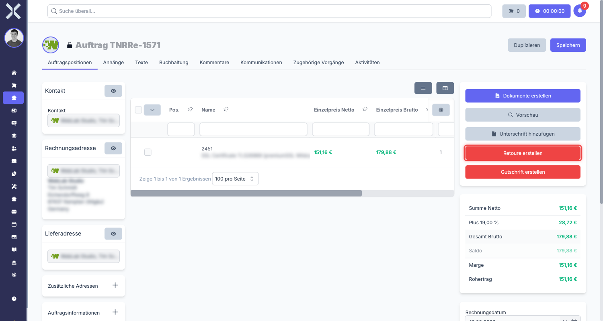
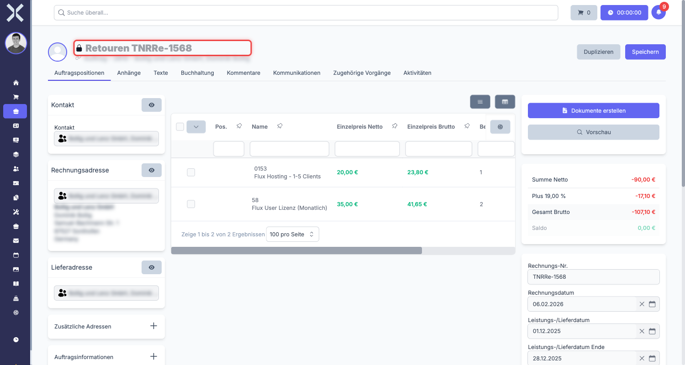

# Retouren

Eine Retoure bildet die Rücksendung von Waren durch den Kunden ab. Sie wird immer in Bezug auf einen bestehenden Auftrag oder eine Rechnung erstellt und enthält negative Beträge. Wie Gutschriften können Retouren nicht eigenständig angelegt werden -- sie sind immer mit einem Originalbeleg verknüpft.

## Unterschied zur Gutschrift

Retouren und [Gutschriften](3-gutschriften.md) sind beides Korrekturbelege mit negativen Beträgen. Der Unterschied liegt in der Bedeutung:

| | Retoure | Gutschrift |
|---|---|---|
| **Zweck** | Physische Rücksendung von Waren | Finanzielle Korrektur |
| **Warenfluss** | Ware kommt zurück ins Lager | Kein Warenfluss |
| **Typischer Anlass** | Kunde schickt Ware zurück | Fehlerhafte Rechnung, Preisnachlass |

> **Hinweis:** In der Praxis wird häufig zuerst eine Retoure erstellt (Ware kommt zurück) und anschließend eine [Gutschrift](3-gutschriften.md) (finanzielle Korrektur).

## Wann wird eine Retoure benötigt?

Typische Anwendungsfälle für Retouren:

- **Falschlieferung** - Der Kunde hat ein falsches Produkt erhalten und schickt es zurück.
- **Defekte Ware** - Das gelieferte Produkt ist beschädigt oder funktioniert nicht.
- **Widerruf** - Der Kunde macht von seinem Widerrufsrecht Gebrauch.
- **Teilrücksendung** - Der Kunde schickt nur einen Teil der bestellten Ware zurück.

## Retoure erstellen

Eine Retoure wird immer aus einem bestehenden Auftrag heraus erstellt, der bereits eine Rechnungsnummer hat.

### Schritt 1: Originalbeleg öffnen

1. Navigieren Sie zu **Aufträge** und öffnen Sie den Auftrag, für den die Retoure erstellt werden soll.
2. Der Auftrag muss bereits eine Rechnungsnummer haben.

### Schritt 2: Retoure anlegen

1. Klicken Sie in der Sidebar auf **Retoure erstellen**.

   

2. Nuxbe erstellt automatisch einen neuen Beleg vom Typ **Retoure**.
3. Die Daten aus dem Originalbeleg werden übernommen:
   - Kontakt und Adresse
   - Positionen und Preise
   - Zahlungsbedingungen

> **Hinweis:** Die Verknüpfung zum Originalbeleg wird automatisch hergestellt. Sie müssen diese nicht manuell setzen.

### Schritt 3: Positionen und Mengen anpassen

Nach dem Erstellen passen Sie die Positionen der Retoure an die tatsächlich zurückgesendeten Waren an.

- **Vollständige Retoure** - Alle Positionen und Mengen bleiben wie im Originalbeleg.
- **Teilretoure** - Reduzieren Sie die Mengen auf die tatsächlich zurückgesendete Stückzahl. Beispiel: Der Kunde hat 5 Stück bestellt, schickt aber nur 2 zurück. Setzen Sie die Menge auf 2.

Die Beträge in einer Retoure sind immer **negativ** (mit Minuszeichen).

### Schritt 4: Speichern

Klicken Sie auf **Speichern**, um die Retoure zu sichern.

## Freigabe-Workflow

Retouren durchlaufen einen Freigabe-Workflow, bevor sie gültig werden.

1. **Genehmiger zuweisen** - Wählen Sie im Feld **Genehmiger** die Person aus, die die Retoure prüfen und freigeben soll.
2. **Prüfung** - Der Genehmiger prüft die Retoure auf Richtigkeit. Idealerweise geschieht dies nach Eingang der zurückgesendeten Ware.
3. **Bestätigung** - Der Genehmiger setzt das Bestätigungshäkchen, um die Retoure freizugeben.

> **Hinweis:** Die Freigabe sollte erst erfolgen, wenn die Ware tatsächlich eingegangen ist und geprüft wurde.

## Verknüpfung zum Originalbeleg

Jede Retoure ist automatisch mit dem Originalauftrag verknüpft. Sie finden diese Verknüpfung an zwei Stellen:

- **In der Retoure** - In der rechten Spalte unter **Verknüpfte Dokumente** sehen Sie den Originalauftrag.
- **Im Originalauftrag** - Unter **Verknüpfte Dokumente** erscheint die Retoure.

## Typischer Ablauf einer Retoure

Ein vollständiger Retourenprozess sieht in der Regel so aus:

1. **Kunde meldet Rücksendung** - Der Kunde teilt mit, dass er Ware zurücksenden möchte.
2. **Retoure anlegen** - Sie erstellen die Retoure aus dem Originalauftrag heraus und passen die Mengen an.
3. **Wareneingang abwarten** - Die zurückgesendete Ware trifft ein.
4. **Ware prüfen** - Die Ware wird auf Vollständigkeit und Zustand geprüft.
5. **Retoure freigeben** - Der Genehmiger bestätigt die Retoure nach erfolgreicher Prüfung.
6. **Gutschrift erstellen** - Bei Bedarf erstellen Sie anschließend eine [Gutschrift](3-gutschriften.md) für die finanzielle Korrektur.

> **Hinweis:** Nicht jede Retoure führt automatisch zu einer Gutschrift. Es kann auch ein Austausch der Ware stattfinden, ohne dass der Kunde eine Rückerstattung erhält.

## Häufige Fragen

### Kann ich eine Retoure ohne Originalbeleg erstellen?

Nein. Eine Retoure kann nur aus einem bestehenden Auftrag heraus erstellt werden, der bereits eine Rechnungsnummer hat.

### Was passiert nach der Freigabe der Retoure?

Nach der Freigabe ist die Retoure abgeschlossen. Wenn der Kunde eine finanzielle Rückerstattung erhalten soll, erstellen Sie im nächsten Schritt eine [Gutschrift](3-gutschriften.md) aus dem Originalauftrag.

### Kann ich die Mengen einer Retoure nachträglich ändern?

Ja, solange die Retoure noch nicht freigegeben wurde. Nach der Freigabe sind Änderungen nicht mehr möglich.

### Was ist der Unterschied zwischen einer Retoure und einer Gutschrift?

Eine Retoure bildet die physische Rücksendung von Waren ab. Eine [Gutschrift](3-gutschriften.md) ist eine rein finanzielle Korrektur. Häufig werden beide zusammen verwendet: Retoure für den Warenrückfluss, Gutschrift für die Erstattung.

## Weiterführende Themen

- [Gutschriften](3-gutschriften.md) - Finanzielle Korrekturen
- [Aufträge verwalten](../1-auftraege-verwalten.md) - Auftragsliste und Filter
- [Auftragsdetails](../2-auftrag-detail.md) - Allgemeine Auftragsdetails
- [Auftragspositionen](../3-auftragspositionen.md) - Positionen bearbeiten
- [Auftragsarten](../../14-einstellungen/11-auftragsarten.md) - Auftragsarten konfigurieren
