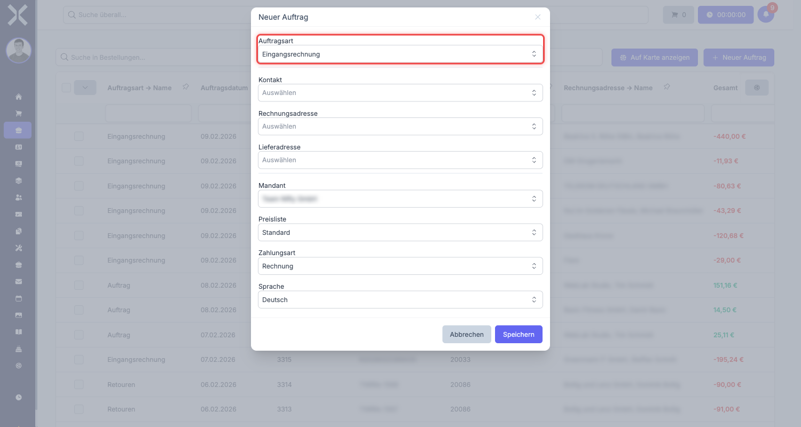
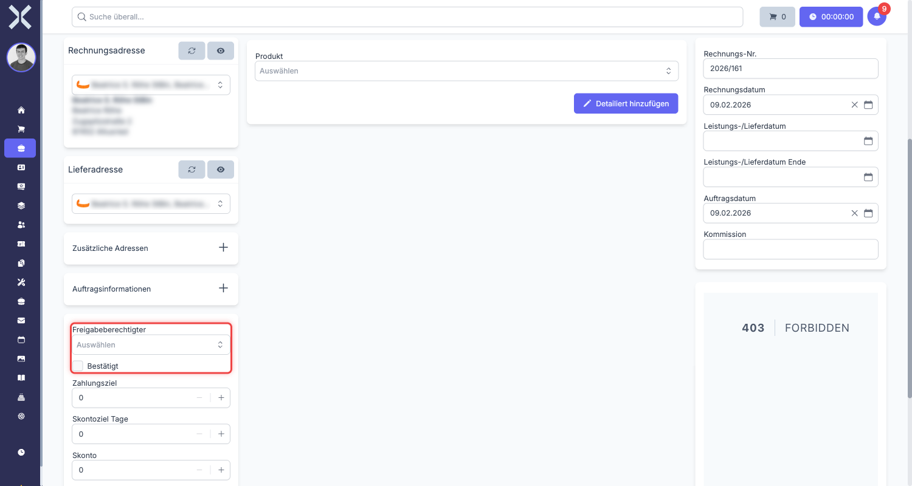
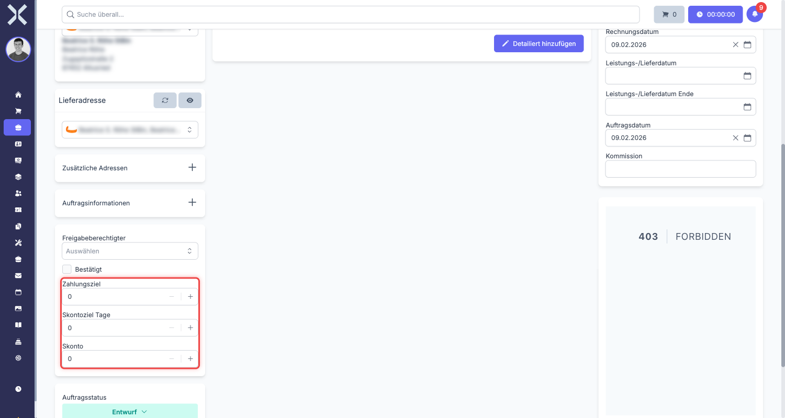
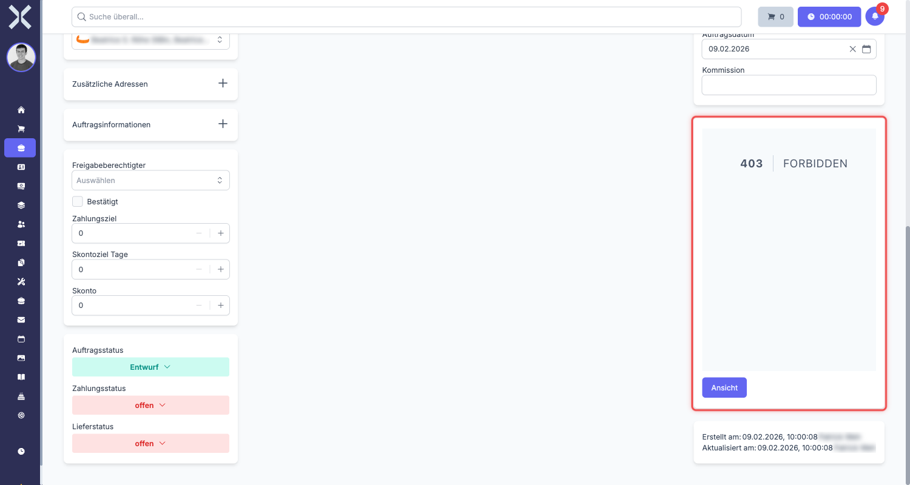

# Einkauf (Bestellung beim Lieferanten)

Ein Einkaufsauftrag bildet eine Bestellung bei einem Lieferanten ab. Im Gegensatz zu den meisten anderen Auftragsarten betrachten Sie hier nicht die Kundenseite, sondern die Lieferantenseite. Sie bestellen Waren oder Dienstleistungen und erfassen die eingehende Rechnung des Lieferanten. Beträge in Einkaufsaufträgen werden als Kosten gewertet (negativer Multiplikator).

## Perspektivwechsel: Einkauf vs. Verkauf

Bei einem Verkaufsauftrag sind Sie der Lieferant und Ihr Kunde der Empfänger. Beim Einkauf dreht sich die Perspektive um:

- **Sie** sind der Besteller.
- **Ihr Lieferant** stellt die Rechnung.
- Beträge sind **Ausgaben**, keine Einnahmen.
- Es gibt keine Marge oder Gewinnberechnung in der Zusammenfassung.

## Einkaufsauftrag erstellen

### Schritt 1: Neuen Auftrag anlegen

1. Navigieren Sie zu **Aufträge**.
2. Klicken Sie auf **Neu**.
3. Wählen Sie als **Auftragsart** den Typ **Einkauf**.

   

4. Wählen Sie den **Kontakt** (Lieferant).
5. Füllen Sie die Kopfdaten aus.
6. Klicken Sie auf **Speichern**.

### Schritt 2: Positionen hinzufügen

Fügen Sie die Produkte oder Dienstleistungen hinzu, die Sie beim Lieferanten bestellen möchten.

1. Klicken Sie auf **Position hinzufügen**.
2. Wählen Sie das Produkt aus oder geben Sie einen freien Text ein.
3. Legen Sie Menge und Preis fest.
4. Wiederholen Sie dies für alle Positionen.
5. Klicken Sie auf **Speichern**.

## Freigabe-Workflow (Vier-Augen-Prinzip)

Der Einkaufsauftrag verfügt über einen Freigabe-Workflow, der sicherstellt, dass Bestellungen vor dem Absenden geprüft und genehmigt werden. Das schützt vor unberechtigten oder fehlerhaften Bestellungen und dient der Budgetkontrolle.

### Genehmiger zuweisen

Im Zustandsbereich des Einkaufsauftrags finden Sie das Feld **Genehmiger**. Hier wählen Sie die Person aus, die diese Bestellung freigeben darf.

- Das Feld ist ein **Pflichtfeld** -- ohne Genehmiger kann der Einkaufsauftrag nicht abgeschlossen werden.
- Wählen Sie eine Person mit entsprechender Berechtigung aus (z. B. Abteilungsleiter, Einkaufsleiter oder Geschäftsführung).

### Bestätigung durch den Genehmiger

Das Feld **Bestätigt** (Häkchen) kann **nur** vom zugewiesenen Genehmiger aktiviert werden. Kein anderer Benutzer kann dieses Häkchen setzen.

So funktioniert der Ablauf:

1. Sie erstellen den Einkaufsauftrag und weisen einen Genehmiger zu.
2. Der Genehmiger öffnet den Auftrag und prüft die Positionen, Mengen und Preise.
3. Wenn alles korrekt ist, setzt der Genehmiger das Häkchen bei **Bestätigt**.
4. Erst nach der Bestätigung kann die Bestellung als freigegeben betrachtet werden.

> **Hinweis:** Das Vier-Augen-Prinzip stellt sicher, dass mindestens zwei Personen an jeder Bestellung beteiligt sind. Das reduziert Fehler und verhindert unautorisierte Ausgaben.

## Zahlungsbedingungen

Im Zustandsbereich finden Sie drei Felder für die Zahlungsbedingungen des Lieferanten. Diese Informationen stammen in der Regel von der Rechnung oder den Konditionen Ihres Lieferanten.

### Zahlungsziel

Das Feld **Zahlungsziel** gibt an, innerhalb wie vieler Tage die Rechnung des Lieferanten bezahlt werden muss.

### Skonto-Zahlungsziel

Das Feld **Skonto-Zahlungsziel** gibt an, innerhalb wie vieler Tage gezahlt werden muss, um den Skonto-Rabatt zu erhalten.

### Skonto-Prozentsatz

Das Feld **Skonto** gibt den Rabatt in Prozent an, der bei frühzeitiger Zahlung gewährt wird. Der Wert liegt zwischen 0,01 % und 99,99 %.

> **Beispiel:** Ihr Lieferant gewährt 30 Tage Zahlungsziel und 2 % Skonto bei Zahlung innerhalb von 10 Tagen. Tragen Sie ein: Zahlungsziel = 30, Skonto-Zahlungsziel = 10, Skonto = 2,00 %.

## Rechnungsdaten des Lieferanten

Im Datumsbereich des Einkaufsauftrags finden Sie zusätzliche Felder, die bei Verkaufsaufträgen nicht vorhanden sind. Hier erfassen Sie die Daten von der Rechnung Ihres Lieferanten.

### Rechnungsnummer

Tragen Sie hier die **Rechnungsnummer des Lieferanten** ein. Dieses Feld ist bearbeitbar, solange der Auftrag nicht gesperrt ist.

### Rechnungsdatum

Tragen Sie hier das **Rechnungsdatum des Lieferanten** ein. Dieses Feld ist ein Pflichtfeld, solange der Auftrag nicht gesperrt ist.

### Leistungszeitraum

Die Felder **Leistungszeitraum Start** und **Leistungszeitraum Ende** geben an, für welchen Zeitraum die Leistung erbracht wurde. Beide Felder sind Pflichtfelder, solange der Auftrag nicht gesperrt ist.

### Weitere Felder

- **Bestelldatum** -- Das Datum, an dem Sie die Bestellung aufgegeben haben.
- **Kommission** -- Ein optionales Referenzfeld für interne Zwecke.

## Rechnungsvorschau

Falls Ihrem Einkaufsauftrag eine Lieferantenrechnung als Dokument angehängt wurde, können Sie diese direkt im Auftrag als Vorschau anzeigen lassen. Im Bereich **Rechnungsvorschau** wird das Dokument in einem eingebetteten Viewer dargestellt.

Klicken Sie auf **Anzeigen**, um die vollständige Rechnung in einem größeren Fenster zu öffnen.

## Unterschiede zum Verkaufsauftrag

| Merkmal | Verkaufsauftrag | Einkaufsauftrag |
|---|---|---|
| **Perspektive** | Sie verkaufen an den Kunden | Sie bestellen beim Lieferanten |
| **Multiplikator** | +1 (Einnahme) | -1 (Ausgabe) |
| **Marge/Gewinn** | Wird in der Zusammenfassung angezeigt | Nicht vorhanden |
| **Genehmiger** | Nicht vorhanden | Pflichtfeld |
| **Rechnungsdaten** | Werden automatisch vergeben | Werden manuell vom Lieferantenbeleg übernommen |
| **Rechnungsvorschau** | Nicht vorhanden | Eingebettete Vorschau der Lieferantenrechnung |
| **Drucklayouts** | Rechnung, Angebot, Auftragsbestätigung, Lieferschein | Nur Lieferantenbestellung |

## Praxisbeispiel: Büroausstattung bestellen

1. Erstellen Sie einen Einkaufsauftrag mit der Auftragsart **Einkauf**.
2. Wählen Sie Ihren Büromöbel-Lieferanten als Kontakt.
3. Fügen Sie die Positionen hinzu (z. B. 5 Schreibtische, 5 Bürostühle).
4. Weisen Sie Ihren Abteilungsleiter als **Genehmiger** zu.
5. Der Abteilungsleiter prüft und setzt das Häkchen bei **Bestätigt**.
6. Wenn die Rechnung des Lieferanten eintrifft, tragen Sie Rechnungsnummer, Rechnungsdatum und Leistungszeitraum ein.
7. Prüfen Sie die Zahlungsbedingungen und nutzen Sie ggf. den Skonto.

## Weiterführende Themen

- [Einkaufs-Abonnements](7-einkaufs-abonnements.md) -- Wiederkehrende Einkaufsaufträge
- [Aufträge verwalten](../1-auftraege-verwalten.md) -- Auftragsliste und Filter
- [Auftragsdetails](../2-auftrag-detail.md) -- Allgemeine Auftragsdetails
- [Auftragspositionen](../3-auftragspositionen.md) -- Positionen bearbeiten
- [Auftragsarten](../../14-einstellungen/11-auftragsarten.md) -- Auftragsarten konfigurieren
