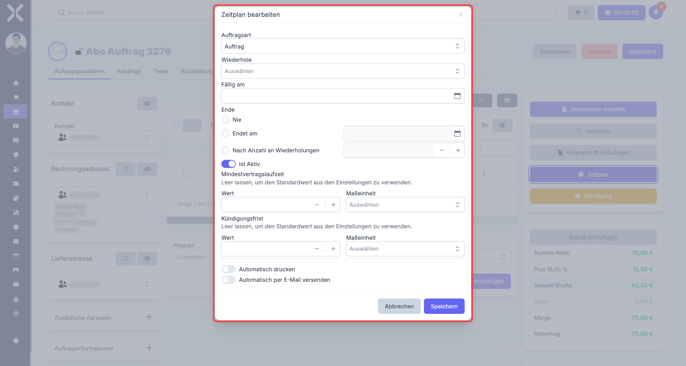

# Einkaufs-Abonnements (wiederkehrende Einkaufsauftraege)

Ein Einkaufs-Abonnement ist ein wiederkehrender Einkaufsauftrag. Es kombiniert die Funktionen des [Einkaufs](6-einkauf.md) (Lieferantenperspektive, Freigabe-Workflow, Zahlungsbedingungen) mit einem automatischen Zeitplan, der in regelmaessigen Abstaenden neue Folgebelege erzeugt. Typische Anwendungsfaelle sind monatliche Cloud-Kosten, quartalweise Wartungsvertraege mit Lieferanten oder jaehrliche Lizenzgebuehren.

## Unterschied zum Verkaufs-Abonnement

Das Einkaufs-Abonnement teilt sich den Zeitplan-Mechanismus mit dem [Verkaufs-Abonnement](4-abonnements.md), unterscheidet sich aber in einigen wichtigen Punkten:

| Merkmal | Verkaufs-Abonnement | Einkaufs-Abonnement |
|---|---|---|
| **Perspektive** | Sie stellen dem Kunden in Rechnung | Sie bestellen beim Lieferanten |
| **Multiplikator** | +1 (Einnahme) | -1 (Ausgabe) |
| **Freigabe-Workflow** | Nicht vorhanden | Genehmiger und Bestaetigung erforderlich |
| **Zahlungsbedingungen** | Zahlungsziel fuer den Kunden | Zahlungsziel, Skonto-Frist, Skonto-Prozentsatz |
| **Automatischer Druck/Versand** | Verfuegbar | Nicht verfuegbar |
| **Kuendigungsfunktion** | Verfuegbar (ueber Sidebar-Button) | Nicht verfuegbar |
| **Drucklayouts** | Rechnung, Angebot, Auftragsbestaetigung, Lieferschein | Nur Lieferantenbestellung |

## Einkaufs-Abonnement erstellen

### Schritt 1: Neuen Auftrag anlegen

1. Navigieren Sie zu **Auftraege**.
2. Klicken Sie auf **Neu**.
3. Waehlen Sie als **Auftragsart** den Typ **Einkaufs-Abonnement**.
4. Waehlen Sie den **Kontakt** (Lieferant).
5. Fuellen Sie die Kopfdaten aus.
6. Klicken Sie auf **Speichern**.

### Schritt 2: Positionen und Einkaufsdaten

Fuegen Sie die wiederkehrenden Positionen hinzu und konfigurieren Sie die Einkaufs-spezifischen Felder:

- **Genehmiger** zuweisen (Pflichtfeld)
- **Zahlungsbedingungen** eintragen (Zahlungsziel, Skonto)
- **Positionen** hinzufuegen (Produkte oder Dienstleistungen)

Details zu diesen Feldern finden Sie in der Dokumentation zum [Einkauf](6-einkauf.md).

### Schritt 3: Zeitplan einrichten

Nachdem der Auftrag gespeichert wurde, sehen Sie in der Sidebar den **Zeitplan**-Button (blaues Uhr-Symbol). Klicken Sie darauf, um das Zeitplan-Fenster zu oeffnen.

Der Zeitplan bietet die gleichen Optionen wie beim Verkaufs-Abonnement:

- **Auftragsart** fuer den Folgebeleg
- **Wiederholung** (taeglich, woechentlich, monatlich, quartalsweise, jaehrlich usw.)
- **Faellig am** (Startdatum fuer die erste Ausfuehrung)
- **Ende-Bedingung** (nie, Enddatum oder Anzahl Wiederholungen)
- **Aktiv** (Zeitplan ein- oder ausschalten)

Eine ausfuehrliche Beschreibung aller Zeitplan-Optionen finden Sie unter [Abonnements](4-abonnements.md).

> **Hinweis:** Im Gegensatz zum Verkaufs-Abonnement gibt es beim Einkaufs-Abonnement **keinen automatischen Druck und E-Mail-Versand**. Da Sie der Besteller sind und nicht der Rechnungssteller, ist ein automatischer Versand an den Lieferanten nicht vorgesehen.

## Freigabe auch bei Abonnements

Der Freigabe-Workflow des Einkaufs bleibt auch beim Einkaufs-Abonnement erhalten. Der zugewiesene Genehmiger muss die Bestellung bestaetigen, bevor sie als freigegeben gilt. Das gilt sowohl fuer den urspruenglichen Abonnement-Auftrag als auch fuer die automatisch erstellten Folgebelege.

## Praxisbeispiel: Monatliche Cloud-Kosten

Ein Unternehmen bezieht Cloud-Hosting-Dienste fuer 499,00 EUR pro Monat.

- **Auftragsart:** Einkaufs-Abonnement
- **Kontakt:** Cloud-Hosting-Anbieter
- **Positionen:** "Cloud Hosting Business" -- 1 Stueck -- 499,00 EUR/Monat
- **Genehmiger:** IT-Leiter
- **Wiederholung:** Monatlich am 1.
- **Faellig am:** 1. Maerz 2025
- **Ende:** Nie
- **Zahlungsziel:** 14 Tage
- **Skonto:** 2 % bei Zahlung innerhalb von 7 Tagen

**Ergebnis:** Am 1. jedes Monats erstellt Nuxbe automatisch einen neuen Einkaufsbeleg fuer die Cloud-Kosten. Der IT-Leiter prueft und bestaetigt den Beleg.

## Weiterfuehrende Themen

- [Einkauf](6-einkauf.md) -- Einkaufsauftraege im Detail
- [Abonnements](4-abonnements.md) -- Allgemeine Zeitplan-Erklaerung und alle Optionen
- [Auftraege verwalten](../1-auftraege-verwalten.md) -- Auftragsliste und Filter
- [Auftragsdetails](../2-auftrag-detail.md) -- Allgemeine Auftragsdetails
- [Auftragsarten](../../14-einstellungen/11-auftragsarten.md) -- Auftragsarten konfigurieren
