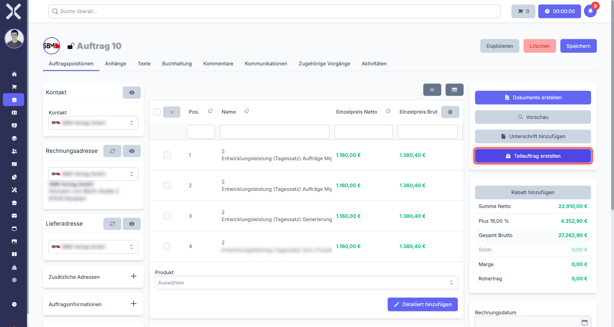
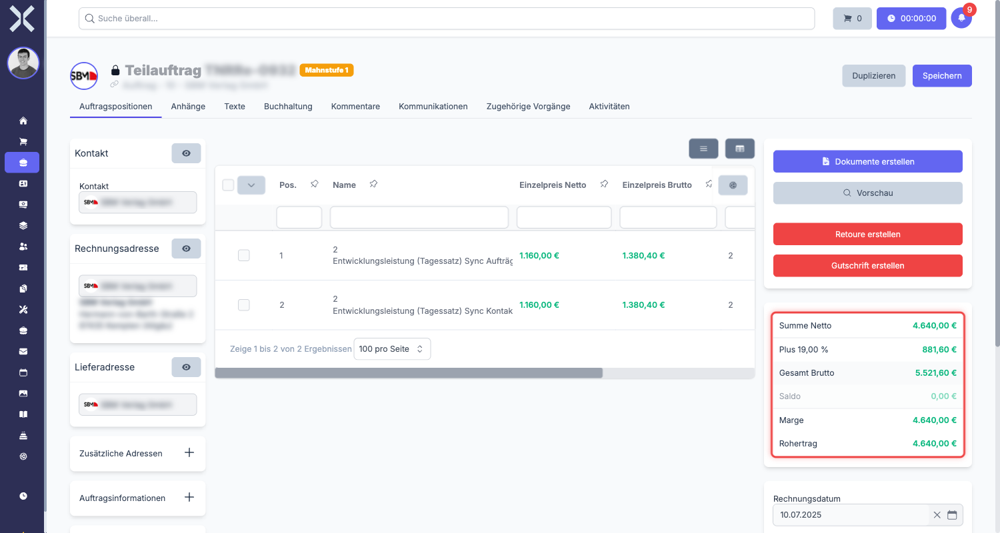
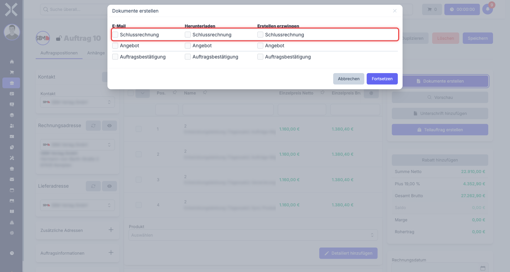

# Split-Auftraege (Teilauftraege)

Ein Split-Auftrag ist ein Teilauftrag, der aus einem bestehenden Elternauftrag heraus erstellt wird. Er ermoeglicht es, einen groesseren Auftrag in mehrere Teillieferungen oder Teilrechnungen aufzuteilen, die unabhaengig voneinander abgerechnet werden koennen. Der Elternauftrag bleibt dabei als uebergeordnetes Element bestehen und verknuepft alle Splits miteinander.

## Wann nutzt man Split-Auftraege?

Split-Auftraege sind in folgenden Situationen hilfreich:

- **Teillieferungen** -- Eine grosse Bestellung wird in mehreren Lieferungen geliefert. Fuer jede Lieferung wird ein eigener Split-Auftrag mit den tatsaechlich gelieferten Mengen erstellt.
- **Teilrechnungen** -- Der Kunde moechte nicht eine Gesamtrechnung erhalten, sondern mehrere kleinere Rechnungen ueber Teilbetraege.
- **Projektmeilensteine** -- Ein Projekt wird in Phasen abgerechnet. Fuer jede abgeschlossene Phase wird ein Split-Auftrag mit den entsprechenden Positionen erstellt.
- **Sukzessive Abrechnung** -- Dienstleistungen werden laufend erbracht und in Abstaenden abgerechnet.

## Split-Auftrag erstellen

### Voraussetzung

Ein Split-Auftrag kann nur erstellt werden, wenn der Elternauftrag **noch keine Rechnungsnummer** hat. Sobald eine Rechnungsnummer vergeben wurde, ist die Split-Funktion nicht mehr verfuegbar.

### Schritt 1: Elternauftrag oeffnen

1. Navigieren Sie zu **Auftraege** und oeffnen Sie den Auftrag, der aufgeteilt werden soll.
2. Stellen Sie sicher, dass der Auftrag noch keine Rechnungsnummer hat.

### Schritt 2: Split-Auftrag anlegen

1. Klicken Sie in der Sidebar auf **Split-Auftrag erstellen**.

   

2. Nuxbe erstellt automatisch einen neuen Beleg vom Typ **Split-Auftrag**.
3. Die Daten aus dem Elternauftrag werden uebernommen:
   - Kontakt und Adresse
   - Positionen und Preise
   - Zahlungsbedingungen und Texte

### Schritt 3: Positionen anpassen

Nach dem Erstellen passen Sie die Positionen fuer diese Teillieferung oder Teilrechnung an.

- **Mengen reduzieren** -- Setzen Sie die Mengen auf die tatsaechlich gelieferte oder abzurechnende Menge.
- **Positionen entfernen** -- Entfernen Sie Positionen, die in diesem Split nicht enthalten sind.
- **Preise beibehalten** -- Die Einzelpreise bleiben in der Regel unveraendert. Nur die Mengen werden angepasst.

> **Hinweis:** Sie koennen beliebig viele Split-Auftraege aus einem Elternauftrag erstellen. Jeder Split enthaelt nur den Anteil, der in dieser Teillieferung abgerechnet wird.

## Betragsuebersicht verstehen

Split-Auftraege verfuegen ueber eine erweiterte Betragsuebersicht, die zeigt, wie sich die Teilbetraege zum Gesamtbetrag zusammensetzen.

### Teilbetrag netto (dieser Split-Auftrag)

Der Nettobetrag des aktuell geoeffneten Split-Auftrags. Das ist der Betrag, der mit diesem Teilauftrag abgerechnet wird.

### Split-Auftraege netto (restliche Splits)

Die Summe der Nettobetraege aller anderen Split-Auftraege, die zum gleichen Elternauftrag gehoeren. Dieser Wert zeigt, wie viel bereits ueber andere Splits abgerechnet wurde oder wird.

### Summe netto (Gesamtsumme)

Die Gesamtsumme aller Split-Auftraege zusammen. Dieser Wert sollte dem urspruenglichen Gesamtbetrag des Elternauftrags entsprechen, wenn alle Positionen vollstaendig auf die Splits verteilt wurden.

> **Beispiel:** Ein Elternauftrag ueber 10.000,00 EUR netto wird in drei Splits aufgeteilt:
> - Split 1: 3.500,00 EUR (Lieferung Phase 1)
> - Split 2: 4.000,00 EUR (Lieferung Phase 2)
> - Split 3: 2.500,00 EUR (Lieferung Phase 3)
>
> Wenn Sie Split 2 oeffnen, sehen Sie:
> - Teilbetrag netto: 4.000,00 EUR
> - Split-Auftraege netto: 6.000,00 EUR (Split 1 + Split 3)
> - Summe netto: 10.000,00 EUR

## Endrechnung

Wenn alle Split-Auftraege eine Rechnungsnummer erhalten haben, kann am Elternauftrag eine **Endrechnung** erstellt werden.

### Was ist die Endrechnung?

Die Endrechnung ist ein zusammenfassender Beleg, der alle Teilrechnungen referenziert. Sie dient als Abschlussdokument fuer den gesamten Auftrag und enthaelt:

- Einen Verweis auf alle Teilrechnungen (Split-Auftraege)
- Die Gesamtsumme aller Teilrechnungen
- Eventuelle Korrekturen oder Anpassungen

### Voraussetzung fuer die Endrechnung

Die Endrechnung kann erst erstellt werden, wenn **alle** Split-Auftraege eine Rechnungsnummer haben. Solange noch ein Split-Auftrag ohne Rechnungsnummer existiert, ist die Funktion nicht verfuegbar.

## Praxisbeispiel: Bueroausstattung in drei Lieferungen

Ein Kunde bestellt Bueroausstattung im Gesamtwert von 15.000,00 EUR. Die Lieferung erfolgt in drei Teilen:

**Elternauftrag:** Bueroausstattung komplett -- 15.000,00 EUR

**Split 1 -- Schreibtische (Lieferung in Woche 1):**
- 10 Schreibtische a 450,00 EUR = 4.500,00 EUR
- Rechnungsnummer wird nach Lieferung vergeben

**Split 2 -- Stuehle und Zubehoer (Lieferung in Woche 3):**
- 10 Buerostuehle a 380,00 EUR = 3.800,00 EUR
- 10 Monitorarme a 89,00 EUR = 890,00 EUR
- Gesamt: 4.690,00 EUR

**Split 3 -- Restliche Ausstattung (Lieferung in Woche 5):**
- 5 Aktenschraenke a 620,00 EUR = 3.100,00 EUR
- 10 Schreibtischlampen a 271,00 EUR = 2.710,00 EUR
- Gesamt: 5.810,00 EUR

Nachdem alle drei Splits eine Rechnungsnummer haben, wird die Endrechnung ueber 15.000,00 EUR erstellt.

## Haeufige Fragen

### Kann ich nachtraeglich weitere Split-Auftraege hinzufuegen?

Ja, solange der Elternauftrag noch keine Rechnungsnummer hat. Sie koennen jederzeit weitere Splits erstellen.

### Was passiert, wenn die Summe der Splits nicht dem Elternauftrag entspricht?

Nuxbe erzwingt keine exakte Uebereinstimmung. Die Betragsuebersicht zeigt Ihnen die aktuelle Verteilung, damit Sie Abweichungen erkennen und korrigieren koennen.

### Kann ich einen Split-Auftrag loeschen?

Ja, solange der Split-Auftrag noch keine Rechnungsnummer hat.

## Weiterfuehrende Themen

- [Auftraege verwalten](../1-auftraege-verwalten.md) -- Auftragsliste und Filter
- [Auftragsdetails](../2-auftrag-detail.md) -- Allgemeine Auftragsdetails
- [Auftragspositionen](../3-auftragspositionen.md) -- Positionen bearbeiten
- [Auftragsarten](../../14-einstellungen/11-auftragsarten.md) -- Auftragsarten konfigurieren
