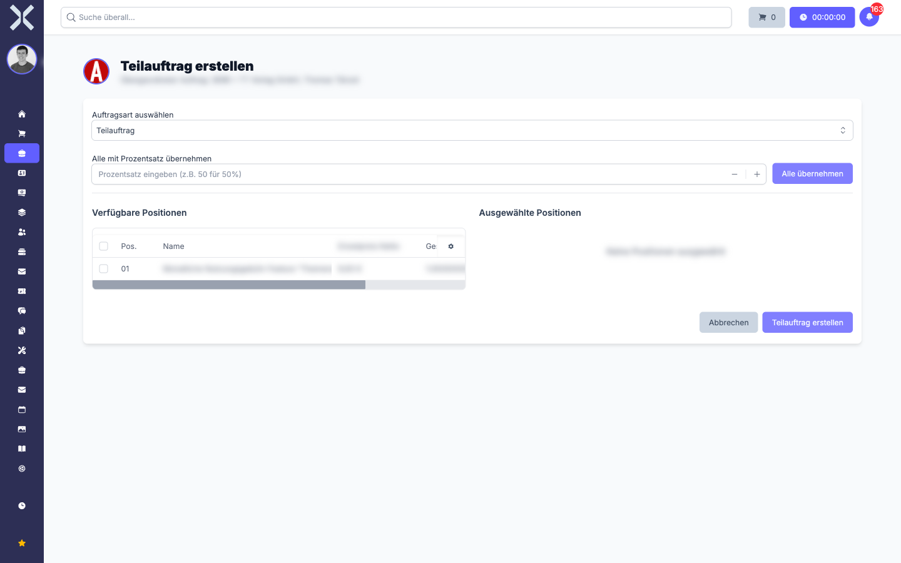
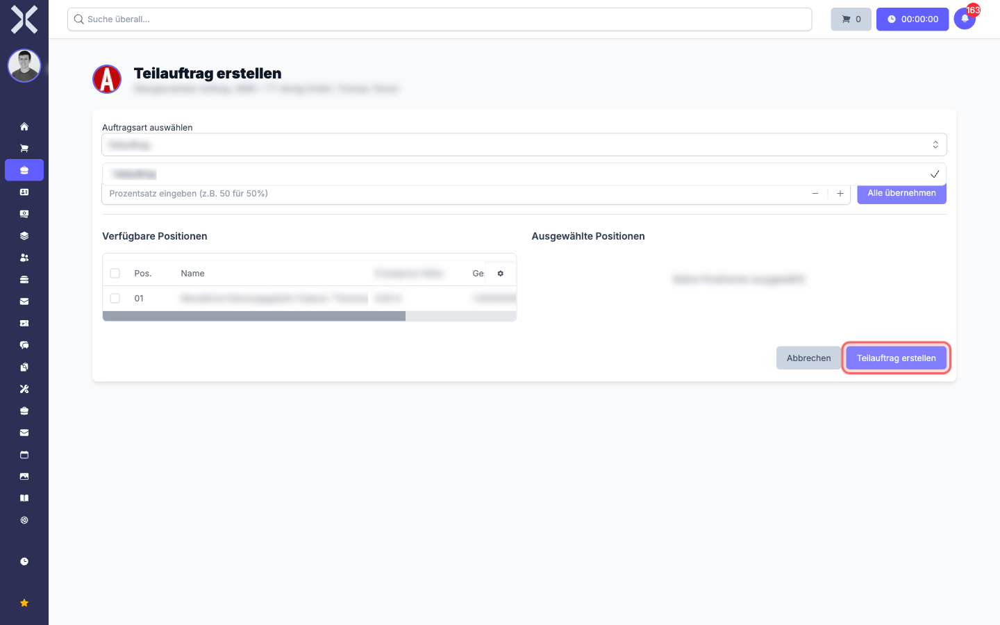

# Aus einem Beleg weitere Belege erzeugen

In Nuxbe ist es üblich, dass aus einem **Quell-Beleg** ein **Folge-Beleg** entsteht: aus dem Angebot wird ein Auftrag, aus dem Auftrag ein Teilauftrag oder eine Retoure, aus einer Rechnung eine Gutschrift. Diese Seite zeigt den Standard-Weg dafür.

> **Hinweis:** Welche genauen Belege bei Ihnen verfügbar sind und ob es z. B. zusätzliche Schritte oder Pflichtfelder gibt, hängt von der Konfiguration Ihres Mandanten ab. Ihr Administrator kann eigene [Auftragsarten](../14-einstellungen/11-auftragsarten.md) anlegen und freischalten. Die hier beschriebenen Schritte sind der **werkseitige Standard-Workflow** -- in Ihrem Mandanten kann er bei Bedarf um eigene Schritte erweitert sein.

## Das Konzept "Folge-Beleg"

Ein Folge-Beleg ist immer mit dem Beleg verknüpft, aus dem er hervorgegangen ist. Im Quell-Beleg sehen Sie unter dem Reiter **Zugehörige Vorgänge** sämtliche Folge-Belege, die daraus entstanden sind. Im Folge-Beleg selbst gibt es eine Rück-Verknüpfung zum übergeordneten Beleg.

Diese Verknüpfung hat mehrere Funktionen:

- Im Folge-Beleg werden Positionen, Adresse, Zahlungsbedingungen und weitere Daten des Quell-Belegs vorbelegt -- Sie müssen nichts erneut eingeben.
- Sie können in Listen, Statistiken und Suche jederzeit den Zusammenhang nachvollziehen.
- Beim Buchen oder Stornieren eines Folge-Belegs greift der Quell-Beleg passend mit (z. B. wird die offene Rest-Menge im Quell-Auftrag korrekt zurück­gesetzt).

## Aus einem Angebot einen Auftrag erstellen

Wenn ein Kunde Ihr Angebot annimmt, machen Sie daraus den Auftrag, der die Grundlage für Lieferung und Rechnung wird.

1. Öffnen Sie das **Angebot** in der Auftragsliste.
2. Klicken Sie unten rechts im Bereich der Auftragspositionen auf **Teilauftrag erstellen**.

   > **Hinweis:** Trotz des Namens *Teilauftrag* wird über diese Schaltfläche jeder Folge-Beleg erstellt -- vom vollständigen Auftrag über einen echten Teilauftrag (nur einige Positionen) bis hin zu Sonderfällen wie Retoure oder Gutschrift, je nach gewählter **Auftragsart**.

3. Sie landen auf der Seite **Teilauftrag erstellen**.

   

4. Wählen Sie unter **Auftragsart auswählen** den gewünschten Folge-Typ. Die Liste enthält nur Auftragsarten, die in Ihrem Mandanten als zulässige Folge-Belege für den Quell-Typ konfiguriert sind. Aus einem Angebot kommen typischerweise *Auftrag* und *Teilauftrag* in Frage; aus einem Auftrag zusätzlich *Retoure* und *Gutschrift*.

5. Wählen Sie die **Positionen**, die übernommen werden sollen, aus der linken Liste **Verfügbare Positionen** aus. Sie haben mehrere Möglichkeiten:

   - **Einzeln auswählen:** Setzen Sie das Häkchen in der Zeile einer Position. Die Position wandert nach rechts in **Ausgewählte Positionen**.
   - **Alle übernehmen:** Klicken Sie auf **Alle übernehmen**, um sämtliche Positionen mit voller Menge zu übernehmen -- der Standardfall, wenn aus einem Angebot der vollständige Auftrag wird.
   - **Alle mit Prozentsatz übernehmen:** Geben Sie z. B. `50` ein und klicken Sie dann auf **Alle übernehmen**. Alle Positionen werden mit halber Menge in den Folge-Beleg übernommen -- praktisch für Anzahlungen oder Teil-Lieferungen.

6. Prüfen Sie die **Ausgewählten Positionen** auf der rechten Seite. Wenn Sie eine Position doch nicht übernehmen möchten, entfernen Sie das Häkchen wieder.

7. Klicken Sie unten rechts auf **Teilauftrag erstellen** (der Button-Text passt sich an die ausgewählte Auftragsart an).

   

8. Sie werden direkt in den neu angelegten Folge-Beleg weitergeleitet. Im Kopfbereich sehen Sie die Verknüpfung zurück zum Quell-Angebot ("Übergeordneter Auftrag: [Nummer]"). Sie können den Folge-Beleg nun normal weiterverarbeiten -- Adresse, Liefertermin und andere Felder anpassen, Positionen ergänzen, drucken oder versenden.

> **Tipp:** Aus einem **Angebot** können Sie beliebig viele Folge-Belege erzeugen. Wenn ein Kunde z. B. erst die Hälfte der angebotenen Leistungen abruft und später die andere Hälfte, machen Sie zwei separate Aufträge aus demselben Angebot -- das Angebot bleibt offen, bis es manuell geschlossen wird.

## Aus einem Auftrag einen Teilauftrag erstellen

Bei umfangreichen Aufträgen, die in mehreren Lieferungen oder Etappen abgearbeitet werden, können Sie pro Lieferung einen Teilauftrag erzeugen. Der Quell-Auftrag bleibt dabei als "Mutter-Beleg" bestehen und zeigt unter **Zugehörige Vorgänge** alle daraus erzeugten Teilaufträge.

Vorgehen ist identisch zum Abschnitt oben:

1. Quell-Auftrag öffnen → **Teilauftrag erstellen** klicken.
2. Im Dropdown **Auftragsart auswählen** den Eintrag **Teilauftrag** wählen (oder die in Ihrem Mandanten dafür benannte Variante).
3. Nur die Positionen auswählen, die in dieser Etappe geliefert/abgerechnet werden.
4. Bei Bedarf den Prozentsatz nutzen, wenn z. B. 30 % Anzahlung berechnet werden sollen.
5. **Teilauftrag erstellen** klicken.

> **Hinweis:** Der Restbestand der Positionen bleibt im Quell-Auftrag offen, bis Sie weitere Teilaufträge anlegen oder den Quell-Auftrag manuell als erledigt markieren.

## Eine Retoure erstellen

Wenn ein Kunde Ware zurückschickt, erzeugen Sie aus dem ursprünglichen Auftrag (oder der Rechnung) eine Retoure.

1. Öffnen Sie den Auftrag, zu dem die Retoure gehört.
2. Klicken Sie auf **Teilauftrag erstellen**.
3. Wählen Sie unter **Auftragsart** den Eintrag **Retoure** (oder die in Ihrem Mandanten benannte Retouren-Auftragsart).
4. Wählen Sie nur die Positionen aus, die zurückgeschickt werden -- ggf. mit reduzierter Menge, wenn nur ein Teil zurückgeht.
5. Klicken Sie auf **Retoure erstellen**.

Die Retoure entsteht als separater Beleg mit Bezug zum Ursprungs-Auftrag. Sie können sie weiterverarbeiten (Wareneingang dokumentieren, Gutschrift erzeugen) wie jeden anderen Auftrag.

> **Hinweis:** Ob die Retoure den Lagerbestand automatisch wieder erhöht oder ob Sie das manuell tun müssen, hängt von der Konfiguration Ihrer [Auftragsarten](../14-einstellungen/11-auftragsarten.md) ab. Im Zweifelsfall fragen Sie Ihren Administrator.

## Eine Gutschrift erstellen

Eine Gutschrift ist der Korrektur-Beleg zu einer bereits gestellten Rechnung. Sie wird in der Regel nicht aus einem Auftrag, sondern aus der **Rechnung** heraus erzeugt.

1. Öffnen Sie die **Rechnung**, zu der die Gutschrift gehört.
2. Klicken Sie auf **Teilauftrag erstellen**.
3. Wählen Sie unter **Auftragsart** den Eintrag **Gutschrift**.
4. Wählen Sie die Positionen, die gutgeschrieben werden sollen -- in voller Menge oder mit reduzierter Menge bei einer Teil-Gutschrift.
5. Klicken Sie auf **Gutschrift erstellen**.

Die Gutschrift trägt eine eigene Belegnummer und referenziert die ursprüngliche Rechnung. In der Buchhaltung wird sie korrekt gegenüber der Rechnung verbucht; Sie sehen unter **Zugehörige Vorgänge** der Rechnung nun die Gutschrift verlinkt.

> **Hinweis:** Wenn die Rechnung bereits bezahlt ist, klärt die Gutschrift nicht automatisch, ob das Geld an den Kunden zurückgezahlt wird. Das veranlassen Sie selbst über die [Buchhaltung > Überweisungen](../5-buchhaltung/7-ueberweisungen.md) oder eine Rückzahlung über Ihren Zahlungsdienstleister.

## Zugehörige Vorgänge im Quell-Beleg

Egal welchen Folge-Beleg Sie erzeugt haben -- im Quell-Beleg ist er sofort sichtbar:

1. Öffnen Sie den Quell-Beleg.
2. Wechseln Sie in den Reiter **Zugehörige Vorgänge**.
3. Sie sehen alle aus diesem Beleg erzeugten Folge-Belege mit Belegart, Belegnummer, Datum und Status.

Über einen Klick auf einen Eintrag wechseln Sie direkt in den Folge-Beleg.

## Wenn die Schaltfläche "Teilauftrag erstellen" fehlt

Mehrere Tickets aus dem Support drehten sich darum, dass die Schaltfläche **Teilauftrag erstellen** nicht (mehr) angezeigt wird. Das hat in der Regel einen dieser Gründe:

- **Der Beleg ist gesperrt.** Sobald ein Auftrag oder eine Rechnung in einen finalen Zustand übergeht (z. B. *bezahlt*, *gebucht*, *abgeschlossen*), wird er für Bearbeitung gesperrt -- auch das Erzeugen von Folge-Belegen aus ihm ist dann unterbunden. Heben Sie die Sperre auf (falls möglich) oder wählen Sie einen anderen Quell-Beleg.
- **Die Auftragsart kennt keine Folge-Belege.** Spezielle Auftragsarten -- besonders eigene, kundenspezifisch konfigurierte -- haben unter Umständen keine Folge-Beleg-Konfiguration. In dem Fall meldet sich Ihr Administrator.
- **Sie haben nicht die nötigen Rechte.** Das Erzeugen von Folge-Belegen kann pro Auftragsart per Berechtigung gesteuert werden. Wenn Sie die Schaltfläche bei Kollegen sehen, bei sich selbst aber nicht, fragen Sie Ihren Administrator nach der entsprechenden Berechtigung.

## Wie geht es weiter?

- Allgemeine Auftragsbearbeitung: [Auftragsdetails](2-auftrag-detail.md)
- Konfiguration der Auftragsarten und ihrer Übergänge: [Einstellungen > Auftragsarten](../14-einstellungen/11-auftragsarten.md)
- Besonderheiten einzelner Auftragsarten (Angebote, Abonnements, Einkauf usw.): [Auftragsarten](5-auftragsarten/0-index.md)
