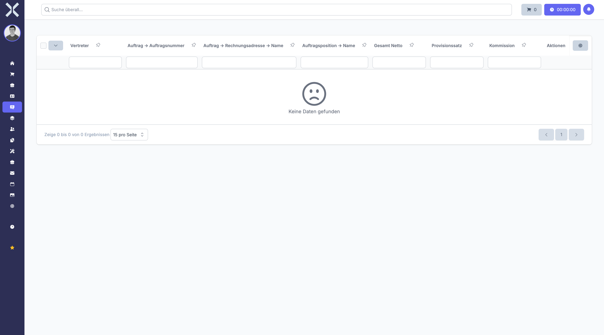

# Provisionen

Im Bereich **Provisionen** verwalten Sie die Provisionsabrechnungen Ihrer Vertriebsmitarbeiter. Provisionen werden auf Basis abgeschlossener Aufträge berechnet und können nach Mitarbeiter, Zeitraum und Abrechnungsstatus gefiltert werden.

## Übersicht

1. Navigieren Sie zu **Buchhaltung > Provisionen**.

   

2. Die Tabelle zeigt alle Provisionen mit folgenden Spalten:
   - **Mitarbeiter** - Name des provisionierten Vertriebsmitarbeiters
   - **Auftrag** - Zugehöriger Auftrag, auf dem die Provision basiert
   - **Betrag** - Höhe der berechneten Provision
   - **Provisionssatz** - Prozentualer Anteil am Auftragswert
   - **Status** - Aktueller Abrechnungsstatus (offen oder abgerechnet)

## Provisionsberechnung

Die Provision wird auf Grundlage des jeweiligen Auftrags berechnet. Dabei fließen folgende Faktoren ein:

- **Auftragssumme** - Der Gesamtbetrag des zugehörigen Auftrags
- **Provisionssatz** - Der für den Mitarbeiter hinterlegte prozentuale Provisionssatz
- **Provisionsbetrag** - Das Ergebnis aus Auftragssumme und Provisionssatz

Jedem Vertriebsmitarbeiter kann ein individueller Provisionssatz zugeordnet werden. Die Berechnung erfolgt automatisch bei Abschluss eines Auftrags.

## Provisionen filtern

Sie können die Provisionsliste gezielt einschränken:

- **Nach Mitarbeiter** - Zeigen Sie nur Provisionen eines bestimmten Vertriebsmitarbeiters an
- **Nach Zeitraum** - Filtern Sie Provisionen nach einem bestimmten Datumszeitraum
- **Nach Status** - Unterscheiden Sie zwischen offenen (noch nicht abgerechneten) und bereits abgerechneten Provisionen

## Status der Provisionen

Provisionen durchlaufen folgende Status:

| Status | Bedeutung |
|---|---|
| **Offen** | Die Provision wurde berechnet, aber noch nicht an den Mitarbeiter ausgezahlt |
| **Abgerechnet** | Die Provision wurde abgerechnet und dem Mitarbeiter gutgeschrieben |

## Weiterführende Themen

- [Buchhaltung](0-index.md) - Zurück zur Buchhaltungsübersicht
- [Aufträge](../4-auftraege/0-index.md) - Aufträge einsehen, auf denen Provisionen basieren
- [Kontakte](../2-kontakte/0-index.md) - Mitarbeiterdaten verwalten
