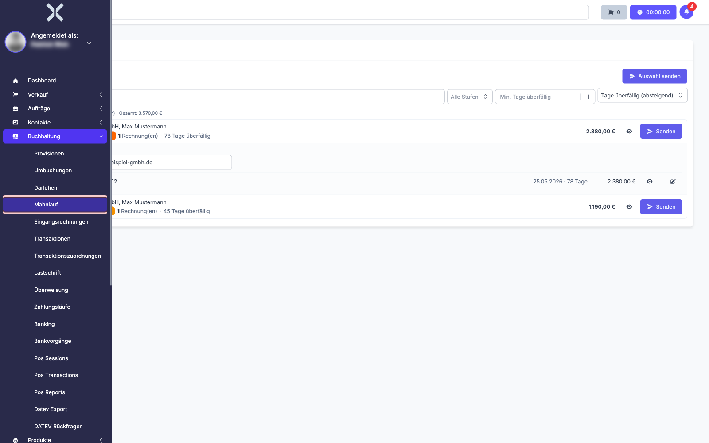
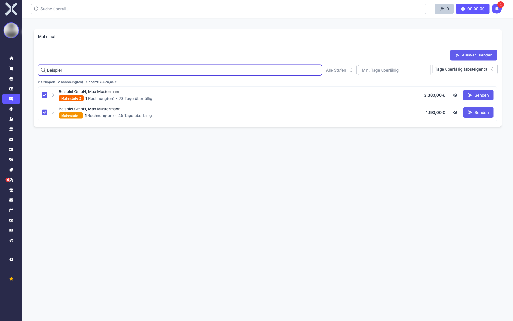
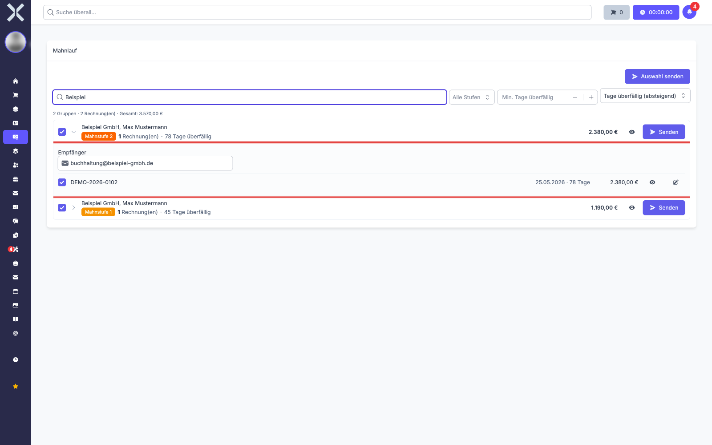
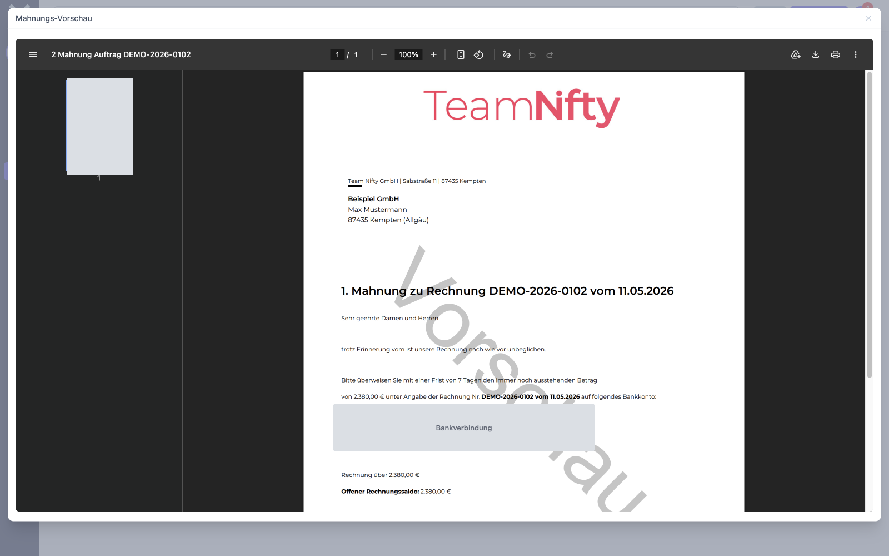
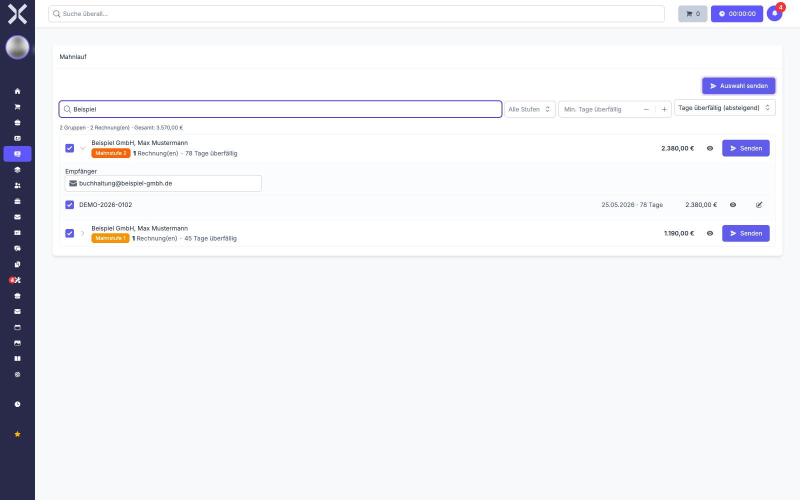
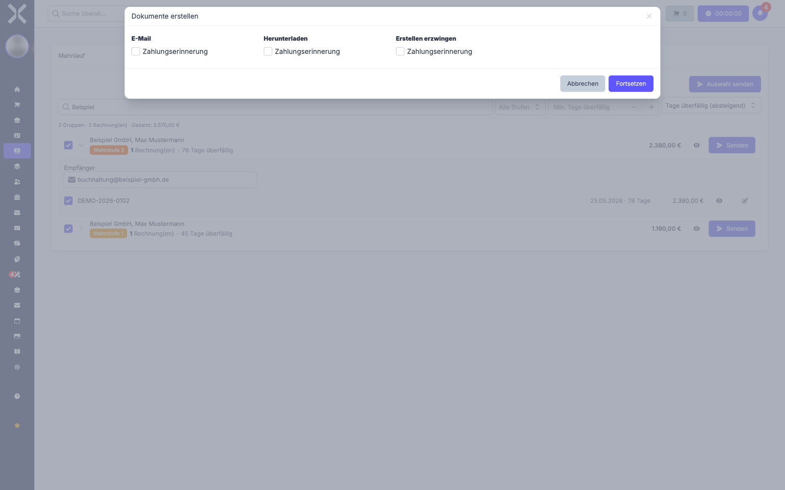

# Mahnlauf

Im Bereich **Mahnlauf** mahnen Sie überfällige Rechnungen. Sie sehen alle fälligen Mahnungen auf einer Seite, gebündelt je Kunde, und versenden sie einzeln, kundenweise oder in einem Rutsch.

> **Hinweis:** Den früheren Menüpunkt **Mahnungen** gibt es nicht mehr. Er wurde durch **Mahnlauf** ersetzt, der alle bisherigen Aufgaben übernimmt und zusätzlich Vorschau, Empfängerkorrektur und Einzelversand bietet.

## Mahnlauf öffnen

1. Navigieren Sie in der Sidebar zu **Buchhaltung > Mahnlauf**.

   

2. Die Seite zeigt alle Rechnungen, für die aktuell eine Mahnung fällig ist.

   

Ist nichts fällig, erscheint der Hinweis **Keine Mahnungen fällig**.

## Aufbau der Liste

Über der Liste steht eine Zusammenfassung: Anzahl der Gruppen, Anzahl der Rechnungen und die Summe aller offenen Beträge.

Darunter steht je Kunde eine Zeile mit:

- **Kundenname** - alle fälligen Rechnungen dieses Kunden sind hier gebündelt
- **Mahnstufe** - die Stufe, mit der als Nächstes gemahnt wird, farblich abgestuft von Gelb bis Rot
- **Anzahl Rechnungen** - wie viele Rechnungen in dieser Gruppe stecken
- **Tage überfällig** - die höchste Überfälligkeit innerhalb der Gruppe
- **Offener Betrag** - die Summe der offenen Beträge der Gruppe

Rechts stehen die Schaltflächen **Vorschau** und **Senden**.

## Liste filtern und sortieren

Vier Bedienelemente über der Liste schränken die Anzeige ein:

- **Suchfeld** - durchsucht Name, Rechnungsnummer und Kundennummer
- **Alle Stufen** - zeigt nur Gruppen einer bestimmten Mahnstufe
- **Min. Tage überfällig** - blendet alles aus, was weniger lang überfällig ist
- **Sortierung** - nach Tagen überfällig, nach Betrag oder nach Kundenname, jeweils auf- oder absteigend

## Rechnungen einer Gruppe ansehen

1. Klicken Sie auf eine Kundenzeile, um die Gruppe aufzuklappen.

   

2. Sie sehen nun je Rechnung die Rechnungsnummer, das Fälligkeitsdatum, die Tage seit Fälligkeit und den offenen Betrag.

3. Über dem Rechnungsblock steht das Feld **Empfänger** mit der E-Mail-Adresse, an die die Mahnung geht. Sie können die Adresse hier für diesen Versand überschreiben, ohne den Kontakt zu ändern.

> **Hinweis:** Ist kein Empfänger hinterlegt, zeigt das Feld **Keine E-Mail**. Tragen Sie dann entweder hier eine Adresse ein oder hinterlegen Sie eine dauerhaft am [Kontakt](../2-kontakte/3-adressen.md).

## Mahnung vorher ansehen

1. Klicken Sie auf das Augensymbol, entweder in der Kundenzeile oder bei einer einzelnen Rechnung.
2. Die fertige Mahnung öffnet sich als PDF im Fenster **Mahnungs-Vorschau**.

   

3. Schließen Sie das Fenster über das Kreuz oben rechts.

Die Vorschau versendet nichts und zählt die Mahnstufe nicht hoch.

## Mahnungen versenden

Sie haben drei Wege, je nachdem wie gezielt Sie vorgehen wollen.

### Eine ganze Kundengruppe

Klicken Sie in der Kundenzeile auf **Senden**. Alle fälligen Rechnungen dieses Kunden gehen gebündelt in einer E-Mail hinaus.

### Mehrere Kunden gleichzeitig

1. Setzen Sie die Haken bei den gewünschten Kunden oder einzelnen Rechnungen.
2. Klicken Sie oben rechts auf **Auswahl senden**.

   

Ohne Auswahl ist die Schaltfläche nicht anklickbar.

### Eine einzelne Rechnung mit angepasster Mail

1. Klappen Sie die Kundengruppe auf.
2. Klicken Sie bei der Rechnung auf das Stiftsymbol **Mail bearbeiten und senden**.
3. Es öffnet sich der Dialog **Dokumente erstellen**.

   

4. Wählen Sie, was passieren soll:
   - **E-Mail** - die Mahnung wird als E-Mail verschickt
   - **Herunterladen** - die Mahnung wird als PDF heruntergeladen, etwa für den Postversand
   - **Erstellen erzwingen** - erzeugt das Dokument auch dann, wenn es bereits existiert
5. Klicken Sie auf **Fortsetzen**. Bei **E-Mail** öffnet sich der Mailversand, in dem Sie Betreff und Text vor dem Absenden anpassen können.

## Was nach dem Versand passiert

Versendete Rechnungen verschwinden aus der Liste und ihre Mahnstufe wird um eins erhöht. Beim nächsten Fälligkeitstermin erscheinen sie mit der nächsthöheren Stufe erneut.

Konnte nicht alles versendet werden, erscheint ein Hinweis in der Form **:count von :total Mahnungen wurden nicht versendet**, zusammen mit dem Grund und der Anzahl betroffener Rechnungen. Diese Rechnungen bleiben stehen und ihre Mahnstufe wird **nicht** hochgezählt. Sobald die Ursache behoben ist, können Sie sie erneut versenden.

## Voraussetzungen für den Versand

Damit eine Rechnung überhaupt im Mahnlauf auftaucht, müssen **alle** folgenden Punkte erfüllt sein:

- Die Rechnung ist gesperrt und hat eine Rechnungsnummer
- Der offene Betrag ist größer als null
- Der Zahlungsstatus ist nicht **Bezahlt**, **In Zahlung** oder **In offenem Zahlungslauf**
- Am Auftrag ist **Zahlungserinnerung Nächstes Datum** gesetzt und dieses Datum ist erreicht oder überschritten
- Für die nächste fällige Mahnstufe ist ein [Mahntext](../14-einstellungen/23-mahntexte.md) hinterlegt
- Diesem Mahntext ist eine [E-Mail-Vorlage](../14-einstellungen/25-email-vorlagen.md) zugeordnet

> **Hinweis:** Rechnungen mit Lastschrifteinzug werden erst mahnbar, wenn mindestens ein Lastschriftlauf dafür fehlgeschlagen ist. Solange die Lastschrift läuft, holen Sie das Geld ja selbst.

## An welche E-Mail-Adresse geht die Mahnung?

Das System prüft in dieser Reihenfolge:

1. **Rechnungsadresse des Auftrags** - ist dort eine E-Mail hinterlegt, wird sie verwendet
2. **Rechnungsadresse des Kontakts** - sonst greift die am Kontakt hinterlegte Rechnungsadresse
3. **Hauptadresse des Kontakts** - sonst die primäre E-Mail-Adresse der Hauptadresse
4. **Kein E-Mail-Versand** - fehlt überall eine Adresse, bleibt nur der Weg über **Herunterladen** und Postversand

Die im Mahnlauf im Feld **Empfänger** eingetragene Adresse hat Vorrang und gilt für diesen einen Versand.

> **Beispiel:** Ihr Kunde „Beispiel GmbH" hat eine Zentrale in München und eine Niederlassung in Berlin. Wählen Sie am Auftrag die Berliner Adresse als Rechnungsadresse und ist dort eine E-Mail hinterlegt, geht die Mahnung für diesen Auftrag nach Berlin.

## Fehlerbehebung

**Eine überfällige Rechnung taucht nicht im Mahnlauf auf**

- Prüfen Sie am [Auftrag](../4-auftraege/2-auftrag-detail.md) das Feld **Zahlungserinnerung Nächstes Datum**: Ist es gesetzt und liegt es in der Vergangenheit?
- Prüfen Sie, ob die Rechnung gesperrt ist und eine Rechnungsnummer hat
- Prüfen Sie, ob der offene Betrag tatsächlich größer als null ist
- Bei Lastschrift: Ist bereits ein Lastschriftlauf fehlgeschlagen?

**Der Hinweis meldet, dass Mahnungen nicht versendet wurden**

Die beiden häufigsten Gründe:

- **Für die Mahnstufe ist kein Mahntext hinterlegt** - legen Sie unter [Einstellungen > Buchhaltung > Mahntexte](../14-einstellungen/23-mahntexte.md) einen Text für die betroffene Stufe an
- **Beim Mahntext ist keine E-Mail-Vorlage hinterlegt** - legen Sie unter [Einstellungen > Buchhaltung > E-Mail-Vorlagen](../14-einstellungen/25-email-vorlagen.md) eine Vorlage an und ordnen Sie sie dem Mahntext zu

**Die Mahnung geht an die falsche Adresse**

Korrigieren Sie die Adresse direkt im Feld **Empfänger**, wenn es nur um diesen einen Versand geht. Dauerhaft ändern Sie sie über die Rechnungsadresse am [Auftrag](../4-auftraege/2-auftrag-detail.md) oder an den [Adressen](../2-kontakte/3-adressen.md) des Kontakts.

## Aufträge vom Mahnwesen ausschließen

Einzelne Aufträge lassen sich vom Mahnwesen ausnehmen, etwa bei laufenden Reklamationen oder vereinbarter Ratenzahlung. Die Einstellung nehmen Sie direkt am jeweiligen [Auftrag](../4-auftraege/2-auftrag-detail.md) vor.

## Weiterführende Themen

- [Buchhaltung](0-index.md) - Zurück zur Buchhaltungsübersicht
- [Mahntexte](../14-einstellungen/23-mahntexte.md) - Texte und Gebühren je Mahnstufe
- [Auftragsdetails](../4-auftraege/2-auftrag-detail.md) - Rechnungsadresse und Zahlungserinnerung am Auftrag
- [Adressen](../2-kontakte/3-adressen.md) - Rechnungsadressen und deren E-Mail-Adressen verwalten
- [Kommunikation](../2-kontakte/4-kommunikation.md) - E-Mail-Adressen auf Kontakt- und Adressebene
