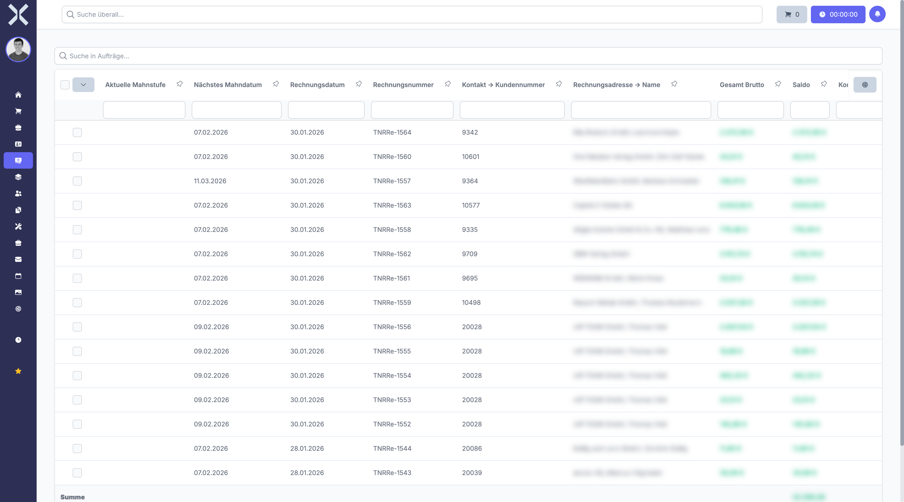

# Mahnungen

Im Bereich **Mahnungen** verwalten Sie das Mahnwesen für offene Rechnungen. Das System unterstützt mehrere Mahnstufen mit konfigurierbaren Texten und Gebühren sowie einen automatischen Mahnlauf, der überfällige Rechnungen erkennt und Mahnungen erzeugt.

## Übersicht

1. Navigieren Sie zu **Buchhaltung > Mahnungen**.

   

2. Die Tabelle zeigt alle Mahnungen mit folgenden Spalten:
   - **Kontakt** - Name des Kunden, der gemahnt wird
   - **Rechnungsnummer** - Nummer der überfälligen Rechnung
   - **Rechnungsdatum** - Datum der ursprünglichen Rechnung
   - **Offener Betrag** - Noch ausstehender Rechnungsbetrag
   - **Mahnstufe** - Aktuelle Stufe der Mahnung (1. Mahnung, 2. Mahnung, 3. Mahnung)
   - **Letzte Mahnung** - Datum, an dem die letzte Mahnung versendet wurde

## Mahnstufen

Das Mahnwesen arbeitet mit konfigurierbaren Mahnstufen. Jede Stufe kann eigene Texte und Gebühren enthalten:

| Mahnstufe | Beschreibung | Typische Frist |
|---|---|---|
| **1. Mahnung** | Freundliche Zahlungserinnerung ohne zusätzliche Gebühren | Nach Ablauf des Zahlungsziels |
| **2. Mahnung** | Nachdrückliche Mahnung, ggf. mit Mahngebühren | Einige Wochen nach der 1. Mahnung |
| **3. Mahnung** | Letzte Mahnung vor weiteren Maßnahmen, mit erhöhten Mahngebühren | Einige Wochen nach der 2. Mahnung |

Die Mahntexte und Mahngebühren je Stufe können Sie in den Einstellungen konfigurieren. So lässt sich der Ton der Mahnungen von einer freundlichen Erinnerung bis hin zu einer nachdrücklichen letzten Aufforderung abstufen.

## Mahnlauf durchführen

Beim automatischen Mahnlauf prüft das System alle offenen Rechnungen und erzeugt Mahnungen für überfällige Positionen:

1. Klicken Sie auf **Mahnlauf starten**.
2. Das System prüft alle offenen Rechnungen, deren Zahlungsziel überschritten ist.
3. Für jede überfällige Rechnung wird automatisch eine Mahnung in der entsprechenden Mahnstufe erzeugt.
4. Prüfen Sie die erzeugten Mahnungen in der Liste.
5. Versenden Sie die Mahnungen per E-Mail oder drucken Sie diese als PDF aus.

> **Hinweis:** Der Mahnlauf berücksichtigt die aktuelle Mahnstufe jeder Rechnung. Wurde bereits eine 1. Mahnung versendet und die Rechnung ist weiterhin offen, wird automatisch die 2. Mahnung erzeugt.

## Mahnungen versenden

Für den Versand stehen Ihnen zwei Wege zur Verfügung:

- **Per E-Mail** - Die Mahnung wird als E-Mail an die hinterlegte Kontaktadresse versendet
- **Als PDF drucken** - Die Mahnung wird als PDF-Dokument erzeugt und kann ausgedruckt und per Post versendet werden

### An welche E-Mail-Adresse wird die Mahnung gesendet?

Das System prüft in folgender Reihenfolge, an welche E-Mail-Adresse die Mahnung gesendet wird:

1. **Rechnungsadresse des Auftrags** - Ist am Auftrag eine Rechnungsadresse mit E-Mail-Adresse hinterlegt, wird diese verwendet.
2. **Rechnungsadresse des Kontakts** - Ist am Auftrag keine Rechnungsadresse hinterlegt (oder hat diese keine E-Mail), wird die am Kontakt hinterlegte Rechnungsadresse verwendet.
3. **Hauptadresse des Kontakts** - Ist auch am Kontakt keine Rechnungsadresse hinterlegt, wird die primäre E-Mail-Adresse der Hauptadresse verwendet.
4. **Kein E-Mail-Versand** - Ist an keiner der drei Adressen eine E-Mail-Adresse hinterlegt, kann die Mahnung nicht per E-Mail versendet werden. In diesem Fall steht nur der Versand als PDF-Dokument bzw. per Post zur Verfügung.

> **Beispiel:** Ihr Kunde „Muster GmbH" hat eine Zentrale in München und eine Niederlassung in Berlin. Wenn Sie beim Auftrag die Berliner Adresse als Rechnungsadresse auswählen und dort eine E-Mail-Adresse hinterlegt ist, wird die Mahnung für diesen Auftrag an die Berliner Adresse gesendet.

### Voraussetzungen für den automatischen Mahnversand

Damit eine Mahnung beim automatischen Mahnlauf erzeugt und versendet werden kann, müssen **alle** folgenden Voraussetzungen erfüllt sein:

- Die Rechnung muss überfällig sein (Zahlungsziel überschritten)
- Am Auftrag muss das Feld **Zahlungserinnerung Nächstes Datum** gesetzt sein und das Datum muss erreicht oder überschritten sein
- Mindestens eine der folgenden Adressen muss eine E-Mail-Adresse besitzen: Rechnungsadresse des Auftrags, Rechnungsadresse des Kontakts oder Hauptadresse des Kontakts
- Die Rechnung muss gesperrt sein (Rechnungsnummer vergeben)
- Der Auftrag muss einen offenen Saldo haben (Balance ≠ 0)
- Der Auftrag darf nicht vom Mahnwesen ausgeschlossen sein

> **Hinweis:** Fehlt eine dieser Voraussetzungen, wird für den betroffenen Auftrag keine Mahnung erzeugt.

### Fehlerbehebung: Mahnung wird nicht erstellt

Falls Mahnungen nicht wie erwartet erzeugt oder versendet werden, prüfen Sie die folgenden häufigen Ursachen:

**Problem:** Mahnung wird trotz überfälliger Rechnung nicht erzeugt

- Prüfen Sie, ob an mindestens einer der drei Adressen (Rechnungsadresse des Auftrags, Rechnungsadresse des Kontakts, Hauptadresse des Kontakts) eine E-Mail-Adresse hinterlegt ist
- Prüfen Sie, ob der Auftrag vom Mahnwesen ausgeschlossen wurde
- Prüfen Sie das Feld **Zahlungserinnerung Nächstes Datum** im Auftrag -- ist es gesetzt und liegt das Datum in der Vergangenheit?
- Prüfen Sie, ob die Rechnung gesperrt ist und eine Rechnungsnummer hat

**Problem:** E-Mail-Dialog öffnet sich nicht nach Klick auf „Fortsetzen"

Wenn Sie einen oder mehrere Aufträge auswählen, auf **Zahlungserinnerung erstellen** klicken, den Haken bei **E-Mail** setzen und anschließend auf **Fortsetzen** klicken, aber der E-Mail-Dialog nicht erscheint, liegt das in der Regel daran, dass beim betroffenen Kontakt keine E-Mail-Adresse hinterlegt ist.

Aufträge ohne E-Mail-Adresse werden beim Erstellen der Zahlungserinnerung automatisch übersprungen. Sind **alle** ausgewählten Aufträge betroffen, öffnet sich der E-Mail-Dialog nicht.

Lösung:
1. Öffnen Sie den betroffenen [Kontakt](../2-kontakte/0-index.md) und navigieren Sie zu dessen [Adressen](../2-kontakte/3-adressen.md).
2. Tragen Sie eine E-Mail-Adresse auf der Rechnungsadresse oder der Hauptadresse ein.
3. Führen Sie den Mahnlauf erneut durch.

**Problem:** Mahnung geht an die falsche E-Mail-Adresse

- Die E-Mail geht zuerst an die **Rechnungsadresse des Auftrags**, dann an die Rechnungsadresse des Kontakts, dann an die Hauptadresse
- Um die Empfängeradresse zu ändern, passen Sie die Rechnungsadresse am [Auftrag](../4-auftraege/2-auftrag-detail.md) an oder hinterlegen Sie die korrekte E-Mail-Adresse an der gewünschten Adresse

## Aufträge vom Mahnwesen ausschließen

In bestimmten Fällen möchten Sie einzelne Aufträge oder Rechnungen vom automatischen Mahnwesen ausschließen, beispielsweise bei laufenden Reklamationen oder vereinbarten Ratenzahlungen. Dies kann direkt am jeweiligen Auftrag eingestellt werden.

## Mahngebühren

Mahngebühren werden je Mahnstufe konfiguriert und automatisch auf den offenen Betrag aufgeschlagen. Die Höhe der Gebühren können Sie in den Einstellungen für jede Mahnstufe individuell festlegen.

## Weiterführende Themen

- [Buchhaltung](0-index.md) - Zurück zur Buchhaltungsübersicht
- [Aufträge](../4-auftraege/0-index.md) - Zugehörige Rechnungen einsehen
- [Auftragsdetails](../4-auftraege/2-auftrag-detail.md) - Rechnungsadresse und Zahlungserinnerung am Auftrag einstellen
- [Kontakte](../2-kontakte/0-index.md) - Kundendaten und Zahlungsziele verwalten
- [Adressen](../2-kontakte/3-adressen.md) - Rechnungsadressen und deren E-Mail-Adressen verwalten
- [Kommunikation](../2-kontakte/4-kommunikation.md) - E-Mail-Adressen auf Kontakt- und Adressebene
