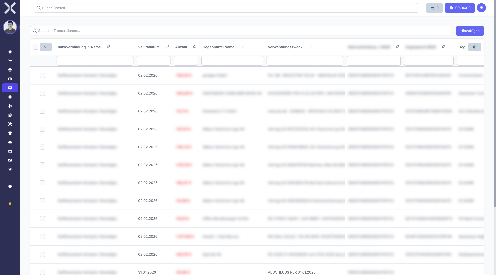

# Transaktionen

Im Bereich **Transaktionen** sehen Sie alle Banktransaktionen und Kontobewegungen. Transaktionen werden automatisch über eine HBCI/FinTS-Verbindung von Ihrer Bank importiert und bilden die Grundlage für die Zuordnung zu Aufträgen und Rechnungen.

## Übersicht

1. Navigieren Sie zu **Buchhaltung > Transaktionen**.

   

2. Die Tabelle zeigt alle Transaktionen mit folgenden Spalten:
   - **Bankverbindung** - Name des zugehörigen Bankkontos
   - **Valutadatum** - Datum der Wertstellung auf dem Konto
   - **Betrag** - Betrag der Transaktion (positiv bei Gutschriften, negativ bei Belastungen)
   - **Gegenpartei Name** - Name des Zahlungsempfängers oder -senders
   - **Verwendungszweck** - Beschreibung bzw. Buchungstext der Transaktion
   - **Bankverbindung IBAN** - IBAN des eigenen Kontos
   - **Gegenpartei IBAN** - IBAN der Gegenpartei

## Automatischer Import

Banktransaktionen werden automatisch über die HBCI/FinTS-Schnittstelle von Ihrer Bank abgerufen. Der Import erfolgt regelmäßig und umfasst alle neuen Kontobewegungen seit dem letzten Abruf. Die Bankverbindungen und Zugangsdaten konfigurieren Sie in den Einstellungen.

## Transaktionen suchen und filtern

Nutzen Sie das Suchfeld und die Filteroptionen, um Transaktionen gezielt zu finden:

- **Suche** - Durchsuchen Sie Transaktionen nach Verwendungszweck, Gegenpartei oder Betrag
- **Bankverbindung** - Filtern Sie nach einem bestimmten Bankkonto
- **Zeitraum** - Schränken Sie die Anzeige auf einen bestimmten Datumszeitraum ein

## Transaktionsstatus

Jede Transaktion hat einen Zuordnungsstatus:

| Status | Bedeutung |
|---|---|
| **Zugeordnet** | Die Transaktion wurde einem oder mehreren Aufträgen/Rechnungen zugeordnet |
| **Nicht zugeordnet** | Die Transaktion wurde noch keinem Auftrag zugeordnet und muss noch bearbeitet werden |
| **Ignoriert** | Die Transaktion wurde als irrelevant markiert, z. B. bei internen Umbuchungen zwischen eigenen Konten |

## Transaktionen als ignoriert markieren

Nicht alle Banktransaktionen sind für die Zuordnung zu Aufträgen relevant. Interne Umbuchungen zwischen eigenen Bankkonten oder regelmäßige Abbuchungen (z. B. Kontoführungsgebühren) können Sie als **ignoriert** markieren. Diese Transaktionen werden dann in der Liste der nicht zugeordneten Transaktionen nicht mehr angezeigt und müssen nicht weiter bearbeitet werden.

## Weiterführende Themen

- [Transaktionszuordnungen](5-transaktionszuordnungen.md) - Transaktionen Aufträgen zuordnen
- [Buchhaltung](0-index.md) - Zurück zur Buchhaltungsübersicht
