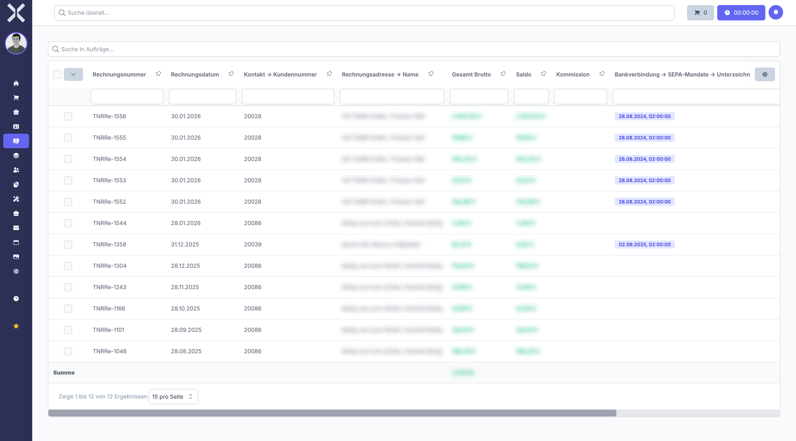

# Lastschriften

Im Bereich **Lastschriften** verwalten Sie SEPA-Lastschrifteinzüge für offene Rechnungen. Lastschriften werden für Aufträge erstellt, bei denen die Zahlungsart auf Lastschrift steht. Voraussetzung ist eine gültige Bankverbindung (IBAN/BIC) und ein SEPA-Mandat beim Kunden.

## Übersicht

1. Navigieren Sie zu **Buchhaltung > Lastschrift**.

   

2. Die Tabelle zeigt alle geplanten und durchgeführten Lastschrifteinzüge mit folgenden Spalten:
   - **Kontakt** - Name des Kunden, bei dem eingezogen wird
   - **Rechnungsnummer** - Nummer der zugehörigen Rechnung
   - **Betrag** - Einzuziehender Betrag
   - **IBAN** - IBAN des Kundenkontos
   - **Status** - Aktueller Status der Lastschrift

## Voraussetzungen für Lastschriften

Damit eine Lastschrift erstellt werden kann, müssen folgende Bedingungen erfüllt sein:

- **Zahlungsart Lastschrift** - Am Auftrag muss die Zahlungsart auf Lastschrift eingestellt sein
- **Gültige IBAN/BIC** - Der Kontakt muss eine gültige Bankverbindung mit IBAN und BIC hinterlegt haben
- **SEPA-Mandat** - Es muss ein gültiges SEPA-Lastschriftmandat für den Kunden vorliegen

## Lastschrift erstellen

### Einzelne Lastschrift

1. Klicken Sie auf **Neu**.
2. Wählen Sie den Auftrag aus, für den eine Lastschrift eingezogen werden soll.
3. Prüfen Sie den Betrag und die Bankverbindung.
4. Klicken Sie auf **Speichern**.

### Lastschriften im Stapel erstellen

Sie können auch mehrere Lastschriften auf einmal erstellen, indem Sie alle offenen Rechnungen mit Zahlungsart Lastschrift auswählen. Das System erstellt dann für jede ausgewählte Rechnung automatisch einen Lastschrifteinzug.

## Lastschriften in einem Zahlungslauf zusammenfassen

Einzelne Lastschriften werden in der Regel nicht einzeln an die Bank übermittelt, sondern in einem **Zahlungslauf** zusammengefasst. Siehe [Zahlungsläufe](8-zahlungslaeufe.md) für weitere Informationen.

## Weiterführende Themen

- [Buchhaltung](0-index.md) - Zurück zur Buchhaltungsübersicht
- [Zahlungsläufe](8-zahlungslaeufe.md) - Sammelzahlungen verarbeiten und SEPA-Datei exportieren
- [Kontakte](../2-kontakte/0-index.md) - Bankverbindungen und SEPA-Mandate der Kunden verwalten
