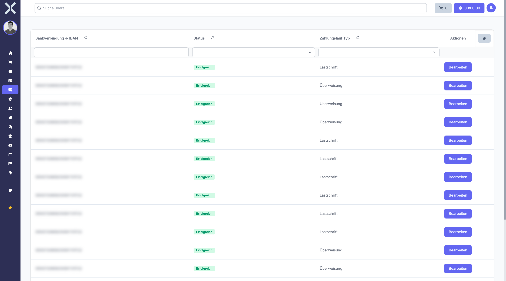

# Zahlungsläufe

Im Bereich **Zahlungsläufe** fassen Sie mehrere Lastschriften oder Überweisungen zu einem Sammellauf zusammen. Der Zahlungslauf erzeugt eine SEPA-XML-Datei, die Sie bei Ihrer Bank hochladen können, um alle enthaltenen Zahlungen in einem Durchgang auszuführen.

## Übersicht

1. Navigieren Sie zu **Buchhaltung > Zahlungsläufe**.

   

2. Die Tabelle zeigt alle Zahlungsläufe mit Status, Typ und Anzahl der enthaltenen Zahlungen.

## Typen von Zahlungsläufen

| Typ | Beschreibung |
|---|---|
| **Lastschrift-Lauf** | Fasst mehrere SEPA-Lastschrifteinzüge zusammen |
| **Überweisungs-Lauf** | Fasst mehrere SEPA-Überweisungen zusammen |

## Status eines Zahlungslaufs

| Status | Bedeutung |
|---|---|
| **Offen** | Der Zahlungslauf wurde erstellt, es können noch Zahlungen hinzugefügt oder entfernt werden |
| **In Bearbeitung** | Der Zahlungslauf wird verarbeitet |
| **Abgeschlossen** | Der Zahlungslauf wurde ausgeführt und die SEPA-Datei wurde erzeugt |

## Neuen Zahlungslauf erstellen

1. Klicken Sie auf **Neu**.
2. Wählen Sie den Typ des Zahlungslaufs (Lastschrift oder Überweisung).
3. Wählen Sie die Zahlungen aus, die in den Lauf aufgenommen werden sollen.
4. Klicken Sie auf **Speichern**.

## Zahlungslauf prüfen und ausführen

1. Öffnen Sie den gewünschten Zahlungslauf, um die [Zahlungslauf-Vorschau](9-zahlungslauf-vorschau.md) zu sehen.
2. Prüfen Sie alle enthaltenen Zahlungen auf Richtigkeit (Beträge, Empfänger, IBANs).
3. Wählen Sie die gewünschten Zahlungen aus oder ab.
4. Klicken Sie auf **Ausführen**, um den Zahlungslauf abzuschließen.

## SEPA-XML-Datei exportieren

Nach dem Ausführen des Zahlungslaufs wird eine SEPA-XML-Datei erzeugt. Diese Datei können Sie herunterladen und im Online-Banking Ihrer Bank hochladen, um die Zahlungen auszuführen.

1. Öffnen Sie den abgeschlossenen Zahlungslauf.
2. Klicken Sie auf **SEPA-Datei herunterladen**.
3. Laden Sie die XML-Datei im Online-Banking Ihrer Bank hoch.

## Historie

Alle durchgeführten Zahlungsläufe werden mit Datum, Typ, Anzahl der Zahlungen und Gesamtbetrag gespeichert. So können Sie jederzeit nachvollziehen, welche Zahlungen in welchem Lauf enthalten waren.

## Weiterführende Themen

- [Zahlungslauf-Vorschau](9-zahlungslauf-vorschau.md) - Zahlungen vor dem Ausführen im Detail prüfen
- [Lastschriften](6-lastschriften.md) - Einzelne Lastschriften verwalten
- [Überweisungen](7-ueberweisungen.md) - Einzelne Überweisungen verwalten
- [Buchhaltung](0-index.md) - Zurück zur Buchhaltungsübersicht
