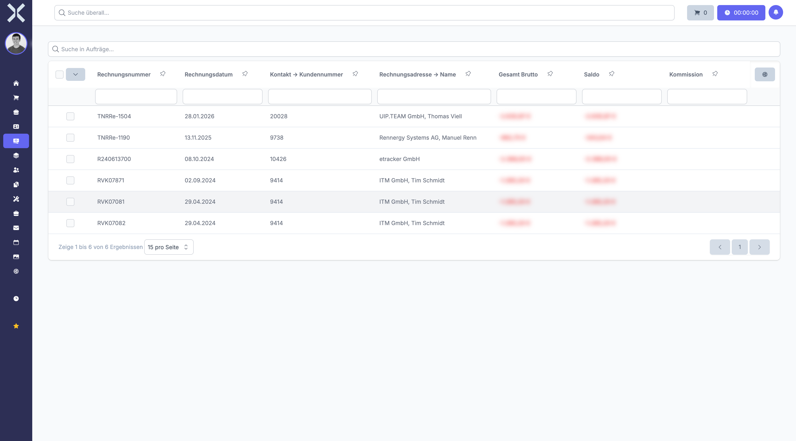

# Zahlungslauf-Vorschau

In der Zahlungslauf-Vorschau prüfen Sie alle enthaltenen Zahlungen im Detail, bevor Sie den Zahlungslauf ausführen. Sie können einzelne Zahlungen auswählen oder abwählen, nach bestimmten Einträgen suchen und die Gesamtsumme kontrollieren.

## Vorschau öffnen

1. Navigieren Sie zu **Buchhaltung > Zahlungsläufe**.
2. Klicken Sie auf den gewünschten Zahlungslauf.

   

## Enthaltene Zahlungen prüfen

Die Tabelle zeigt alle im Zahlungslauf enthaltenen Positionen mit folgenden Spalten:

- **Rechnungsnummer** - Nummer der zugehörigen Rechnung
- **Rechnungsdatum** - Datum der Rechnung
- **Kontakt -> Kundennummer** - Kundennummer des Zahlungsempfängers bzw. -pflichtigen
- **Rechnungsadresse -> Name** - Name des Rechnungsempfängers
- **Gesamt Brutto** - Bruttobetrag der Rechnung
- **Saldo** - Offener Restbetrag der Rechnung
- **Kommission** - Zugehörige Kommission

Am Ende der Tabelle wird die **Gesamtsumme** aller ausgewählten Zahlungen angezeigt. So haben Sie jederzeit einen Überblick über den Gesamtbetrag des Zahlungslaufs.

## Zahlungen filtern und suchen

- Nutzen Sie das Suchfeld **Suche in Aufträge...**, um gezielt nach Rechnungen, Kundennummern oder Namen zu suchen.
- Verwenden Sie die Filterzeilen unterhalb der Spaltenüberschriften für eine detaillierte Filterung nach einzelnen Spalten.

## Zahlungen auswählen und abwählen

1. Setzen Sie die Häkchen neben den Zahlungen, die im Lauf enthalten sein sollen.
2. Nutzen Sie das Häkchen in der Kopfzeile, um alle Zahlungen auf einmal auszuwählen.
3. Entfernen Sie das Häkchen bei einzelnen Zahlungen, die Sie aus dem Lauf herausnehmen möchten.

## Validierungswarnungen

Das System prüft vor dem Ausführen, ob alle erforderlichen Daten vorhanden sind. Bei fehlenden oder unvollständigen Daten werden Warnungen angezeigt, beispielsweise:

- **Fehlende IBAN** - Beim Kunden oder Lieferanten ist keine gültige IBAN hinterlegt
- **Fehlendes SEPA-Mandat** - Für eine Lastschrift liegt kein gültiges SEPA-Mandat vor
- **Ungültige Bankverbindung** - Die hinterlegte Bankverbindung ist fehlerhaft oder unvollständig

Beheben Sie diese Warnungen, bevor Sie den Zahlungslauf ausführen, um Rücklastschriften oder abgelehnte Überweisungen zu vermeiden.

## Weiterführende Themen

- [Zahlungsläufe](8-zahlungslaeufe.md) - Zurück zur Zahlungslauf-Übersicht
- [Lastschriften](6-lastschriften.md) - Einzelne Lastschriften verwalten
- [Überweisungen](7-ueberweisungen.md) - Einzelne Überweisungen verwalten
