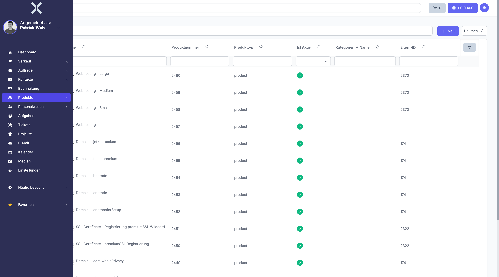

# Produkte

Im Modul **Produkte** verwalten Sie Ihren gesamten Produktkatalog -- von physischen Artikeln und Dienstleistungen über Varianten und Bundleprodukte bis hin zu Seriennummern und Lagerbeständen.

## Übersicht

Navigieren Sie über die Sidebar zu **Produkte**. Das Untermenü enthält:

- **Produkte** -- Vollständiger Produktkatalog mit Varianten, Preisen und Lagerbeständen
- **Seriennummern** -- Verwaltung und Nachverfolgung von Seriennummern

## Funktionsumfang

Das Produktmodul bietet folgende Kernfunktionen:

- **Produktkatalog** -- Zentrale Verwaltung aller Produkte mit Produktnummern, Beschreibungen, Attributen und Medien
- **Varianten** -- Abbildung verschiedener Ausprägungen (z. B. Größen, Farben) über Produktoptionsgruppen
- **Bundleprodukte** -- Zusammenstellung mehrerer Einzelprodukte zu einem Bündelprodukt
- **Preislisten** -- Hinterlegung mehrerer Preislisten pro Produkt mit Staffelpreisen (Mengenrabatte)
- **Lagerverwaltung** -- Bestandsführung über mehrere Lager mit Reservierungen und Verfügbarkeitsanzeige
- **Seriennummern** -- Nachverfolgung einzelner physischer Artikel über eindeutige Seriennummern
- **Produkteigenschaften und Optionsgruppen** -- Konfigurierbare Eigenschaften und Optionsgruppen für Varianten
- **Cross-Selling** -- Verknüpfung verwandter Produkte für Empfehlungen
- **Kategorien und Tags** -- Zuordnung von Kategorien und Tags zur Strukturierung des Katalogs

## Produktliste

Die Produktübersicht zeigt alle Produkte in einer tabellarischen Darstellung.

Die Tabelle enthält typische Spalten wie:

- **Produktnummer** -- Eindeutige Artikelnummer
- **Name** -- Bezeichnung des Produkts
- **Beschreibung** -- Kurzbeschreibung
- **Preis** -- Verkaufspreis aus der Standardpreisliste
- **Ist Aktiv** -- Status des Produkts (aktiv/inaktiv)
- **EAN** -- European Article Number (Barcode)

## Funktionen

- **Suche** -- Durchsuchen Sie den Produktkatalog nach Produktnummer, Name, Beschreibung oder EAN.
- **Neues Produkt** -- Klicken Sie auf **Neu**, um ein neues Produkt anzulegen.
- **Filter** -- Filtern Sie Produkte nach verschiedenen Kriterien, z. B. aktiv/inaktiv, Kategorie oder Produkttyp.
- **Gespeicherte Filter** -- Legen Sie häufig genutzte Filterkombinationen als gespeicherte Filter ab.

## Seiten in diesem Kapitel

- [Produkte verwalten](1-produkte-verwalten.md) -- Produktliste, Suche, Filter und neues Produkt anlegen
- [Seriennummern](2-seriennummern.md) -- Seriennummern verwalten und nachverfolgen
- [Produktdetails](3-produkt-detail.md) -- Detailansicht eines Produkts mit allen Tabs

## Weiterführende Themen

- [Aufträge](../4-auftraege/0-index.md) -- Produkte in Aufträgen verwenden
- [Preislisten](../14-einstellungen/15-preislisten.md) -- Preislisten in den Einstellungen konfigurieren
- [Lager](../14-einstellungen/41-lager.md) -- Lagerorte in den Einstellungen verwalten
- [Produktoptionsgruppen](../14-einstellungen/38-produktoptionsgruppen.md) -- Optionsgruppen für Varianten konfigurieren
- [Produkteigenschaften](../14-einstellungen/39-produkteigenschaften.md) -- Produkteigenschaften verwalten
- [Seriennummernbereiche](../14-einstellungen/40-seriennummernbereiche.md) -- Seriennummernbereiche in den Einstellungen definieren
- [Einheiten](../14-einstellungen/37-einheiten.md) -- Maßeinheiten konfigurieren
