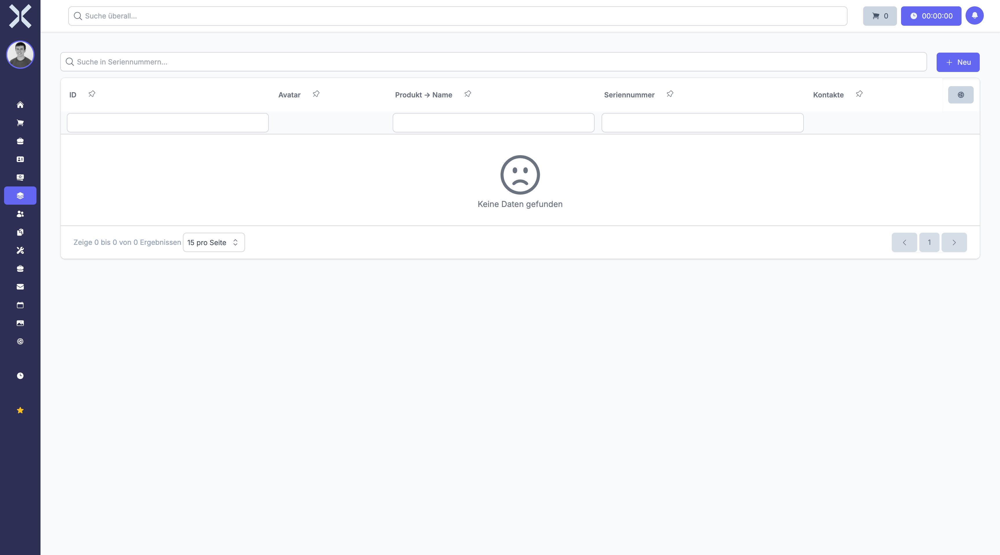

# Seriennummern

Im Bereich **Seriennummern** verwalten und verfolgen Sie die Seriennummern Ihrer Produkte. Jede Seriennummer identifiziert ein einzelnes physisches Exemplar eines Produkts eindeutig.

## Übersicht

1. Navigieren Sie zu **Produkte > Seriennummern**.

   

2. Die Tabelle zeigt alle erfassten Seriennummern mit folgenden Spalten:
   - **Seriennummer** -- Die eindeutige Kennung des einzelnen Exemplars
   - **Produkt** -- Das zugeordnete Produkt
   - **Aufgegebenes Datum** -- Datum, an dem die Seriennummer ausgegeben wurde
   - **Status** -- Aktueller Status der Seriennummer (z. B. verfügbar, zugewiesen, ausgeliefert)

## Wozu dienen Seriennummern?

Seriennummern ermöglichen die Nachverfolgung einzelner Produktexemplare über den gesamten Lebenszyklus hinweg:

- **Wareneingang** -- Beim Eingang einer Lieferung werden Seriennummern erfasst und dem Produkt zugeordnet.
- **Lagerung** -- Jede Seriennummer ist einem Lagerplatz zugeordnet.
- **Auftragsabwicklung** -- Bei der Kommissionierung wird eine konkrete Seriennummer einer Auftragsposition zugewiesen.
- **Kundenhistorie** -- Sie können jederzeit nachvollziehen, welcher Kunde welche Seriennummer erhalten hat.
- **Service und Garantie** -- Bei Reklamationen oder Garantiefällen lässt sich das betroffene Exemplar anhand der Seriennummer identifizieren.

## Seriennummern suchen

Nutzen Sie das Suchfeld oberhalb der Tabelle, um Seriennummern schnell zu finden. Die Suche berücksichtigt die Seriennummer selbst sowie den Produktnamen.

## Seriennummern filtern

- **Spaltenfilter** -- Filtern Sie gezielt nach Produkt, Status oder Datum, indem Sie die Filterzeile unterhalb der Spaltenüberschriften verwenden.
- **Sortierung** -- Klicken Sie auf eine Spaltenüberschrift, um die Liste zu sortieren.

## Zuweisung zu Auftragspositionen

Wenn ein Produkt seriennummernpflichtig ist, wird bei der Auftragsabwicklung eine Seriennummer zugewiesen:

1. Öffnen Sie den entsprechenden Auftrag.
2. Wählen Sie in der Auftragsposition die gewünschte Seriennummer aus.
3. Nach dem Speichern ist die Seriennummer der Position und damit dem Kunden zugeordnet.

## Seriennummernbereiche

Die Konfiguration von Seriennummernbereichen erfolgt in den Einstellungen. Dort definieren Sie:

- Nummernformate und Präfixe
- Automatische Vergabe oder manuelle Eingabe
- Zuordnung zu Produkten oder Produktgruppen

Weitere Informationen finden Sie unter [Seriennummernbereiche](../14-einstellungen/40-seriennummernbereiche.md).

## Weiterführende Themen

- [Produkte verwalten](1-produkte-verwalten.md) -- Zurück zum Produktkatalog
- [Produktdetails](3-produkt-detail.md) -- Seriennummern im Kontext eines einzelnen Produkts
- [Aufträge](../4-auftraege/0-index.md) -- Seriennummern in Aufträgen zuweisen
- [Seriennummernbereiche](../14-einstellungen/40-seriennummernbereiche.md) -- Konfiguration in den Einstellungen
