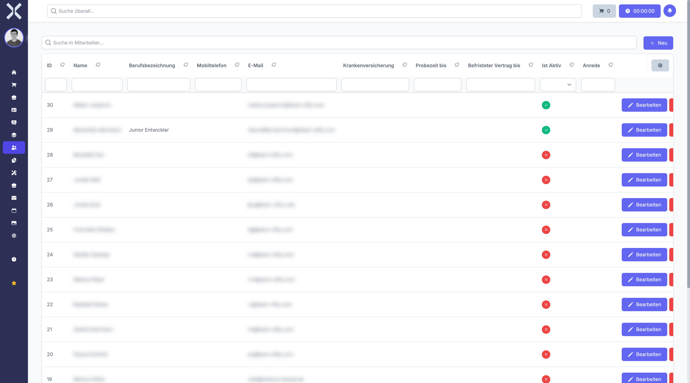

# Personalwesen

Im Modul **Personalwesen** verwalten Sie alle Aspekte rund um Ihre Mitarbeiter - von persönlichen Daten und Verträgen über Arbeitszeiten und Anwesenheit bis hin zu Abwesenheitsanträgen und Überstunden.

## Übersicht

Navigieren Sie über die Sidebar zu **Personalwesen**. Das Untermenü enthält folgende Bereiche:

- **Mein Mitarbeiterprofil** - Ihr eigenes Mitarbeiterprofil mit persönlichen Daten, Arbeitszeiten und Abwesenheitssalden
- **Dashboard** - Übersicht über Personalwesen-Kennzahlen mit konfigurierbaren Widgets
- **Anwesenheitsübersicht** - Tagesaktuelle Anwesenheit aller Mitarbeiter auf einen Blick
- **Mitarbeiter** - Vollständige Mitarbeiterliste mit Verwaltungsfunktionen
- **Mitarbeitertage** - Tagesgenaue Auswertung von Soll- und Ist-Stunden, Urlaubstagen und Überstunden
- **Arbeitszeiten** - Erfasste Arbeitszeiten aller Mitarbeiter mit Start-/Endzeiten und Pausen
- **Abwesenheitsanträge** - Urlaubs- und Abwesenheitsanträge mit Genehmigungsworkflow

## Funktionsumfang

Das Personalwesen-Modul deckt folgende Kernbereiche ab:

- **Mitarbeiterverwaltung** - Stammdaten, Vertragsinformationen, Abteilungszuordnung und Kontaktdaten aller Mitarbeiter
- **Arbeitszeiterfassung** - Tägliche Erfassung von Arbeitszeiten mit Start-/Endzeiten, Pausenzeiten und Arbeitszeittypen
- **Arbeitszeitmodelle** - Definition von Soll-Arbeitszeiten pro Wochentag, konfigurierbar in den [Einstellungen](../14-einstellungen/35-arbeitszeitmodelle.md)
- **Abwesenheitsmanagement** - Vollständiger Workflow für Urlaubsanträge, Krankmeldungen und Sonderurlaub mit Genehmigungsprozess
- **Überstundenverwaltung** - Automatische Berechnung von Plus- und Minusstunden basierend auf Soll- und Ist-Zeiten
- **Anwesenheitsübersicht** - Tagesaktuelle Darstellung des Anwesenheitsstatus aller Mitarbeiter
- **Mitarbeitertage** - Tagesgenaue Auswertung mit Zielstunden, Ist-Stunden und Abwesenheitsinformationen

## Mitarbeiterliste

Die Mitarbeiterübersicht zeigt alle Mitarbeiter in einer tabellarischen Darstellung.

Die Tabelle enthält folgende Spalten:

- **ID** - Eindeutige Mitarbeiter-ID
- **Name** - Vor- und Nachname
- **Berufsbezeichnung** - Position im Unternehmen
- **Mobiltelefon** - Handynummer
- **E-Mail** - E-Mail-Adresse
- **Krankenversicherung** - Hinterlegte Krankenversicherung
- **Probezeit bis** - Ende der Probezeit
- **Befristeter Vertrag bis** - Vertragsende bei Befristung
- **Ist Aktiv** - Aktiver Mitarbeiter (grün) oder inaktiv (rot)

## Funktionen

- **Suche** - Durchsuchen Sie die Mitarbeiterliste nach Namen oder anderen Kriterien.
- **Neuer Mitarbeiter** - Klicken Sie auf **Neu**, um einen neuen Mitarbeiter anzulegen.
- **Bearbeiten** - Klicken Sie auf einen Mitarbeiter, um dessen Detailansicht zu öffnen und Daten zu ändern.
- **Filter** - Filtern Sie nach aktiven/inaktiven Mitarbeitern, Abteilung oder anderen Kriterien.

## Seiten in diesem Kapitel

- [Mein Mitarbeiterprofil](1-mein-mitarbeiterprofil.md) - Ihr eigenes Profil anzeigen und bearbeiten
- [Dashboard](2-dashboard.md) - Personalwesen-Dashboard mit Widgets und Kennzahlen
- [Anwesenheitsübersicht](3-anwesenheit.md) - Tagesaktuelle Anwesenheit aller Mitarbeiter
- [Mitarbeiter](4-mitarbeiter.md) - Mitarbeiterliste verwalten
- [Arbeitszeiten](5-arbeitszeiten.md) - Erfasste Arbeitszeiten einsehen und filtern
- [Abwesenheitsanträge](6-abwesenheitsantraege.md) - Urlaubs- und Abwesenheitsanträge mit Workflow
- [Mitarbeiterdetails](7-mitarbeiter-detail.md) - Detailansicht eines Mitarbeiters
- [Mitarbeitertage](8-mitarbeitertage.md) - Tagesübersicht der Arbeitszeiten und Abwesenheiten
- [Abwesenheitsantrag-Details](9-abwesenheitsantrag-detail.md) - Detailansicht eines Antrags

## Weiterführende Themen

- [Arbeitszeitmodelle](../14-einstellungen/35-arbeitszeitmodelle.md) - Arbeitszeitmodelle in den Einstellungen konfigurieren
- [Arbeitszeittypen](../14-einstellungen/36-arbeitszeittypen.md) - Arbeitszeittypen verwalten
- [Abteilungen](../14-einstellungen/29-abteilungen.md) - Abteilungen konfigurieren
- [Abwesenheitsarten](../14-einstellungen/30-abwesenheitsarten.md) - Abwesenheitsarten definieren
- [Abwesenheitsrichtlinien](../14-einstellungen/31-abwesenheitsrichtlinien.md) - Richtlinien für Abwesenheiten festlegen
- [Feiertage](../14-einstellungen/32-feiertage.md) - Feiertage konfigurieren
- [Urlaubssperren](../14-einstellungen/33-urlaubssperren.md) - Urlaubssperren einrichten
- [Urlaubsübertrag](../14-einstellungen/34-urlaubsuebertrag.md) - Urlaubsübertrag verwalten
