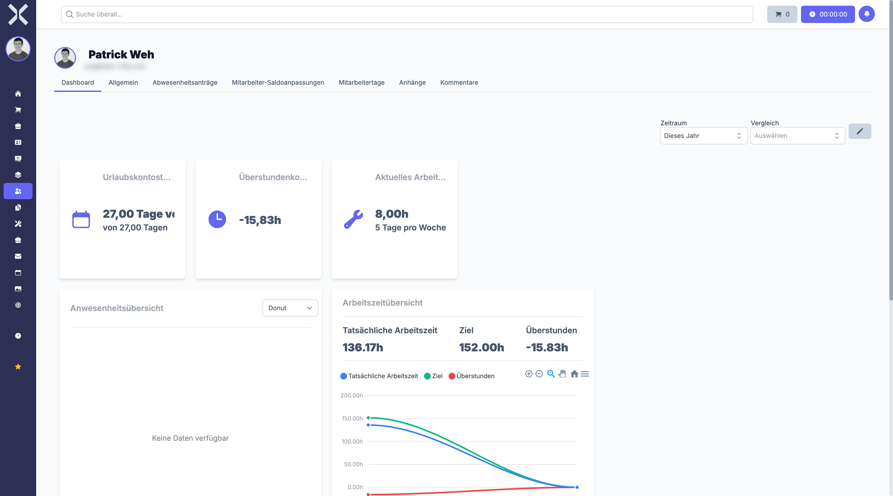

# Mein Mitarbeiterprofil

Im Bereich **Mein Mitarbeiterprofil** sehen und bearbeiten Sie Ihr eigenes Mitarbeiterprofil. Hier finden Sie Ihre persönlichen Daten, Arbeitszeitsalden und Abwesenheitsinformationen auf einen Blick.

## Profil öffnen

1. Navigieren Sie zu **Personalwesen > Mein Mitarbeiterprofil**.

   

2. Sie sehen Ihr eigenes Mitarbeiterprofil mit allen relevanten Informationen.

## Persönliche Daten

Im oberen Bereich Ihres Profils werden Ihre persönlichen Stammdaten angezeigt:

- **Name** - Ihr Vor- und Nachname
- **Berufsbezeichnung** - Ihre Position im Unternehmen
- **E-Mail** - Ihre geschäftliche E-Mail-Adresse
- **Mobiltelefon** - Ihre Handynummer
- **Abteilung** - Die Abteilung, der Sie zugeordnet sind

## Arbeitszeiten und Überstunden

Ihr Profil zeigt eine Zusammenfassung Ihrer Arbeitszeiten:

- **Überstundensaldo** - Ihre aktuell angesammelten Plus- oder Minusstunden
- **Arbeitszeitmodell** - Das Ihnen zugewiesene Arbeitszeitmodell mit den täglichen Sollstunden

Von hier aus können Sie direkt zu Ihren detaillierten [Arbeitszeiten](5-arbeitszeiten.md) navigieren.

## Abwesenheiten und Urlaubssaldo

Im Bereich Abwesenheiten sehen Sie:

- **Resturlaubstage** - Ihre verbleibenden Urlaubstage für das aktuelle Jahr
- **Genommene Urlaubstage** - Bereits genommene Urlaubstage im laufenden Jahr
- **Laufende Anträge** - Aktuelle Abwesenheitsanträge und deren Status (beantragt, genehmigt, abgelehnt)

## Profil bearbeiten

1. Klicken Sie auf **Bearbeiten**, um Ihre Daten anzupassen.
2. Ändern Sie die gewünschten Felder (z. B. Mobiltelefonnummer oder E-Mail-Adresse).
3. Klicken Sie auf **Speichern**.

> **Hinweis:** Bestimmte Felder wie Vertragsdaten oder das Arbeitszeitmodell können nur von Vorgesetzten oder der Personalabteilung geändert werden.

## Schnellzugriff

Aus Ihrem Profil heraus gelangen Sie direkt zu den wichtigsten Bereichen:

- Ihre erfassten Arbeitszeiten
- Ihre Abwesenheitsanträge
- Ihre Mitarbeitertage mit Soll-/Ist-Vergleich

## Weiterführende Themen

- [Arbeitszeiten](5-arbeitszeiten.md) - Ihre Arbeitszeiten einsehen
- [Abwesenheitsanträge](6-abwesenheitsantraege.md) - Urlaub beantragen
- [Mitarbeitertage](8-mitarbeitertage.md) - Tagesgenaue Übersicht Ihrer Arbeitszeiten
- [Mitarbeiterdetails](7-mitarbeiter-detail.md) - Vollständige Detailansicht
