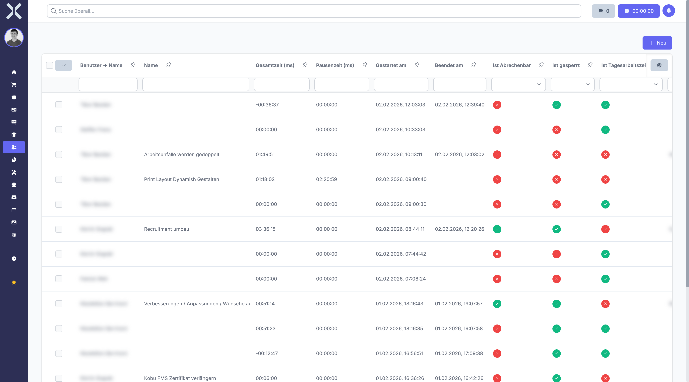

# Arbeitszeiten

Im Bereich **Arbeitszeiten** sehen Sie alle erfassten Arbeitszeiten der Mitarbeiter. Jeder Eintrag dokumentiert einen Arbeitszeitblock mit Start- und Endzeit, Pausen und optionaler Zuordnung zu Aufgaben oder Tickets.

## Übersicht

1. Navigieren Sie zu **Personalwesen > Arbeitszeiten**.

   

2. Die Tabelle zeigt alle Arbeitszeiterfassungen mit folgenden Spalten:
   - **Mitarbeiter** - Name des Mitarbeiters, der die Arbeitszeit erfasst hat
   - **Datum** - Der Tag, an dem die Arbeitszeit geleistet wurde
   - **Startzeit** - Beginn der Arbeitszeit
   - **Endzeit** - Ende der Arbeitszeit
   - **Dauer** - Gesamtdauer der Arbeitszeit
   - **Pause** - Erfasste Pausenzeit innerhalb des Arbeitszeitblocks
   - **Arbeitszeittyp** - Art der Arbeitszeit (z. B. reguläre Arbeitszeit, Überstunden). Arbeitszeittypen werden in den [Einstellungen](../14-einstellungen/36-arbeitszeittypen.md) konfiguriert.
   - **Aufgabe/Ticket** - Optionale Zuordnung zu einer Aufgabe oder einem Ticket, an dem gearbeitet wurde

## Arbeitszeiten filtern

Nutzen Sie die umfangreichen Filtermöglichkeiten, um die Anzeige auf relevante Einträge einzuschränken:

- **Nach Mitarbeiter** - Wählen Sie einen bestimmten Mitarbeiter aus, um nur dessen Arbeitszeiten zu sehen.
- **Nach Datum/Zeitraum** - Filtern Sie auf einen bestimmten Tag oder Zeitraum (z. B. aktuelle Woche, letzter Monat).
- **Nach Projekt** - Zeigen Sie nur Arbeitszeiten an, die einem bestimmten Projekt zugeordnet sind.
- **Spaltenfilter** - Nutzen Sie die Filterzeile unterhalb der Spaltenüberschriften für gezielte Filterung.
- **Sortierung** - Klicken Sie auf eine Spaltenüberschrift, um die Liste zu sortieren (z. B. nach Datum oder Mitarbeiter).

## Tägliche Erfassung

Arbeitszeiten werden täglich mit Start- und Endzeit erfasst:

- Jeder Eintrag dokumentiert einen zusammenhängenden Arbeitszeitblock.
- Pausenzeiten können innerhalb eines Eintrags separat erfasst werden, sodass die Netto-Arbeitszeit korrekt berechnet wird.
- Pro Tag und Mitarbeiter können mehrere Arbeitszeitblöcke existieren (z. B. bei geteilter Arbeitszeit).

## Zuordnung zu Aufgaben und Tickets

Arbeitszeiten können optional einer Aufgabe oder einem Ticket zugeordnet werden:

- Dies ermöglicht die Nachverfolgung, wie viel Zeit für bestimmte Projekte oder Supportanfragen aufgewendet wurde.
- Die Zuordnung erfolgt bei der Erfassung der Arbeitszeit über das entsprechende Auswahlfeld.

## Weiterführende Themen

- [Mitarbeitertage](8-mitarbeitertage.md) - Tagesgenaue Übersicht mit Soll-/Ist-Vergleich
- [Abwesenheitsanträge](6-abwesenheitsantraege.md) - Abwesenheiten verwalten
- [Mitarbeiterdetails](7-mitarbeiter-detail.md) - Arbeitszeiten eines einzelnen Mitarbeiters
- [Arbeitszeittypen](../14-einstellungen/36-arbeitszeittypen.md) - Arbeitszeittypen in den Einstellungen konfigurieren
- [Arbeitszeitmodelle](../14-einstellungen/35-arbeitszeitmodelle.md) - Arbeitszeitmodelle verwalten
- [Aufgaben](../8-aufgaben/0-index.md) - Aufgaben verwalten
- [Tickets](../9-tickets/0-index.md) - Tickets verwalten
- [Personalwesen](0-index.md) - Zurück zur Übersicht
