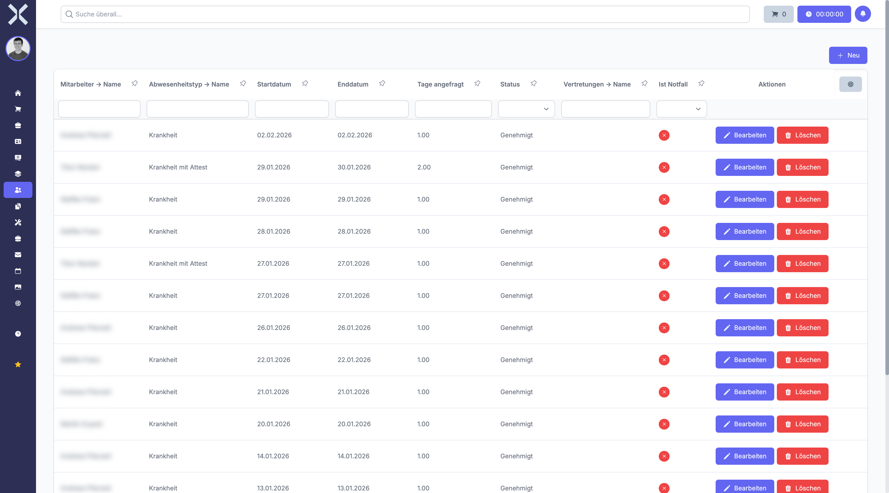

# Abwesenheitsanträge

Im Bereich **Abwesenheitsanträge** verwalten Sie alle Urlaubs- und Abwesenheitsanträge Ihres Unternehmens. Der gesamte Prozess - von der Antragstellung über die Genehmigung bis zur Stornierung - wird hier abgebildet.

## Übersicht

1. Navigieren Sie zu **Personalwesen > Abwesenheitsanträge**.

   

2. Die Tabelle zeigt alle Abwesenheitsanträge mit folgenden Informationen:
   - **Mitarbeiter** - Name des antragstellenden Mitarbeiters
   - **Abwesenheitstyp** - Art der Abwesenheit (z. B. Urlaub, Krankheit, Sonderurlaub)
   - **Von** - Startdatum der Abwesenheit
   - **Bis** - Enddatum der Abwesenheit
   - **Tagesabschnitt** - Ganzer Tag oder halber Tag
   - **Status** - Aktueller Bearbeitungsstatus des Antrags

## Status-Workflow

Jeder Abwesenheitsantrag durchläuft einen definierten Workflow mit folgenden Status:

1. **Beantragt** - Der Antrag wurde eingereicht und wartet auf Bearbeitung.
2. **Genehmigt** - Der Antrag wurde durch den Vorgesetzten oder die Personalabteilung genehmigt.
3. **Abgelehnt** - Der Antrag wurde abgelehnt (z. B. wegen Personalengpass oder Urlaubssperre).
4. **Storniert** - Der Antrag wurde vom Mitarbeiter oder der Personalabteilung storniert.

## Abwesenheitsarten

Die verfügbaren Abwesenheitsarten werden in den [Einstellungen](../14-einstellungen/30-abwesenheitsarten.md) konfiguriert. Typische Arten sind:

- **Urlaub** - Regulärer Erholungsurlaub
- **Krankheit** - Krankheitsbedingte Abwesenheit
- **Sonderurlaub** - Sonderurlaub bei besonderen Anlässen (z. B. Umzug, Hochzeit, Todesfall)
- **Bildungsurlaub** - Freistellung für Weiterbildungsmaßnahmen
- **Unbezahlter Urlaub** - Unbezahlte Freistellung

## Neuen Antrag stellen

1. Klicken Sie auf die Schaltfläche **Neu** oben rechts.
2. Füllen Sie die Antragsfelder aus:
   - **Abwesenheitstyp** - Wählen Sie die Art der Abwesenheit aus der Auswahlliste.
   - **Tagesabschnitt** - Ganzer Tag oder halber Tag (Vormittag/Nachmittag).
   - **Von** - Startdatum der gewünschten Abwesenheit.
   - **Bis** - Enddatum der gewünschten Abwesenheit.
   - **Vertretung** - Wählen Sie einen Mitarbeiter als Vertretung während Ihrer Abwesenheit.
   - **Grund** - Optionale Begründung des Antrags.
   - **Vertretungsnotiz** - Hinweise und Übergabeinformationen für die Vertretung.
3. Klicken Sie auf **Speichern**, um den Antrag einzureichen.

> **Hinweis:** Nach dem Speichern wird der Antrag mit dem Status **Beantragt** angelegt. Die verbleibenden Urlaubstage werden Ihnen vor dem Speichern angezeigt, damit Sie Ihren Resturlaub im Blick behalten.

## Resturlaubstage

Beim Erstellen eines Antrags wird Ihnen der aktuelle Urlaubssaldo angezeigt:

- **Jahresurlaub** - Gesamter Urlaubsanspruch für das aktuelle Jahr
- **Genommen** - Bereits genommene oder genehmigte Urlaubstage
- **Verbleibend** - Noch verfügbare Urlaubstage

So können Sie sicherstellen, dass ausreichend Urlaubstage zur Verfügung stehen, bevor Sie den Antrag einreichen.

## Antrag genehmigen oder ablehnen

Wenn Sie die Berechtigung zur Genehmigung von Abwesenheitsanträgen haben:

1. Öffnen Sie den Antrag durch Klicken auf den Eintrag in der Liste.
2. Prüfen Sie die Details des Antrags (Zeitraum, Vertretung, Auswirkung auf das Team).
3. Klicken Sie auf **Genehmigen** oder **Ablehnen**.

Bei der Ablehnung können Sie optional einen Grund angeben, der dem Mitarbeiter mitgeteilt wird.

## Antrag stornieren

Ein bereits genehmigter oder beantragter Antrag kann unter bestimmten Voraussetzungen storniert werden:

1. Öffnen Sie den Antrag.
2. Klicken Sie auf **Stornieren**.
3. Bestätigen Sie die Stornierung.

> **Hinweis:** Bei einem stornierten Antrag werden die entsprechenden Urlaubstage dem Kontingent des Mitarbeiters wieder gutgeschrieben.

## Kalenderansicht

Über die Anwesenheitsübersicht erhalten Sie eine kalenderartige Darstellung aller Abwesenheiten im Team. So können Sie mögliche Überschneidungen frühzeitig erkennen, bevor Sie einen Antrag genehmigen.

## Konflikt- und Überschneidungserkennung

Das System prüft bei neuen Anträgen, ob bereits Abwesenheiten im gewünschten Zeitraum vorliegen:

- Überlappende Anträge desselben Mitarbeiters werden erkannt und angezeigt.
- Bei der Genehmigung sehen Vorgesetzte, welche anderen Mitarbeiter im gleichen Zeitraum abwesend sind.

## Weiterführende Themen

- [Abwesenheitsantrag-Details](9-abwesenheitsantrag-detail.md) - Detailansicht eines einzelnen Antrags
- [Arbeitszeiten](5-arbeitszeiten.md) - Arbeitszeiten verwalten
- [Mitarbeitertage](8-mitarbeitertage.md) - Tagesgenaue Auswirkung von Abwesenheiten
- [Abwesenheitsarten](../14-einstellungen/30-abwesenheitsarten.md) - Abwesenheitsarten konfigurieren
- [Abwesenheitsrichtlinien](../14-einstellungen/31-abwesenheitsrichtlinien.md) - Richtlinien für Abwesenheiten
- [Urlaubssperren](../14-einstellungen/33-urlaubssperren.md) - Urlaubssperren einrichten
- [Personalwesen](0-index.md) - Zurück zur Übersicht
