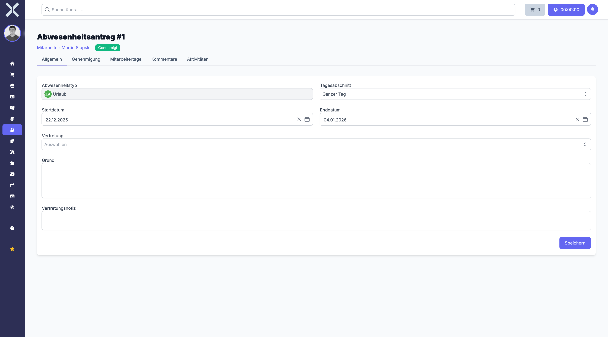

# Abwesenheitsantrag-Details

In der Detailansicht sehen und bearbeiten Sie alle Informationen zu einem einzelnen Abwesenheitsantrag. Die Ansicht ist in mehrere Tabs unterteilt und zeigt den aktuellen Genehmigungsstatus prominent im Kopfbereich an.

## Detailansicht öffnen

1. Navigieren Sie zur [Abwesenheitsanträge-Liste](6-abwesenheitsantraege.md).
2. Klicken Sie auf den gewünschten Antrag.

   

## Kopfbereich

Im Kopfbereich der Detailansicht werden die wichtigsten Informationen sofort sichtbar:

- **Mitarbeiter** - Name des antragstellenden Mitarbeiters
- **Genehmigungsstatus** - Aktueller Status als farbiges Badge:
  - **Beantragt** - Antrag wartet auf Bearbeitung
  - **Genehmigt** - Antrag wurde genehmigt
  - **Abgelehnt** - Antrag wurde abgelehnt
  - **Storniert** - Antrag wurde storniert

## Tab: Allgemein

Im Tab **Allgemein** sehen Sie die vollständigen Antragsdaten:

- **Abwesenheitstyp** - Art der Abwesenheit (z. B. Urlaub, Krankheit, Sonderurlaub, Bildungsurlaub). Die verfügbaren Typen werden in den [Einstellungen](../14-einstellungen/30-abwesenheitsarten.md) konfiguriert.
- **Tagesabschnitt** - Gibt an, ob die Abwesenheit einen ganzen Tag oder einen halben Tag (Vormittag/Nachmittag) umfasst.
- **Startdatum** - Erster Tag der Abwesenheit.
- **Enddatum** - Letzter Tag der Abwesenheit.
- **Vertretung** - Der Mitarbeiter, der während der Abwesenheit als Vertretung fungiert.
- **Grund** - Optionale Begründung des Antrags (z. B. bei Sonderurlaub).
- **Vertretungsnotiz** - Hinweise und Übergabeinformationen für die Vertretung, damit laufende Aufgaben weiterbearbeitet werden können.

## Tab: Genehmigung

Im Tab **Genehmigung** sehen Sie den vollständigen Genehmigungsprozess:

- **Status** - Aktueller Genehmigungsstatus (Beantragt, Genehmigt, Abgelehnt, Storniert)
- **Genehmigungsperson** - Name des Vorgesetzten oder der Person, die den Antrag bearbeitet hat
- **Genehmigungsdatum** - Datum und Uhrzeit der Genehmigung oder Ablehnung
- **Begründung** - Optionale Begründung bei Ablehnung

## Tab: Mitarbeitertage

Im Tab **Mitarbeitertage** sehen Sie die Auflistung aller betroffenen Arbeitstage innerhalb des Abwesenheitszeitraums:

- Jeder einzelne Arbeitstag wird aufgelistet (Wochenenden und Feiertage werden ausgenommen)
- Pro Tag wird angezeigt: Datum, Zielstunden und Abwesenheitsstunden
- So können Sie nachvollziehen, wie viele tatsächliche Arbeitstage von der Abwesenheit betroffen sind

## Tab: Kommentare

Im Tab **Kommentare** können interne Notizen zum Abwesenheitsantrag hinterlegt werden:

- Kommentare sind nur für berechtigte Benutzer sichtbar (z. B. Personalabteilung, Vorgesetzte)
- Nützlich für interne Abstimmungen vor der Genehmigung oder Ablehnung
- Neuen Kommentar hinzufügen über das Textfeld und **Speichern**

## Tab: Aktivitäten

Im Tab **Aktivitäten** sehen Sie den vollständigen Verlauf aller Änderungen und Aktionen am Antrag:

- Erstellung des Antrags
- Statusänderungen (Beantragt, Genehmigt, Abgelehnt, Storniert)
- Änderungen an Antragsdaten (z. B. Anpassung des Zeitraums)
- Jeder Eintrag zeigt den Zeitpunkt, den Benutzer und die Art der Änderung

## Aktionen

Je nach aktuellem Status und Ihren Berechtigungen stehen Ihnen verschiedene Aktionen zur Verfügung:

- **Genehmigen** - Genehmigt den Antrag (verfügbar bei Status "Beantragt" und entsprechender Berechtigung)
- **Ablehnen** - Lehnt den Antrag ab, optional mit Begründung (verfügbar bei Status "Beantragt" und entsprechender Berechtigung)
- **Stornieren** - Storniert den Antrag (verfügbar bei Status "Beantragt" oder "Genehmigt")

> **Hinweis:** Bei der Stornierung eines genehmigten Antrags werden die bereits abgezogenen Urlaubstage dem Kontingent des Mitarbeiters wieder gutgeschrieben.

## Antrag bearbeiten

1. Ändern Sie die gewünschten Felder im Tab **Allgemein** (z. B. Zeitraum oder Vertretung).
2. Klicken Sie auf **Speichern**.

> **Hinweis:** Änderungen an einem bereits genehmigten Antrag können eine erneute Genehmigung erfordern, abhängig von den konfigurierten Abwesenheitsrichtlinien.

## Weiterführende Themen

- [Abwesenheitsanträge](6-abwesenheitsantraege.md) - Zurück zur Antragsliste
- [Mitarbeitertage](8-mitarbeitertage.md) - Tagesübersicht der Mitarbeiter
- [Mitarbeiterdetails](7-mitarbeiter-detail.md) - Detailansicht des betroffenen Mitarbeiters
- [Abwesenheitsarten](../14-einstellungen/30-abwesenheitsarten.md) - Abwesenheitsarten konfigurieren
- [Abwesenheitsrichtlinien](../14-einstellungen/31-abwesenheitsrichtlinien.md) - Richtlinien für Abwesenheiten
- [Personalwesen](0-index.md) - Zurück zur Übersicht
