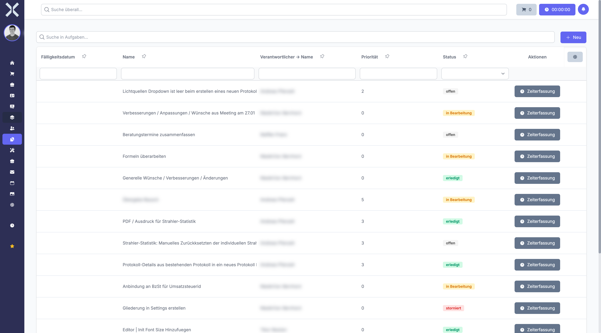

# Aufgaben

Im Modul **Aufgaben** verwalten Sie Ihre Aufgaben, verfolgen den Fortschritt und koordinieren die Zusammenarbeit im Team. Aufgaben bilden die operative Grundlage für die tägliche Arbeit und können Projekten, Mitarbeitern und Zeitbudgets zugeordnet werden.

## Übersicht

Navigieren Sie über die Sidebar zu **Aufgaben**. Sie sehen eine tabellarische Übersicht aller Aufgaben.

## Aufgaben-Statusmodell

Jede Aufgabe durchläuft einen definierten Lebenszyklus mit folgenden Status:

| Status | Beschreibung |
|---|---|
| **Offen** | Die Aufgabe wurde erstellt, aber noch nicht begonnen |
| **In Bearbeitung** | Die Aufgabe wird aktiv bearbeitet |
| **Erledigt** | Die Aufgabe wurde erfolgreich abgeschlossen |
| **Abgebrochen** | Die Aufgabe wurde vorzeitig beendet und nicht abgeschlossen |

Der Statuswechsel erfolgt über ein Dropdown-Feld in der Detailansicht oder direkt in der Aufgabenliste.

## Prioritätssystem

Aufgaben können mit einer Priorität versehen werden, um die Dringlichkeit zu kennzeichnen:

| Priorität | Beschreibung |
|---|---|
| **Niedrig** | Aufgabe ohne besonderen Zeitdruck |
| **Normal** | Standard-Priorität für reguläre Aufgaben |
| **Hoch** | Aufgabe mit erhöhter Dringlichkeit |
| **Dringend** | Aufgabe mit höchster Priorität, sofortige Bearbeitung erforderlich |

Die Priorität wird in der Aufgabenliste und in der Detailansicht farblich hervorgehoben, sodass dringende Aufgaben sofort erkennbar sind.

## Kernfunktionen

- **Zuweisung an Teammitglieder** - Weisen Sie eine Aufgabe einem oder mehreren Mitarbeitern zu. Alle zugewiesenen Personen sehen die Aufgabe in ihren persönlichen Aufgabenlisten.
- **Zeiterfassung** - Starten Sie die Zeiterfassung direkt aus einer Aufgabe heraus. Die erfassten Zeiten werden automatisch der Aufgabe zugeordnet.
- **Zeitbudget** - Legen Sie ein Zeitbudget fest und verfolgen Sie, wie viel Zeit bereits erfasst wurde. So behalten Sie den Aufwand im Blick.
- **Aufgabenhierarchie** - Erstellen Sie übergeordnete und untergeordnete Aufgaben, um komplexe Vorhaben in kleinere Teilaufgaben zu gliedern.
- **Projektverknüpfung** - Ordnen Sie Aufgaben einem Projekt zu. Die Aufgaben erscheinen dann auch im Projekt-Tab und tragen zum Projektfortschritt bei.
- **Fälligkeitsverfolgung** - Setzen Sie ein Fälligkeitsdatum. Überfällige Aufgaben werden optisch hervorgehoben, damit keine Fristen verpasst werden.

## Detailansicht

Klicken Sie auf eine Aufgabe, um die Detailansicht zu öffnen. Dort finden Sie:

- **Stammdaten** - Name, Beschreibung, Status, Priorität, Zuständigkeiten und Fristen
- **Kommentare** - Kommunikation und Fortschrittsdokumentation
- **Arbeitszeiten** - Alle erfassten Zeiten mit Start, Ende, Dauer und Mitarbeiter
- **Unteraufgaben** - Übersicht aller untergeordneten Aufgaben
- **Aktivitäten** - Änderungsprotokoll der Aufgabe

## Seiten in diesem Kapitel

- [Aufgaben verwalten](1-aufgaben-verwalten.md) - Aufgabenliste, Suche, Filter und neue Aufgabe anlegen
- [Aufgabendetails](2-aufgabe-detail.md) - Detailansicht einer Aufgabe mit allen Bereichen

## Weiterführende Themen

- [Projekte](../10-projekte/0-index.md) - Projekte verwalten, denen Aufgaben zugeordnet sind
- [Tickets](../9-tickets/0-index.md) - Support-Tickets bearbeiten
- [Personalwesen > Arbeitszeiten](../7-personalwesen/5-arbeitszeiten.md) - Übersicht aller erfassten Arbeitszeiten
