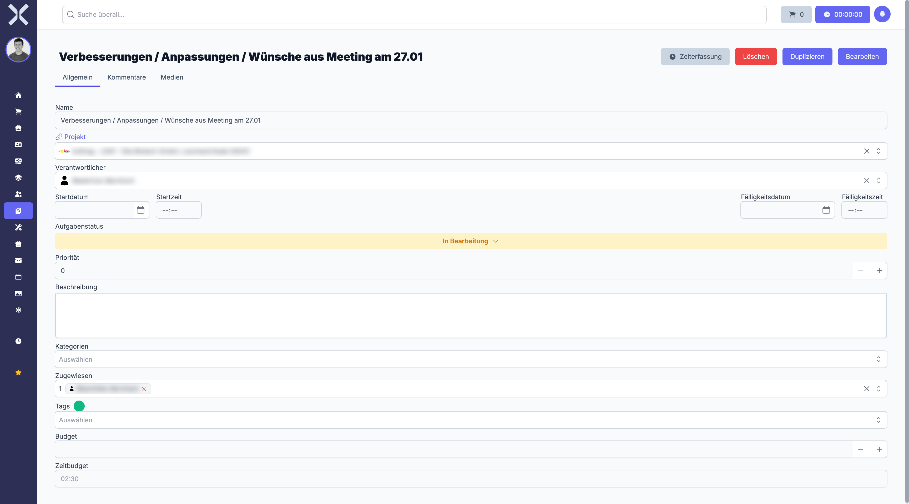

# Aufgabendetails

In der Detailansicht sehen und bearbeiten Sie alle Informationen zu einer einzelnen Aufgabe. Hier verwalten Sie Stammdaten, dokumentieren den Fortschritt über Kommentare, verfolgen erfasste Arbeitszeiten und koordinieren Unteraufgaben.

## Detailansicht öffnen

1. Navigieren Sie zur [Aufgabenliste](1-aufgaben-verwalten.md).
2. Klicken Sie auf die gewünschte Aufgabe.

   

## Kopfbereich

Am oberen Rand der Detailansicht finden Sie die wichtigsten Informationen auf einen Blick:

- **Aufgabenname** - Bezeichnung der Aufgabe, prominent dargestellt
- **Status-Badge** - Farblich hervorgehobene Anzeige des aktuellen Status (Offen, In Bearbeitung, Erledigt, Abgebrochen)
- **Prioritäts-Badge** - Farbliche Kennzeichnung der Priorität (Niedrig, Normal, Hoch, Dringend)

Im Kopfbereich befinden sich auch die Aktionsschaltflächen:

- **Speichern** - Übernimmt alle vorgenommenen Änderungen
- **Löschen** - Entfernt die Aufgabe nach Bestätigung

## Felder der Aufgabe

### Name

Geben Sie eine aussagekräftige Bezeichnung für die Aufgabe ein. Der Name wird in der Aufgabenliste und in Verknüpfungen (z. B. innerhalb von Projekten) angezeigt.

### Beschreibung

Ein Richtext-Editor ermöglicht eine ausführliche Beschreibung der Aufgabe. Sie können Formatierungen wie Fettschrift, Aufzählungen, Nummerierungen, Links und weitere Elemente verwenden, um die Anforderungen klar zu dokumentieren.

### Status

Wählen Sie den aktuellen Bearbeitungsstand aus dem Dropdown:

| Status | Bedeutung |
|---|---|
| **Offen** | Die Aufgabe wurde erstellt, aber noch nicht begonnen |
| **In Bearbeitung** | Die Aufgabe wird aktiv bearbeitet |
| **Erledigt** | Die Aufgabe wurde erfolgreich abgeschlossen |
| **Abgebrochen** | Die Aufgabe wurde vorzeitig beendet |

### Priorität

Wählen Sie die Dringlichkeit der Aufgabe:

- **Niedrig** - Keine besondere Eile
- **Normal** - Standard-Priorität
- **Hoch** - Erhöhte Dringlichkeit
- **Dringend** - Sofortige Bearbeitung erforderlich

### Zugewiesen an

Wählen Sie einen oder mehrere Mitarbeiter aus, die für die Aufgabe verantwortlich sind. Die Auswahl erfolgt als Mehrfachauswahl. Alle zugewiesenen Personen sehen die Aufgabe in ihren persönlichen Aufgabenlisten und werden über Änderungen informiert.

### Projekt

Verknüpfen Sie die Aufgabe optional mit einem bestehenden Projekt. Die Aufgabe erscheint dann im Tab **Aufgaben** des Projekts und trägt zum Projektfortschritt bei. Klicken Sie auf den Projektnamen, um direkt zur [Projektdetailansicht](../10-projekte/2-projekt-detail.md) zu navigieren.

### Fällig am

Setzen Sie ein Fälligkeitsdatum, bis zu dem die Aufgabe erledigt sein soll. Ist das Datum überschritten und die Aufgabe noch nicht erledigt, wird sie in der Aufgabenliste als überfällig gekennzeichnet.

### Zeitbudget

Geben Sie ein Zeitbudget in Stunden ein, um den geplanten Aufwand festzuhalten. In der Detailansicht wird ein Fortschrittsindikator angezeigt, der die bereits erfasste Zeit im Verhältnis zum Budget darstellt. So erkennen Sie frühzeitig, wenn der geplante Aufwand überschritten wird.

### Übergeordnete Aufgabe

Wählen Sie optional eine übergeordnete Aufgabe, um eine Aufgabenhierarchie aufzubauen. Dies ist nützlich, um komplexe Vorhaben in kleinere, überschaubare Teilaufgaben zu gliedern. Die übergeordnete Aufgabe zeigt dann alle zugeordneten Unteraufgaben im Bereich **Unteraufgaben** an.

## Bereiche der Detailansicht

### Kommentare

Im Kommentarbereich dokumentieren Sie den Fortschritt und kommunizieren mit dem Team:

- Schreiben Sie Kommentare, um Statusupdates, Rückfragen oder Hinweise zu hinterlassen.
- Jeder Kommentar zeigt den Autor und den Zeitstempel an.
- Kommentare werden chronologisch aufgelistet.
- Nutzen Sie Kommentare, um Entscheidungen und Absprachen nachvollziehbar festzuhalten.

### Arbeitszeiten

Der Bereich **Arbeitszeiten** listet alle auf diese Aufgabe gebuchten Arbeitszeiteinträge auf:

| Spalte | Beschreibung |
|---|---|
| **Startzeit** | Beginn der Arbeitszeitbuchung |
| **Endzeit** | Ende der Arbeitszeitbuchung |
| **Dauer** | Berechnete Dauer des Eintrags |
| **Mitarbeiter** | Name des Mitarbeiters, der die Zeit erfasst hat |
| **Beschreibung** | Optionale Beschreibung der durchgeführten Tätigkeit |

#### Zeiterfassung starten

Klicken Sie auf die Schaltfläche **Start** bzw. das Timer-Symbol, um eine Zeiterfassung für diese Aufgabe zu starten. Der laufende Timer wird in der Oberfläche angezeigt. Klicken Sie auf **Stop**, um die Erfassung zu beenden. Die Zeit wird automatisch als Arbeitszeiteintrag angelegt und der Aufgabe zugeordnet.

#### Fortschrittsindikator

Wenn ein Zeitbudget hinterlegt ist, zeigt ein Fortschrittsbalken das Verhältnis von erfasster Zeit zum Budget an. So erkennen Sie auf einen Blick, wie viel des geplanten Aufwands bereits verbraucht wurde.

### Unteraufgaben

Wenn die Aufgabe als übergeordnete Aufgabe fungiert, werden hier alle untergeordneten Aufgaben aufgelistet. Für jede Unteraufgabe werden Name, Status und Priorität angezeigt. Klicken Sie auf eine Unteraufgabe, um deren Detailansicht zu öffnen.

### Aktivitäten

Der Bereich **Aktivitäten** zeigt ein Änderungsprotokoll der Aufgabe. Hier werden alle relevanten Änderungen dokumentiert, beispielsweise:

- Statuswechsel (z. B. von Offen auf In Bearbeitung)
- Änderungen an Feldern (Priorität, Zuständigkeit, Fälligkeitsdatum etc.)
- Zuweisung oder Entfernung von Mitarbeitern

Jeder Eintrag zeigt den Zeitpunkt und den Benutzer an, der die Änderung vorgenommen hat.

## Aufgabe bearbeiten

1. Ändern Sie die gewünschten Felder direkt in der Detailansicht.
2. Klicken Sie auf **Speichern**, um alle Änderungen zu übernehmen.

## Weiterführende Themen

- [Aufgaben verwalten](1-aufgaben-verwalten.md) - Zurück zur Aufgabenliste
- [Projekte](../10-projekte/0-index.md) - Verknüpfte Projekte verwalten
- [Personalwesen > Arbeitszeiten](../7-personalwesen/5-arbeitszeiten.md) - Übersicht aller erfassten Arbeitszeiten
