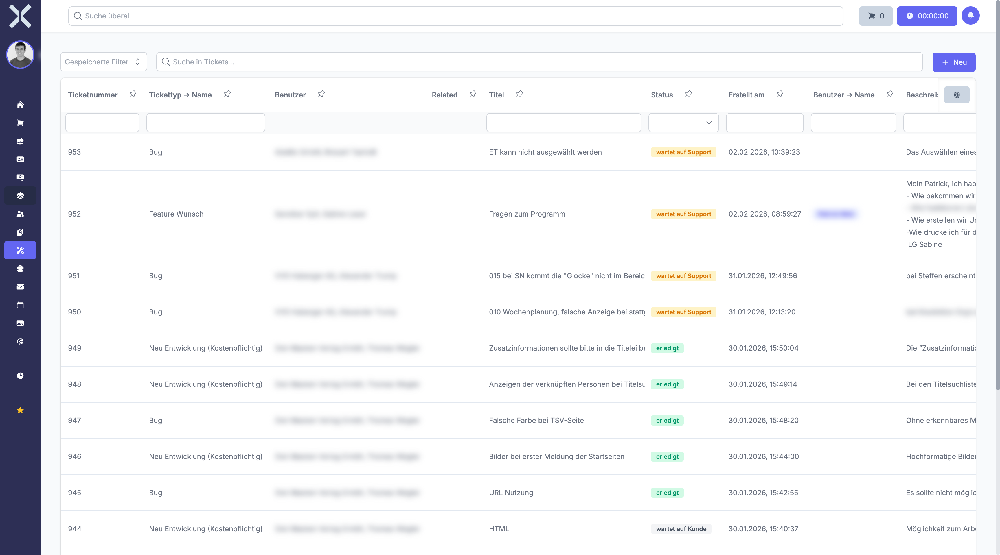

# Tickets

Im Modul **Tickets** bearbeiten Sie Support-Anfragen, kommunizieren mit Kunden und verfolgen den Bearbeitungsstatus. Das Ticketsystem bietet eine strukturierte Arbeitsweise für den Kundensupport mit öffentlichen und internen Kommentaren, Zeiterfassung und konfigurierbaren Ticketarten.

## Übersicht

Navigieren Sie über die Sidebar zu **Tickets**. Sie sehen eine tabellarische Übersicht aller Tickets.

## Ticket-Statusmodell

Jedes Ticket durchläuft einen definierten Lebenszyklus. Die verfügbaren Status und deren Bedeutung:

| Status | Beschreibung |
|---|---|
| **wartet auf Support** | Das Ticket wurde erstellt und wartet auf Bearbeitung durch das Team |
| **wartet auf Kunde** | Eine Rückmeldung vom Kunden ist erforderlich, bevor weitergearbeitet werden kann |
| **in Bearbeitung** | Das Ticket wird aktiv vom Team bearbeitet |
| **erledigt** | Die Anfrage wurde bearbeitet und als erledigt markiert |
| **geschlossen** | Das Ticket ist endgültig geschlossen |
| **Eskaliert** | Das Ticket wurde eskaliert und erfordert besondere Aufmerksamkeit |

> **Hinweis:** Der Status kann sich auch automatisch ändern, beispielsweise wenn ein interner Kommentar verfasst wird (Wechsel zu **in Bearbeitung**) oder ein öffentlicher Kommentar gesendet wird (Wechsel zu **wartet auf Kunde**).

## Ticketarten

Tickets werden nach Art der Anfrage klassifiziert. Die verfügbaren Ticketarten sind konfigurierbar und umfassen typischerweise:

| Ticketart | Beschreibung |
|---|---|
| **Bug** | Fehlermeldung zu einer bestehenden Funktionalität |
| **Feature Wunsch** | Anfrage für eine neue Funktion oder Erweiterung |
| **Neu Entwicklung** | Auftrag für eine Neuentwicklung |
| **Support** | Allgemeine Supportanfrage oder Hilfeersuchen |

> **Hinweis:** Die verfügbaren Ticketarten können in den [Einstellungen > Ticketarten](../14-einstellungen/42-ticketarten.md) konfiguriert werden. Weitere Ticket-Einstellungen finden Sie unter [Einstellungen > Ticket-Einstellungen](../14-einstellungen/43-ticket-einstellungen.md).

## Kernfunktionen

- **Öffentliche und interne Kommentare** - Kommunizieren Sie mit dem Kunden über öffentliche Kommentare, die per E-Mail-Benachrichtigung versendet werden. Interne Kommentare sind nur für das Team sichtbar.
- **Zeiterfassung** - Starten Sie die Zeiterfassung direkt aus einem Ticket heraus, um den Bearbeitungsaufwand zu dokumentieren.
- **E-Mail-zu-Ticket** - Eingehende E-Mails können direkt in Tickets umgewandelt werden, sodass keine Anfrage verloren geht.
- **Zuweisung an Teammitglieder** - Weisen Sie Tickets einem oder mehreren Bearbeitern zu, um die Verantwortlichkeiten klar zu regeln.
- **Verknüpfte Datensätze** - Verknüpfen Sie Tickets mit bestehenden Datensätzen wie Aufträgen, Kontakten oder Projekten, um den Kontext herzustellen.

## Detailansicht

Klicken Sie auf ein Ticket, um die Detailansicht zu öffnen. Dort finden Sie:

- **Stammdaten** - Titel, Beschreibung, Tickettyp, Status und Zuständigkeiten
- **Kommentarsystem** - Öffentliche und interne Kommentare mit vollständigem Verlauf
- **Arbeitszeiten** - Alle auf dieses Ticket gebuchten Zeiten
- **Aktivitäten** - Änderungsprotokoll des Tickets

## Seiten in diesem Kapitel

- [Tickets verwalten](1-tickets-verwalten.md) - Ticketliste, Suche, Filter und neues Ticket erstellen
- [Ticketdetails](2-ticket-detail.md) - Detailansicht eines Tickets mit Kommentarsystem

## Weiterführende Themen

- [Aufgaben](../8-aufgaben/0-index.md) - Aufgaben im Zusammenhang mit Tickets bearbeiten
- [E-Mail](../11-e-mail/0-index.md) - E-Mails können in Tickets umgewandelt werden
- [Einstellungen > Ticketarten](../14-einstellungen/42-ticketarten.md) - Ticketarten konfigurieren
- [Einstellungen > Ticket-Einstellungen](../14-einstellungen/43-ticket-einstellungen.md) - Allgemeine Ticket-Einstellungen
