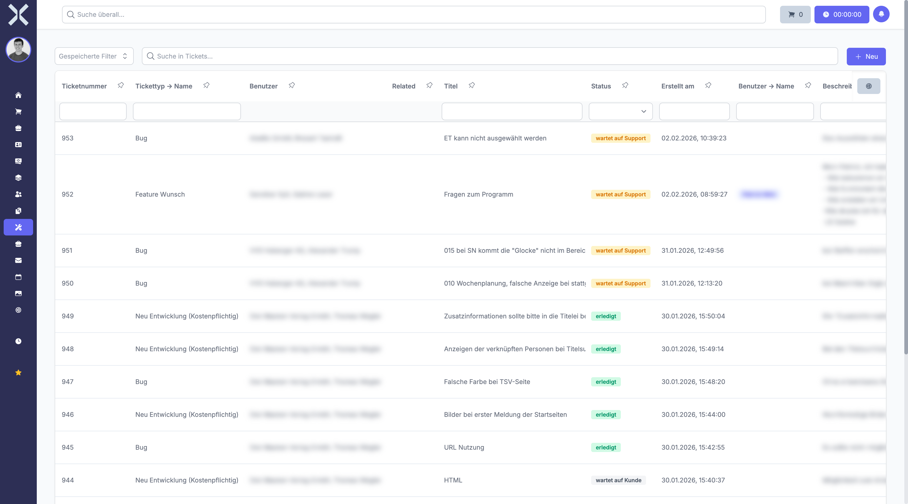

# Tickets verwalten

In der Ticketliste sehen Sie alle Support-Tickets und deren aktuellen Bearbeitungsstatus auf einen Blick.

## Ticketliste öffnen

1. Klicken Sie in der Sidebar auf **Tickets**.

   

2. Die Tabelle zeigt alle Tickets mit folgenden Spalten:
   - **Ticketnummer** - Eindeutige Nummer des Tickets zur Identifikation
   - **Tickettyp** - Art des Tickets (Bug, Feature Wunsch, Neu Entwicklung, Support etc.)
   - **Benutzer** - Der Kontakt und die zugehörige Adresse (Ansprechpartner), die das Ticket erstellt haben
   - **Related** - Verknüpfte Datensätze (z. B. Aufträge, Kontakte, Projekte)
   - **Titel** - Betreff des Tickets
   - **Status** - Aktueller Bearbeitungsstatus, farblich hervorgehoben als Badge:
     - **wartet auf Support** - Warten auf Bearbeitung durch das Team
     - **wartet auf Kunde** - Rückmeldung vom Kunden erforderlich
     - **in Bearbeitung** - Wird aktiv bearbeitet
     - **erledigt** - Anfrage wurde bearbeitet
     - **geschlossen** - Ticket endgültig geschlossen
     - **Eskaliert** - Ticket wurde eskaliert
   - **Erstellt am** - Erstellungsdatum des Tickets
   - **Beschreibung** - Vorschau des Ticketinhalts

## Tickets filtern

### Suchfeld

Nutzen Sie das Suchfeld oberhalb der Tabelle, um Tickets nach Titel, Ticketnummer oder Beschreibung zu durchsuchen. Die Ergebnisse werden in Echtzeit gefiltert.

### Statusfilter

Filtern Sie Tickets direkt über das Dropdown in der Statusspalte, um beispielsweise nur offene oder nur eskalierte Tickets anzuzeigen.

### Gespeicherte Filter

Verwenden Sie **Gespeicherte Filter** für häufig genutzte Filtereinstellungen. Typische vordefinierte Filter sind:

- **Offene Tickets** - Alle Tickets, die noch nicht geschlossen sind
- **Meine Tickets** - Tickets, die Ihnen zugewiesen sind
- **Wartet auf Support** - Tickets, die auf Bearbeitung durch das Team warten

Sie können eigene Filter erstellen und speichern, indem Sie die gewünschten Filterkriterien einstellen und auf **Filter speichern** klicken.

### Spaltenfilter

Nutzen Sie die Filterzeilen unterhalb der Spaltenüberschriften, um die Tabelle gezielt nach einzelnen Spalten einzuschränken, beispielsweise nach einem bestimmten Tickettyp oder Ersteller.

## Neues Ticket erstellen

1. Klicken Sie auf die Schaltfläche **Neu** oben rechts.
2. Füllen Sie die folgenden Felder aus:
   - **Tickettyp** - Wählen Sie die Art des Tickets (Bug, Feature Wunsch, Neu Entwicklung, Support etc.).
   - **Titel** - Geben Sie einen aussagekräftigen Betreff für das Ticket ein.
   - **Beschreibung** - Beschreiben Sie die Anfrage im Richtext-Editor. Sie können Formatierungen, Listen, Links und Bilder verwenden.
   - **Kontakt/Adresse** - Ordnen Sie das Ticket optional einem bestehenden Kontakt und einer Adresse (Ansprechpartner) zu.
3. Klicken Sie auf **Speichern**, um das Ticket zu erstellen.

Das neue Ticket wird mit dem Status **wartet auf Support** erstellt und erscheint in der Ticketliste.

## Zeiterfassung aus der Liste

Klicken Sie auf die Schaltfläche **Zeiterfassung** in der Ticketliste, um direkt eine Zeiterfassung für ein Ticket zu starten. Ein laufender Timer wird in der Oberfläche angezeigt und kann jederzeit gestoppt werden. Die erfasste Zeit wird automatisch dem jeweiligen Ticket zugeordnet.

## Weiterführende Themen

- [Ticketdetails](2-ticket-detail.md) - Einzelnes Ticket im Detail ansehen und bearbeiten
- [Einstellungen > Ticketarten](../14-einstellungen/42-ticketarten.md) - Ticketarten konfigurieren
