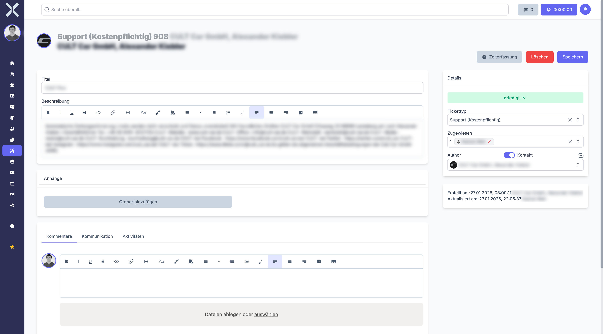

# Ticketdetails

In der Detailansicht sehen und bearbeiten Sie alle Informationen zu einem einzelnen Ticket. Hier verwalten Sie die Stammdaten, kommunizieren mit dem Kunden und dem Team über das Kommentarsystem und verfolgen erfasste Arbeitszeiten.

## Detailansicht öffnen

1. Navigieren Sie zur [Ticketliste](1-tickets-verwalten.md).
2. Klicken Sie auf das gewünschte Ticket.

   

## Kopfbereich

Am oberen Rand der Detailansicht finden Sie die wichtigsten Informationen auf einen Blick:

- **Ticketnummer** - Eindeutige Nummer zur Identifikation des Tickets
- **Titel** - Betreff des Tickets, prominent dargestellt
- **Status-Badge** - Farblich hervorgehobene Anzeige des aktuellen Status
- **Zugewiesene Bearbeiter** - Namen der Teammitglieder, die dem Ticket zugewiesen sind

Im Kopfbereich befinden sich auch die Aktionsschaltflächen:

- **Speichern** - Übernimmt alle vorgenommenen Änderungen
- **Löschen** - Entfernt das Ticket nach Bestätigung

## Felder des Tickets

### Titel

Geben Sie einen aussagekräftigen Betreff für das Ticket ein. Der Titel wird in der Ticketliste und in Verknüpfungen angezeigt.

### Beschreibung

Ein Richtext-Editor ermöglicht eine ausführliche Beschreibung der Anfrage. Sie können Formatierungen wie Fettschrift, Aufzählungen, Nummerierungen, Links, Bilder und weitere Elemente verwenden, um das Anliegen klar zu dokumentieren.

### Tickettyp

Wählen Sie die Art des Tickets aus dem Dropdown:

| Tickettyp | Beschreibung |
|---|---|
| **Bug** | Fehlermeldung zu einer bestehenden Funktionalität |
| **Feature Wunsch** | Anfrage für eine neue Funktion oder Erweiterung |
| **Neu Entwicklung** | Auftrag für eine Neuentwicklung |
| **Support** | Allgemeine Supportanfrage oder Hilfeersuchen |

> **Hinweis:** Die verfügbaren Ticketarten können in den [Einstellungen > Ticketarten](../14-einstellungen/42-ticketarten.md) konfiguriert werden.

### Status

Wählen Sie den aktuellen Bearbeitungsstatus aus dem Dropdown:

| Status | Bedeutung |
|---|---|
| **wartet auf Support** | Das Ticket wartet auf Bearbeitung durch das Team |
| **wartet auf Kunde** | Eine Rückmeldung vom Kunden ist erforderlich |
| **in Bearbeitung** | Das Ticket wird aktiv bearbeitet |
| **erledigt** | Die Anfrage wurde bearbeitet |
| **geschlossen** | Das Ticket ist endgültig geschlossen |
| **Eskaliert** | Das Ticket erfordert besondere Aufmerksamkeit |

> **Hinweis:** Der Status kann sich auch automatisch ändern, wenn Kommentare verfasst werden. Ein interner Kommentar setzt den Status auf **in Bearbeitung**, ein öffentlicher Kommentar auf **wartet auf Kunde**.

### Zugewiesen an

Wählen Sie einen oder mehrere Teammitglieder aus, die für die Bearbeitung des Tickets verantwortlich sind. Die Auswahl erfolgt als Mehrfachauswahl. Alle zugewiesenen Personen sehen das Ticket in ihren persönlichen Ticketlisten.

### Benutzer / Kontakt

Ordnen Sie das Ticket einem bestehenden Kontakt und einer konkreten Adresse (Ansprechpartner) zu. Das ist die Person, die die Anfrage gestellt hat bzw. der Anfrager. Der Kontakt wird als Empfänger für öffentliche Kommentare verwendet.

### Related (Verknüpfte Datensätze)

Verknüpfen Sie das Ticket mit bestehenden Datensätzen, um den Kontext herzustellen. Mögliche Verknüpfungen umfassen:

- **Aufträge** - z. B. wenn sich das Ticket auf eine bestimmte Bestellung oder Rechnung bezieht
- **Kontakte** - z. B. wenn mehrere Kontakte betroffen sind
- **Projekte** - z. B. wenn das Ticket im Rahmen eines Projekts bearbeitet wird

## Kommentarsystem

Das Kommentarsystem ist das zentrale Element der Ticketbearbeitung. Es unterscheidet zwei Arten von Kommentaren:

### Öffentliche Kommentare

Öffentliche Kommentare sind für den Kunden sichtbar. Wenn Sie einen öffentlichen Kommentar verfassen, wird dieser als E-Mail-Benachrichtigung an den verknüpften Kontakt gesendet. Verwenden Sie öffentliche Kommentare für:

- Antworten auf Kundenanfragen
- Rückfragen an den Kunden
- Statusupdates, die der Kunde kennen soll
- Abschlussbenachrichtigungen

Jeder öffentliche Kommentar zeigt den Autor, den Zeitstempel und den vollständigen Text im Richtext-Format an.

### Interne Kommentare

Interne Kommentare sind nur für das Team sichtbar und werden nicht an den Kunden gesendet. Verwenden Sie interne Kommentare für:

- Absprachen innerhalb des Teams
- Technische Notizen und Analysen
- Dokumentation von Lösungsansätzen
- Übergabenotizen bei Zuständigkeitswechsel

Jeder interne Kommentar wird in der Darstellung von öffentlichen Kommentaren unterschieden, damit Sie sofort erkennen, welche Kommentare der Kunde sehen kann.

### Automatische Statusänderung

Beim Verfassen von Kommentaren ändert sich der Ticketstatus automatisch:

- **Interner Kommentar** - Der Status wechselt zu **in Bearbeitung**, da das Team aktiv am Ticket arbeitet.
- **Öffentlicher Kommentar** - Der Status wechselt zu **wartet auf Kunde**, da nun eine Rückmeldung des Kunden erwartet wird.

## Arbeitszeiten

Der Bereich **Arbeitszeiten** listet alle auf dieses Ticket gebuchten Arbeitszeiteinträge auf. Jeder Eintrag zeigt:

| Spalte | Beschreibung |
|---|---|
| **Startzeit** | Beginn der Arbeitszeitbuchung |
| **Endzeit** | Ende der Arbeitszeitbuchung |
| **Dauer** | Berechnete Dauer des Eintrags |
| **Mitarbeiter** | Name des Mitarbeiters, der die Zeit erfasst hat |
| **Beschreibung** | Optionale Beschreibung der durchgeführten Tätigkeit |

### Zeiterfassung starten

Klicken Sie auf die Schaltfläche **Start** bzw. das Timer-Symbol, um eine Zeiterfassung für dieses Ticket zu starten. Der laufende Timer wird in der Oberfläche angezeigt. Klicken Sie auf **Stop**, um die Erfassung zu beenden. Die Zeit wird automatisch als Arbeitszeiteintrag angelegt und dem Ticket zugeordnet.

## Aktivitätsprotokoll

Der Bereich **Aktivitäten** zeigt ein Änderungsprotokoll des Tickets. Hier werden alle relevanten Änderungen dokumentiert, beispielsweise:

- Statuswechsel (z. B. von wartet auf Support zu in Bearbeitung)
- Änderungen an Feldern (Tickettyp, Zuständigkeit etc.)
- Zuweisung oder Entfernung von Bearbeitern
- Erstellung von Kommentaren

Jeder Eintrag zeigt den Zeitpunkt und den Benutzer an, der die Änderung vorgenommen hat.

## Ticket-Status ändern

1. Wählen Sie den neuen Status im Dropdown-Feld.
2. Klicken Sie auf **Speichern**, um die Änderung zu übernehmen.

Alternativ wird der Status automatisch angepasst, wenn Sie einen Kommentar verfassen (siehe Abschnitt Automatische Statusänderung).

## Ticket bearbeiten

1. Ändern Sie die gewünschten Felder direkt in der Detailansicht.
2. Klicken Sie auf **Speichern**, um alle Änderungen zu übernehmen.

## Weiterführende Themen

- [Tickets verwalten](1-tickets-verwalten.md) - Zurück zur Ticketliste
- [Aufgaben](../8-aufgaben/0-index.md) - Aufgaben im Zusammenhang mit Tickets bearbeiten
- [E-Mail](../11-e-mail/0-index.md) - E-Mails können in Tickets umgewandelt werden
- [Einstellungen > Ticketarten](../14-einstellungen/42-ticketarten.md) - Ticketarten konfigurieren
