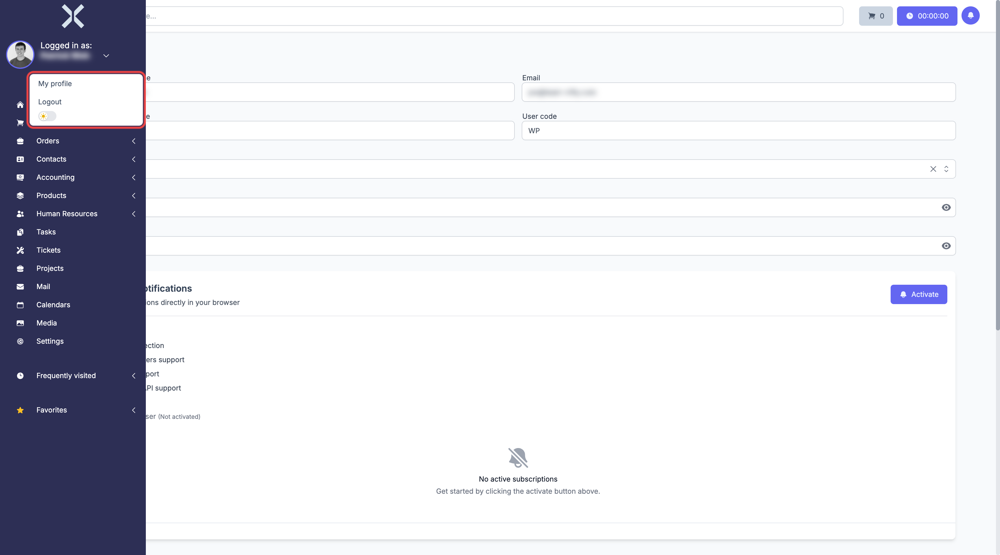

# Login and Logout

## Login

Open the Nuxbe application in your browser. On the login page, enter your email address and password, then click **Login**.

> **Note:** If you have forgotten your password, click **Forgot password** to receive a reset link by email.

## Logout

1. Click on your username in the top left of the sidebar below **Logged in as:**.

   

2. Click **Logout**.

You will be redirected to the login page.
