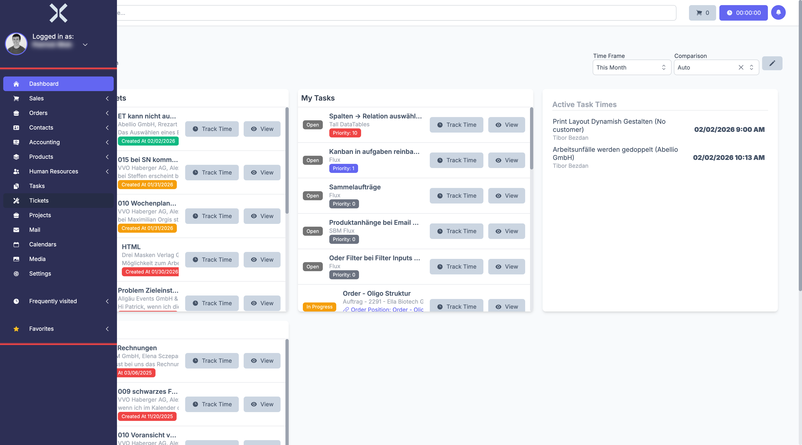
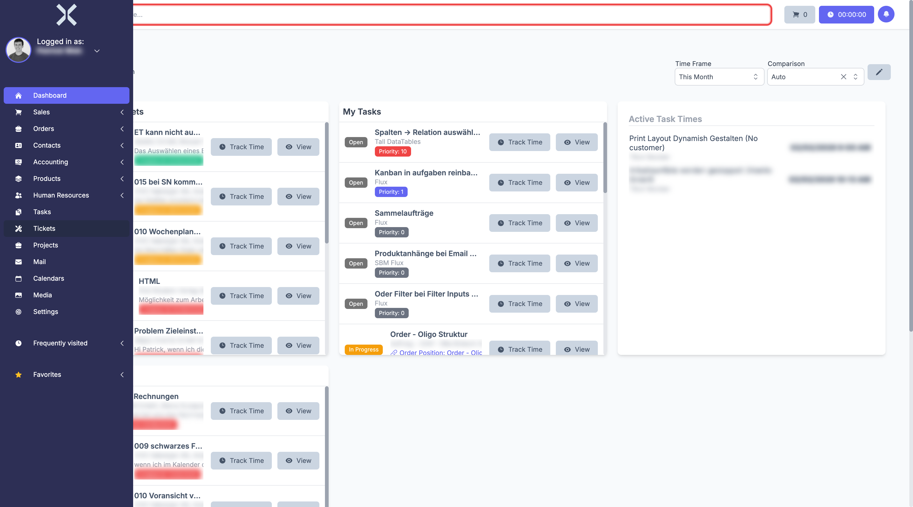

# Navigation

The Nuxbe user interface consists of a left sidebar, a global search bar, and the central content area.

## Sidebar

The sidebar is located on the left edge of the screen. In its collapsed state, only icons are shown. Hover over it with your mouse to see the full labels.

The sidebar contains the following main sections:

- **Dashboard** - Home page with overview
- **Sales** - Leads and sales pipeline
- **Orders** - Quotes, invoices and other order types
- **Contacts** - Customers, suppliers and addresses
- **Accounting** - Transactions, purchase invoices and payments
- **Products** - Product catalog and serial numbers
- **Human Resources** - Employees, work times and absences
- **Tasks** - Task management
- **Tickets** - Support tickets
- **Projects** - Project management
- **Mail** - Integrated email client
- **Calendars** - Appointments and calendars
- **Media** - File and media management
- **Settings** - System configuration

Below the main navigation you will find the **Frequently visited** and **Favorites** sections, which provide quick access to frequently used pages.

Some menu items such as **Orders** or **Accounting** have submenus. You can recognize them by the arrow icon to the right of the name. Click on the menu item to expand the submenu.

## User Menu

In the top left of the sidebar, you can see your username below **Logged in as:**. Click on it to open the user menu. Here you will find:

- **My profile** - Opens your profile settings
- **Logout** - Logs you out of the system
- **Dark Mode** - Switches between light and dark theme

## Global Search

At the top of the screen you will find the global search bar **Search everywhere...**.

Enter a search term to search across contacts, orders, tickets, products and other records system-wide. Results are displayed grouped by category.
