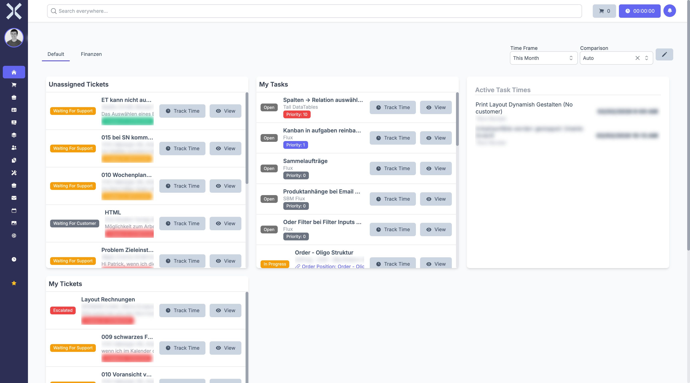

# Dashboard

The dashboard is your home page after logging in. It shows you an overview of your current tasks, tickets and active time tracking.

## Dashboard Tabs

At the top you can see tabs that allow you to switch between different widget configurations. The tabs are fully configurable - in edit mode you can create new tabs, rename or remove them.

## Time Frame and Comparison

In the top right, you can select the **Time Frame** (e.g. "This Month") and a **Comparison** period. These settings affect the widgets that display time-based data.

## Widgets

The default dashboard typically contains the following widgets:

- **Unassigned Tickets** - Open tickets that have not yet been assigned to anyone. From here you can start time tracking directly or open a ticket.
- **My Tasks** - Your open and in-progress tasks with priority indicators.
- **Active Task Times** - Shows running time tracking entries of your team members.
- **My Tickets** - All tickets assigned to you, with status and creation date.

## Editing the Dashboard

Click the **pencil icon** in the top right next to the time frame filters to activate edit mode. In edit mode you can add, remove and rearrange widgets.
