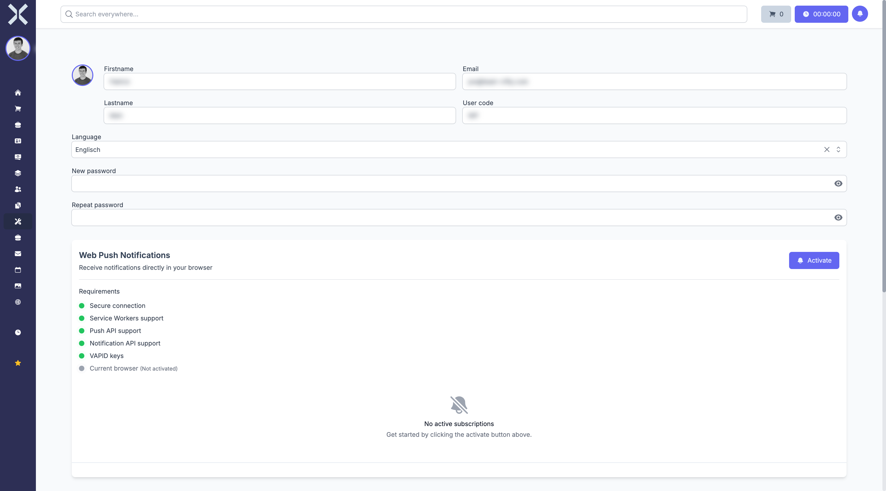

# My Profile

On the profile page you can change your personal data, switch the language and configure notifications.

## Opening Your Profile

1. Click on your username in the top left of the sidebar below **Logged in as:**.
2. Click **My profile**.

## Personal Data

On the profile page you can edit the following fields:

- **Firstname** - Your first name
- **Lastname** - Your last name
- **Email** - Your email address for login and notifications
- **User code** - Your unique user code in the system

## Language

Use the **Language** dropdown to change the display language of the user interface. After switching, the entire interface will be shown in the selected language.

## Changing Your Password

Enter a new password under **New password** and confirm it in the **Repeat password** field. Leave the fields empty if you do not want to change your password.

## Web Push Notifications

In the **Web Push Notifications** section you can activate browser notifications. This allows you to receive notifications directly in your browser, even when you are not actively working in Nuxbe.

Under **Requirements** you can see whether your browser meets all technical requirements:

- Secure connection
- Service Workers support
- Push API support
- Notification API support
- VAPID keys
- Current browser (activated)

Click **Activate** when all requirements are met.
